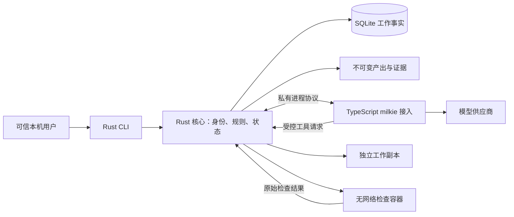
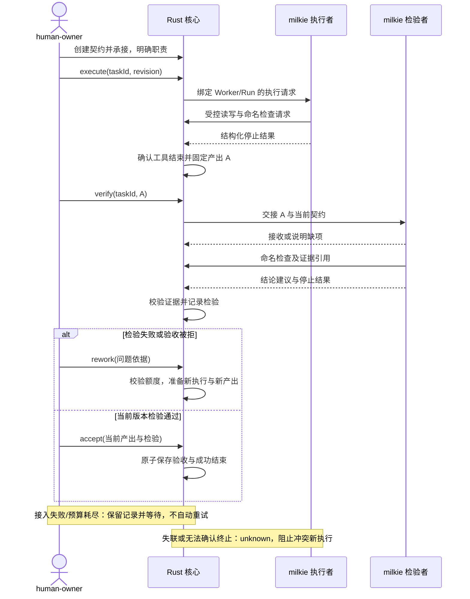

# 首项团队代码任务的完整交付

状态：Draft，v0.1，2026-09-27。关联 [Issue #1](https://github.com/xforce-io/atelier/issues/1)，分支 `feat/1-first-team-delivery`。本文是本 Issue 的详细设计事实源，未批准、未实现；Issue 仅保留验收与设计摘要。S1–S5 均指 Issue 编号，不是 overview 的编号。

## 1. 背景

[概要设计](../overview.md)已经确定持续 Worker、唯一团队负责人、Task 与 Run 分离，以及执行结束、检验通过、任务验收分别判断。当前仓库只有概要与名词表，没有可复用的核心实现；本次从一项真实代码修改验证这些边界，不先实现完整会话系统或组织平台。

任务可以交给 Worker 或 Team；本 Issue 仅实现预配置 Team 的路径。当前对话最多聚焦一项 Task 的长期原则保留，但本版 CLI 每次操作显式指定 taskId，不存隐式“当前任务”，也不识别聊天意图。

milkie 接口核对基线为 `7865ffcc14a8359a055e5e6e0998b56ab2160379`。其 `AgentResult` 已包含 `stopReason`、`partial`、`artifacts` 和可选 checkpointId，`AgentConfig.builtinTools` 支持显式空白名单，`ToolContext` 可接收取消信号。本设计依赖这些公开契约，实际依赖版本必须固定并通过 Integration 验证；不以“上游 Issue 已关闭”代替接入测试。

## 2. 名词解释

已有术语见[名词表](../glossary.md)，不重新定义。

- **Verification Profile/检验配置**：本设计新增，固定可执行的检查、运行环境和输出要求；不同于描述业务性质的 Verification Method/检验方式。模型不能修改检验配置或把自己返回的结论当成检查证据。
- `revision` 是操作并发校验用的技术字段，不是 Contract Version/契约版本；任务其他记录变化也会增加 revision。
- `requestId` 标识一次用户操作；`runId` 标识 Atelier 的一次执行，`executorRunId` 保留 milkie 返回的运行标识，三者不互相替代。

## 3. 目标与非目标

目标：用户通过 CLI 将一项代码修改交给固定 Team，真实调用 milkie 形成固定产出，由另一 Worker 独立检验，必要时返工，最终由人验收；错误路径仍有完整责任、产出和停止依据。

固定 Team：`human-owner`（人类成员，兼团队负责人、任务负责人和验收者）、`implementer`（数字员工）、`verifier`（数字员工）。只有经配置授予的权限生效；成员类型不隐含权限。检验者不能是产出执行者。

非目标：动态团队管理、数字员工团队负责人、直接委派给 Worker 的 CLI、子任务树、连续对话、自动建任务、多任务并行、UI、后台常驻调度、自动恢复/改派、跨执行器切换、外部发布及组织学习。执行器不自动安排下一轮执行或最终验收；团队负责人通过显式操作推进本次最小路径。

## 4. 能力

### 4.1 UI/UX：CLI 主路径与可见结果

本版没有图形页面、会话窗口或任务切换器。CLI 提供下面的工作入口；同一命令支持面向人的简洁文本与 `--json` 结果。

| 入口 | 用户看到什么 | 什么算成功 |
|---|---|---|
| `init` / `team show` | 当前工作区、3 名成员、唯一团队负责人、授权、执行器与检验环境的可用性 | 预配置关系可读取；缺项逐项显示，不因配置保存而宣称模型已可执行 |
| `task create` / `task show` | 目标、拟承接 Team、契约缺项、待承接处理者 | 返回稳定 taskId；可以先建工作再补齐契约 |
| `task intake` | 承接、明确等待条件或拒绝的结果 | 承接后唯一任务负责人和职责已落库；等待/拒绝有原因 |
| `task execute` | 当前执行者、runId、执行/工具进展和停止结果 | 真实 milkie 执行结果持久化，固定产出可查看；不是已验收 |
| `task verify` | 指定产出和契约、交接接收情况、检验过程、结论与证据 | 不同 Worker 对固定内容给出可复核结论，不能检验浮动工作目录 |
| `task rework` | 失败或拒绝原因、已用返工次数、剩余额度、下一次执行 | 基于问题形成新版本；额度耗尽时明确等待 human-owner |
| `task accept` / `task reject` | 指定交付、检验依据、决定与落实结果 | 接受有固定关联；拒绝保留原因和下一步，不算完成 |

`task show` 固定优先显示：任务结果、承接对象/任务负责人、当前契约、活动执行、最新固定产出、有效检验、阻塞原因、可执行的下一步。缺项显示“尚无”，执行无法核对显示“未知”，不拿旧结果填充为当前正常状态。必要时再查看 `run show`、`artifact show`、`verification show` 的细节。

空工作区提示 `init`；空任务列表可创建任务。授权不足、并发冲突、版本过期均返回明确错误及当前 revision，不自动覆盖。CLI 模型进度与日志走 stderr，stdout 只输出最终文本或单个 JSON 结果；机器调用不需要从进度文本猜状态。

### 4.2 状态与推进规则

Task 只维护三个粗粒度生命周期值，配合职责、Run、产出和检验事实展示进展；不把每个内部步骤设为一个互斥任务状态。

| Task 生命周期 | 含义 | 合法推进 |
|---|---|---|
| `pending` | 已建立，Team 尚未承接 | 补齐契约；承接进入 active；拒绝承接进入 closed/declined；缺条件保持 pending 并说明原因 |
| `active` | Team 已承接，可能正在执行、等待、检验或返工 | 执行、交接、检验、返工；满足条件的人工验收进入 closed/accepted |
| `closed` | 保存明确结束结果 | 本版只读，结果为 accepted 或 declined；反馈后新工作另建任务 |

暂停请求、取消和无法继续后终止是概要能力，但本 Issue 不实现任务取消命令。运行命令被打断仅停止/核对 Run，Task 保持 active；用户仍能查询已有工作。不能通过把 Task 设成 closed 掩盖执行未知。

Run 记录 `prepared / running / stopped / unknown`，并独立保存结构化停止原因。检验记录为 `pass / fail / inconclusive`。等待原因与处理者是可查询工作事实，不另造等待状态机。任务只有同一版本的有效检验与人工接受决定才能成功结束。

- `execute` 只用于首次执行；后续工作用 `rework`，防止换命令绕过返工额度。
- 正常执行停止后形成固定候选产出，仍需显式 `verify`；模型文字中的“完成”无状态效力。
- 检验失败或验收拒绝允许 `rework`；执行错误、预算耗尽、交接资料缺失可在问题已明确且旧 Run 确认停止后由任务负责人发起新的尝试。
- 一次返工额度在授权新 Run 前消耗并持久化，失败尝试不返还。默认最多 2 次返工；契约可在承接前设置 0–2 的上限。本版不提供运行中加额或重新标记“首次执行”的操作。
- 额度耗尽保持 active，显示 `rework_limit_reached`、已用额度及 human-owner；不自动继续，不因换一次 CLI 调用重置计数。

## 5. 思路与折衷

### 5.1 最小运行形态

选择 Rust CLI 内的核心执行命令与规则，SQLite 保存事实，每次 Run 启动独立 TypeScript milkie 接入子进程。`task execute/verify/rework` 是前台长命令；另一 CLI 可读已提交的状态，同一工作区同一时刻最多一个 Run。未来可将核心搬入常驻进程，CLI 契约不以当前进程寿命定义任务寿命。

这是本版工作区的串行执行限制，不是产品概念上的“Team 只能拥有一项 Task”。可以保存多个任务，但不实现排队、抢占或自动选择下一项；冲突请求返回忙及占用的 taskId/runId。

放弃本阶段引入常驻守护进程、消息队列、调度器和完整事件溯源。代价是用户关闭执行命令不承诺后台继续；本设计只保证已提交的工作记录可再次查询，并明确暴露未知。长命令正常处理 Ctrl-C 时请求停止并记录结果；强杀/断电后的自动恢复不在本版。

### 5.2 核心、模型与权限

模型选择如何修改代码、阅读证据和解释结果；Rust 核心决定谁能启动执行、哪些内容可访问、产出是否固定、检验是否有效和验收是否成立。模型只能通过绑定当前 Run 的工具请求行动，不可直接写数据库或指定自己的 Worker 身份。

本版是单机、单个可信 OS 使用者的产品：工作区初始化绑定 human-owner，本地 CLI 操作使用该身份，不提供可任意冒充成员的 `--actor` 参数。Agent 身份由父进程创建的私有 IPC 通道绑定。操作系统账户的拥有者能够修改自己的配置和数据，这是信任边界，不承诺抵御本机管理员伪造。

| 操作 | human-owner | implementer | verifier |
|---|---|---|---|
| 创建、补齐、承接或拒绝任务 | 有对应配置授权时允许 | 不允许 | 不允许 |
| 指定执行、检验、返工 | 任务负责人且有启动权限 | 不允许自行启动另一 Run | 不允许 |
| 读取内容 | 当前工作区获准内容 | 当前执行工作副本与任务输入 | 交接的固定版本与契约、检验配置及明确提供的问题 |
| 修改代码 | 不通过本版 CLI 直接改候选产出 | 仅当前 Run 的受控工作副本 | 不允许改候选产出 |
| 提交检验建议 | 不冒充数字员工检验 | 自测不算独立检验 | 可提交有证据引用的结论建议 |
| 接受或拒绝交付 | 验收授权有效时允许 | 不允许 | 不允许 |

初始配置须验证唯一团队负责人、三名成员身份、执行者与检验者分离及操作授权。配置无权限与配置缺能力分别报告；任何一项通过都不代表另一项满足。任务承接后冻结本任务使用的成员、权限和执行配置版本；本版不支持热改权限或成员。外部改文件不能使已承接任务静默换配置。

### 5.3 代码内容与检验可信度

源仓库只读导入确定的 Git commit，不在用户正在工作的检出目录直接执行或覆盖未提交改动。任务执行在核心管理的独立文件副本上，排除 `.git`、Atelier 数据目录、凭据配置、子模块和符号链接；遇到不支持内容时拒绝导入并列出原因，不静默丢弃后声称完整支持。

milkie 的内置工具白名单显式为空，不注册 subAgents、shell、动态工具箱或任意 Skill。接入只提供核心代理的文件读写、目录查询、命名检查与结构化报告工具；执行者可写副本，检验者只读固定版本。路径必须相对副本根，拒绝越界、符号链接、保留目录和非普通文件；检查在实际打开/写入时落实，不能只在 prompt 声明。模型无法指定主机 cwd、任意命令或读写 Atelier 状态目录。

代码本身可能在检验时运行，因此检查在 **无网络的 Linux OCI 容器**中执行：固定镜像摘要、非 root、只读源内容、独立临时目录、资源/时间上限，不挂载主机凭据、数据库或容器管理 socket。核心使用本机容器运行环境，第一版只支持 Docker 兼容接口。运行环境缺失时允许配置和查看，但阻止需要检查的执行/检验；不降级为在宿主运行任意代码。模型访问供应商由接入进程完成，供应商凭据不进入检查容器。

选择这一有限执行环境，代价是需预备镜像与检查依赖；放弃第一版支持任意宿主 shell、临时联网安装和所有语言项目。模型能在受控文件工具中改代码，通过预配置的命名检查获得反馈。检验配置由 human-owner 在承接前选择，命令、检查资源与镜像摘要不由候选代码或模型替换。依赖准备与镜像构建由可信使用者事先完成。

### 5.4 固定产出、检验与验收

执行或返工的 Run 在拒绝后续工具写入并确认所有已接受工具操作结束后，核心对实际工作副本生成文件清单、逐文件内容摘要和总摘要，保存不可变内容。Artifact 记录源 commit、契约版本、生产 Worker/Run、内容摘要与持久对象位置。相同内容可以复用存储，但不同提交/执行关联分别保留；不存在的文件或 milkie 自报 hash 不构成核心验证过的产出。

检验 Run 不生成新的代码版本，只引用交接的 Artifact 并保存检验产出。执行或返工副本停止可确认时，无论正常停止还是预算/运行错误，均尽量保存部分内容并标记 `partial`；无法确认静止或固定失败时，不制造 Artifact，仅保留已有的持久产出和诊断。milkie 的 artifacts、checkpointId、output 作为来源与诊断保存，不直接升级为 Atelier 产出、检验或验收记录。

`verify --artifact A` 创建从执行者到 verifier 的交接，绑定契约版本、固定内容、已知问题与职责。接入验证输入可访问并返回接收后才运行检验；verifier 的 started 必须在 handoff.accepted 之后，未接收保留原因，由 human-owner 处理。开始检验时以选定 Artifact 建立独立只读输入，不共享执行者的原生会话、WorkingMemory 或运行句柄。可以显式传递已知问题，但不能将执行者“测试通过”的文字当成检验依据。

检验方式本版要求包含命名的确定性检查，可附加数字员工对要求的评估。核心确认全部必需检查完成、退出结果满足契约、证据绑定同一版本，且 verifier 给出有依据的通过建议后，才保存 pass。检查失败或 verifier 指出未满足要求为 fail；检查未完成、结果缺失、报告无效或运行错误为 inconclusive。`model_stop` 本身不产生 pass；即使部分检查通过，预算耗尽或未知也不得自动通过。

检验命令的 stdout/stderr、退出码、检查配置摘要、镜像摘要与被检验产出摘要由核心采集。大日志保存为可引用文件，CLI 只展示限长摘要并标注截断；缺失或截断的结构化检查结果不能当成完整通过。代码可以修改本身的测试，因此必须执行来自冻结检验配置的检查，不能仅以候选代码内自定义的“全部通过”脚本验收。

`accept` 要求：Task active、调用者有验收权、无活动或未知 Run、选定交付仍是当前版本、检验 pass 且对应当前契约/产出、没有该检验之后的有效拒绝记录。以上校验和验收记录、Task closed/accepted 在同一事务生效。`reject` 不删除通过记录，但保存理由并要求返工和重新检验，旧通过结论不再直接满足验收。

本版以一个固定代码 Artifact 为整体交付，检验报告为其证据关联，不实现多产出装配。验收不包含合入用户仓库、push、发布或部署；用户通过产出位置、清单和差异查看交付。

### 5.5 持久化、冲突及失败

SQLite 保存当前事实和必要的不可变记录；较大的代码内容与日志在核心管理的对象目录存储。Task、契约、Run、交接、Artifact、检验和验收各有稳定标识和关联，不能通过覆盖一段模型总结替代。

下表限定持久化契约，不规定 SQL 表拆分或 ORM：

| 记录 | 必须保留的字段与约束 |
|---|---|
| Task | taskId、revision、拟承接/实际承接 Team、生命周期/结束结果、唯一任务负责人、当前契约与配置版本、当前 Artifact、等待原因与处理者、首次执行及返工计数 |
| 任务契约与配置 | 不可变版本 ID、规范化内容与摘要、授权主体、时间；已承接任务关联的内容不可原地覆盖 |
| Run | runId、taskId、Worker、execute/verify/rework 用途、冻结契约与输入版本、requestId、执行配置、进程归属、准备/开始/结束时间、SDK 终态与实际效果核对结果 |
| Artifact | artifactId、源 commit、契约、生产 Worker/Run、固定文件清单与总摘要、持久对象位置、partial 标记 |
| 交接关系 | 发送者、verifier、artifactId、契约版本、后续职责、offered/accepted/rejected、接收结果与缺项 |
| 检验记录 | verificationId、verifier、检验 Run、artifactId、契约/检验配置版本、pass/fail/inconclusive、全部必需检查的证据 ID、限制和问题 |
| 验收与拒绝 | 决定 ID、taskId、操作者、artifactId、verificationId、契约版本、决定、原因与时间；接受决定关联独立 Acceptance Record |
| 请求与操作依据 | requestId、主体、规范化请求摘要、执行中/完成结果、受影响对象 ID 与操作时间；不得保存密钥或完整供应商请求 |

首次执行/返工固定新产出时，在同一事务更新 currentArtifact 并保留旧关联；固定失败不更新。新版本即使内容摘要相同，也有新的提交关联；若是对验收拒绝的返工，仍需重新检验，不能借内容相同重用旧通过结论。任务 revision 随影响判断的持久事实递增；纯展示进度不增加 revision。

变更请求携带 `requestId` 与预期 `revision`。同一 requestId、同一规范化请求重复提交返回原结果；相同 requestId 携带不同内容返回冲突。已有同 requestId 的进行中 Run 返回其标识，不再启动；有未知 Run 时不得通过新 requestId 绕过。重复 requestId 的既有结果查询先于 revision 校验，以免一次成功操作的重发被错误拒绝。每次规则修改在事务内校验 revision，拒绝过期请求，不自动重试带副作用的操作。

内容先写临时对象、校验并原子固定，再提交数据库引用；任何持久化失败不返回成功。数据库不得引用尚未固定的对象；先写成功而事务失败可能留下无引用对象，保留待后续清理，不删除已有记录。

启动顺序为：取得工作区唯一执行权 → 事务校验授权、revision 和未决 Run，保存 prepared Run 及请求结果 → 完成适配器握手 → running → 工具/检查 → 固定结果 → stopped。取得执行权失败不创建可启动的 Run；事务失败不启动适配器。prepared 后在确认没有活动效果的前提下发生接入失败，记录 stopped/runtime_error 并释放执行权；意外丢失进程归属则进入 unknown。不能持有数据库写事务等待模型；其他 CLI 可读取已提交进度，变更按 revision 和活动执行限制校验。绑定到当前 Run 的工具和终态以 runId、角色及启动时冻结的契约校验，不重复使用用户启动时的过期 revision；未经绑定的新用户命令仍须校验最新 revision。

工作区用 OS 进程锁防止并行启动，数据库保存 Run 与进程归属。锁释放不证明所有外部活动停止。进程丢失或 IPC 意外断开时标记 unknown 并阻止新执行；本版没有自动恢复或强制清除命令。操作者先核对/停止残留接入进程与带该 runId 标识的容器；后续恢复能力另立范围，不能直接改数据库后宣称安全恢复。

接入进程没有独立副本写权限，全部写操作经核心代理，父进程消失后无法继续写工作副本；检查容器只读输入、无网络，即使残留也不拥有修改候选产出或访问主机工作区的能力。这缩小故障影响，但不把“可能残留”描述成“已停止”。

## 6. 架构

### 分层与信任边界

CLI 与核心先在同一程序中，模块边界不等于独立服务。适配器是可信接入代码，模型与候选代码不可信；本版不为恶意替换的适配器提供宿主隔离保证。适配器不可自行执行模型提供的宿主代码或注册未声明工具。

### 主路径与失败路径

## 7. 模块

| 模块责任 | 拥有的事实或能力 | 明确不拥有 |
|---|---|---|
| CLI | 参数校验、输出、可信本机用户入口 | 独立任务状态、可伪造 Agent 身份 |
| 核心规则 | 授权、承接、职责、revision、返工额度、验收前置条件 | 模型内部推理步骤 |
| 工作存储 | SQLite 事务、查询、请求去重、记录关联 | 外部执行是否成功的推断 |
| 产出与检验环境 | 受控文件工具、固定内容、容器检查及原始证据 | 用模型自报替代真实检查 |
| 执行管理 | 单 Run 执行权、进程/IPC、停止与未知、事件归属 | 自动接续、多任务调度 |
| milkie 接入 | 模型配置、受控工具声明、invoke 与终态映射 | 任务验收、核心数据库写入 |

逻辑模块先在一个 Rust 项目与一个 TypeScript 接入包内实现，不要求每行独立 crate/服务。第一方 Rust 核心使用 safe Rust；序列化输入必须校验。

## 8. API/CLI

### 8.1 配置与任务输入

本机工作区路径由 `--workspace` 指定，默认当前目录中初始化的工作区。初始化配置采用版本化 JSON，包含 `schemaVersion`、Team 与 3 名 Worker、授权、执行配置引用、检验配置、资源限制。模型凭据只从本机环境或私有配置读取；公共示例只包含环境变量名，日志/请求记录不保存密钥值。

任务契约 JSON 至少包含 `goal`、`delivery`、`verificationProfileId`、`guardrails`、`inputs`；`inputs` 固定源 commit 与已授权文件范围。create 允许缺项并返回清单，intake accept 前需齐备且可落实。承接前 `task contract set` 追加契约版本；承接后本版契约不变更，新增要求另建任务，避免在本 Issue 中扩入动态要求变更能力。产出版本仍随执行/返工变化。

默认限制：单 Run 15 分钟、50 次模型迭代、100 次工具调用；单次检查 120 秒，1 CPU/512 MiB、最多 64 个进程；文件读写每次最多 256 KiB，源内容及单个 Artifact 最多 50 MiB；IPC 单帧最多 1 MiB；单次检查两路日志各最多保存 5 MiB并标记截断。可在初始化/承接前收紧，本版不提供模型自行加额。不能落实某项约束时拒绝对应启动，不静默忽略。token/金额预算未实现，不将上述限制表述为精确费用上限。

源输入与最终产出不得包含符号链接、子模块、特殊文件或超过限制的内容；支持普通文本/二进制文件与普通可执行文件模式。限额与不支持项在启动前报告；执行中越界拒绝该工具操作，不能部分写入。

### 8.2 CLI 契约

所有变更命令接受 `--request-id`；未提供时生成并在结果中返回。已有 Task 的变更必须提供 `--revision`，从 show 的结果取得。命令主体如下，参数表示契约而非要求具体解析库：

| 命令 | 关键参数 | 行为 |
|---|---|---|
| `atelier init` | `--config FILE` | 校验并保存预配置，绑定本机 human-owner；已有不同配置拒绝覆盖 |
| `atelier team show` | 无 | 成员、授权、配置与能力缺项 |
| `atelier task create` | `--team ID --contract FILE` | 创建 pending 任务，不自动启动 |
| `atelier task contract set` | `TASK --file FILE --revision N` | pending 下追加契约版本 |
| `atelier task intake` | `TASK --decision accept\|wait\|decline [--reason TEXT] --revision N` | accept 落实 human-owner 为任务负责人；wait/decline 要求原因 |
| `atelier task execute` | `TASK --revision N` | 首次执行，绑定 implementer；前台推进至停止或未知 |
| `atelier task verify` | `TASK --artifact ID --revision N` | 交接给 verifier 并前台检验指定版本 |
| `atelier task rework` | `TASK --reason-ref ID --revision N` | 引用检验、拒绝或 Run 问题，消耗额度后发起新执行 |
| `atelier task accept` | `TASK --artifact ID --verification ID --revision N` | 原子校验与人工接受 |
| `atelier task reject` | `TASK --artifact ID --reason TEXT --revision N` | 对当前待验收交付拒绝并要求返工 |
| `atelier task list/show` | `[TASK]` | 只读列表或详情，无隐式执行/恢复 |
| `atelier run/artifact/verification show` | `ID` | 读取记录及证据关联；代码内容通过核心管理的固定产出位置查看 |

JSON 结果统一为 `schemaVersion, requestId, ok, data, error?`；错误含 `code, message, taskId?, currentRevision?, nextAction?`。稳定错误类别：`INVALID_INPUT`、`FORBIDDEN`、`STALE_REVISION`、`REQUEST_CONFLICT`、`WORKSPACE_BUSY`、`PRECONDITION_FAILED`、`CAPABILITY_UNAVAILABLE`、`EXECUTOR_FAILED`、`RUN_UNKNOWN`、`STORAGE_FAILED`。nextAction 是建议，不是自动执行指令。

退出码：0 表示本次操作按契约生效（包括明确拒绝、检验 fail/inconclusive、预算耗尽后的已记录停止）；2 为输入无效，3 为权限/前置条件/并发限制，4 为接入或运行错误，5 为执行未知，6 为持久化失败。0 不表示任务成功，调用方以 data 中的任务、Run 和检验事实判断。read-only show 对已失败任务正常返回 0。

### 8.3 Rust 与 TypeScript 的进程协议 v1

专用 stdin/stdout JSON Lines，适配器日志仅写 stderr，不开放网络控制端口。每个接入进程只处理一个 Atelier Run。帧包含 `protocolVersion, type, requestId, taskId, runId, seq, payload`；握手前 taskId/runId 由核心预分配，不能由模型指定。seq 为每个发送方向单调递增；同序号同内容重发忽略，不同内容或缺号视为协议错误并停止推进。未知版本和未声明必需能力在 invoke 前拒绝。

| 消息 | 方向 | 必要语义 |
|---|---|---|
| `hello / ready` | 核心→接入 / 接入→核心 | 协议版本、milkie 包版本（字段为 milkieVersion）、执行/检验角色、工具集合、预算与取消支持；10 秒内未就绪按接入失败 |
| `start / started` | 核心→接入 / 接入→核心 | 绑定身份、目标、契约和输入内容句柄；started 表示调用已开始，不代表任务完成 |
| `handoff.accepted / rejected` | 接入→核心 | 检验输入接收结果与缺项；拒收不进入检查，不伪造检验结论 |
| `tool.request / tool.result` | 接入↔核心 | toolCallId、操作、限定输入；身份从通道取值，核心校验范围和额度；重复工具请求按 ID 返回既有结果，不能重复写入/运行检查 |
| `progress` | 接入→核心 | 有界进度信息，可展示但无权直接变更任务或检验事实 |
| `report` | 接入→核心 | 结构化产出说明或检验建议、核心签发的证据 ID、限制；在对应 Run 停止前仅为候选 |
| `stop / terminal` | 核心→接入 / 接入→核心 | 停止请求与最终 SDK 信封；请求不等于停止确认，需连同核心工具及容器实际状态核对 |

适配器使用 `Milkie.invoke`，每次新 Run 使用新 contextId；返工显式传递已有产出与问题，不使用原生 resume。模型提示、注册工具和角色来自固定执行配置，不从任务正文加载可执行模块。`onBudgetFinalize` 不配置；停机与固定产出由核心处理，避免额外不受控收尾。

受控工具最小集合：`list_files`、`read_file`、`write_file`、`delete_file`、`run_check`、`submit_report`。检验角色无 write/delete；run_check 只能引用冻结配置中的 checkId，不能接收任意 shell 命令。文件句柄和证据 ID 由核心发放并绑定当前 Run/Artifact，不能凭一个路径字符串越权访问。

terminal 保留 `executorRunId, status, stopReason, stopCode?, partial, artifacts, checkpointId?, output, error?`。核心采用结构化 stopReason，不以 status=completed 或 output 文案判断成功。缺失必需字段、超限帧、伪造标识和相互冲突的终态均视为协议错误，不补猜默认成功。

取消时核心先拒绝新工具效果，向接入传递 AbortSignal，并停止仍在运行的检查容器；10 秒后仍未退出的接入进程被终止，容器终止需单独确认。无法确认的效果保持 unknown。核心确认没有活动工具后才固定内容并记录 stopped；不能仅收到 milkie cancelled 就认定全部外部活动已结束。

## 9. 边界

- Team 委派、任务负责人、执行者、检验者与验收者各自关联，不用一个 owner 字段混合表达。任务负责人兼任验收者仅因本场景配置授予权限。
- 本版无多人认证或远程服务，适配器通道不能伪装本机人类主体；未来网络入口必须另做身份与权限设计。
- Task 仅成功验收或拒绝承接后结束；执行错误、检验失败、预算耗尽和未知保留未完成工作，不从 Run 停止推断任务结束。
- 本版没有通用自动返工；人工明确触发每次返工，有限次数规则同样生效，后续自动化也不得绕过该规则。
- 部分产出可以由任务负责人明确送检；只有之后独立完成的有效检验及人工验收才能证明满足要求，原 Run 的 partial/停止原因仍原样保留。选择旧 Artifact 可以查看历史，但 `verify/accept/reject` 只允许当前候选交付。任何新产出使旧检验不再满足当前验收；存量记录不删除。
- 外部改写 SQLite、对象存储或接入程序属于可信主机被修改；正常查询仍校验对象摘要，内容损坏时失败并提示，不以旧通过结论继续验收。
- 已活动 Run 未停止、检验尚未完成、对象未固定或持久化失败时，禁止验收和冲突新执行。
- 本版不使用 milkie 原生子 Agent 表示 Atelier 成员，不依赖其原生任务结果作为团队验收。两个数字员工是独立配置与独立调用，由核心关联。

## 10. 迁移/兼容/回滚

首次实现，无既有产品数据迁移。SQLite schema、配置 JSON 和 IPC 分别带版本；v1 只接受明确支持的版本，不自动兼容未知字段含义。配置必需字段缺失或旧二进制遇到较新存储版本时拒绝写入并给出说明。

初始化失败不得留下看似可用的半配置；已有工作区不覆盖。安装/升级前需固定软件与 milkie 版本，保留工作区备份；备份须在无活动 Run 时包含数据库一致快照及其引用对象。回滚使用匹配版本的软件与数据副本，不通过删除验收或检验记录“回滚”。用户源仓库不被自动修改，因此本 Issue 无业务发布回滚。

草案批准后与实现 PR 双向链接；任何改变上述可观察结果、权限或协议含义的实现调整须更新本文，不能只在 PR 描述里形成第二份契约。

## 11. 测试计划

现阶段仅设计测试，未执行或声称通过。实现阶段新增 `.agents/skills/verify-atelier/SKILL.md` 与功能文件；每个功能文件记录真实入口、前置、步骤、可见结果及证据位置。以下与 Issue S1–S5 一一对应。

| 验收 | E2E 与驾驶手册文件 | Integration / Unit |
|---|---|---|
| S1 | `.agents/skills/verify-atelier/features/first-task-intake.md`：配置 1 个 Team/3 名 Worker，创建任务，补齐条件，等待/拒绝/承接；查看唯一职责及契约 | Integration：初始化原子性、CLI 独立查询；Unit：唯一性、权限、契约缺项与冻结、revision |
| S2 | `.agents/skills/verify-atelier/features/code-artifact-delivery.md`：至少 1 次真实 milkie 运行修改公开样例，查看至少 1 个固定版本与停止原因，确认未自动验收 | Integration：真实 SDK 信封、工具代理、工作副本隔离、对象先固定后引用；Unit：路径/限额、状态与停止原因分离 |
| S3 | `.agents/skills/verify-atelier/features/verification-rework.md`：固定失败场景经过 1 次失败、1 次返工及新版本重新检验，另触发返工上限 | Integration：交接接收/拒收、独立上下文、冻结检查资源与容器证据；Unit：自检限制、额度、缺证据不通过 |
| S4 | `.agents/skills/verify-atelier/features/human-acceptance.md`：接受、拒绝、版本改变、检验未通过、无验收权 5 类场景；新 CLI 查询验收关联 | Integration：并发新产出/接受互斥、事务中断；Unit：当前版本、拒绝后旧结论无效、Agent 不能验收 |
| S5 | `.agents/skills/verify-atelier/features/execution-failure.md`：接入失败、运行错误、预算耗尽 3 类结果；独立 CLI 仍能读取同一任务，不重复启动 | Integration：握手失败、IPC 断开/重复/乱序、Ctrl-C、父进程异常、残留容器、持久化失败；Unit：unknown 与错误区分、requestId 去重 |

真实验证使用可分发的小型代码样例，依赖与检查镜像预备好。S3 的确定性失败用已知不满足要求的候选版本或检查场景，不等待真实模型随机犯错；成功修改仍包含真实 milkie 调用。确定性 stub 只用于异常注入与规则验证，不能替代 S2 的真实运行证据。

检验证据包括任务/契约/产出/Run/检验/验收 ID、内容摘要、命令结果与必要截图或终端记录；不提交供应商密钥、私有绝对路径、真实用户任务或会话。测试重点验证用户结果和跨边界失效，不逐个内部函数镜像测试。

补充必测边界：源输入含符号链接或子模块；模型请求越界读写/任意命令；检查访问网络或主机状态；更换候选测试试图伪造通过；重复请求不增加执行次数；对象摘要损坏不能验收；初次预算耗尽后不能绕过返工额度；父进程消失后不自动恢复或重试。

## 12. 开放问题

本稿提议的前台执行、受控工具与容器检查是待评审选择，不是已获批准的实现决定。以下具体前置条件须在真实验证前落实；若改变设计边界需修订本文。

1. 首个公开样例采用哪种语言、哪项代码修改，以及由谁维护可信检验配置与预构建镜像？设计要求简单、离线可检查，不支持临时联网装依赖。
2. 验证机器的 Docker 兼容运行环境及模型供应商是否可用？不可用则先补前置条件，不降级权限边界或用 stub 宣称 S2 通过。
3. milkie 固定使用哪个可获取发布版本或 commit 构建？已核对 commit 见第 1 节，依赖锁定后需验证工具策略和完整终态信封。
4. 本版接受前台执行与无自动恢复的限制；后续常驻核心、unknown 人工核对后恢复、直接 Worker 委派和持续对话分别另立范围，不在实现中顺带加入。

## 13. 关联

- [Issue #1](https://github.com/xforce-io/atelier/issues/1)：S1–S5 验收事实源。
- [概要设计](../overview.md)、[名词表](../glossary.md)。
- [milkie AgentResult 与调用类型](https://github.com/xforce-io/milkie/blob/7865ffcc14a8359a055e5e6e0998b56ab2160379/src/types/common.ts)、[AgentConfig](https://github.com/xforce-io/milkie/blob/7865ffcc14a8359a055e5e6e0998b56ab2160379/src/types/agent.ts)、[ToolContext](https://github.com/xforce-io/milkie/blob/7865ffcc14a8359a055e5e6e0998b56ab2160379/src/types/tool.ts)。
- 上游恢复与终态修复：[milkie #259](https://github.com/xforce-io/milkie/issues/259)、[#260](https://github.com/xforce-io/milkie/issues/260)、[#261](https://github.com/xforce-io/milkie/issues/261)；本版只消费所需执行契约，不使用恢复能力。
- 实现 PR：尚未创建；创建时补充双向链接。
