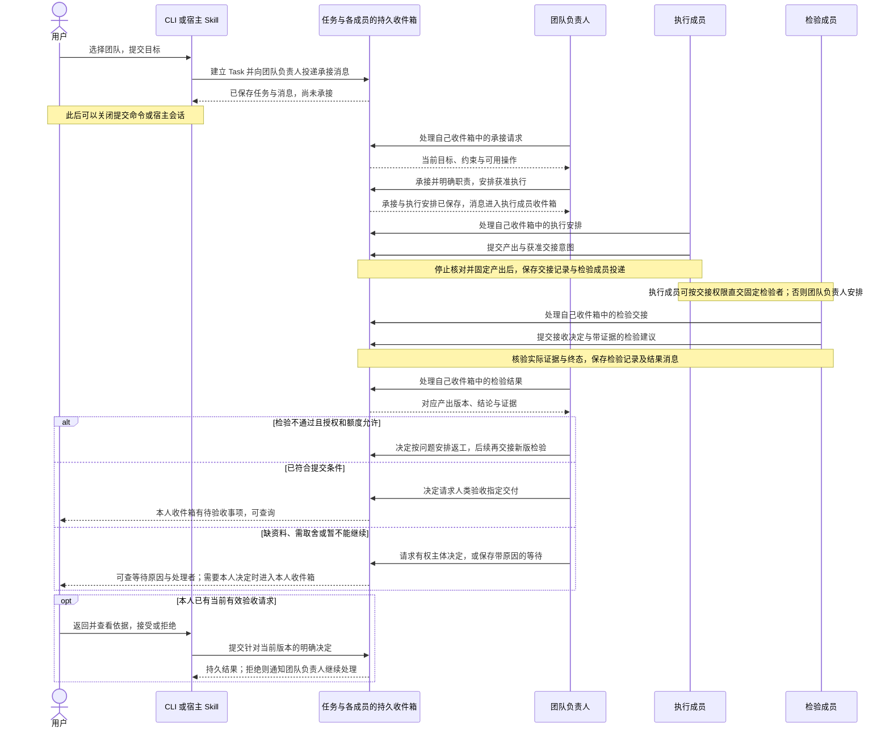
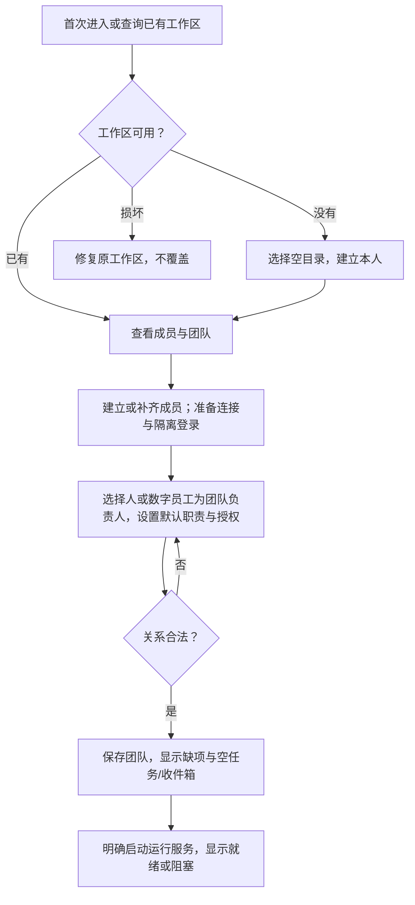
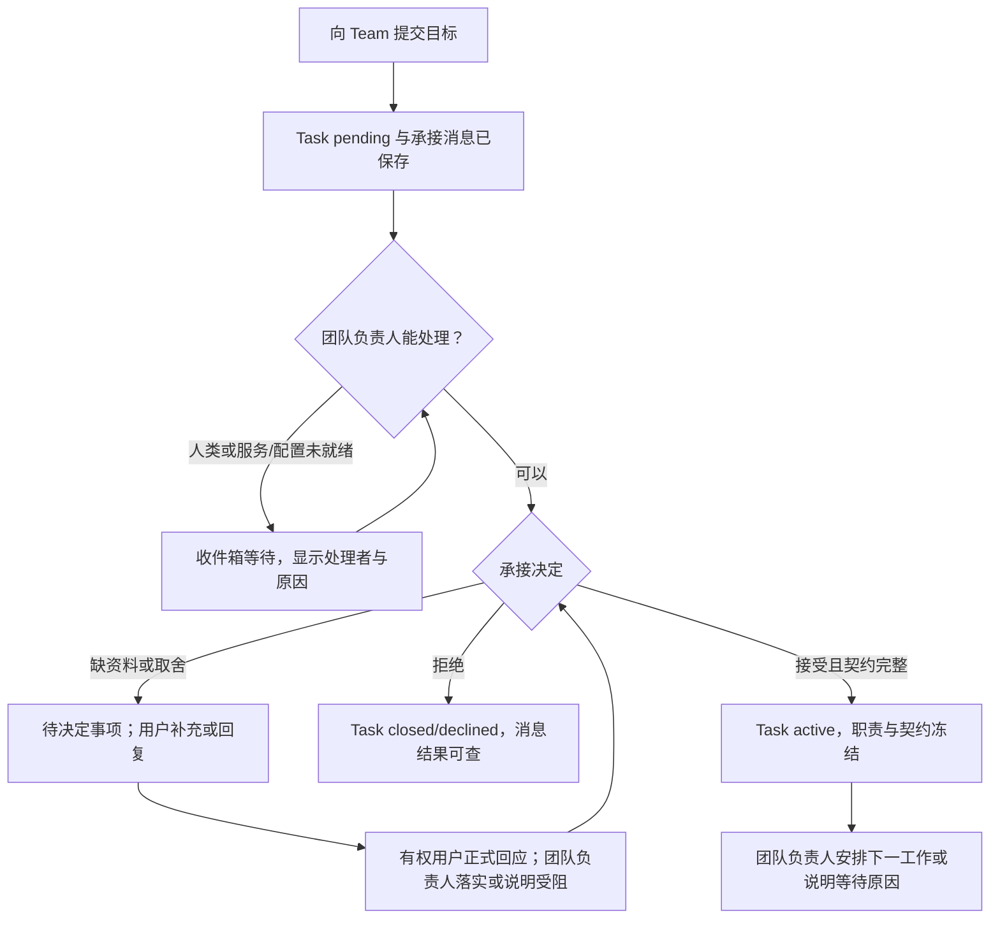
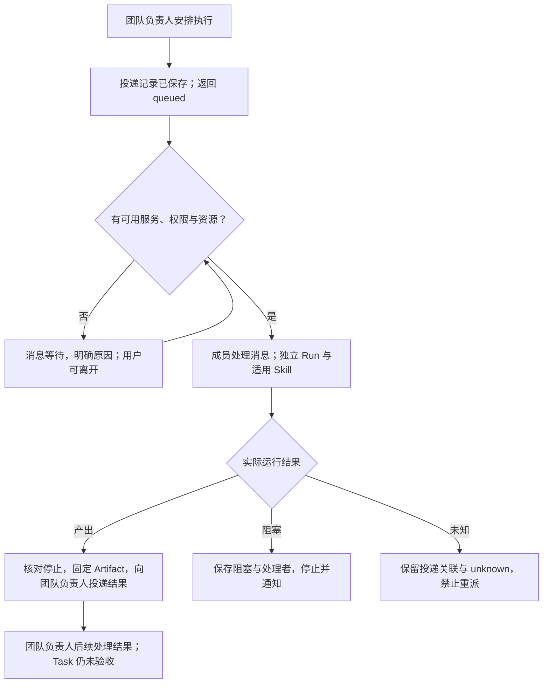
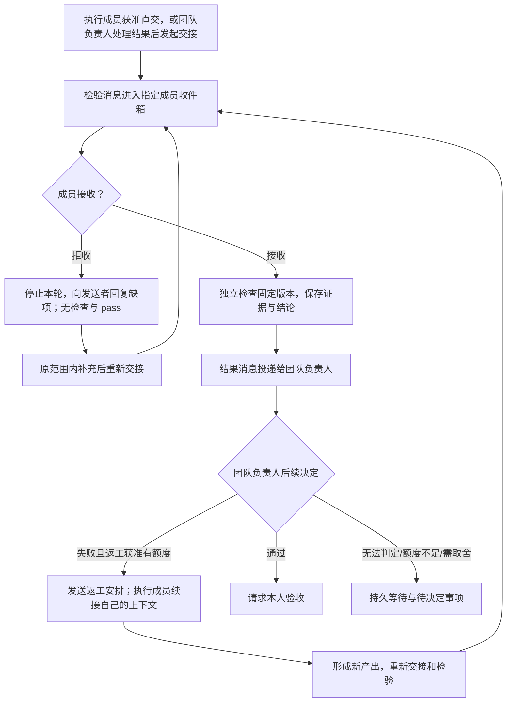
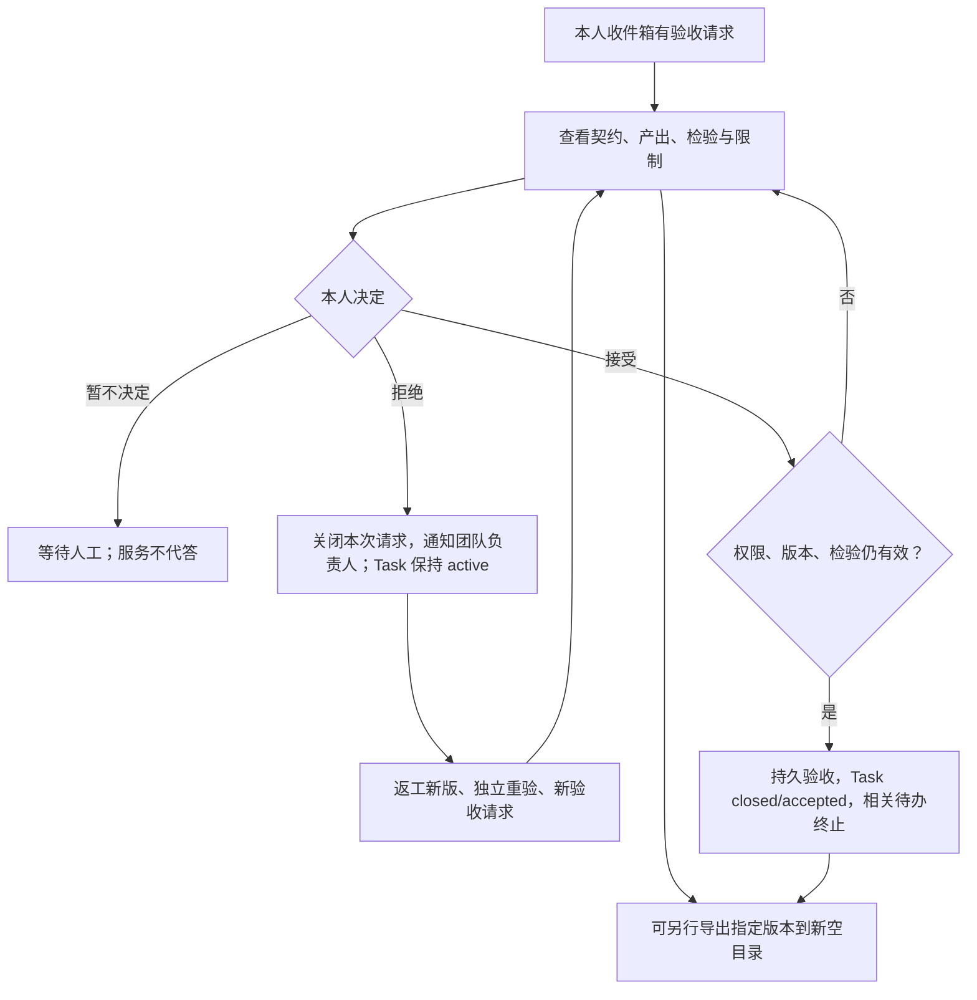
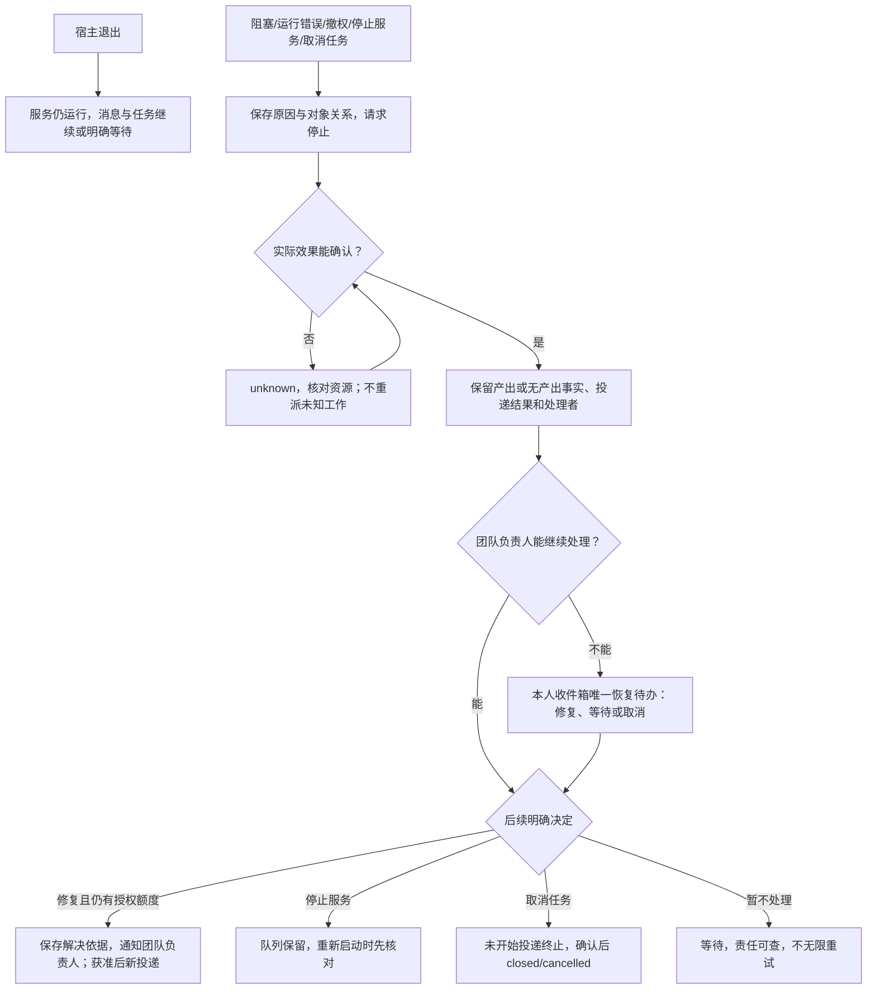

# L1 产品设计：通过 CLI 与 Skill 参与异步团队协作

版本：v0.10，2026-10-01 修订；状态：Draft，基础实现进行中，未验收。关联 [Issue #1](https://github.com/xforce-io/atelier/issues/1)、[L2 v0.10](technical.md)、[产品方向](../../overview.md)、[名词表](../../glossary.md)。实现与验证状态另见 [实现记录](../../implementation/1-first-team-delivery.md)，本稿只定义目标契约。

范围依据：用户明确要求 Team 是持续工作的组织，Worker 通过异步工作消息协作，Task 是独立生命周期实体；先做 CLI 与 Skill 是入口选择，不把团队协作缩减成外部宿主串联命令。本版替换 v0.8 的前台流程主干；不代表实现已获批准或能力已交付。

修订追踪：2026-09-28 本次用户讨论与“持续修改直到通过 review”的授权，是异步团队范围的修订依据。2026-10-01 用户提出进入 Issue 与实现准备，线上 Issue #1 已同步当前范围与验收汇总：S1 改为 4 Worker 并加入服务，S2/S5 改为异步提交与独立服务，新增 S7；其余 S 保留职责并扩展消息路径。原 v0.6 的前台执行范围失效。用户随后回复“go”进入开发；三处恢复规则已在 L2 §4.1/4.3 明确，仍须实现与验证。最新设计正文仍在本地，尚未提交/推送；跨任务交接前须发布可引用版本。Issue 同步不代表技术审查、实现或验收已通过。

2026-10-01 根据用户讨论补明成员自主协作与契约约束的边界：成员消费自己的收件箱并选择行动，运行服务不编排业务阶段；任务沿用固定契约结构，暂缓任务类型体系、DSL 与通用流程解释器。保持既有 S/验收 ID，补强消息意图来源、无业务决定不得自动推进、缺少有效检验不得验收的标准；不新增外部审批系统接入。

2026-10-05 根据 [Issue #8](https://github.com/xforce-io/atelier/issues/8) 的期望补明 API 上下文中断：checkpoint 尚未写出且没有已提交工具效果时，后续运行继续使用原上下文，不再被缺失续接锁死。已有已提交工具效果时，失败码与适配崩溃分开，且不得把该上下文静默当成首次运行。确认来源是该 Issue 正文；本版仍为 Draft。

2026-10-05 明确部署职责改由 [Issue #5 产品设计](../5-deploy-duty/product.md) 定义。本文件仍不做自动合入、push，也不由核心执行部署。没有该职责的团队，接受后关闭的行为不变。

2026-10-05 根据 [Issue #6](https://github.com/xforce-io/atelier/issues/6) 的期望补明本机 Keychain：重建后的二进制读不到已有项时，失败原因写明当前二进制无法读取，并要求用当前二进制重新设置凭据。不放宽 ACL，不把秘密回退到明文或数据库，输出不含凭据。确认来源是该 Issue 正文；本版仍为 Draft。

## 1. 背景与目标

用户将明确目标交给 Team，团队负责人接收并决定承接，成员通过工作消息开展执行、交接、独立检验与有限返工，最终由人验收。用户可以关闭最初提交目标的宿主会话，工作区运行服务仍在已授权范围内处理工作；需补资料、扩权或人工决定时明确等待。

首个成功结果：用户建立本人、数字员工团队负责人、执行成员和独立检验成员，在真实入口提交代码目标；团队自行处理工作消息到待验收，期间发生一次阻塞或检验失败并正确继续。用户重新进入后，不读完整日志即可知道谁收到什么、谁正在处理、谁等待谁、有哪些产出及待决定事项。数字员工团队负责人不能自行接受交付。

首版仍可由人担任团队负责人，此时承接和安排消息进入人的收件箱，系统如实等待人处理；数字员工团队负责人路径是本版必需验收，不用宿主代人连续调用命令替代。任务持久、消息投递、成员运行、检验通过及任务验收分别判断。

## 2. 范围与非目标

| 本期提供 | 边界 |
|---|---|
| CLI 与 Atelier Skill | CLI 提供对象、工作消息、收件箱、运行服务及决定入口；Skill 为宿主和成员提供按实际授权选择的指导与工具，不是唯一流程控制者 |
| 持续 Team 与 Worker | 一个 Team 恰有一个团队负责人，人或数字员工均可；首版由团队负责人兼任各任务的任务负责人，不另配置一个岗位 |
| Task 与工作消息 | Task 关联目标、契约、职责、产出和结果；工作消息有发送者、接收者、内容引用、处理状态与回复关联；每个 Worker 有持久收件箱 |
| 本机工作区运行服务 | 显式启动后独立于提交命令和宿主会话运行；投递、唤起数字员工、核对终态；首版同工作区最多一个活动 Run，多个消息可以等待 |
| 执行、检验与协调 | 三种职责都可以通过真实数字员工执行器处理；成员作业务决定，核心校验授权、版本、额度和独立性；协调不写成固定的执行—检验脚本 |
| 执行器 | Rust 核心与 CLI；TypeScript milkie 接入 API 及 Grok/Codex/Pi 中至少两种 CLI；实际适配完成前不得宣称支持 |
| 用户可观察性 | 查询 Team、Worker、Task、消息和 Run，看到待处理、处理中、等待原因、处理者与证据；为未来可视化提供持久事实 |

不做：GPUI/Web/TUI、自由单聊/群聊与频道消息产品、完整 Conversation 存储、远程多人认证、跨机器服务、多 Run 并行、子任务树、动态更换已承接任务的团队负责人、任务类型体系、契约 DSL/通用流程解释器、外部审批系统接入、自动合入/push、由核心执行部署、组织学习与 RSI 实现。显式部署职责见 [Issue #5](../5-deploy-duty/product.md)。工作消息不是通用聊天系统；本期每条消息关联 Task，不把普通聊天自动存为工作消息。

本版允许在原任务职责内安排工作、交接与返工，不做自动拆任务和任意改派。工作区运行服务不会替成员判断该不该承接、该向谁请求取舍；它只运行已获授权且条件满足的工作。后台运行依赖机器和服务实际在线，不承诺关机后继续，也不自动恢复未知副作用。

## 3. 用户与产品概念

以名词表为准。组织角色只有团队负责人和其他成员；执行、检验、验收是任务职责，不要求五个固定岗位。首个数字团队路径为四名 Worker：本人验收，数字员工团队负责人协调，另外两个数字员工分别执行和检验。团队负责人不自动获得管理权限或验收权，授权单独明确。人担任团队负责人时可以兼任验收，但不得用同一执行者自检替代独立检验。

| 对象 | 持续保存的事实 | 与其他对象的关系 |
|---|---|---|
| Team | 成员、唯一团队负责人、默认职责及授权 | 承接多个 Task；不等于一个模型进程 |
| Worker | 身份、执行配置、成员关系与收件箱 | 可以处理多条工作消息；暂未运行不影响接收 |
| Task | 目标、契约、职责、等待、产出、检验与验收 | 每个 Task 交给一个 Team；多个成员和多次 Run 围绕它工作 |
| 工作消息与投递记录 | 谁向谁说明什么、关联何事、是否处理、回复是什么 | 每条消息关联 Task；写入收件箱不等于成员接受业务工作 |
| Run | 某个成员处理一次投递所发生的执行及效果 | 接收消息不必立即产生 Run；运行结束不必结束 Task |

### 3.1 操作范围与协作责任

| 主体／职责 | 获准后可做 | 不能做 |
|---|---|---|
| 本人／工作区管理者 | 初始化、配置成员和团队、启动/停止本机服务；按团队授权提出目标、查询、决定、导出 | 不能把命令返回或聊天赞许当已验收；管理配置不自动代表接受交付 |
| 团队负责人 | 处理任务承接消息；在冻结范围内安排执行或检验、处理交接与阻塞、有限返工、请求人工决定 | 不能改变冻结目标/检验标准、无限加预算、自授权限；数字员工不得人工验收 |
| 执行成员 | 处理执行/返工消息，读取允许输入，工作并提交产出，发送有关说明或阻塞 | 不修改核心事实和检验依据、不代检验者给结论、不启动嵌套执行 |
| 检验成员 | 处理检验交接，接收/拒收指定产出，运行获准检查并提交建议，报告阻塞 | 不修改待检产出、不替验收者作决定、不扩大职责 |
| 宿主智能体 | 按用户授权通过 Skill 提出目标、查看事实、发送用户决定 | 宿主不是隐含团队负责人，不需要常驻串联每步；不能代成员制造接收或检验事实 |

任何参与成员可在其任务范围内发送工作说明或请求，但普通说明不等于授权委派。只有有权主体通过对应业务操作，才形成可执行的工作消息。每个已承接任务必须明确检验责任和证据要求。核心按身份、实际授权、职责、对象范围和当前状态强制校验；模型负责理解工作、提出决定，不负责决定权限是否放行。

### 3.2 加载与用户可见状态

成员启动前，核心确定身份、Task、消息及获准操作；执行器获得公共协作概念、适用职责与操作说明，未授权的工具和详细用法不提供。API 获得等价内容，本地 CLI 获得隔离 Skill 文件。角色只提供默认授权建议，加载说明不授予权限；权限变化后旧上下文不能绕过核心。

Worker 查询分别展示运行可用性与收件箱，不用一个 online/ready 掩盖问题。人类成员显示待人工处理；数字员工显示待服务启动、等待资源、正在处理、阻塞或未知。Task 查询展示当前目标、承接状态、谁处理什么、消息与产出关系、下一处理者及人工决定。空队列、未启动服务、未知运行和已完成不能混为“空闲”。

### 3.3 成员自主协作与契约约束

每个 Worker 持续拥有自己的收件箱，按职责处理发送给自己的消息；承接请求、工作安排、结果、问题和回复可以进入同一个收件箱。成员根据消息、当前任务事实与授权选择行动，实际顺序逐步形成。数字员工的选择来自模型，人类成员的选择来自本人；核心校验不替代成员判断，运行服务只提供投递、执行资源和故障处理，不根据阶段结果决定下一业务阶段。

任务契约规定目标、职责、执行约束、检验与验收要求。成员可以选择先提问、补资料、交接或等待，但不能绕过必要条件：当前产出缺少有效独立检验、检验未通过或证据版本过期时，系统拒绝验收，保留未关闭的任务及原因。专业质量由检验成员结合证据判断，权限、版本、额度和验收前置由核心强制校验；说明“已 review”不能替代有效检验记录。

外部系统可以拥有自己的评审、审批或合并条件，其权威状态属于对应系统。若任务以后需要这些条件，应使用与对应对象和版本匹配的权威证据；本期不接入外部审批，也不把成员自报当成已核验的外部通过状态。首版用已有任务契约和检验配置表达具体要求，不要求用户选择任务类型或编写 DSL。

## 4. 产品交互总览

以下是一次典型协作路径，展示成员如何通过收件箱作决定及看到反馈。契约约束合法先后关系，运行服务不把图中的顺序作为固定流程执行。

图中的“处理自己收件箱”表示成员参与协作的逻辑行为；数字员工由通用运行机制提供处理机会，人类成员则等待本人操作，不要求每个 Worker 有常驻进程。每次运行可独立结束，消息和任务一直保留。串行执行仅限制资源，不要求成员同时在线；没有交接决定时，产出固定不会自动送检，没有返工决定时，检验失败不会自动重做。任意消息发出、收到、已读、已处理都不单独代表业务完成。

## 5. 入口、信息组织与使用方式

| 用户意图 | CLI 语义入口 | 返回的可观察结果 |
|---|---|---|
| 首次使用 | workspace、connection、worker、team 配置；skill install/describe | 已保存对象、配置缺项、实际授权；无任务也可组队 |
| 允许团队后台工作 | runtime start/status/stop/reconcile | 服务状态、所属工作区、排队/活动/未知工作；启动不扩大任务授权 |
| 把目标交给团队 | task create/update/show | pending Task 与团队负责人承接消息；等待、拒绝或接受分别可见 |
| 查看成员协作 | worker show、mailbox list/show、message show、task show | 谁发给谁、未处理/处理中/已处理、关联 Run/回复、等待原因 |
| 补充或回应 | message send、task decision respond、task blocker resolve、task intake、task accept/reject/cancel | 消息或决定已持久，是否生效另有明确结果 |
| 人工团队负责人安排工作 | task execute/verify/rework | 已保存的安排和投递，绝不把排队成功当执行结束 |
| 查证与取走结果 | run/artifact/verification show、artifact export | 原始证据、固定内容、部分结果或已验收交付 |

普通用户的主路径是提出目标、处理必要决定、查询与验收。团队负责人为数字员工时，不要求宿主调用 execute→verify→rework；这些业务操作由成员在处理消息时发起。直接 CLI 仍可供人类团队负责人完成同等决定。安排与承接同时要求 task.arrange 授权和团队负责人职责；本人不是该任务的团队负责人时不能代其安排，首版不另设管理代办模式。本人可以修复环境、回应决定、撤权或取消，不能冒充数字员工团队负责人。

Skill 初始入口在无工作区时提供初始化指导；有工作区无团队时提供建队入口；有团队时按权限返回可用范围。显式损坏工作区报错，不假装新用户。非交互输入缺项立即返回，不挂起；长说明可读普通 UTF-8 文件。凭据不经聊天和命令参数传递。退出码仅说明操作处理结果，Task/消息/Run 的实际状态另外返回。

服务由用户显式启动，可在终端或宿主退出后继续；不默认开机启动。服务停止要显示停止中与实际停止结果，保留队列和任务。用户中断短命令不会取消已投递工作；取消任务必须明确操作。查询只能报告运行事实，不能假定服务永远在线。

## 6. Stories 与完整交互

### S1. 建立成员、团队及运行条件

角色：本人及代人宿主。空目录初始化产生唯一 Human Worker；之后建立数字员工、连接与执行配置。API 使用实际服务检查；CLI 使用固定隔离镜像及 Worker 专用登录，准备/登录/检查各有结果。缺模型、镜像或 Docker 不阻止保存成员与团队。

首个异步闭环创建数字员工团队负责人、执行者和检验者，验收者为本人；也可把团队负责人设为本人。团队负责人统一承担任务协调，不另设必填岗位。执行和检验须不同成员；成员可在不同任务交换职责。展示默认职责、授权、服务和成员缺项后保存；不因为角色名自动授权。

覆盖 S1.A1–A3、A7–A18。连接失败、取消录入、暂不启动均保留已保存对象。初始化/测试/建队不自动建立业务任务。重建后的二进制若读不到已有 Keychain 项，查询与连接检查写明须用当前二进制重新设置凭据，不放宽访问控制，也不回显秘密。

### S6. 提交目标、补齐契约与团队承接

角色：本人、团队负责人。选择 Team 和目标即可创建通用 Task，并原子投递承接消息，不要求 Git/Docker。只讨论不自动建 Task。缺契约内容时团队负责人提出待决定事项或补齐建议，用户通过任务更新/回复提供已授权信息；收到消息不表示承接。

承接需明确目标、输入、交付、检验方式、各职责与约束；团队负责人决定接受、等待或拒绝，核心保存并冻结依据。首版任务负责人沿用团队负责人。非代码任务可承接，后续执行取决于能力，不宣称已完整支持其他业务场景。更新 pending 任务通知团队负责人重新检查，旧版本决定被拒绝，防重复承接。

待决定事项指定有权处理者、可选项/输入要求和依据版本。普通聊天回复不算正式决定；用户通过 `task decision respond` 选择或补充，保存后向发起成员投递决定结果。该回应不自动改契约、授权或发起执行。发起成员再通过各自业务操作落实，并关联该决定；资料写入 pending 任务使用 `task update`，扩权由本人另行操作权限入口，冻结范围外要求转为新任务。查询区分“已回应待落实”“已落实”“落实受阻”，不把答复成功当作工作已继续；过期回应拒绝并展示当前依据。

覆盖 S6.A1–A5。代码场景另固定 Git 基线、可信检查配置和资源要求；环境未准备可先承接。默认每 Task 最多 20 次成员 Run、100 条工作消息、执行后最多 2 次返工；每 Run 15 分钟/50 次模型迭代/100 次工具调用。协调和检验也计总额度，承接前可收紧，不能靠消息循环或服务重启清零。

### S2. 成员处理工作消息并形成产出

角色：团队负责人、执行成员。团队负责人通过获准安排将指定任务投递给执行成员。安排返回后消息可排队；工作区运行服务在权限、配置、版本、环境和额度允许时领取并启动执行，加载该成员适用 Skill 与工具。其他消息继续保存，不因成员未运行丢失。

覆盖 S2.A1、A3–A9。成员提交内容说明由核心核对，不凭模型自报生成可信产出。工作消息只能访问当前任务允许的内容，不能调用完整管理入口、窥探其他成员会话或自授权限。API 与选中的两种 CLI 均须真实执行验证。

### S3. 交接、独立检验与有限返工

执行成员可在提交产出时按已授予的交接权限请求直交冻结检验者；无该权限时团队负责人收到结果消息后决定送检或请求补充。交接保存发送者、接收者、产出版本和要求。检验成员处理投递时明确接收或拒收，接收前不跑检查；拒收保留 Run 和原因并通知发送者。检验工具收集证据，成员提交建议，核心形成 pass/fail/inconclusive，结果通知团队负责人。

覆盖 S3.A1–A7。团队负责人不能把失败改为通过，也不能在未收到适用证据时请求有效验收。返工形成新 Run 和产出，不能沿用旧检验。检验可重试，不消耗代码返工额度但计 Task 总运行额度；上下文续接不重放未知效果。成员可发送任务范围内的说明，说明本身不自动启动代码执行。

### S4. 人工验收与取走结果

角色：有权本人。团队负责人提出验收请求后，本人收件箱展示对应版本、证据和限制。用户直接使用 CLI 或在宿主 Skill 中明确接受/拒绝；核心核验当前版本和有效检验。数字员工、旧决定、普通聊天或消息已读都不能代替人工验收。

覆盖 S4.A1–A8。导出不等于验收，也不合入、push 或部署；部分结果可显式导出并标限制。验收必须引用当前有效验收请求。拒绝使该次请求成为 rejected，接受为 accepted，未完成旧请求因版本过期成为 superseded；正式决定同时处理本人对应投递，查询保留原因。旧检验不得直接重新提交接受；必须返工形成新产出、完成对应独立检验并创建新请求，才能再次验收。旧拒绝持续保留，只约束旧交付，不永久阻断新版。

### S5. 离开、失败、撤权、阻塞与继续

角色：成员、团队负责人、有权本人。关闭提交命令或宿主不取消工作；服务在线则继续，服务停止则保留队列。runtime stop 请求停止领取和在途执行，返回停止中，确认后显示 stopped；不取消 Task。重新启动服务先核对旧资源，unknown 未解决不再投递执行。服务未运行时，本人也可用 runtime reconcile 单独核对，看到已停止或仍未知的 Run；该操作不启动排队工作，服务仍持锁时明确拒绝。

撤权事务生效后拒绝新受限操作，受影响运行进入停止核对；已完成效果保留，未发布写入不得在撤权后生效。缓存结果也按当前可见权限返回。旧 Run 不因恢复授权复活；只在原冻结范围内恢复后才能建立新工作。

成员报告阻塞后停止并投递通知；修复只记录原契约范围内的依据，不能改变冻结要求。团队负责人收到解决通知后决定安排继续：已开始执行的用返工额度，检验用新检验投递；首次执行尚未真正受理的可继续原安排。无产出也能通过阻塞记录继续，不伪造检验失败。取消 Task 终止其未开始投递并停止其在途工作，确认全部效果结束才关闭。

覆盖 S5.A1/A2/A4/A5/A7–A14。同请求重试不重复投递；领取后服务崩溃不因租约到期就重放有副作用的 Run。工作消息可以重投递，业务效果必须去重，不承诺消息传输只发生一次。人类离线、成员不可用或服务缺环境都显示真实等待。

对已登记 Run 的 execute/rework 投递禁止原样 retry；确认停止后用新的 rework 安排继续并消费返工额度。未登记 Run 的前置失败可重新评估原投递，不消费运行额度。coordinate/verify 可在停止核对后重试，消费总 Run 额度并复用已提交操作；有已提交终局决定的投递只核对完成，不再次运行模型。传输重发本身不产生 Run。

API 上下文在写出 checkpoint 之前中断时，上图的运行错误与修复后继续覆盖本路径。没有已提交工具效果的后续运行继续使用原上下文，查询不再反复看到适配崩溃。已有已提交工具效果时，运行查询显示 `CHECKPOINT_MISSING`，与适配崩溃 `ADAPTER_FAILED` 分开；该上下文不被静默当成首次运行。不另画图。

团队负责人承接/协调投递因连接、权限或额度等条件无法继续时，核心在同一事务为有权本人保留待处理事项，不仅通知不可用的数字员工。本人可修复原配置范围内的登录/凭据与服务、恢复原授权、重评估投递或取消；修改已冻结执行配置须新任务。修复后仍由原团队负责人处理；不能修复时如实等待或取消，不自动换人、不由宿主接管。重复检测不重复生成待办，待办不唤起模型、也不占 Run。

### S7. 不依赖宿主的异步团队协作

角色：用户、数字员工团队负责人、执行和检验成员。前置为团队、授权和运行服务已就绪。用户提交任务后关闭宿主，不再由外部 agent 调用各阶段命令。团队负责人处理承接、成员处理安排并交接，检验结果反馈团队负责人，必要时在额度内返工，直到本人收件箱有待验收或明确待决定事项。

第 4 节时序图覆盖本 Story 的完整主路径与失败/人工分支，第 S5 图覆盖服务中断与未知；这里不另复制同图。覆盖 S7.A1–A5：阶段结果与回复可追踪；普通说明不能伪装正式决定；成员离线/人类等待不能丢消息或占据运行锁；消息与运行额度防止循环唤起。

## 7. 产品规则与边界

| 编号 | 保证与责任 |
|---|---|
| R1 身份/授权 | 核心绑定真实入口与成员运行身份；角色与 Skill 不授予权限；本机代人入口仍可信，不声称认证聊天者为真人 |
| R2 唯一/独立 | Team 一个团队负责人，首版兼任任务负责人；执行与检验不同成员，人工验收职责明确 |
| R3 保存/就绪 | 对象存在、已投递、服务运行、成员可执行分别展示；未就绪不冒充正在执行 |
| R4 版本 | 承接冻结契约；消息决定绑定相应版本；旧产出检验不用于新验收 |
| R5 生命周期 | Task、消息、Run、宿主和服务分别管理；投递/处理完成不代表任务完成 |
| R6 有限推进 | 单活动 Run；任务总运行/消息额度和返工额度均由核心维护，不靠成员自觉 |
| R7 检验/决定 | 真实证据加独立检验；最终接受来自有权人的当前决定；普通消息不替代正式操作 |
| R8 内容/秘密 | 不覆盖源仓库/非空导出目录，不泄露凭据或跨成员上下文；检验不改候选 |
| R9 持久/幂等 | 业务变更与对应待投递消息原子保存；去重、领取和核对防止重复效果 |
| R10 Skill 事实源 | 所有入口读取核心事实；宿主退出不丢团队推进责任，Skill 文件存在不算真实接入 |
| R11 按权限加载 | 提供适用说明及工具，调用时仍强制核验；不能绕过完整管理入口 |
| R12 消息协作 | 每条工作消息有任务、发送者、接收者、处理及回复依据；持久收件箱独立于在线状态，同一成员收件箱承载不同类别；业务意图来自成员，核心校验并保存；运行服务不代成员选择阶段 |

## 8. 验收与效果验证

这里只定义标准，所有能力待实现、未运行。CLI 与真实宿主 Skill 分别验收，数字员工团队负责人、执行成员和检验成员还须真实加载适用指导并通过消息协作；宿主脚本串起命令不能替代。离开测试必须停止最初宿主而保持独立运行服务，以持久证据证明工作继续。

保留既有 S 与子项 ID 的责任范围，入口变更须重新取证；v0.8 以前的前台执行证据不能直接复用。以下表格以当前版本为唯一标准。所有表格项均为必需验收；默认由 agent 从真实入口执行，需要用户决定的路径保留明确人类交互。故障注入只能证明对应异常规则，不能替代真实模型、两种 CLI 与宿主 Skill 的成功链路。

### 8.1 贯穿验收场景：井字棋小游戏

用一项可实际游玩的代码交付贯穿现有 Stories，验证游戏结果与团队协作两方面。此处是现有验收项的具体验证场景，不新增验收编号，也不要求工作区运行服务内置这条流程。当前样例、检查资源和产品入口均待实现，尚无运行结果。

用户提交的目标：

> 请交付一个离线可玩的双人井字棋网页小游戏。两人在同一设备轮流操作，X 先手；界面显示当前轮次、胜者或平局。禁止重复落子，分出胜负或平局后不能继续落子，可以重新开始。导出后直接打开首页即可游玩，附简短说明，不依赖联网、登录、安装依赖或启动服务。

固定范围为 3×3 棋盘、本地双人、单局状态和重新开始；不含 AI 对手、联机、账号、排行榜、历史存档或部署。网页是团队交付的样例产出，Atelier 仍通过 CLI 与 Skill 操作。任务输入使用固定 Git 基线，检验要求和可信检查配置在承接时冻结。

| 游戏要求 | 可判定的结果 |
|---|---|
| 初始与轮次 | 空棋盘显示 X 先手；每次合法落子后切换落子方，非法点击不改变棋盘或轮次 |
| 胜负 | 三行、三列及两条对角线均能正确判胜；X、O 两方均覆盖，显示与棋盘一致的胜者 |
| 平局与结束 | 合法无胜者满盘显示平局；胜利或平局后点击空位或已有棋子均不改变本局结果 |
| 重新开始 | 游戏中及结束后均能清空棋盘、结果和轮次，恢复 X 先手，可连续开始新一局 |
| 离线交付 | 指定版本完整导出至空目录后，在断网浏览器中打开首页即可完成对局；棋盘、状态与重新开始控件可见可用，说明与实际操作一致 |

正常交付从空工作区组建四名 Worker 开始：本人验收，三个数字员工分别承担团队负责人、执行和独立检验职责。用户通过真实入口提出目标，确认任务与承接投递已保存后即关闭宿主或退出 CLI，保留运行服务。其后团队负责人自行处理承接与工作安排，成员在各自上下文中处理消息、提交产出并交接，检验成员运行预先固定的独立检查并形成结论；需要补充或取舍时保存可见待办。本人返回后查看依据，实际打开导出版本游玩，再作出明确验收决定。期间不由外部脚本代成员调用阶段命令或修改产出。

游戏规则的独立检查和浏览器交互检查使用可信资源，执行成员不能修改它们来制造通过；执行者自测另行记录。实际游玩至少包含胜利、平局和重新开始，检查显示及点击反馈；人工游玩不能替代独立检验，自动检查通过也不能替代人类验收。浏览器证据与导出内容须绑定同一 Artifact 版本及摘要，不能用开发目录中的另一份游戏替代。

| 路径 | 执行与结果要求 | 关联现有验收 |
|---|---|---|
| 正常交付 | 真实成员完成从目标到待验收；用户离开后继续，导出游戏可玩，人明确接受后任务关闭；首轮检验通过如实记录 | S1.A1/A7/A17、S6.A1、S2.A1/A4–A7、S4.A1/A6–A8、S7.A1 |
| 缺陷与返工 | 另用任务开始前固定的含已知缺陷基线，例如漏判一条对角线；真实检验发现对应产出不满足要求，团队负责人决定返工，形成新产出、独立重验与人类验收 | S3.A1/A5/A7、S4.A4、S7.A1 |
| 停服与恢复 | 独立运行中在投递已保存未领取、已领取或操作已提交等位置注入故障；查询持久记录，核对旧效果后按规则继续，消息不丢失且业务效果不重复 | S5.A4/A5/A7/A12；故障注入按 L2.8 的 Integration 计划取证 |

缺陷基线和预期失败检查必须在任务开始前确定，禁止篡改已固定产出、改检验标准或伪造检验者拒绝。若执行成员在首次交接前已经修复该缺陷，则记录该次正常通过，S3.A1 的失败返工路径仍为未覆盖，不能将基线有缺陷或一次自测失败当成独立检验失败。必须另取得真实的失败→有权成员返工→新版独立检验链路，才能通过该项。

CLI 与真实宿主 Skill 使用独立任务分别取证，执行与检验仍须覆盖 API 和选定的至少两种 CLI。每次保存任务与契约版本、成员配置、消息与操作因果、Run、产出摘要、原始检查结果、导出游戏的浏览器操作记录以及人类验收决定；同一场景名称不能代替各入口和执行器的实际证据。游戏通过只覆盖关联项，§8.2 中其余权限、边界及异常标准仍须分别验证。

### 8.2 逐项验收标准

| ID / 规则 | 前置与操作 | 可判定结果及禁止结果 | 证据与依赖 |
|---|---|---|---|
| S1.A1 / R1–3 | 空工作区建立本人、数字员工团队负责人/执行者/检验者及 Team | 四个 Worker、一名团队负责人，职责与授权可查；无业务 Task/Run | 直接 CLI 与独立查询；另覆盖人类团队负责人配置 |
| S1.A2 / R3、R8 | 保存连接、检查失败、修复重测；取消录入 | 配置保留，缺项清楚，不回显秘密，不误发任务 | 真实连接及脱敏失败证据 |
| S1.A3 / R1–2 | 非法成员/缺 leader/执行检验同人后修复 | 非法关系被拒，合法缺项可保存；leader 可为人或数字员工 | 原子更新前后查询 |
| S1.A7 / R3、R10 | 实际宿主安装并加载 Skill，从空工作区组队；模拟 CLI 不兼容 | 实际调用创建对象；缺安装/版本不兼容明确阻断，文件存在不当成功 | 具名宿主、模型、版本及调用 |
| S1.A8 / R3、R8 | 初始化、新进程查询；已有工作区/非空目录/取消 | 唯一本人、空团队与收件箱；无覆盖、重复初始化或伪成功 | 目录与对象对照 |
| S1.A9 / R3 | 先存成员身份再补连接与执行配置 | 同 Worker 身份持续；缺项可见；可选工作说明不变成必填 | 配置与版本 |
| S1.A10 / R3、R8 | 连接检查后修改工作说明、连接或登录代次 | 说明改变不使检查无效；连接/凭据/运行镜像改变后旧成功不冒充当前 | 真实检查及版本 |
| S1.A11 / R1–3 | 同名成员参考连接配置，各自承担职责 | 身份独立、重名不猜测、上下文不共用、授权不跨任务团队 | 对象/配置/权限 |
| S1.A12 / R1–3 | 缺配置成员加入团队，退出后补齐 | 合法不完整团队持久、非法关系拒绝；无任务不自动建业务工作 | 缺项与恢复查询 |
| S1.A13 / R3、R8 | 建立 API 与两种选定 CLI 连接；不支持 runtime | 字段互斥；CLI 不要求 API 密钥；支持状态来自适配而非枚举 | 真实连接配置 |
| S1.A14 / R1–2、R11 | 同成员跨任务交换执行/检验职责 | 无额外任务负责人岗位，协调者为当时团队负责人；身份与权限边界保持 | CLI/Skill 职责记录 |
| S1.A15 / R3、R10 | 无工作区加载→初始化→无团队→组队；损坏工作区 | 引导可用且不自动创建；损坏报修复而非重新初始化 | 真实宿主及 describe |
| S1.A16 / R3、R8、R11 | 两种 CLI 隔离准备/登录/执行/续接及越界尝试 | 真实可用且拒绝宿主/其他成员存储和非法网络；不沿用宿主登录 | 镜像/挂载/网络/会话与运行证据 |
| S1.A17 / R3、R9、R12 | 显式启动服务、重复启动、关闭启动终端、另进程查询 | 仅一个有效服务，状态可查且独立存活；未启动时队列可保存 | PID/epoch、服务锁和实际工作 |
| S1.A18 / R8 / Issue #6 | 另一份签名不同的二进制读取已有 API Keychain 项 | 失败原因写明当前二进制无法读取已有项，并要求用当前二进制重新设置；秘密不回退明文、不出现在输出；不放宽到任意进程 | 错误分类与连接检查结果；两份重签名 CLI 的读取见 setup-and-intake；必需 |
| S6.A1 / R3、R8 | 代码任务固定基线、导入可信检查配置、准备环境 | 未提交内容不导入，来源可核对；缺环境可保存不误运行 | 基线/镜像/检查摘要 |
| S6.A2 / R2–5、R12 | 无 Git/Docker 创建报告 Task，团队负责人异步等待/拒绝/承接 | 创建仅投递不承接；三类决定持久、任务负责人明确、缺执行能力不撤销承接 | CLI/Skill 与团队负责人实际处理；可用 API 协调，执行不要求存在 |
| S6.A3 / R4 | 承接后改 Team/成员配置，查询旧新任务 | 旧冻结配置和职责不变，新任务可用新配置 | 契约/配置版本 |
| S6.A4 / R4、R9、R12 | 创建时断开客户端、重复请求、pending 更新后旧承接决定 | 恰一个 Task/初始投递，无半提交；旧版本拒绝，更新消息可追踪 | 事务注入与因果记录 |
| S2.A1 / R5、R8、R12 | 获准执行安排入箱，由服务启动真实成员 | 命令返回排队；至少一实际 Run 和固定产出，未自动验收 | 真实 milkie 与投递/产出 |
| S2.A3 / R6、R9 | 重复同安排，同时安排另一任务 | 不重复投递和 Run；不同任务排队，同阶段冲突拒绝，不抢占 | 请求/投递/Run 数与资源锁 |
| S2.A4 / R5、R9 | 执行期间独立查询，客户端退出再查 | 查询不停止服务，Task/投递/Run/产出持续可读 | 多进程及后台运行证据 |
| S2.A5 / R6、R10、R12 | 宿主 Skill 提交目标后退出，数字团队推进到待验收 | 无宿主阶段调用和人工搬运；团队负责人及成员实际处理，状态真实 | 完整因果链、宿主退出与服务记录 |
| S2.A6 / R5、R8 | API 与两种 CLI 分别执行样例；缺约束能力 | 每路径真实固定产出；能力不足启动前拒绝，不靠提示词保证 | 实际执行器/版本及产出 |
| S2.A7 / R1、R10–11 | 三种职责运行装配；执行/检验覆盖 API 与两 CLI | 成员获得适用内容和工具，自己完成业务操作，宿主未代做 | 加载摘要及真实工具请求 |
| S2.A8 / R1、R9、R11 | 跨任务/伪造身份/未授权操作/读取禁用资源/运行中撤权 | 核心或隔离拒绝且无越权效果；旧工具和缓存不绕过撤权 | 确定性注入及前后事实 |
| S2.A9 / R5、R9、R12 | 成员未运行时接收多条任务消息，之后启动服务 | 消息持久、逐条关联处理；创建 Worker 不等于启动执行器 | 收件箱与 Run 关联 |
| S3.A1 / R2、R7 | 真实缺陷→直接交接→失败→团队负责人返工→新版检验 | 不同执行/检验成员，至少一失败/返工/重验，旧问题保留 | 成员消息与独立证据 |
| S3.A2 / R6 | 耗尽返工或总额度后换消息/请求/服务再尝试 | 不启动超额 Run，不重置预算，显示人工待办 | 计数、拒绝与重启 |
| S3.A3 / R3、R7 | 检验缺资料拒收，原范围补齐后重交接 | 拒收无检查/pass；保留 Run、交接原因及发送者通知 | 消息/交接/检查次数 |
| S3.A4 / R7 | 检查不全、预算耗尽或运行错误 | inconclusive，不能验收，部分检查不冒充全部通过 | 原始证据 |
| S3.A5 / R2、R4–6 | 两种 CLI 各跨 Run/进程返工续接，另会话丢失 | 执行上下文可续接且检验独立；缺失明确 blocked、不静默新建/重放 | 原生会话与运行记录 |
| S3.A6 / R2、R7、R12 | 检验消息接收/拒收/阻塞与重复处理 | 接收来自成员，拒收保留停止 Run；重复决定不重复效果；处理者可查 | 交接记录与投递状态 |
| S3.A7 / R1、R9、R12 | 执行者有交接权时直交；无权则通知团队负责人安排 | 不需团队负责人转发每条消息；未固定/旧版本/错误接收者拒绝；无重复送检 | 两条真实交接路径 |
| S4.A1 / R4、R7、R9 | 有效检验后本人明确接受，再独立查询 | 验收主体与同一版本匹配，持久闭合，不发布业务产出 | 真实验收与证据 |
| S4.A2 / R6–7、R12 | 拒绝→旧请求再接受→返工新版→新检验/请求→接受 | 旧请求 rejected、本人投递已处理且不可复用；新请求 accepted 后闭合，不被历史拒绝永久阻断 | CLI/Skill 两路径的请求、版本、拒绝及新版接受 |
| S4.A3 / R4 | 旧验收请求下产出版本改变后提交决定 | 拒绝过期，旧请求 superseded、未处理投递 cancelled，不接受新版 | 版本及请求状态 |
| S4.A4 / R7 | 缺少有效独立检验或 fail/inconclusive 下直接 accept，另用普通消息声称已 review | 核心拒绝且不产生验收记录；更换消息、入口或请求 ID 不能绕过要求，不依赖 Skill 自觉 | CLI、真实 Skill 与受控操作拒绝及任务未关闭记录 |
| S4.A5 / R1 | 撤销本人验收权或数字员工尝试验收 | 均拒绝，不能传 actor 冒充 | 主体及权限证据 |
| S4.A6 / R8 | 导出当前/历史/部分版本，另选非空目录 | 内容正确，无覆盖、不改变验收、不包含秘密 | 摘要/目录对照 |
| S4.A7 / R7、R10 | Skill 展示待办；未决定/拒绝/接受/过期 | 无明确当前决定不 accept，决定和版本可追踪 | 真实脱敏人类交互 |
| S4.A8 / R5、R7、R12 | 验收请求入本人箱，用户离开后返回；处理后迟到消息 | 离线不丢待办、不自动代答；关闭后不被迟到消息重开 | 人类投递/决定/关闭记录 |
| S5.A1 / R5、R9 | 接入失败、运行错误、预算耗尽后独立查询 | 三类原因、投递/责任/产出保留，不假报成功或自动重放 | 三组故障记录 |
| S5.A2 / R5、R12 | 取消有排队及活动执行的任务，另无法停止 | 未开始投递终止，活动先停止核对；未知不关闭、不放行新执行 | 取消/投递/资源 |
| S5.A4 / R5–6、R9 | 强杀服务或成员进程，重启并 reconcile | claimed 不因租约过期重派；旧效果确认后才允许明确重试 | 进程/容器/epoch及副作用 |
| S5.A5 / R9 | 业务提交/产出固定/消息保存阶段故障，按同请求查询 | 不半提交、不丢已提交待投递记录、不重复效果 | 事务和对象注入 |
| S5.A7 / R5 | Ctrl-C 中断客户端；另 runtime stop | 客户端退出不停止已提交工作；stop 明确停止领取和核对，不取消 Task | 独立服务与资源记录 |
| S5.A8 / R9–10 | 宿主超时/重开要求继续 | 先查 Task/消息/Run，不重发安排；服务工作不依赖旧聊天 | 宿主与核心对照 |
| S5.A9 / R3、R10 | 中文/空格/长文本/非交互缺项及空/失败/未知结果 | 保真、JSON 单结果、缺项不悬挂；排队不当完成 | stdout/stderr/协议 |
| S5.A10 / R1、R9、R11 | 撤权与已发布/未发布写入、在途检查、旧缓存并发 | 新操作拒绝，已发布保留、未发布撤销；停止状态真实，旧 Run 不复活 | 事务和授权版本 |
| S5.A11 / R5–6、R9 | 无产出阻塞→停止→原范围解决→团队负责人继续；另检验/额度不足 | 无须伪造检验失败；返工/检验预算正确；不能提前继续 | 阻塞/解决通知与实际 Run |
| S5.A12 / R6、R9、R12 | 成员已提交安排后终态丢失；已受理 execute/rework 重试；旧 epoch 提交 | 终局决定仅核对；已受理代码工作不能原样 retry，继续消耗返工额度；旧 epoch 拒绝 | 投递、操作账本、额度及故障注入 |
| S6.A5 / R1、R4、R7、R12 | 请求补充/取舍→普通回复→正式回应→落实或失败；另过期/无权 | 普通回复不闭合决定；正式答复与落实分开可查，失败待处理；不自动扩权/改契约 | CLI/真实 Skill 的决定、对应业务记录及失败反馈；必需 |
| S5.A13 / R1、R3、R12 | 数字团队负责人连接失效或撤权，修复重评估；另无法修复 | 本人收到唯一待办；原团队负责人恢复处理，不能冒充或默默换人；无法修复可等待/取消 | 原投递、本人待办、修复与真实恢复；必需 |
| S5.A14 / R5、R9 / Issue #8 | API 运行在写出 checkpoint 前中断后再领取同一上下文；另已有已提交工具效果 | 无已提交效果时后续运行继续，停止码不是反复的 `ADAPTER_FAILED`；有已提交效果时停止码为 `CHECKPOINT_MISSING`，上下文使用标记保持，不静默当成首次运行 | 运行查询中的停止码、账本 completed 记录；适配测试可判定空上下文与有效果两条，完整服务路径见 failure-and-lifecycle；必需 |
| S7.A5 / R1–2、R12 | 本人非团队负责人时直接 intake/execute/verify/rework；另本人担任团队负责人 | 前者即使有 arrange 授权也拒绝，后者按权限可行；宿主不冒充数字员工 | CLI/Skill 的身份、职责与拒绝记录；必需 |
| S7.A1 / R5、R10、R12 | 真实数字团队从目标到待验收，提交后完全退出宿主；核对各次安排的来源 | 各成员处理自己的消息，执行/交接/返工安排均有有权成员操作；宿主与服务均无阶段代办，最终人类待办；无交接/返工决定不自动产生相应安排 | 真实全链路、成员操作与因果消息；无决定分支另做 Integration |
| S7.A2 / R1、R7、R12 | 同一成员收到承接或结果等业务通知及普通问题/回复，另发送伪装授权/验收内容 | 不同类别归同一接收者收件箱；普通消息类别来自成员选择，正式通知可追溯操作/事实；正文不改变权限、类别或验收 | 消息接收者/类别、成员工具请求与核心状态对照 |
| S7.A3 / R3、R6、R12 | 人类待办与不可用成员并存，另任务可处理 | 等待不占 Run；可处理消息继续，顺序和原因可查；无消息丢失 | 多任务串行队列证据 |
| S7.A4 / R6、R9、R12 | 制造 note/reply 循环直至预算耗尽，重启服务 | 总运行/消息上限不重置，必要失败通知仍持久，停止自动唤起 | 预算、唯一事件与待办 |

编号说明：v0.3 桌面专属 S2.A2、S5.A3/A6 保持退役，不复用；原 S1.A4–A6 已迁为 S6.A1–A3。本版保留 v0.8 全部有效 ID 的责任范围，但 S2.A3 改为异步排队，S2.A5 改为宿主退出后的团队推进，S5.A7 改为客户端与服务分离，必须重新取证。相对 v0.8 新增 S1.A17、S6.A4、S2.A9、S3.A7、S4.A8、S5.A12、S7.A1–A4；本轮复审新增 S6.A5、S5.A13、S7.A5，并补强 S4.A2/S5.A12。2026-10-05 按 Issue #8 新增 S5.A14，按 Issue #6 新增 S1.A18。用户路径按 S1→S6→S2→S3→S4 阅读，S5 横切失败，S7 验证端到端异步协作。

效果观察：记录用户维持成员协作所需介入、消息搬运及状态解释次数；区分必要的人类决定和替系统串流程的劳动。完成若干 Run 不证明组织学习，消息数量也不证明协作有效。

## 9. 折衷与开放问题

选择持久消息和本机运行服务，使协作独立于宿主会话；代价是增加领取、失败核对、预算和服务生命周期。首版用单活动 Run 限制资源复杂度，不以同步嵌套调用代替异步语义。团队负责人统一任务协调以减少岗位，但直接交接不要求所有信息由它中转。

选择正式业务操作生成权威结果，普通工作消息承载说明与请求；放弃仅靠自然语言消息改变权限和任务状态。仍不做自由群聊界面或通用聊天记录，后续 Conversation/channel/direct 可关联已有 Task 和工作消息。

保留显式任务契约，首版使用固定字段与明确规则，暂缓任务类型体系、契约 DSL 和通用流程解释器。这样新增业务规则需要明确设计与实现，但避免在只有首个交付场景时建立通用流程平台；配置复用待真实重复需求出现再考虑。成员自主协作也可能判断错误，因此以硬约束、证据、有限额度和人工决定收敛，而非让服务接管业务判断。

外部 CLI 的隔离登录、受控工具、上下文与 milkie 接入版本须真实验证；数字员工团队负责人能否可靠在有限额度内处理消息也属于必需验收。缺能力标 blocked，不能退回宿主固定流程后宣称异步团队通过。最终人工验收、独立检验、固定产出与授权边界保持明确。
