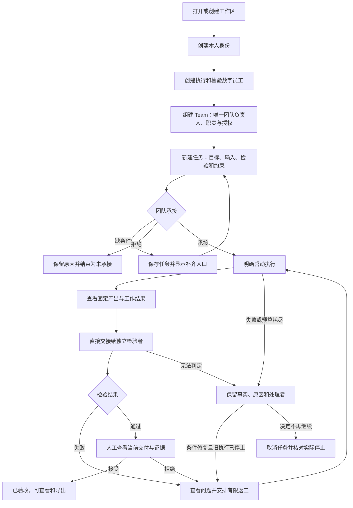

# L1 产品设计：首项团队代码任务的桌面交付

版本：v0.2，2026-09-27；状态：Draft，供评审，未实现。关联 [Issue #1](https://github.com/xforce-io/atelier/issues/1)、[L2 技术设计](technical.md)、[产品方向](../../overview.md)、[名词表](../../glossary.md)。

范围依据：本次会话已选择 GPUI 桌面方向，要求补全 Worker/Team 的位置、配置及完整 Stories，并要求直接开始按新版 keel 调整。本文将首阶段由 CLI/预配置团队调整为桌面创建与交付；原有 S1–S5 保留主旨及编号，S1 扩入首次配置，其余改用真实桌面入口。具体交互是本版可评审方案，不将新稿自批为 Approved。L2 只针对本文 v0.2 形成对应技术草案；不因此授权实现。

## 1. 背景与目标

用户要组织一支能实际工作的团队，而不是先手写配置、记住对象 ID，再分别调用执行器。首阶段用一项可复现的代码修改检验：用户能从空工作区建立成员与团队，交出明确目标，查看工作事实，经独立检验与必要返工后作出人工验收。

成功包括两部分：工作确实完成且有依据；用户知道工作在哪里、谁在处理、下一步是什么，不需要复制消息充当执行者和检验者之间的中转。长期价值仍是围绕明确目标交付并持续学习；本 Issue 只建立可追溯交付与反馈基础，不宣称组织学习已经成立。

## 2. 范围与非目标

| 本次提供 | 具体边界 |
|---|---|
| GPUI 桌面 | 首个验证平台为 macOS；本机单一可信使用者，一个已打开工作区，不承诺多人登录或跨设备同步 |
| Worker 与 Team 配置 | 从空状态创建本人及数字员工、模型连接、1 个用于首项验证的 Team；名字由用户输入，不硬编码成员 ID；团队负责人及验收者本轮为本人 |
| 任务交付 | 保存和查看多项任务，同一工作区最多 1 次活动执行；首项路径为 Team 承接，明确启动、交接、检验、返工、人工验收与手动取消 |
| 输入与证据 | 选择本地 Git 基线、检验配置；至少 1 次真实 milkie 执行、固定代码产出、独立检验、版本关联和导出 |
| 持续可见 | 页面切换、关闭窗口后已启动执行继续；重开窗口能看到事实。显式退出应用先停止执行，重启保留记录但不自动恢复 |

不做：完整即时通信、模型自动识别每句话并建任务、直接 Worker 委派、子任务树、数字员工担任团队负责人、多任务并发/抢占、运行中更换团队负责人、自动恢复或改派、任意执行器切换、自动合入/push/部署、组织学习与 RSI。长期 Task 可交给 Worker 或 Team 的定义不变；这里只提供 Team 入口。CLI 不再是本 Issue 必需交付或图形路径的替代验收。

必须由用户提供的外部条件只有：可用的模型服务凭据、可读的代码仓库，以及可用的本机 Docker 兼容检查环境。应用提供可分发的 Python 标准库代码样例和对应检验配置，界面提供环境检测及样例镜像准备入口；用户不需要预先创建 Worker/Team 或手写内部配置 JSON。环境不可用时仍可保存成员、团队和任务。

## 3. 用户与产品概念

概念定义沿用名词表。界面中“成员”显示 Worker 的人类/数字员工类型，“团队负责人”“任务负责人”“执行者”“检验者”“验收者”分开显示。

| 参与者 | 本轮职责与授权 |
|---|---|
| 本人（Human Worker/人类成员） | 创建本机工作区与配置；显式接受团队管理、任务安排及验收权限；在首个 Team 兼任团队负责人、任务负责人、验收者 |
| 代码执行成员（Agent Worker/数字员工） | 在所分配 Task 的限定副本内修改和提交代码；不能自行授予权限或验收 |
| 独立检验成员（另一 Agent Worker/数字员工） | 接收固定产出并独立检验；不能修改候选代码；与执行者不同 Worker、不同单次执行上下文 |

同一数字员工可以被重复用于后续任务，身份不随 Run 结束消失。模型连接检查成功只证明当时服务可用，不代表已有工作授权、检查环境就绪或任务已经完成。

## 4. Product Interaction Overview / 产品交互总览



建立任务、承接和启动是可区分的动作。成员间交接通过产品操作传递固定资料，用户只作必要安排，不手动转发模型输出。关闭窗口不触发图中的取消或验收。

## 5. 信息架构与入口

首次打开选择“创建工作区”或“打开已有工作区”。新建时选一个本地空目录、填写本人显示名称，确认“以当前本机用户管理此工作区”；保存成功后进入主界面，失败保留输入并显示重试入口。已有工作区读出本人身份，不允许通过选择不同成员冒充另一个主体。

```text
Atelier · 当前工作区                         本人 · 工作区设置
┌──────────┬─────────────────────────────────────────────┐
│ 团队      │ 团队/任务标题 · 当前情况 · 下一步              │
│ 成员      │                                             │
│ 任务      │ 主要内容：列表、配置或任务详情                 │
│ 设置      │                                             │
│          │ 详情内：概况 | 活动 | 产出与检验                │
└──────────┴─────────────────────────────────────────────┘
```

| 入口 | 列表/空状态 | 详情及主操作 |
|---|---|---|
| 团队 | 名称、团队负责人、执行条件；空状态“创建团队” | 团队工作页：任务、待处理事项、成员与配置、新建任务 |
| 成员 | 本人和数字员工，类型、配置情况；“创建数字员工” | 身份、执行配置、连接检查、所属团队与任务；编辑配置 |
| 任务 | 目标、承接 Team、当前情况、处理者；可按 Team/未结束筛选 | 概况、活动、产出与检验；显示当前允许操作及不可用原因 |
| 设置 | 模型连接、检验配置与环境、当前工作区 | 创建/编辑连接、测试、准备样例环境、检测、查看本地存储位置 |

任务详情顶部固定显示目标、Team、任务负责人、当前情况和下一步；技术 ID、原始日志收在二级详情。返回 Team 不结束 Task；打开另一任务只改变当前浏览对象。首阶段没有聊天输入框或“对话意图识别”，因此不制造第二套任务归属算法；长期会话聚焦 0/1 个 Task 的原则不变。

所有表单支持中文输入、键盘顺序导航、可见焦点、长内容滚动和文本状态提示。保存处理中按钮防重复但不能冻结导航；取消未提交表单有修改时询问是否丢弃。已经提交的动作离开页面仍由核心处理，返回后读取结果，不以页面存在与否判断成功。出错保持输入；权限不足说明有权主体；空、加载、错误、执行未知不得都显示“暂无数据”。

## 6. Stories 与完整交互

### S1. 从空工作区建立团队并承接任务

**S1.a 创建数字员工。** 本人进入“成员 → 创建数字员工”，填写名称和职责说明，执行器固定为本轮支持的 milkie；选择模型连接、输入模型标识和角色说明。没有连接时就地打开连接表单，保存后返回，原成员输入保留。首版连接类型为 OpenAI 兼容文本接口：连接名称、服务地址、模型标识、凭据；只承诺通过本版接入验证的服务，不以兼容标签宣称所有供应商均可用。服务地址默认 HTTPS，本机开发地址可用 HTTP 并明确标为本机连接；凭据掩码，不在列表或日志回显。

“测试连接”明确提示发送最小模型请求及可能产生费用，展示测试中、最近结果及时间；只测试服务，不读代码或启动任务。失败显示原因、修复入口并允许保存为待配置。名称必填且在工作区内可区分；其余缺项允许草稿保存，但不能显示可执行。取消创建不生成成员。两次创建得到执行、检验两个独立成员；成员详情可编辑配置，新版本仅供后续未承接任务选择，已承接任务不静默改模型或权限。

**S1.b 创建 Team。** “团队 → 创建团队”：名称、用途、选择成员、选择唯一团队负责人、默认执行者/检验者/验收者、授权摘要。首版团队负责人和验收者只可选本人；不支持的数字员工选项展示原因。执行与检验选择同一 Worker 当场阻止保存。缺执行者/检验者允许保存团队但明确未就绪，不能创建看似完整的工作安排。缺本人或团队负责人不能保存。就地创建成员后返回，团队输入保留。

创建摘要单独列出本人将获得的团队管理/任务安排/验收权限及数字员工在任务范围内的权限；用户确认后生效，不根据“团队负责人”名义推导权限。保存后进入 Team 页；无任务时显示“尚未承接工作”。成员与配置可编辑名称、用途和默认安排，新版本只影响后续承接；本轮不提供删除成员、移除活动任务参与者或更换团队负责人。

**S1.c 准备输入与检验。** Team 页点击“新建任务”，填写目标和交付要求；选择“使用样例”或本地 Git 仓库，从分支/提交列表确认固定基线。明确提示未提交修改不会导入，也不会覆盖原目录；不支持符号链接、子模块或超限输入时列出问题，让用户换基线，不能静默剔除后称导入完整。

检验配置选择列表展示覆盖要求、独立检查、环境及局限。应用自带样例配置；“设置 → 检验配置 → 导入”可选择由可信维护者提供的配置包，在确认页查看镜像、命令、资源与检查文件摘要，确认后形成只读版本；模型或候选仓库不能替换它。检查环境缺失时展示检测结果及安装说明；样例镜像未就绪时提供显式“准备样例环境”，显示下载进度/失败/重试，不在执行中临时联网装依赖。

约束默认展示“每次执行最多 15 分钟、50 次模型迭代、100 次工具调用；最多 2 次返工”，承接前可收紧；不是精确费用上限。成员安排预填 Team 默认值，必须明确唯一任务负责人、执行者、独立检验者及本人验收权。

**S1.d 建立和承接。** 只要有可辨认目标即可“建立任务”；保存后进入待承接详情，显示 Team、缺项与处理者，不启动代码修改。缺条件可继续编辑；本人选择“承接并指定任务负责人”“等待条件”或“拒绝承接”。承接检查契约、职责及授权完整性；服务或检查环境暂不可用时可以承接但显示等待，执行按钮不可用并提供修复入口。等待/拒绝须有原因；拒绝后保留只读记录，不误报已验收。承接后本轮不改目标、输入、成员和约束；新要求另建任务或先取消当前工作。

### S2. 执行并形成固定交付

任务负责人在详情点击“开始执行”，先看到目标、源基线、执行成员、约束与授权摘要。确定后显示请求处理中，再显示当前 Run 与真实进展；重复点击或返回重试不产生第二次执行。已占用工作区时说明哪项工作正在运行并可跳转，不排队或抢占。

用户切换页面或关闭窗口，已经启动的执行继续；再次打开从 Team 的任务列表进入同一任务，概况首先显示当前情况、最近变化、已有产出和下一步，不要求通读日志。仅执行本次获准工作，结束后等待送检，不自动启动其他任务。

执行停止后，“产出与检验”显示固定版本、源基线、差异、生产成员、停止原因和是否部分产出。模型说“完成”没有验收效力；正常候选显示“等待独立检验”。部分产出允许任务负责人查看并明确送检，但只有独立检验和人工验收才能决定是否满足要求。没有成功固定内容时只显示已有版本和失败原因，不能捏造新产出。

### S3. 独立检验与有限返工

点击“交给检验者”，确认指定的当前版本、契约、检验配置、已知问题与接收成员。资料直接关联，不需复制消息。活动中区分交接已发送、已接收、拒收；拒收列明缺项及任务负责人，不能当检验通过。接收后显示独立检验进展，结果为通过、不通过或无法判定，并列出具体检查及证据。

失败后“安排返工”展示问题、将使用的输入版本与剩余额度；确认后由执行成员在新一次 Run 处理，生成新产出。旧问题和旧版本保留，新版本须重新检验。默认 2 次返工，承接前可设 0–2；授权启动一次即消耗，失败不返还。正常执行错误、预算耗尽或验收拒绝后的再次执行也共用该额度，不能换按钮绕过。检验接入失败可在确认旧 Run 停止后重试检验，不消耗代码返工额度，每次仍受单 Run 上限。

额度耗尽显示“等待任务负责人处理”，不继续尝试。可以查看/导出已有结果或取消任务；本轮不提供运行中加额或一键恢复。不得把“等待”包装成整体任务成功。

### S4. 人工验收与取走交付

当前版本检验通过后显示“等待验收”。验收面板一次呈现目标与约束、固定版本和差异、独立检验结论、证据及限制。“接受交付”记录确定的版本与验收主体，任务显示已验收；“要求返工”必须输入原因，回到返工或等待，旧通过记录保留但不能直接再次接受。

无验收权限时说明原因和有权主体；检验失败/无法判定时接受不可用。面板打开后版本已变化，保留用户输入，要求刷新依据，不对新版本复用旧确认。所有条件在操作落实时重新校验，不能只靠禁用按钮。

产出页支持“导出代码副本”：选择新的空目标目录，显示所选版本与 partial 信息，明确只复制该版本代码，不覆盖源仓库、不自动合入或推送。导出失败指出目标问题，已有交付不改变；历史产出也可导出，导出不是验收。重启应用后仍可查看验收与对应证据。

### S5. 失败、停止与重新进入

接入失败、运行错误、预算耗尽分别显示原因、最后持久记录、已有产出及任务负责人。修复模型连接时可以恢复同一连接的凭据有效性；不借此更换已冻结的地址/模型配置。确认旧 Run 停止后才允许安排再次执行或重新检验；信息未知时保持“执行状态未知”，禁止冲突启动。

任务负责人可“取消任务”，先输入原因。没有活动执行时立即记录取消结果；有活动执行时先显示“正在停止”，保留任务未结束，收到真实停止结果后才显示“已取消”。不能确认停止时显示“取消待处理/执行未知”，不宣称安全取消。拒绝承接、取消、已验收分别保留不同结束结果。

关闭窗口只隐藏窗口，应用继续存在，可从 Dock 重新打开；应用菜单“退出”在有活动执行时提供“停止执行并退出”与“返回”。停止流程先拒绝新工作，保存结果；无法确认停止时显示原因，允许用户明确“退出并保留未知状态”，不得显示正常停止。强杀、断电或异常退出后，重新打开显示未核对执行及已有记录，不自动重放。详情提供“重新核对停止状态”：仅当系统确认本应用拥有的执行与检查均已结束才解除冲突启动限制，不恢复旧执行；无法证明则保持阻塞并显示具体资源与诊断位置。

## 7. 产品规则与边界

| 编号 | 必须保证或禁止的结果 |
|---|---|
| R1 身份与授权 | 人类身份绑定本机用户，数字员工绑定实际 Run；不能切换显示角色来冒充操作者；团队负责人不隐含验收权 |
| R2 唯一性与独立性 | Team 始终恰有 1 名团队负责人，承接 Task 恰有 1 名任务负责人；执行者不能独立检验自己 |
| R3 保存与就绪 | 保存成员/团队/任务不等于连接可用、能力就绪、承接或开始执行；缺项有可操作入口 |
| R4 版本 | 已承接任务固定契约、成员、执行及检验配置；新产出有新关联；验收只能引用当前有效检验 |
| R5 执行与任务分离 | Run 结束、页面离开、预算耗尽不结束 Task；验收、拒绝承接、取消有不同结果，未知不冒充停止 |
| R6 有限推进 | 一次活动执行；所有新执行须明确授权且旧活动已核对；共享返工额度，不自动无限重试 |
| R7 证据与验收 | 实际检查证据和自报文字分开；缺检查、过期结果、拒绝后旧通过记录均不得验收 |
| R8 原始内容与凭据 | 不覆盖用户仓库或导出目录；凭据不进入产出、日志或公开配置；检验不能改候选内容 |
| R9 持久与重复操作 | 成功只在实际保存后显示；重复提交不重复执行；返回/重启仍读同一对象和已保存结果 |

## 8. 验收与效果验证

这里定义标准，不填写运行通过结果。执行表另记软件候选、本文版本、环境、时间、证据。以下全部为必需验收，ID 不随改文案重排；全部适用子项通过才汇总对应 S 通过。需真实服务的项缺环境记 blocked，未做记 not_run；不得用 mock、截图或核心单测替代要求的桌面路径。

共用前置 P：macOS 上本版应用、隔离测试工作区、本人身份、可分发样例；除“空工作区”项外已创建 3 名 Worker 和 Team。执行方式均为 agent 驾驶桌面并核对记录；标“真实服务”的项必须真实 milkie/模型及检查环境。确定性注入只用测试构建中标明的失败设施，不向正式用户暴露内部调试字段。E 表示连续操作记录与关键截图、相关对象/版本关联；还需各行明确的证据。

| ID / Story / 规则 | 前置与实际入口操作 | 可判定结果、异常与禁止结果 | 证据与依赖 |
|---|---|---|---|
| S1.A1 / S1.a–b / R1–3 | 空工作区→创建本人→创建 2 个数字员工→组建 Team | 1 个 Team、3 个 Worker，唯一团队负责人；全程不用 JSON/对象 ID/CLI；重开仍在 | E + 配置重开记录；模型测试需真实服务 |
| S1.A2 / S1.a / R3、R8 | 创建成员→填不可用连接→测试→保存→重开→修复重测 | 失败原因、待配置与修复入口明确；不显示可执行、不启动任务、不回显凭据；取消新表单不创建对象 | E + 脱敏日志；可注入连接错误，修复成功用真实服务 |
| S1.A3 / S1.b / R1–2 | 创建 Team→不选团队负责人/执行与检验选同人→尝试保存；再改为合规安排 | 不合法关系不生效；合规后保存，授权逐项可见；缺执行成员可保存但未就绪 | E + 保存前后关系；无需模型 |
| S1.A4 / S1.c / R3、R8 | 新任务→选择样例/本地基线→选择检验配置→环境检测与准备 | 基线可辨认、未提交修改未导入；配置来源和检查可见；环境缺失可保存但不能启动 | E + 源目录前后摘要、检测结果；真实检查环境 |
| S1.A5 / S1.d / R2–4 | 仅填目标建任务→补齐契约→承接；另建任务等待/拒绝 | 建立不执行；3 类承接结果明确；承接后唯一任务负责人、冻结契约、缺运行条件仍等待 | E + 任务/契约；无需模型 |
| S1.A6 / S1.a–d / R4 | 承接任务后编辑成员配置与 Team 默认安排→重开旧任务→新建任务 | 旧任务不静默换配置；新任务使用新版本；没有运行中变更冻结契约入口 | E + 新旧版本关联；无需模型 |
| S2.A1 / S2 / R5、R8 | 已就绪任务→开始执行→产出与检验→查看差异 | 至少 1 次真实 milkie 修改，至少 1 个固定产出；停止原因/partial 可见；不自动检验通过或验收 | E + Run、Artifact、内容摘要；真实服务 |
| S2.A2 / S2 / R5、R9 | 执行中切页→关窗口→Dock 重开→同一任务 | 同一 Run 继续或已产生真实停止结果，记录未丢；能看到变化与下一步，不重复启动 | E + 时间与 Run 关联；真实服务 |
| S2.A3 / S2 / R6、R9 | 重复启动提交；另一个任务尝试启动 | 第一个请求最多产生 1 个 Run；占用时说明任务并可跳转，不隐式抢占/排队 | E + 请求/Run 数量；确定性长执行可注入 |
| S3.A1 / S3 / R2、R7 | 当前产出→送检→接收→检验失败→返工→新版本送检 | 至少 1 次失败、1 次返工、新版本重新检验；不同 Worker、独立上下文，旧问题可见，旧结论不替新版本 | E + 两版产出、交接与检查原始证据；真实服务，缺陷可预置 |
| S3.A2 / S3 / R6 | 将返工上限设为 0，或用尽允许次数→再次安排返工 | 显示额度及处理者，不产生新 Run；错误后换“开始执行”也不能绕过 | E + 计数/Run 清单；失败可注入 |
| S3.A3 / S3 / R3、R7 | 交接缺必需资料→送检；补齐可变交接说明后重试 | 拒收原因和处理者可见；未接收不开始检查；补齐不改冻结契约，不生成虚假通过 | E + 交接结果/检验记录；可注入缺资料 |
| S3.A4 / S3 / R7 | 检验时检查不全/预算耗尽/检查运行错误 | 结果无法判定；部分成功不变成 pass，验收不可用；旧检验保留 | E + 检查原始输出；可确定性注入 |
| S4.A1 / S4 / R4、R7、R9 | 当前版本检验通过→验收面板→接受→重启重开 | 已验收关联同一契约/产出/检验/主体；记录持久存在；不触发外部发布 | E + 验收关联；真实完整交付 |
| S4.A2 / S4 / R6–7 | 等待验收→要求返工→输入原因→再次尝试接受 | 原因及处理者保留，返工/等待明确；旧通过不能直接再验收 | E + 拒绝和后续状态；已通过候选 |
| S4.A3 / S4 / R4 | 打开验收面板后当前版本变化→接受 | 拒绝过期决定、保留输入并要求刷新；不误接受新版本 | E + 新旧版本；可确定性注入并发更新 |
| S4.A4 / S4 / R7 | 检验 fail/inconclusive→验收面板 | 明确不可接受及原因；绕过界面限制的同请求仍被核心拒绝 | E + 核心拒绝记录；可注入结果 |
| S4.A5 / S4 / R1 | 测试工作区取消本人验收授权→打开同一交付→尝试接受 | 界面说明无权，核心不生成验收记录；不提供冒充角色入口 | E + 权限及拒绝；受控测试配置 |
| S4.A6 / S4 / R8 | 当前或历史产出→导出→选择空目录；另选非空目录 | 精确复制所选固定代码内容；非空目录不覆盖；导出不改变验收状态 | E + 源/目标内容摘要；无需新模型运行 |
| S5.A1 / S5 / R5、R9 | 分别注入接入失败、运行错误、预算耗尽→重启查看 | 3 类原因可分辨，责任/契约/已持久产出保留，没有自动重放或成功验收 | E + 3 组停止记录；确定性注入 |
| S5.A2 / S5 / R5 | 有活动执行→取消→核对停止；另注入停止无法确认 | 确认停止才已取消；不明时保持取消待处理/未知，不能冲突启动 | E + 决定及资源停止依据；确定性执行/容器 |
| S5.A3 / S5 / R5、R9 | 有活动执行→菜单退出→返回；再停止并退出→重开 | 返回不丢工作；正常停止保存记录，Task 未被验收或隐式取消；不承诺自动恢复 | E + 重开前后记录；真实执行或确定性长执行 |
| S5.A4 / S5 / R5–6 | 异常退出→重开→重新核对停止状态 | 先显示未知；证明全部所属资源结束后才解除启动限制；核对不恢复旧 Run、不改成已验收 | E + 资源归属/核对结果；故障注入 |
| S5.A5 / S1–5 / R9 | 保存/执行结果写入失败→离开并返回→重试 | 不显示未持久的成功；输入/已有记录保留；同请求不重复执行 | E + 原始存储错误与请求结果；故障注入 |
| S5.A6 / S1–5 / R3 | 以键盘和中文输入走创建、长文本编辑、错误恢复和验收；另用鼠标复走主入口 | 焦点可见、输入无丢字、滚动可达、状态有文字；加载/空/失败分开；无必须使用 CLI 的步骤 | 连续桌面操作记录；人工抽查可读性，缺判断记 blocked |

功能地图按 S 分为 setup-and-intake、code-delivery、verification-rework、human-acceptance、failure-and-lifecycle；对应文件及技术验证见 L2.8。S5.A5/A6 为跨路径验收，主要归属 S5，并引用其他功能路径，不另造重复标准。

效果观察单独进行：首次用户能否不借助开发者完成配置、返回任务后能否仅凭概况说明进展、交接是否仍需复制消息。正式比较前由产品负责人建立基线与判定阈值；学习能力增长的跨任务评估另立范围，不用本次功能测试声称已经证明。

## 9. 折衷与开放问题

- 桌面创建配置取代预配置 CLI，让首项任务具备实际产品入口；增加了表单、凭据、窗口生命周期和图形验证成本。
- 本人承担团队协调，执行、送检、返工仍明确发起；先证明对象、责任和证据闭环，不宣称已交出全部日常协调。数字员工团队负责人、自动推进和持续对话后续单独验证。
- 关闭窗口继续、退出应用停止，选择明确可理解的桌面边界；不提前引入后台服务。异常退出只核对已有资源，不恢复执行。
- 首轮 macOS、单机、单活动执行、固定任务配置，牺牲覆盖面以确保正常及失败路径可判定；这些限制须在应用中说明。
- 本版没有阻止写技术草案的产品范围问题；仍需通过可运行 GPUI 原型、真实服务和检查环境验证可行性。发现做不到时修订产品取舍与验收，不把要求变成隐藏的配置前置或删掉异常验收。
