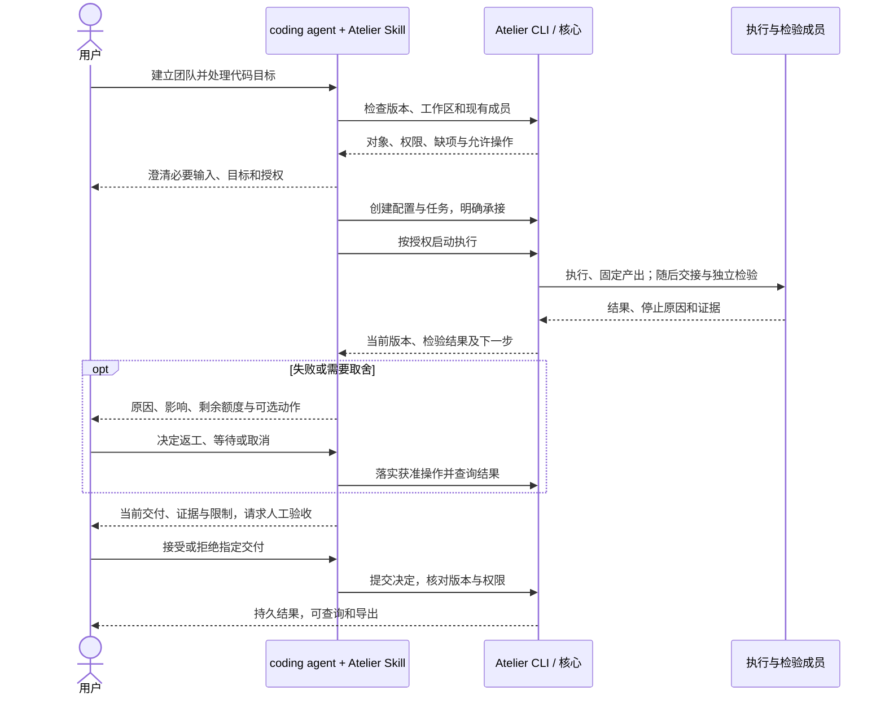
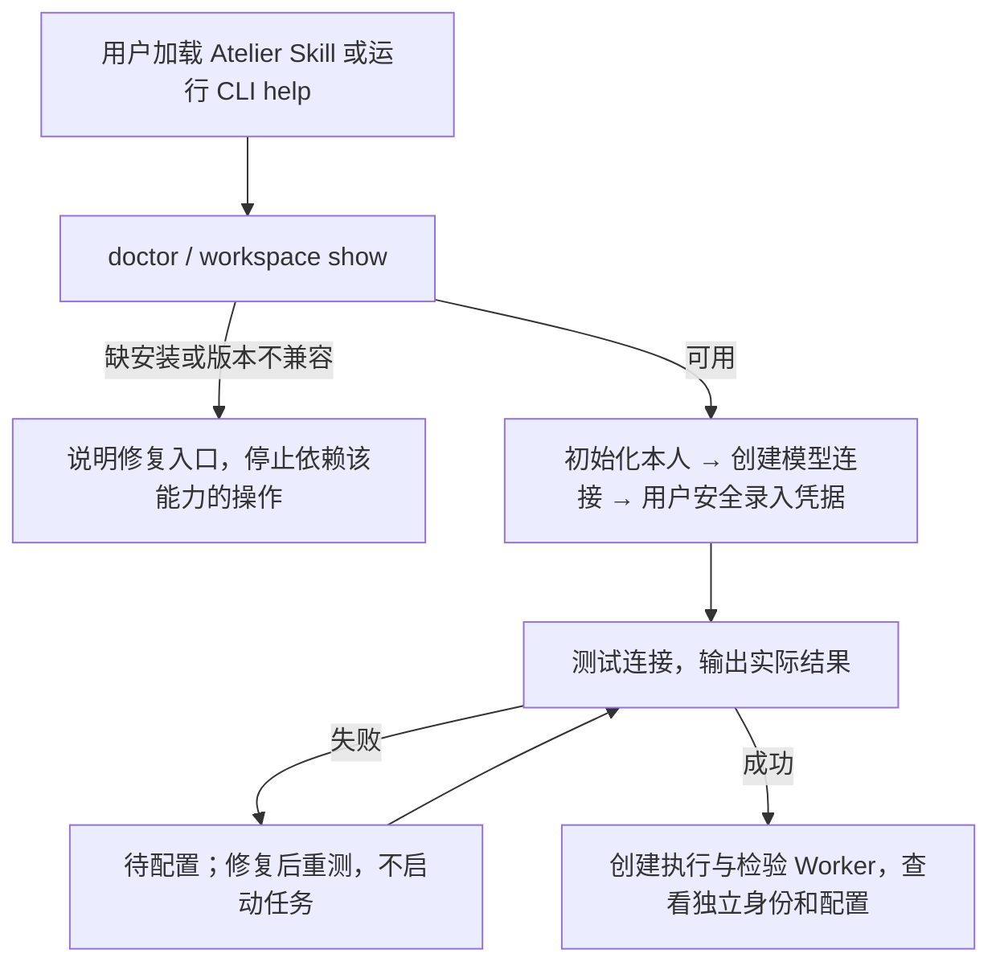
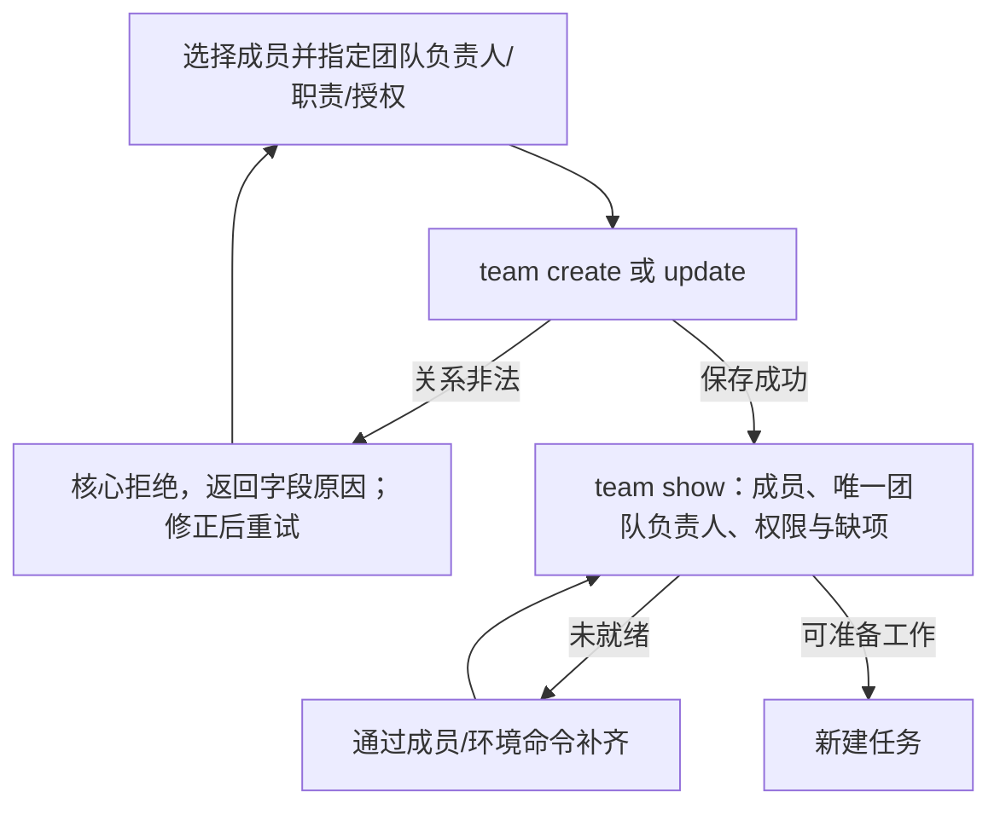
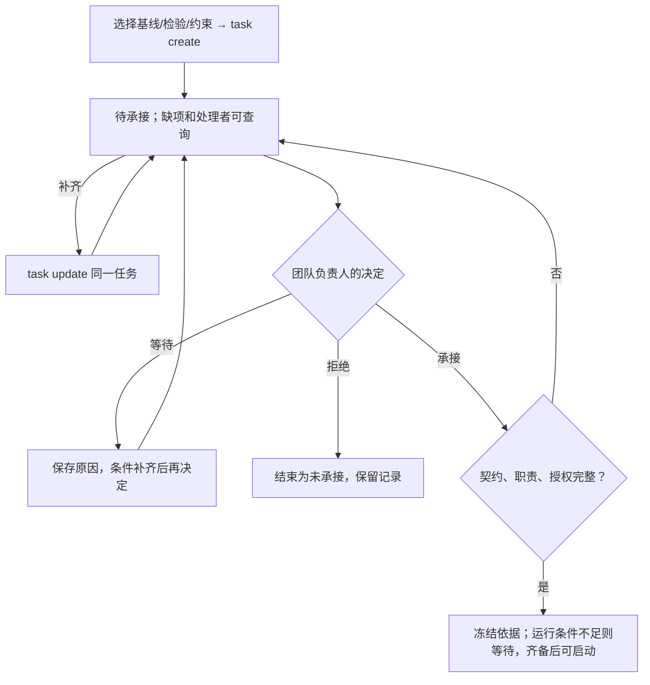
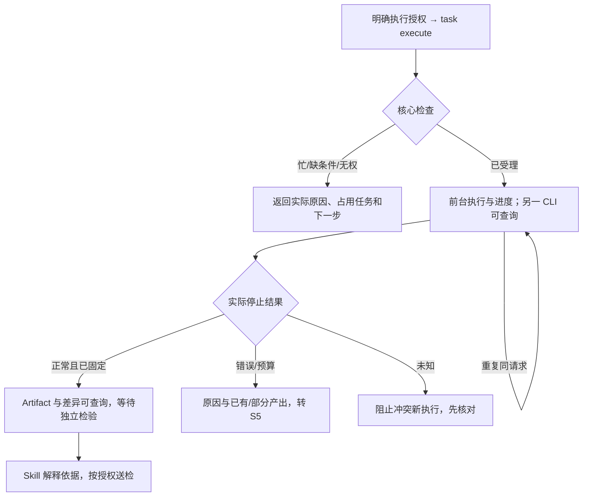
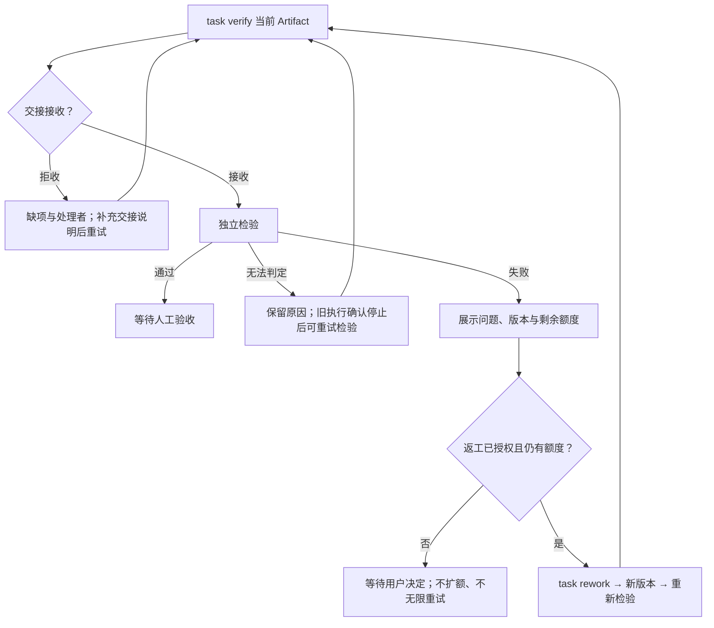
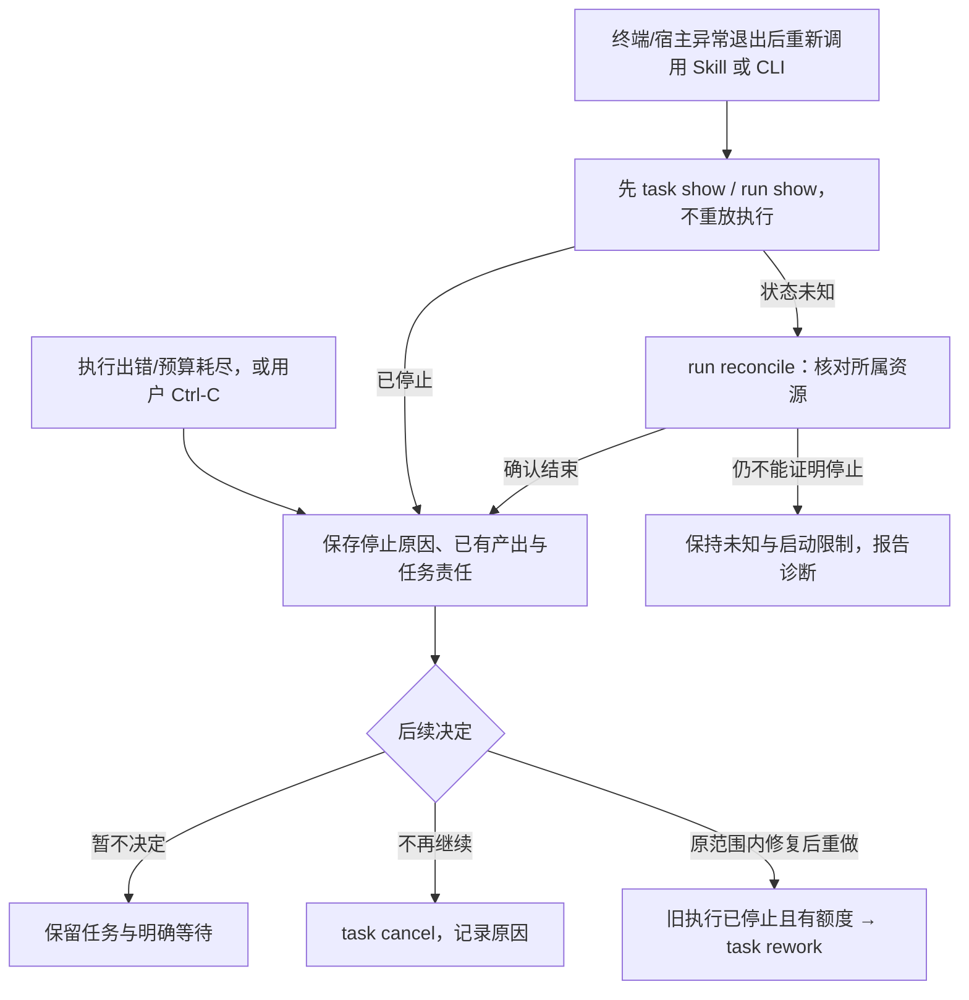
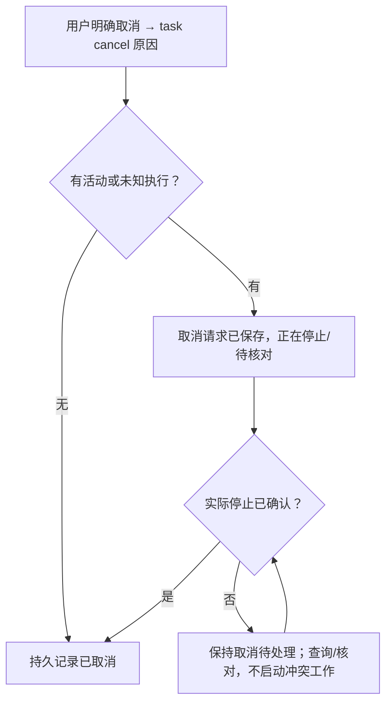

# L1 产品设计：通过 CLI 与 Skill 完成首项团队代码任务

版本：v0.4，2026-09-27；状态：Draft，未实现。关联 [Issue #1](https://github.com/xforce-io/atelier/issues/1)、[L2 v0.4](technical.md)、[产品方向](../../overview.md)、[名词表](../../glossary.md)。

范围依据：用户已确认“先保证 CLI 和 Skill，再补 UI”。本稿取代 v0.3 桌面首发范围，GPUI 保留为[后续产品参考](../future-gpui-product.md)。沿用 S1–S5 的交付主旨；本次是设计调整，不自批实现或验收通过。

## 1. 背景与目标

用户在已经使用的 coding agent 中表达目标，通过 Atelier Skill 建立成员与团队、推进任务并理解结果；也可直接通过 CLI 完成相同操作。先验证团队交付机制与入口可用性，再增加 GPUI，避免把窗口、布局、输入法和核心机制同时引入首个 feature。

首个成功结果：从空工作区创建本人、执行与独立检验数字员工、唯一团队负责人的 Team，真实完成代码修改、检验、返工和人工验收，结果可查询、可导出。用户不必手写内部 JSON 或自行在成员间搬运消息。长期目标仍是围绕明确目标交付并持续学习；第一阶段建立可靠工作事实，不宣称实现自主团队协调或组织学习。

## 2. 范围与非目标

| 本期提供 | 边界 |
|---|---|
| CLI | 人可读文本与稳定 JSON 两种输出；工作区、连接、Worker、Team、任务、交接、检验、验收、取消、查询与导出均有命令 |
| Atelier Skill | 可安装到支持本地 Skill 与终端调用的 coding agent；引导澄清、选择对象、调用 CLI、解释事实和错误；至少在一个具名宿主完成实际端到端验证 |
| 核心 | Rust 持久化工作事实并强制执行身份/授权、唯一性、版本、独立检验、额度与验收条件；不依赖 Skill 自觉维持状态 |
| 执行 | TypeScript milkie 接入；同一工作区最多 1 次活动 Run，可保存多项未结束 Task；执行/检验命令前台运行，另一终端可查询 |
| 初始环境 | 首个验证平台 macOS、单个可信 OS 使用者；受保护本机凭据存储、可读 Git 基线、Docker 兼容检查环境；提供代码样例与检验配置 |

不做：GPUI/Web/TUI、公共服务 API、后台常驻调度、宿主退出后继续执行保证、直接 Worker 委派、子任务树、数字员工团队负责人、多任务并行/抢占、自动恢复/改派、运行中改契约/换团队负责人、自动合入/push/部署、组织学习与 RSI。GPUI 后续复用同一核心契约，不能另建一套任务事实。

Skill 会话不是 Team 的独立执行器；用户的 coding agent 代用户操作 CLI，不因编排就获得某名数字员工的身份。Task 记录跨调用和会话保留，但前台 Run 不承诺在终端或宿主进程消失后继续。关闭查询命令不影响另一条仍运行的执行命令；中断执行命令停止/核对 Run，不自动结束 Task。

## 3. 用户与产品概念

定义以名词表为准。本人是绑定工作区的人类成员，首个 Team 中兼任团队负责人、任务负责人、验收者，各项授权单独明确。两个数字员工分别执行和独立检验，具有不同 Worker 身份和运行上下文。

Atelier Skill 是操作说明与编排入口，不持有独立工作状态，不修改数据库、不直接代替数字员工修改代码、不根据模型自报完成生成验收。CLI 为直接用户和 Skill 返回同一核心事实；人和 agent 都不能靠换显示身份绕过权限。

## 4. Product Interaction Overview / 产品交互总览

用户可跳过 Skill 直接调用相同 CLI。图中成员协作由核心关联输入与结果，不要求用户复制模型输出；图中的顺序不意味着 Skill 获得无限自主推进授权。

## 5. 入口、信息组织与使用方式

安装产物包括 CLI、milkie 接入 runtime、样例/检验配置及 Atelier Skill。`atelier --help` 显示操作分组；`atelier doctor` 检查版本、工作区、执行依赖与缺项。`atelier skill install --target DIR` 安装到用户明确选择的宿主 Skill 目录，不修改其它 Skill，不猜测宿主路径、不覆盖不同内容；`--replace` 只能在展示差异后显式使用。宿主刷新方式随发行文档说明，不把文件复制成功等同于宿主已加载。

| 用户要做什么 | CLI 入口 | Skill 中的表达与反馈 |
|---|---|---|
| 初始化 | `workspace init/show` | “开始使用 Atelier”；先检测已有工作区，不重复创建 |
| 准备成员 | `connection create/credential set/test`、`worker create/update/list/show` | “创建执行和检验成员”；逐项补缺，不让用户手写内部配置 |
| 组建团队 | `team create/update/list/show` | “组一个团队”；展示唯一团队负责人、默认职责及显式授权 |
| 准备输入 | `sample prepare`、`profile import/list/show`、`environment check/prepare` | 选择样例或仓库/基线、检验配置；解释准备动作与缺项 |
| 交付工作 | `task create/update/intake/execute/verify/rework` | 整理目标、建立承接、在授权内调用命令；呈现真实中间状态 |
| 作决定 | `task accept/reject/cancel` | 请求针对当前交付的决定，执行后查询落实结果 |
| 查看与取走 | `task list/show`、`run/artifact/verification show`、`artifact export` | 先给目标、处理者、版本和下一步，再按需展开日志 |

直接用户通过具名参数或 `--interactive` 的逐项提示填写配置；非交互缺必需参数立即返回缺项，不挂起等输入。长文本可传普通 UTF-8 文本文件，不要求内部 JSON。Skill 使用非交互参数和 `--json`，从返回 ID/revision 继续，不能猜测对象 ID 或解析面向人的段落当机器接口。

凭据由用户通过受保护的终端输入或预先设置的秘密来源录入，Skill 不要求粘贴到聊天、不读取回显；也不把密钥作为命令参数。用户可取消交互式录入，未提交部分不创建对象。命令结果区分空列表、缺项、拒绝、执行失败和未知，支持中文名称/长文本及空格路径；stdout 的 JSON 不夹进度，长命令进度在 stderr。

## 6. Stories 与完整交互

### S1. 从空工作区建立团队并承接

**S1.a 安装与配置成员。** 用户安装 CLI 和 Skill，宿主加载 Skill 后先执行版本与 doctor。缺 CLI、协议不匹配或执行依赖时说明缺什么及文档入口，不编造安装成功或启动命令。本人经 `workspace init` 绑定身份；创建模型连接（名称、OpenAI 兼容文本接口地址、凭据引用），测试最小无工具请求。提示测试可能产生费用，展示时间、成功或脱敏原因；失败允许连接/成员保持待配置，不能伪装为可执行。创建两个数字员工，填写名称、职责、连接、模型和角色说明，获得独立身份。本人无需模型配置。

覆盖 S1.a；关联 S1.A1、S1.A2、S1.A7。编辑成员或连接形成新配置版本，已承接任务保持原依据；凭据有效性可以修复，但不能借此偷换冻结的地址或模型。

**S1.b 组建 Team。** 选择名称、用途、已有成员、唯一团队负责人及默认执行/检验/验收安排，首版团队负责人和验收者选本人。缺团队负责人或同人独立检验被核心拒绝；缺执行或检验成员可保存未就绪团队，输出补齐命令。创建前向用户展示将授予的管理、安排、执行范围和验收权限，按明确选择生效，不能由“leader”名义推导。配置变更只影响后续承接，本轮不删除活动成员或更换团队负责人。

覆盖 S1.b；关联 S1.A1、S1.A3、S1.A6。

**S1.c 输入与承接。** 用户选择样例或本地 Git 基线，查看确定 commit；未提交修改不会导入，源目录不被覆盖。不支持子模块、符号链接或超限内容时列出问题，不静默剔除。选择只读检验配置；可用内置 Python 标准库样例，或由可信使用者导入配置包并确认镜像、命令和检查资源摘要。环境检测不足可以先保存任务，准备镜像必须明确触发，不在检查中偷偷联网装依赖。

目标明确即可 `task create`，显示待承接对象、缺项、处理者，不启动。`task update` 仅对未承接任务补充交付要求、输入、检验配置、约束与职责。承接固定这些依据，指定本人为唯一任务负责人；等待或拒绝必须有原因。运行服务尚不可用时可以承接但等待，启动仍需重验。默认每 Run 最多 15 分钟/50 次模型迭代/100 次工具调用，最多 2 次返工，承接前可收紧；不是精确费用承诺。

覆盖 S1.c；关联 S1.A4–S1.A6。Skill 可以根据已明确的范围批量完成普通配置操作，不机械地每条命令都再问；缺重要取舍、扩大权限或新增费用行为时才取得相应决定。

### S2. 执行并形成固定产出

Skill 展示任务目标、执行成员、基线和资源上限，在用户授权范围内调用 `task execute`；直接 CLI 用户调用该命令代表授权此操作。命令前台运行到明确停止或未知，不因一次工具调用超时就重新执行。另一终端可 `task show` 查看同一任务，输出目标、当前 Run、产出、阻塞与下一步；Skill 重新进入会话时也先查询，不从聊天记忆猜测状态。

覆盖 S2；关联 S2.A1、S2.A3–S2.A5。返回产出版本、内容摘要、生产者、停止原因和 partial；没固定成功不制造新版本。模型“完成”或命令退出码 0 不能替代独立检验和人工验收。Skill 不直接修改源仓库来绕过数字员工执行路径。

### S3. 独立检验与有限返工

`task verify` 指定当前产出，核心将契约、固定内容及已知问题直接交给独立检验成员；输出接收或拒收及原因，不让用户复制消息。通过/不通过/无法判定分开，实际检查原始证据可查询。失败后 Skill 解释问题与额度，在原授权已覆盖时推进有限返工，超出范围或需取舍时交还用户，不必为已授权的机械步骤逐次确认。

覆盖 S3；关联 S3.A1–S3.A4。首次执行后，代码重做共用 0–2 次返工额度，错误尝试不返还；不能换 requestId、换命令或重启 Skill 绕过。检验重试不改代码、不消耗代码返工额度，仍受每 Run 上限。旧失败保留，新版本必须新检验。

### S4. 人工验收并取走交付

`task show` 和证据命令返回当前契约、指定产出、差异、检验和限制。Skill 向用户呈现这些依据，请求接受或拒绝该版本；不能把“去实现”“测试通过”或上一次接受当成本次验收。用户直接 `task accept`，或在 Skill 中明确决定后由 Skill 代调同一命令，核心均重验权限、版本和有效检验。拒绝要保留原因与处理者；版本过期则刷新依据重新决定。

```mermaid
flowchart TD
    A["查询当前交付、差异、证据和限制"] --> B["用户决定接受或拒绝指定版本"]
    B -->|拒绝| C["task reject 原因 → 返工或等待"]
    B -->|接受| D["task accept：核心重验"]
    D -->|无权/检验无效/依据过期| E["拒绝变更，解释原因；更新依据后重新决定"]
    E --> A
    D -->|有效且保存成功| F["已验收，之后独立查询仍可读"]
    A -->|另行取走当前或历史版本| G["artifact export → 新空目录"]
    F --> G
    G -->|目标不可用| H["不覆盖文件，改目标后重试"]
    H --> G
    G -->|成功| I["准确复制指定版本，不合入/push/部署"]
```

覆盖 S4；关联 S4.A1–S4.A7。导出不是验收，部分产出也能显式导出并标注限制。Skill 引用人类决定及对应版本，保存记录去除凭据与无关聊天；不承诺防御可信本机进程伪造人类意图，信任边界见 L2。

### S5. 失败、中断与重新进入

CLI 明确输出接入失败、运行错误、预算耗尽，记录责任与已保存结果。Ctrl-C 请求停止本次 Run；Task 保持未结束，不自动取消/验收。强杀或宿主终止可能无法确认停止，后续查询必须显示未知；用户通过 `run reconcile` 核对所属资源，不恢复旧 Run。核对无法证明停止则保持冲突启动限制。

覆盖 S5；关联 S5.A1、S5.A4、S5.A7、S5.A8。`task cancel` 可在另一 CLI 调用：活动执行时先记录取消请求，待实际停止核对后才闭合 cancelled；未知时显示待处理，不假称安全停止。取消与 Ctrl-C 的产品含义分开。

覆盖取消分支，关联 S5.A2。所有操作存储失败都不显示成功，按同 requestId 查询结果再决定重试；Skill 不能为“走完流程”重新初始化工作区、直接改数据库或隐瞒失败。

## 7. 产品规则与边界

| 编号 | 核心保证与入口责任 |
|---|---|
| R1 身份/授权 | 核心绑定本机主体与 Run 身份、核验显式授权；Skill 编排不新增权限；本期以可信本机调用者为边界 |
| R2 唯一/独立 | Team 恰有一名团队负责人，已承接 Task 恰有一名任务负责人；执行者不能独立检验自己 |
| R3 保存/就绪 | 配置保存、连接成功、承接、执行各自有结果；CLI 返回缺项，Skill 不美化成成功 |
| R4 版本 | 已承接依据冻结；当前产出变化使旧检验不满足新验收；拒绝后不能直接复用旧通过 |
| R5 生命周期 | 查询结束、Run 结束、会话结束不自动结束 Task；只有有效验收、拒绝承接或确认取消闭合 |
| R6 有限推进 | 工作区单活动 Run、核心维护共用返工额度；Skill 只在用户授权内编排，不无限重试 |
| R7 检验/决定 | 核心依据真实检查证据和当前版本验收；Skill 取得明确人类决定，不以自报或之前授权替代 |
| R8 内容/秘密 | 源仓库与非空导出目录不覆盖；凭据不进 argv/聊天/产出；独立检验不能改候选内容 |
| R9 持久/幂等 | 持久化后才返回成功；相同请求不重复执行，未知时不盲重放 |
| R10 Skill 事实源 | Skill 必须读取 CLI 返回；命令结果和实际工作记录优先于聊天总结；不直接写数据库或越过核心 |

## 8. 验收与效果验证

本节只定义标准，执行结果另存。下面各项均为必需项；默认在 macOS 隔离测试工作区、公开样例上，由 agent 执行并保留命令、退出码、原始 JSON/文本、对象/版本关联与必要的脱敏宿主操作记录。标“真实”的项须真实模型/milkie/检查环境，缺依赖记 blocked，未执行记 not_run，不用 stub 代替真实闭环。

CLI 与 Skill 是两条实际入口：CLI 验证各命令和规则，Skill 验证宿主中实际加载后能理解目标并使用这些命令。不得用“SKILL.md 存在”或“命令可被脚本调用”代替 Skill 端到端。

| ID / 关联规则 | 前置与操作 | 可判定结果及禁止结果 | 特定证据/依赖 |
|---|---|---|---|
| S1.A1 / R1–3 | 空目录，直接 CLI 创建本人、2 个数字员工和 Team，再查询 | 1 Team/3 Worker，唯一职责与授权可读；无需内部 JSON；独立进程查询仍在 | CLI 文本/JSON、配置关联；真实连接测试 |
| S1.A2 / R3、R8 | 连接不可用→测试→保存待配置→修复重测；取消一次交互录入 | 缺项/原因清楚，不启动工作、不回显秘密；未提交录入不创建对象 | 失败可注入，修复用真实服务；脱敏输出 |
| S1.A3 / R1–2 | 创建/修改 Team，缺团队负责人或执行检验同人，再改正 | 核心拒绝非法关系；缺执行配置可保存但标未就绪 | 失败/成功结果及关系查询 |
| S1.A4 / R3、R8 | 选择基线/样例，导入检验配置，检查/准备环境 | 未提交内容不导入；来源/检查可查看；缺环境可保存但不能执行 | 基线及源目录摘要、真实环境检测 |
| S1.A5 / R2–4 | 仅有目标建任务→补齐→承接，另覆盖等待/拒绝 | 创建不执行；3 类决定可区分，承接后唯一任务负责人和冻结依据 | Task/契约与状态查询 |
| S1.A6 / R4 | 承接后更新成员/Team 配置，再查旧任务与新任务 | 旧任务不换配置，新任务可以引用新版本 | 新旧配置与契约关联 |
| S1.A7 / R3、R10 | 明确目标目录安装 Skill→宿主加载→从空工作区请求组队；另模拟 CLI 缺失/版本不兼容 | 实际宿主调用 CLI 建立对象；缺安装明确阻断，不能假报就绪；不覆盖无关 Skill | 具名宿主/模型/Skill 版本与真实工具调用记录 |
| S2.A1 / R5、R8 | 已就绪任务，用 CLI 执行→读取产出与差异 | 至少 1 次真实 milkie 修改、1 个固定产出；停止原因/partial 可见，不自动验收 | 真实 Run/Artifact 与摘要 |
| S2.A3 / R6、R9 | 重复同启动请求，另一任务尝试启动 | 原请求最多 1 Run；冲突返回占用对象，不抢占/隐式排队 | requestId/Run 数量、忙错误 |
| S2.A4 / R5、R9 | 前台执行中另一终端查询，停止后新进程再查 | 查询不停止执行；同一 Task/Run/产出持久，状态不靠终端记忆 | 两终端记录与版本；真实执行 |
| S2.A5 / R6、R10 | 在真实宿主调用 Skill 提供代码目标，经配置承接、执行、检验、必要返工直到等待验收 | 无手写内部 JSON/消息搬运；调用公开 CLI、返回真实交付及限制；不直接改代码替代成员，不越权自动验收 | 连续宿主工具记录与核心事实对应；真实服务 |
| S3.A1 / R2、R7 | 固定缺陷→交接检验失败→返工→新版本重验 | 不同 Worker，至少 1 失败/1 返工/1 新版重验；旧问题保留且旧结论不替新版 | 真实运行与独立检查输出，缺陷可预置 |
| S3.A2 / R6 | 耗尽额度或设为 0，换命令/requestId/重启后再尝试 | 均无新代码 Run，报告额度与处理者 | 计数、请求及拒绝结果 |
| S3.A3 / R3、R7 | 交接缺资料→拒收→补充说明后重试 | 不开始未接收的检查，缺项明确；不改冻结契约制造通过 | 交接/检查关联；可注入缺资料 |
| S3.A4 / R7 | 检验检查不全、预算耗尽或运行错误 | inconclusive，不准验收；部分成功不当 pass | 原始检查与错误证据；可注入 |
| S4.A1 / R4、R7、R9 | 当前版本 pass→有权用户接受→新 CLI 查询 | 验收绑定同一依据和主体，持久存在，不发布业务产出 | 真实完整交付及 Acceptance Record |
| S4.A2 / R6–7 | 拒绝并说明原因，再尝试沿用原检验接受 | 原因/处理者保留，旧通过不能直接再接受 | 拒绝、阻断和下一步 |
| S4.A3 / R4 | 取得验收依据后改变当前版本，再提交旧决定 | 拒绝过期请求，须刷新并重新决定，不接受新版本 | 并发/版本证据；可注入 |
| S4.A4 / R7 | 检验 fail/inconclusive→直接调用 accept | 核心拒绝，没有验收记录；不依赖 Skill 约束 | CLI 错误及状态查询 |
| S4.A5 / R1 | 测试配置撤销本人验收权→直接 accept | 核心拒绝，不能传 actor 参数冒充 | 权限与失败结果；测试配置 |
| S4.A6 / R8 | 导出当前/历史产出到空目录，另选非空目录 | 精确复制指定版本；非空不覆盖；不改变验收 | 源/目标摘要与导出结果 |
| S4.A7 / R7、R10 | Skill 展示交付；用户未决定/拒绝/接受/依据过期四种交互 | 未决定不 accept；拒绝保存原因；明确接受才代调；过期须重新取得决定 | 脱敏用户决定、真实命令及版本关联 |
| S5.A1 / R5、R9 | 接入失败/运行错误/预算耗尽后独立进程查询 | 3 类原因明确，责任/契约/已有产出在，不重放或误验收 | 3 组确定性失败记录 |
| S5.A2 / R5 | 另一 CLI 取消活动任务，另注入无法停止 | 先返回取消待处理，实际停止才 cancelled；未知不放行冲突启动 | 决定、资源停止及查询依据 |
| S5.A4 / R5–6 | 强杀执行进程→新 CLI 查询→reconcile | 显示未知；全部所属资源确认结束才解除限制；不恢复旧 Run | 资源身份/核对；故障注入 |
| S5.A5 / R9 | 保存/结果写入失败，按同请求查询并重试 | 无虚假成功，既有数据保留，不重复执行 | 存储错误、requestId 与实际结果 |
| S5.A7 / R5 | Ctrl-C 中断前台执行后独立查询 | Run 实际停止或未知，Task 未隐式取消/验收；已有结果可读 | 信号与停止证据；长执行样例 |
| S5.A8 / R9–10 | 宿主工具超时/Skill 会话重开，要求继续任务 | 先查询 requestId/Task/Run，不重发未知副作用；解释阻塞或在已核对状态继续 | 宿主与 CLI 对照记录；故障注入 |
| S5.A9 / R3、R10 | CLI 中文/长文本/空格路径，JSON 非交互缺参数；Skill 收到空列表/失败/未知 | 文本保真，JSON 无进度污染，缺参数不悬挂；Skill 不把三者混为成功 | stdout/stderr/退出码与宿主反馈 |

编号迁移：v0.3 的 S2.A2（关窗口返回）、S5.A3（应用菜单退出）、S5.A6（图形键鼠/输入法）退出本期，保留在后续 GPUI 参考中，不记本期 skip/pass；新增 S2.A4/A5、S5.A7–A9 等表达 CLI/Skill 新入口。其余编号保留原规则主旨，操作入口由桌面变为 CLI；详细执行表必须标 L1 v0.4，不能复用旧入口证据。S1–S5 汇总数量仍为五条。

效果观察：记录首次使用所需人工解释、用户是否仍需手动搬运上下文、Skill 对失败与限制的解释是否足以继续。由产品负责人在正式比较前确定基线；本期不声称已证明自主协调或组织学习收益。

## 9. 折衷与开放问题

CLI + Skill 先验证真实闭环，并允许在现有宿主中使用；代价是受宿主工具执行和上下文能力影响，因此要独立验 CLI 与 Skill。Skill 的意图理解不是核心状态机，不能承担权限和版本规则。

首期选择前台命令，不引入后台服务；Task 持久不等于进程可恢复。GPUI、后台持续推进与团队自主协调分别后续设计，不能将其收益计入本期。已明确的普通步骤可按授权串联，最终人工验收必须是针对交付的决定。

当前无须用户另选首阶段入口。发布前需确定并记录一套可复现的宿主/模型/终端能力、CLI/Skill 兼容版本和真实执行环境；这属于验证条件，不允许改成“Skill 文本存在即可”。
