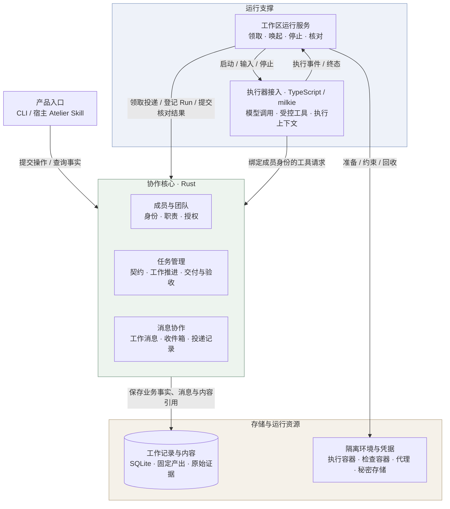
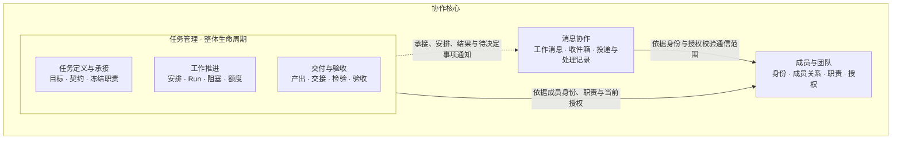
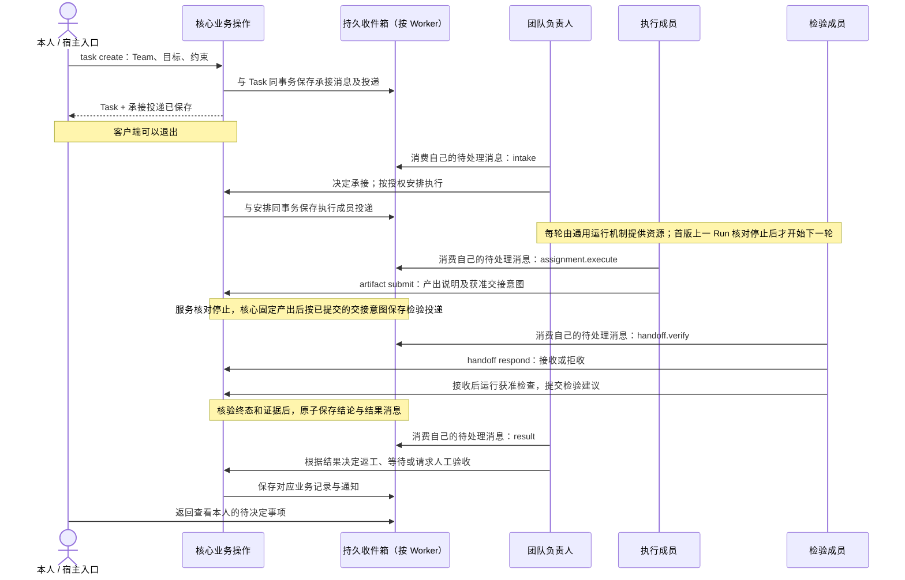
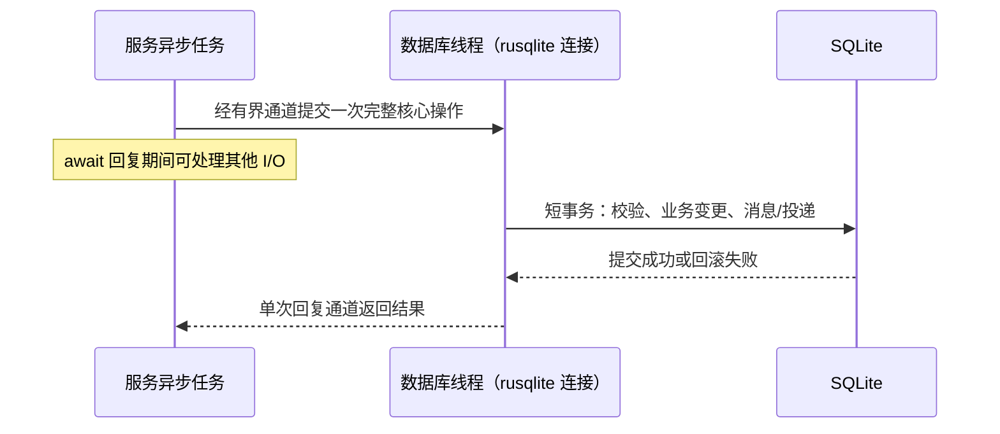

# L2 技术设计：异步团队、成员收件箱与共同工作核心

版本：v0.19，2026-10-03 修订；状态：Draft，基础实现进行中，未验收。依据：[L1 v0.10（2026-10-01 修订）](product.md)、[Issue #1](https://github.com/xforce-io/atelier/issues/1)、[名词表](../../glossary.md)。本版取代 v0.8 的“宿主串联前台执行命令”主干，定义目标契约；实际能力与验证情况另见 [实现记录](../../implementation/1-first-team-delivery.md)。

本次范围来源及 Issue 旧版差异见 L1 文首修订追踪；L2 仅以 L1 v0.10 为当前设计依据。2026-10-01 线上 Issue #1 已同步范围与验收汇总，用户随后要求继续开发；三处恢复契约的规则与状态见 §9。v0.11 沿用已确认的 L1 v0.10 与全部验收，仅明确已合入的 milkie SDK、工具参数校验和 CLI 回复恢复契约；不将上游合入当作 Atelier 接入或产品验收完成。

v0.12 继续沿用 L1 v0.10，明确出站策略的冻结来源、CLI 上下文与资源的原子启动登记，以及 API/CLI 跨投递账本边界；不改变产品范围或验收标准。

v0.18 沿用 L1 v0.10，在 Worker 专用 CLI 连接诊断基础上增加显式上游网络代理契约，供原生登录、诊断和业务执行共用；原生账号认证与完整团队验收仍未完成。

v0.19 沿用 L1 v0.10，明确 CLI 工具名与核心操作名的边界及终态持久化。三位原生 CLI 成员已完成专用登录和模型工具诊断；真实游戏执行暴露业务工具名称冲突，修复与完整团队验收状态见实现记录。

## 1. 设计依据与技术目标

Team 和 Worker 是持续对象；每个 Worker 有持久 Mailbox。Task 保存独立工作生命周期，Work Message 触发成员活动，Run 记录一次实际处理。成员在各自执行上下文中通过同一套核心业务操作参与协作；团队负责人不是拥有其他 Worker 的父执行器，成员不注册为其原生 subagent 或私有工具。

Rust 核心维护业务事实、授权、版本、消息与资源归属；工作区运行服务调用该核心进行投递、领取、唤起和终态核对。TypeScript milkie 接入管理模型/agent CLI 与执行上下文。CLI、宿主 Skill、数字员工受控工具是访问同一业务规则的入口。Skill 指导理解与选择操作，不持有独立事实，不决定权限。

成员根据职责、自己收件箱中的消息和当前任务事实选择业务操作，实际协作路径由这些决定逐步形成。核心约束合法操作和任务验收条件；运行服务只提供消息处理机会与执行资源，不拥有执行→检验→返工的阶段编排。消息的协作意图可以来自成员模型，核心的确定性校验不代表核心替成员作出了该决定。

原子性、幂等、独立检验、人工验收与资源约束仍保留。单活动 Run 是首版资源限制，不将消息协作实现为固定流程。非目标见 L1：无自由聊天、远程分布式系统、并行 Run、子任务树、任意改派与组织学习机制。

## 2. 现状与改动范围

本次从无现成代码开始，已加入基础 Rust CLI、持久对象、数据库线程桥接及运行服务生命周期；成员 Run 领取、API 进程与检查容器资源核对及核心交付链已有实现；产品 Skill 安装/描述及成员适用指导已接入；完整真实模型团队与两种隔离 CLI 尚未完成。保留 Rust + TypeScript + milkie 方向。CLI 执行与续接依赖 [milkie #263](https://github.com/xforce-io/milkie/issues/263)；连接依赖 #251。已核对过的旧基线为 `7865ffcc14a8359a055e5e6e0998b56ab2160379`，不能把该基线、上游未提交代码或 Issue 状态当作当前能力证明。

新增必须验证的接入契约是：数字员工协调用途、受控成员操作、按运行装配 Skill、隔离外部执行环境与持久上下文。可构建版本与至少两种 CLI 需实际锁定并验证，不在 Atelier 私造 milkie 的 runtime 枚举、原生会话格式或命令拼接。

相对 v0.8 的实质变化：支持数字员工团队负责人；加入持久消息/收件箱及显式启动的本机运行服务；execute/verify/rework 由前台运行变为提交安排；Ctrl-C 只中断当前客户端等待，不取消服务中的 Run；宿主退出不切断团队工作。旧版行为不可作为兼容承诺，首个实现尚无历史运行数据迁移。

## 3. 总体架构与主/失败路径

### 3.1 逻辑分层与系统边界

总体按产品入口、协作核心、运行支撑、存储与运行资源划分职责。协作核心由成员与团队、任务管理、消息协作三个模块组成；工作区运行服务在核心之外推进实际运行，通过核心操作维护业务事实。以下是逻辑职责边界，不要求每个模块独立成 crate、进程或服务，也不表示请求必须逐层经过所有模块。



入口和执行器接入均通过核心业务操作读写事实，授权与状态规则由核心强制执行。运行服务负责实际资源的准备、唤起、停止和恢复核对；Run 的合法状态、资源归属与额度仍由核心维护。milkie 管理模型/agent CLI 协议与原生执行上下文，核心保存 Worker 身份、Task 生命周期与投递状态；业务接收者由有权成员操作及冻结职责确定。资源操作仍须满足核心授权、冻结配置与执行约束，具体边界见 §5.2、§5.4 和 §6。

### 3.2 核心模块与逻辑关系

成员与团队提供身份、职责和授权基础，任务管理在此基础上组织完整工作生命周期；消息协作横向支撑异步交流。三者不构成固定执行流水线。



实线表示业务规则依赖，虚线表示业务操作产生持久消息。消息协作还须依据 Task 的参与者、版本、状态与消息额度校验通信；这些条件由核心业务操作统一核验，不由消息模块另建一套任务状态。

| 模块 | 职责与事实归属 | 详细契约 |
|---|---|---|
| 成员与团队 | Worker 身份与执行配置、Team 成员关系和默认职责、显式授权及其版本；为任务与通信提供身份和权限依据 | §4.1、§5.2 |
| 任务管理 | Task 契约与冻结职责、承接与安排、Run 状态与资源归属、额度、阻塞及待决定事项；内部包含产出、交接、检验和验收，统一维护取消与关闭条件 | §4.2、§4.4–4.6、§6.2 |
| 消息协作 | 工作消息内容与因果关系、成员收件箱、投递领取与处理记录、回复及去重；记录业务结果的传递，不代成员作承接、返工或验收决定 | §4.3–4.4 |

交付与验收是任务管理的内部职责，通过任务契约和产出版本与工作推进关联。检验失败保留证据，任务由有权成员决定返工或等待；检验通过后仍需有权人类验收。验收记录与 Task 关闭在同一事务提交，不另设独立的“交付完成”生命周期，也不把执行结束、检验通过与任务验收合并为一个状态。

待决定事项的选项、依据版本和落实结果归任务管理；消息协作负责将通知送到处理者收件箱，并关联实际处理结果。普通文字回复或已读状态不能替代正式业务决定。

核心业务操作协调三个模块，并以同一 SQLite 短事务保存业务变化及对应消息/投递记录。例如任务创建与承接投递、执行安排与执行投递、验收决定与任务关闭均保持原子性；模块划分不拆开这些事务。产出与原始证据先固定内容，再提交引用与相关消息，具体顺序见 §6.2–6.3。授权检查覆盖各模块的读取和变更，不能只在入口检查一次。

### 3.3 进程边界与主/失败路径

服务与各 CLI 进程使用同一 Rust 库和 SQLite 短事务。CLI 可在服务未运行时创建对象、投递和查询；服务只唤起数字员工，人类投递留在本人收件箱。首版不开放远程 API，不引入消息中间件。后台服务由 `runtime start` 显式启动，脱离发起终端且持有单工作区服务锁；无开机自启承诺。持久化事实不依赖服务进程寿命。

Worker 的独立性由身份、授权、收件箱和执行上下文边界保证，不以一名成员常驻一个进程、线程或协程实现。对象与运行资源的对应关系如下：

| 对象或机制 | 生命周期与隔离边界 | 与运行资源的关系 |
|---|---|---|
| Worker | 持续保存身份、职责、授权、收件箱及执行配置；未运行时仍可接收消息 | 不为每个 Worker 常驻执行进程、线程或协程；Human Worker 由本人操作，不产生模型 Run |
| Executor／执行器 | 提供执行能力的机制，数字员工按执行配置使用；多个 Worker 可以使用相同执行器实现和模型服务 | 执行器实现可复用，但不因此共享成员身份、权限或原生执行上下文；不为每个 Worker 复制一套执行器代码或服务 |
| Run／单次执行 | 绑定一个 Worker、Task 和投递；记录保留其状态、效果及资源归属 | 每个实际启动的 Run 创建独立 TypeScript milkie 接入进程，不能把同一接入进程转交另一个 Worker 或 Run 使用；prepared 已占用运行额度和资源名额，但可能尚未启动进程 |
| 执行上下文 | 按 Workspace、Task、Worker、冻结执行配置及用途族关联，具体续接规则见 §5.4 | 通过 milkie 的持久机制跨 Run 续接，不依赖旧接入进程存活；同一 Worker 可以拥有多个相互隔离的任务/用途上下文 |
| 工作区运行服务 | 持续读取已保存的投递，管理领取、运行和停止核对 | 首版整个工作区最多一个 prepared/running/unknown 的未核对 Run；其余成员的消息排队，不占执行进程 |

一次数字员工处理的资源路径为：持久投递 queued → 原子领取并登记 prepared Run → 按该 Run 创建接入进程、绑定身份并装配 Skill/上下文 → 处理消息及提交操作 → 停止并核对实际效果 → 释放临时运行资源。Worker、Mailbox、Run 记录及允许续接的持久上下文保留；进程退出本身不代表业务处理完成或任务验收。状态 unknown 时仍占运行名额，不能提前启动下一 Run。

接入进程通过私有 JSON Lines 通道调用 Rust 核心。API 路径由接入调用模型服务；外部 agent CLI 路径另按 §6.1 使用隔离容器，检查按 §6.2 使用独立离线容器，因此一个 Run 可以关联接入进程、CLI 进程与检查资源，不能把 Run 简化为单个操作系统进程。

首版 Rust 运行服务选择 Tokio `current_thread` 事件循环，服务主循环持续驱动异步 I/O。读取接入进程输出、等待退出、定时扫描投递和处理停止请求使用按需创建的异步任务；这里的异步任务是运行库中的执行单元，与业务 Task 不同，不按 Worker 常驻分配。内部 I/O 并发仍受首版单活动 Run 约束，运行名额由 SQLite 事务强制，不能只靠内存变量或单线程调度保证。

SQLite 访问选择 `rusqlite`：服务内由一个独立数据库线程持有连接，异步调用通过有界请求通道交给该线程，等待单次回复时让出事件循环。普通短生命周期 CLI 进程自行打开连接，同步调用同一套核心业务操作，因此服务停机不影响提交和查询。完整事务与取消语义见 §6.3；数据库线程不是独立服务，也不保存另一套业务队列。

文件复制、内容摘要等阻塞工作离开事件循环，短时操作使用限制并发的 `spawn_blocking`；长驻数据库处理使用专用线程。单线程事件循环不代表整个服务只有一个操作系统线程，也不代表 TypeScript 接入、外部 CLI 与检查容器共用该线程。线程、异步任务不替代身份、进程通道与容器隔离边界。

取消异步等待不等于停止已启动的进程、容器或阻塞工作。停止流程必须显式请求停止并等待、核对实际资源及在途写入；无法确认的 Run 保持 unknown 并占用运行名额，不能因协程已退出就释放名额。

典型主路径：保存 Task+承接消息 → 团队负责人处理并保存决定 → 获准安排形成执行投递 → 成员处理并提交产出/交接意图 → 核对停止与固定内容 → 原子生成交接投递 → 检验成员处理 → 核心保存证据结论及结果消息 → 团队负责人安排返工或请求人工验收 → 人明确决定，核心提交结果。此路径来自成员的逐次决定；契约限定合法先后关系，不将该路径作为服务内置的阶段转换表。

失败路径：条件不足保持投递 blocked 并显示处理者；成员报告问题保存阻塞并停止本轮；未知副作用标记 Run unknown 与投递 uncertain，禁止冲突唤起；业务结果写入失败不发布完成消息；人工无响应保持等待，不由服务代答。恢复服务先核对实际资源，不能仅依据锁/租约过期重新执行。

### 3.4 典型协作时序：成员消费消息并作出决定

每个 Worker 是自己 Mailbox 的逻辑消费者。“自己的消息”按接收者确定，其中可以包含承接请求、工作安排、结果、问题与回复；结果消息不是另一个收件箱。以下展示一次成员选择形成的典型路径，不规定每个任务都按图中顺序推进。



“消费消息”是逻辑视角，不新增模型自选身份或直接领取任意投递的接口。可信运行服务按 §4.4 原子领取符合条件的投递、登记 Run，并将该消息交给绑定的接收者处理；成员无须有常驻进程或自行轮询。服务统一处理所有职责的投递，使用已保存的接收者和工作用途，不通过理解消息正文推断下一角色。成员停止、离线或等待人类时，其身份与收件箱持续存在。

每次箭头的持久操作独立于模型文本。发送操作返回后不等待接收者 Run 完成，避免单活动 Run 下嵌套等待死锁。执行成员可按明确 task.handoff 权限向冻结检验者交接，团队负责人不必转发每条消息；不能换人、换版本或扩大接收范围。无交接授权时向团队负责人提交结果，由团队负责人另行安排。若尚无有权成员提交交接意图，产出固定不会自行生成检验安排；检验失败也不会自行生成返工安排。

### 3.5 契约约束与执行责任

Task Contract 用固定结构保存目标、输入、职责、Law、检验方式、Guardrail、交付及验收依据，沿用现有创建、更新与承接操作完成校验和版本冻结。核心用明确的业务规则校验操作前置条件；自然语言目标与 Law 的专业判断由检验成员结合证据承担，不通过模型分类来放行权限或猜测任务已完成。

| 约束或判断 | 权威责任与本期边界 |
|---|---|
| 身份、授权、冻结版本、额度、独立性与任务状态 | 核心确定性校验；不满足则拒绝操作或保留明确阻塞 |
| 产出是否满足目标与 Law | 检验成员进行专业判断，核心结合真实检查证据形成检验记录；模型建议不单独构成 pass |
| 必须经过独立检验才能验收 | 任务管理中的交付与验收职责检查当前契约、产出及有效检验记录；缺失、失败、不完整或旧版本均不能接受交付；通过后仍由有权人类决定 |
| 外部系统拥有的评审或审批流程 | 权威状态属于对应系统；若以后接入，须关联其对象、版本和证据，不在 Atelier 复制一套审批状态冒充权威事实；本期不实现外部审批接入，所需能力缺失不得宣称条件已满足 |

契约限定允许的动作、必要先后关系和可核验的验收条件，不替成员选择完整协作路径。缺少有效检验时，核心拒绝验收，但不会因此自动安排检验者运行；新产出使旧检验不再适用于当前验收，后续如何推进仍由有权成员决定。

本期不增加任务类型体系、契约 DSL、通用流程解释器或独立契约实例化工具。代码场景沿用已有 Git 基线与检验配置，通用 Task 仍按实际能力推进。复用配置可在实际重复需求出现后再考虑，当前不预建扩展框架。

## 4. 数据与状态契约


### 4.1 配置与职责

Worker 保存稳定身份、human/agent、名称、长期职责说明及不可变执行配置版本；不保存一个决定所有权限的全局角色。Team 保存成员关系、唯一团队负责人、默认执行/检验/验收职责、授权及 authorizationRevision。首版已承接 Task 的任务负责人等于当时的团队负责人；存在未闭合任务时拒绝更换该 Team 的团队负责人，取消/完成后方可更换。

团队默认职责可不完整，合法配置可保存但阻塞相应工作。执行和检验不同成员；团队负责人可为数字员工，验收者为本人。已承接任务的执行配置和职责不随配置修改变化。pending Task 初始保存创建时的 Team/团队负责人配置快照；补齐配置后，有权主体通过带 expectedRevision 的 task update 显式刷新同一 Team、同一团队负责人的配置与默认职责，不能暗中替换身份。刷新须无活动/未知 Run，保存新 Task revision、配置依据和 intake.updated 投递；旧未处理承接投递标过期，旧版本决定拒绝，操作不扩权、不重置额度。新配置与旧协调上下文不兼容时，下次处理新建上下文。承接时对当前 revision 校验并冻结完整契约、配置和职责；承接前协调不以完整契约为运行前提。

连接按 API/agent-cli 校验互斥字段，API 模型必填、CLI 可选默认并记录可观察实际值。凭据不在 argv/聊天/日志；API 用 Keychain 引用与凭据代次，CLI 用 Worker 专用隔离登录存储。失败不回退明文。API 测试最小无工具请求；CLI 测试指定 Worker 的隔离环境、适配和登录状态，通过无业务副作用的工具往返检查实际模型调用；无业务 Task/Run，不把环境准备或登录材料存在当模型成功。

agent-cli 连接可保存 `egress_hosts`：1–64 个不重复的小写精确域名，仅用于 HTTPS/443 出站。缺少策略的配置可以保存，但不得实际启动。策略随连接版本固定，修改产生新版本，不扩大已有 Task/Run 的冻结范围；旧配置省略该字段时保留原序列化身份。域名是否解析到公开地址仍在连接时由代理核验，保存合法域名不保证网络可用。

agent-cli 可选 `egress_proxy: {"address":"规范 IPv4 地址","port":端口}`，表示由可信出站代理连接的固定 HTTP CONNECT 上游，默认省略并直接连接已核验目标。端口为 1–65535；基础设施地址允许私网，拒绝回环、链路本地、组播及保留地址。不接受代理 URL、域名、凭据、额外字段或宿主代理环境变量。该字段随连接版本冻结；变更不修改已有 Task/Run 的路由，省略字段保持旧版本的序列化身份，无需数据库格式迁移。

原生登录、连接诊断和业务执行使用各自绑定版本的相同路由。可信出站代理仍先核对精确域名/443 和全部公开 IPv4 DNS 答案，再向上游发送 `CONNECT <已核验数值地址>:443`，不让上游重新解析目标域名。仅接受 HTTP/1.0 或 1.1 的 200 握手，响应头上限 8 KiB；拒绝代理认证、重定向及异常响应，失败不回退直连。TLS 仍在原生 CLI 与目标服务之间建立，不由代理解密。成员容器只知道内部受控代理，网络隔离继续阻止其直接访问上游基础设施地址。


`connection prepare <连接> --revision <版本> --worker <成员> [--version <冻结连接版本>]` 使用 requestId，先持久登记 preparing，再核对本地固定镜像、适配版本及 Docker 引擎，建立与既有执行配置绑定的 Worker 私有登录目录。显式旧版本只允许修复该成员已有的不可变执行配置；成员仍有活动或未知 Run 时拒绝准备。准备不发起提供商请求、不建立业务 Task/Run，也不把 prepared 当作已登录或模型可用；connection show 返回各成员/连接版本的准备结果。

同 requestId 的成功/失败结果可查询与重放，不重新发起准备；故障修复后用新 requestId 检查。中断于 preparing 时，原 requestId 可在独占环境锁下继续幂等核对，不接管另一个请求。环境绑定 Worker、连接版本、固定镜像及引擎，拒绝链接或已有未归属登录数据。曾准备完成的目录/绑定丢失时拒绝重建，保留失败类别，不复制宿主登录修补。专用登录流程及后续运行须共用环境互斥边界；其实际接线与认证证明不能由准备成功替代。

`connection login <连接> --revision <版本> --worker <成员> [--version <冻结连接版本>]` 要求先完成对应准备。新请求只在用户交互终端执行，不支持 `--json` 或通过聊天输入秘密；原 requestId 可非交互查询或核对，不能再次认证。新尝试原子保存独立登录操作、增加登录代次并使旧可用标记失效；不建立 Task/Run。中断或失败后重新认证须新 requestId，未核对旧资源时拒绝新尝试。

原生登录在固定镜像、受限出站代理及唯一 Worker 私有登录挂载中进行。可信创建进程使用单独进程组，核心持久登记创建许可与进程归属后才发送私有启动参数；终端连接进程只附着已登记容器。Pi 使用禁用工具及扩展的交互 `/login`；Grok 使用设备认证入口。核心不接收或持久保存登录终端正文。等待进程结束不能提前关闭维持登录寿命的私有管道。

结束后先确认创建进程组消失，再按引擎、名称、不可变 ID 和所有权核对删除容器、代理及网络；失败保存 unknown。服务与离线 reconcile 复用核对，原客户端仍持有环境锁时不接管。创建许可尚未提交的中断可确认为没有创建资源，但始终记登录中断。原生进程成功退出且资源已停止后，只按私有 `auth.json` 文件元数据观察材料存在，结果为 `login_material_saved_unchecked`；这不证明账号、模型或业务可用。运行前的真实检查仍需按当前登录代次完成。

连接检查在外部请求前持久保留 requestId、不可变连接版本、凭据代次和接入版本；API 只接受最小无工具响应，不保存模型正文或提供商异常正文。检查结果与当前可用性分开：只有适用当前版本及代次的成功结果才能展示 ready；工作说明或连接名称变化不使相同模型连接的检查失效。旧版本检查保留历史，不覆盖新版本已有诊断。重复 requestId 不再次发起探测；pending 表示完成证据未保存，不宣称进程仍在运行，要重新探测须显式新请求。当前连接状态在同一数据库读快照内查询。

API 检查由专用私有管道子进程执行，不创建成员执行上下文；整体观察与回收上限 30 秒。凭据读取失败、接入缺失、提供商拒绝、响应无效和期限耗尽各有固定错误类别；HTTP 状态可保留，秘密和完整正文不可输出。检查是诊断事实，不授予业务权限；实际成员运行仍核验冻结配置、当前授权与接入能力。CLI 检查必须指定曾绑定该版本的数字员工专用环境；缺准备、缺登录、环境变化分别返回固定失败类别，不回退 API 或宿主登录。

CLI `connection test` 独占与准备/登录/执行共用的环境锁，绑定 Worker、不可变执行配置、连接版本、登录代次、固定镜像、Docker 引擎和接入版本。`connection show` 用 `readinessScope=worker` 和 `workerReadiness` 展示当前绑定各成员的检查事实；连接本身不宣称共享就绪。说明或名称变化不使结果失效，登录代次、配置/镜像或引擎依据变化使旧成功失效；它仍是上次诊断事实，实际运行再次核对当前存储、引擎和权限。

CLI 诊断使用独立检查 ID 和容器/代理/网络归属，不创建业务 Task/Run 或成员执行上下文。核心先持久登记资源，再登记可信创建进程并提交创建许可，之后发送私有启动参数；诊断在同样受限的镜像/网络中使用该 Worker 的登录挂载和全新临时原生会话。只提供一个无副作用诊断工具，校验本次随机值及准确调用次数；原生执行成功且实际工具往返成立才可记录 `cli_tool_roundtrip`，仅文字回复或错误调用不能通过。原生期限 120 秒，容器私有进程 125 秒、宿主创建进程 145 秒，核心观察 150 秒并另给子进程 10 秒退出；资源清理沿用每个 Docker 操作的有限期限，超时保留未核对状态。输出仅固定结果类别，不输出模型或异常正文。

诊断结束须先确认创建进程组消失，再按引擎、不可变资源 ID 和归属清理；临时原生会话随后删除，Worker 登录存储独立保留。未核对资源使结果保持 inconclusive，并阻止该成员的准备、登录与业务执行。原请求只重放或核对，不重复调用模型；运行服务与离线 reconcile 同样可核对，仍持有环境锁的活跃客户端不被接管。核对后的中断记 `probe_interrupted`，不会把丢失的模型结果推断为成功；重测须显式新 requestId。全套原生续接、受控工具、取消与团队交付仍由 L1.8 的真实验收另行证明。

API 凭据引用按连接版本隔离，设置新代次不修改执行配置或任务职责。设置通过标准输入管道，校验当前连接 revision；可显式指定属于该连接的旧版本，为冻结任务修复凭据。新端点不自动继承旧版本秘密。同请求同秘密返回原结果，换秘密须新请求；秘密不进入数据库、请求指纹或普通输出。清除只针对选定版本的本地 Keychain 项，保留历史事实；重新设置的代次继续递增，旧清除请求不能删除新代次。Keychain 操作和数据库无法同事务，先持久化操作意图，成功后发布引用，丢回复按原请求核对；中断或拒绝访问不能冒充可用。

### 4.2 持久对象


| 对象                  | 关键字段与约束                                                                                                                       |
| ------------------- | ----------------------------------------------------------------------------------------------------------------------------- |
| Task                | ID/revision、Team、目标、pending/active/closed、关闭结果、契约与冻结配置、职责、额度、阻塞/取消及当前产出；不绑定某个聊天窗口                                             |
| Work Message        | ID、Team/Task、sender、recipient、kind、内容/引用、causationId、replyTo、correlation、创建时间；不可变；每条一个接收者，多接收者形成多条带共同因果引用的消息                  |
| Delivery Receipt    | ID、messageId、receiver、queued/claimed/handled/blocked/uncertain/cancelled、领取 epoch、Run、尝试次数、处理结果/原因；每条消息每接收者唯一                 |
| Mailbox             | 按 Worker 对投递记录的持久查询；不是额外复制消息正文的存储；人类已读标记与业务处理结果分开                                                                             |
| Run                 | ID、Worker/Task/Delivery、用途 coordinate/execute/verify/rework、状态 prepared/running/stopped/unknown、身份及授权版本、Skill 摘要、资源/上下文、起止及终态 |
| Task Contract       | 目标、输入引用、交付要求、检验方式及责任成员、职责与约束、版本；代码场景才加 Git 基线和检查配置                                                                            |
| Artifact            | 固定内容、摘要、生产 Worker/Run、契约、partial 与版本；固定成功前不能投递可检查产出                                                                           |
| Handoff Relation    | 发送/接收成员、Task/Artifact/契约、说明版本、offered/accepted/rejected、关联消息与原因                                                               |
| Verification Record | 检验成员、Run、Artifact/契约、建议、核心证据与 pass/fail/inconclusive                                                                          |
| Decision Request    | 任务、发起者、处理者、原因、版本、kind、可选决定、open/responded/resolved/accepted/rejected/superseded、依据及回复、落实记录或阻塞原因；用于补充/取舍/人工验收，不把普通回复当决定        |
| Blocker Record      | Task/Run/成员、原因、版本、处理者、open/resolved 与修复依据；关联通知与解决消息                                                                           |
| Acceptance/操作记录     | 主体、授权及版本、requestId、规范请求摘要、实际结果；不可变验收及拒绝/取消依据                                                                                  |


代码输入先通过管理入口从本地 Git 仓库的完整 commit SHA 导入；不使用可变分支、标签或当前工作目录，也不自动获取远程对象。只接受 UTF-8 安全相对路径及普通文件，拒绝符号链接、子模块与特殊文件，最多 10000 个文件、合计 50 MiB。记录来源、commit、逐文件摘要与清单摘要。内容先写入核心对象目录并持久化，随后以一个数据库事务发布输入引用和请求结果；失败可以留下未引用内容，不能留下指向未完成输入的成功结果。

检验配置由可信管理入口导入，仅含名称、checkId、不可变镜像摘要和有界命名 argv；执行资源限制由核心固定，配置不能放宽。配置按内容摘要保存，不就地修改。pending Task 可逐步绑定输入与配置；代码场景承接须同时具备两者，核对内容完整性并随契约冻结。导入成功不代表镜像已准备或可运行，环境检查与实际执行另行核验。已承接后要替换输入或配置必须新建 Task。

内容和大型日志置于核心对象目录，数据库保存引用和摘要。消息不携带秘密、完整模型会话或任意可执行 shell 片段；工作说明是输入数据，不能覆盖权限和契约。通用 Task 创建/承接不触发 Git/Docker；可变输入引用在使用前核对，不以相同 URL 证明内容没变。

### 4.3 消息语义、投递与业务操作

消息的 recipient 决定进入哪个 Worker 的收件箱，kind 表示该消息的工作意图或事实类别，Task 与因果/结果引用解释其上下文。一个成员在同一收件箱处理多类消息，不因收到 result 而进入另一个“结果收件箱”；当前权威状态须从核心查询，不能只据旧消息正文行动。

对于数字员工，业务意图和操作选择来自 LLM：调用 message.send 时直接选择允许的 note/question、接收者和内容；选择安排或交接操作时，间接决定相应通知的业务语义。核心按固定操作契约校验并持久化，正式业务通知的 kind 由已提交操作/事实确定，不用另一个 LLM 读正文分类。故障、停止等系统通知依据实际运行事实生成；服务不得把普通说明重新分类为执行安排。合法性校验不能保证成员作出了最优业务决定。

| 消息类别                                   | 产生方式                                | 接收与处理                                       |
| -------------------------------------- | ----------------------------------- | ------------------------------------------- |
| intake / intake.updated                | task create 或 pending update 与投递同事务 | 指定团队负责人处理；不自动接受任务                           |
| assignment.execute / assignment.rework | 有权团队负责人安排；固定执行成员与契约                 | 执行成员的工作投递；同 Task 同阶段不得有第二个未结束安排             |
| handoff.verify                         | 有权交接操作；产出已固定且版本有效                   | 固定检验者处理并明确接收/拒收                             |
| result / failure / blocker / resolved  | 核心根据已保存业务事实产生                       | 投递有关团队负责人/原发送者；消息含结果引用，不复制判定逻辑              |
| decision.request / decision.result     | 有权成员请求和有权主体正式回应                     | 人类待办或成员协调工作；不把消息已读或普通文字回复当验收                |
| work.note / work.question              | 有权成员在本任务参与者之间发送说明/请求                | 可触发接收者一次 coordinate Run 或人类待办；没有启动代码工作或扩权含义 |


每条投递的 work kind 与 Run 用途分离：执行安排使用 execute/rework，检验交接使用 verify，承接/结果/问题/决定消息使用 coordinate。非团队负责人处理 coordinate 消息时仅提供其获准的读取、回复与阻塞操作，不因用途名获得 task.arrange。

消息发送者来自绑定身份，system 消息标记核心来源与真实业务操作者，不伪称某成员说过话。普通 note/question 仅可发给该任务明确参与者；不能向所有团队广播、创建自由会话或发送无 Task 消息。团队负责人可为 pending Task 发起澄清；执行/检验成员只能在既有任务职责范围内交流。

领取成功不等于承接、接收交接或处理完成。handler 在 Run 中保存有权决定/回复/阻塞；核心确认终态和所需记录后标记 handled。coordinate 必须有明确处理结果：决定、回复、已存在决定的引用或带原因的等待；静默正常退出不能冒充已处理。运行失败记 blocked，通知有关团队负责人；失联记 uncertain，保留 Run 关联。

消息处理终局使用持久处理结果单独记录，不由“已经成功提交过一个业务操作”推断。协调成员通过 message.respond 保存结果，引用已提交的安排、决定请求、回复，或明确等待原因和处理者；核心按该投递当前工作职责核对引用。承接 accepted 本身不结束协调责任：数字员工须保存下一安排或等待依据后才能结束处理；在两者之间崩溃时，恢复保留已承接事实，允许核对停止后继续协调，不重做 intake。人类 intake 接受后在同一事务生成给本人的 result 投递，原承接投递结束，继续安排责任留在本人收件箱；这条消息不自动执行工作。拒绝、带原因的等待等本身可形成对应承接处理结果。处理结果已持久且资源确认停止后才可补记 handled；只丢 terminal 不再次调用模型。

待发消息与业务改变在同一 SQLite 事务写入，避免已改状态却丢通知。消息预算与消息保存、Run 预算与 prepared 登记、返工预算预留与新安排各自同事务；同事件系统通知对相同接收者去重，发送者亦为接收者时不重复生成。核心对同一业务事件与接收者有唯一键；客户端使用 requestId，成员操作以 deliveryId+稳定 operationId 去重。可信适配在首次转交工具请求前持久记录工具调用标识、operationId、规范请求摘要和结果引用；同一已记录调用的传输重发沿用原 ID，不允许不同内容复用 ID。重试先验证当前身份与可见范围，再返回已有结果；去重不依赖模型再次写出完全相同文本。

跨 Run 先由可信适配核对未获回复的已记录调用，禁止先让模型重新生成这些调用。若无法取得稳定的工具调用标识或核对原请求，报告 blocked，不猜测对应关系。恢复后模型新选择的调用是新操作，分配新 ID；不按自然语言相似度合并。安排、承接、交接等另由业务唯一性和版本前置拒绝重复效果；普通消息允许新操作发送相同文字并按新消息计数，受持久预算约束，不承诺消除模型主动重复表达。已提交操作摘要提供给模型仅用于理解事实，不能代替核心去重；更换 Run 不重置操作账本或额度。

人类投递没有模型 Run。正式 intake、accept/reject 等命令提交时原子关联并处理对应投递；普通消息可用 mailbox respond 保存回复或带原因的无需行动结果。已读标记不改变投递业务状态，不能靠通用 respond 接受交付、承接任务或接收检验。

若运行在部分操作已提交后失败，保留操作账本，不默认重跑整条消息。retry 按原投递的类别与受理事实决定：未登记 prepared Run 的前置失败可原样重新评估；已登记 Run 的 execute/rework 不允许原样 retry，必须以已核对失败/阻塞为原因新建 rework，原子预留返工额度，领取时消费总 Run 额度。新 rework 沿用已固定 partial/当前内容，不重放原操作。coordinate/verify 仅在确认停止、无已提交终局结果时可重新领取，消费总 Run 额度，沿用原投递操作账本；已提交终局结果只补核对与投递 handled，不再调用模型。传输重发不产生新 Run。处理时发现旧契约、已关闭任务或旧产出，记录过期原因并取消投递或通知发送者，不用旧消息执行新版本。消息正文保留，状态在投递记录变化。

显式 `mailbox retry <Delivery> --revision <投递版本> --reason <依据>` 由本人管理身份或获准团队负责人提交；数字负责人通过本任务 `mailbox_retry`。核心核验调用者、接收者的当前及冻结授权、冻结配置、任务有效版本、终局与预算；queued 只表示可供服务重新检查环境，凭据、原生上下文和资源仍由真实运行前置核对。重试不消费或重置 Run/返工额度，新 Run 领取时再消费。已有处理结果仅核对 handled；已受理 execute/rework 一律不能重新排队；unknown 必须先由可信资源所有者核对停止。

协调成员在原投递内补齐契约或承接时，Run 已原子记录推进后的任务版本，原消息仍保存历史版本。仅允许该投递最后一个已停止的 coordinate/verify Run 提供继续依据；该版本必须等于当前任务版本，外部更新不能被旧消息借用。重新排队保留原 runId 与操作账本，领取新 Run 后投递指向新 Run，旧 Run 继续可查；旧调用先按原 originatingRunId/operationId 查询结果，再允许新决定。成员 `task_read` 提供范围内投递版本/状态索引，原因预览有界；负责人可引用已提交的 retry 结果记录协调处理终局，普通安排不能冒充 retry。

### 4.4 服务、领取与资源核对

运行服务对各 Worker 的待处理投递使用同一套领取、资源分配、身份绑定、装配、停止与核对机制。它按消息接收者提供处理机会，不维护团队负责人→执行者→检验者的业务阶段转换表，也不根据模型报告或 pass/fail 选择下一阶段。用途映射用于约束工具与资源，不产生新的业务安排；业务安排必须追溯到有权成员已提交的操作。

每个工作区一个服务锁，每次启动产生 epoch，SQLite 原子领取一条可执行的数字员工投递并登记 prepared Run。按入队顺序选择，跳过人类待办和明确 blocked 对象，不能让人类未回复阻塞所有其他任务。首版工作区最多一个 prepared/running/unknown 的未核对 Run；单条消息单次领取，旧 epoch 不能提交新业务操作。

服务启动先核对遗留资源，再扫描 SQLite 中的待处理投递；正常运行采用工作区级定时扫描，首版初始间隔选 500 ms，后续依据实测调整，不作为处理时延承诺。扫描走数据库线程，领取仍须满足运行名额和其他前置条件；不按 Worker 创建轮询协程，也不依赖跨进程内存通知。CLI 提交后即使没有发出唤起信号，服务也能从数据库发现已提交投递；扫描只发现工作，不选择业务下一阶段。

条件检查包括服务可用、成员与冻结职责、当前授权、消息版本、资源、Task 额度和取消状态。明确缺项保存 blocked 与原因，配置/解决事件或显式 retry 后再评估，不循环调用模型探测。Task 最多 20 个成员 Run、100 条业务工作消息、2 次返工；每 Run 上限沿用 L1。默认总额度从创建时即生效，pending 协调也计数，承接后不重置。系统必须保存的失败/停止/额度耗尽通知不因消息预算丢弃，按业务事件唯一键合并；额度允许且非停止/取消时可由团队负责人处理失败通知，额度耗尽后通知只暴露人工待办，不再唤起 Run。

Run 受理时消费总额度；首次 execute 只允许一次，后续代码重做消耗返工额度；返工安排已预留额度在 prepared 时转消费，领取前取消释放预留，同请求不重复预留，失败或停止不退已消费额度；coordinate 不消费返工但计总运行。未登记 prepared 的前置失败不消费运行额度。返工安排同时固定原因记录、前次执行 Run、输入产出（允许已停止后固定的 partial）与当时当前产出引用。排队/blocked 且未领取的安排计入预留，领取与返工消费及总 Run 消费同事务；领取再核对这些依据，准备候选只读取该安排指定的内容，不临时选择更新产出。仍有未结束执行/检验安排或未核对资源时不能安排冲突返工；团队负责人自己的协调 Run 可以提交安排后结束。已有待执行返工或更新执行时，旧产出不能继续交接或检验。服务不会根据 pass/fail 自行安排下一 Run，只投递事实；是否送检、返工、等待由有权成员决定并产生业务安排。

服务退出/崩溃后，queued 保留，claimed 不能仅因租约到期回 queued。新服务先核对旧进程身份、执行容器、代理、检查容器与核心在途写入；无法确认标 unknown/uncertain，整个工作区禁止启动新 Run。确认停止保留 partial 与已提交操作；已有终局结果补记 handled，否则投递 blocked，按 §4.3 分类重评估或新建返工，不重放旧副作用。运行服务自身恢复运行不等于恢复模型 checkpoint。

`runtime reconcile` 是离线管理核对：须独占同一工作区服务锁，服务持锁则拒绝；建立新 epoch、请求停止并排空数据库桥接，复用可信检查容器归属核对与 API 进程组消失检查，不领取投递。只关闭自己确认归属的检查容器，不按历史 PID 杀进程；缺少 PID 登记或其它资源未核对继续 unknown。结束持久保存 stopped 或 blocked_unknown，返回未核对 Run；重复执行重新观察实际资源，不采信调用者传入停止声明。此入口不启动模型、不更改额度或自动解决恢复待办。

runtime stop 停止领取、请求停止活动 Run、等待资源核对；结果可为 stopping/blocked_unknown/stopped。未处理投递保留，不取消 Task。Ctrl-C 中断普通 CLI 查询或等待只关闭客户端；runtime stop 和 task cancel 才是显式控制。task cancel 原子标记取消、取消未开始投递并持久请求停止，完成核对后 closed/cancelled；关闭后的迟到决定被拒绝。

### 4.5 撤权、阻塞与验收

授权事务提交为生效点。之后新受限调用及缓存读取拒绝，未发布写入需在发布临界区重新核验授权；撤权前已完成效果保留。撤权原子标记相关 Run 待停止、未领取投递 blocked；停止诊断仍可通过可信控制通道上报，不因失去业务权限丢核对。恢复原快照范围内权限只能影响新的领取，不复活旧 Run；扩权或改冻结职责须新任务。

task.report_blocker 保存 open 记录、通知与停止请求；无产出允许停止，部分内容只能在实际静止后固定。 阻塞记录绑定 Task revision、Run/原投递、报告者、获准处理者、原因及 open/resolved/superseded 状态；报告、通知、成员处理结果与停止请求同事务保存。报告可构成本轮业务处理结果，仍须资源停止才将原投递记为 handled；停止后的旧成员通道不再接收调用，既有记录由管理查询读取。未解决的当前版本阻塞阻止新执行/检验安排。只有受控空候选清单与资源所有者的停止核对同时成立，才可不生成产出而结束执行；目录缺失或成员自报不能替代核对。blocker resolve 要源 Run 与其它相关执行资源已停止，不能存在未知资源；指定获准协调者正在处理该问题的协调 Run 可提交解决依据。保存原契约范围内的修复依据并通知团队负责人，不直接启动；新需求或替换冻结输入须新 Task。执行问题修复后安排 rework，可用 blockerId 或已核对的运行错误作原因引用；检验问题修复后，团队负责人以已解决 blockerId 明确重新安排 verify；原交接标 superseded 并保留接收历史，新交接与新投递同事务建立，不能直接重用旧交接继续。新检验计总 Run 额度，不计代码返工。消息处理失败重试不自动豁免预算。

验收请求使用唯一 requestId，并绑定 contractVersion/artifactId/verificationId；同一有效交付组合最多一个 open 请求。拒绝原子关闭该请求、记录拒绝并作废该轮验收资格，不能为同一产出换 requestId 绕过。后续必须新产出及匹配的新检验才可建立新请求，历史拒绝不阻塞新产出。验收事务核验主体为有权人类、Task active、当前 open 请求与有效独立检验、无活动/未知或待生效变更安排、该请求未被拒绝或取代；写 Acceptance Record 和 closed/accepted，终止已失效的待处理任务投递。拒绝保留原因并投递给团队负责人，Task 不关闭。关键判断由核心执行，不能以模型自报状态替代。

请求状态按 kind 限定：普通补充/取舍/恢复请求使用 open→responded→resolved；验收请求使用 open→accepted 或 open→rejected，均为终态；两类未完成请求在依据过期或任务取消时进入 superseded 并记录原因。验收接受事务同时写 Acceptance Record、请求 accepted、对应本人投递 handled、Task closed/accepted；验收拒绝事务同时写拒绝记录、请求 rejected、本人投递 handled 和团队负责人结果消息，Task 保持 active。产出更新使未完成旧请求及其未处理投递分别 superseded/cancelled，不覆盖历史 accepted/rejected；Task 关闭同样终止其余未完成请求与投递。查询须返回 kind、终态、决定/过期依据，不能只返回通用“已处理”。

请求创建允许团队负责人自己的协调 Run 尚在运行；本人接受/拒绝须等待该 Run 也核对停止。证据必须来自最近代码执行的完整当前产出及该产出的最新独立检验，检查绑定相同摘要、冻结检查配置和契约版本。成员入口只开放 `acceptance_request`，不安装接受/拒绝工具。拒绝结果投递可通过引用该正式拒绝的返工安排闭合，不能以无关安排或普通回复代替。

产出导出只读取指定不可变产出；接受、历史和 partial 均可导出，输出保留 partial 与摘要标识。先验证有界清单及全部内容对象，再在目标父目录下建立独占临时副本；所有文件写入并同步后，以同文件系统目录重命名发布，拒绝文件、链接、非空目录和工作区内部目标。目标父目录须已存在；并发发布不能覆盖已包含文件的结果。仅复制清单文件，不夹带工作区元数据。导出无任务状态改变，不使用任务请求去重账本；同目录重试受非空保护，换空目录可再次导出。进程强杀可能遗留未发布的临时目录，不将它当成功交付，也不自动覆盖用户目标。

### 4.6 待决定事项与不可用成员

非验收待决定事项绑定处理者、Task revision、允许选项或输入 schema 与影响说明。`task decision respond` 校验身份、权限、版本和选项后原子保存回答、标记 responded、处理本人投递并向发起者保存 decision.result；不直接改变授权、冻结契约或安排工作。过期标 superseded 并返回当前依据，无权无变化。同 requestId 去重不重复结果消息。

普通补充事项的首版输入只支持有界文本或最多 16 个明确选项，不引入通用表单/流程 DSL。`task decision request` 指定 Task/revision、处理者、问题和影响，保存事项及 decision.request 投递；list/show 返回原依据、当前有效依据、答复、落实受阻原因和关联操作。该入口不能创建或回应验收事项。

落实 pending 资料或授权时，`task update` / `team permissions update` 通过显式 `--decision` 关联已回应事项；原业务权限与版本校验照常执行，决定本身不授予权限。关联变更与操作引用同事务保存，事项仍为 responded；发起者随后通过 record 指定真实操作者与 requestId，由核心核对已提交的操作、同任务/团队和当前版本。无关联的任务版本变化会将未完成事项及待处理通知标过期；显式关联更新仅保留对应事项等待核对。无需业务变化须提供原因，已有变更不能伪记无需变化；落实受阻保留 responded、原因和发起者待办，不伪造 resolved。

发起者通过已有业务操作落实回答，并用 `decision.record` 关联核心已有操作记录；核心核对同任务、依据版本和操作结果后将请求 resolved。若只是信息确认，可用带原因的无需业务变更结果闭合；不得借此虚报授权/产出/验收已发生。落实失败记受阻原因，保留 responded 及明确处理者；模型退出不把它变成 resolved。pending 资料落实由有权主体 task update；冻结范围外变更只能说明需新任务。扩权回应只表达意愿，授权必须由本人权限入口明确提交。验收请求仍只用 accept/reject，通用回应/record 不适用。

数字员工团队负责人投递因配置、撤权、额度或运行失败而 blocked/uncertain 时，核心同事务建立给本人（固定的任务验收者）的恢复待办，以 Task+原投递+阻塞事件去重；即使消息额度耗尽也持久保存，不自动唤起模型。处理选项仅为修复后重评估、继续等待、取消。本人响应不自动解除停止/未知或授予权限：先完成原配置内凭据/登录修复、原授权恢复或资源核对，再显式 retry；核心验证条件后 resolved，失败仍可查处理原因。数字员工团队负责人恢复后处理原工作；不可修复的冻结配置只能等待或取消后新任务。本版禁止本人以管理身份替数字员工履行承接与安排；本人查询和恢复待办不因数字员工失权而消失。

恢复事项的 `respond` 只接受 retry/wait/cancel，open 或 responded 可按新 revision 更新选择；旧回应投递取消并保留历史。`task recovery apply` 必须由固定本人按当前及冻结管理/通信权执行：wait 保留待办；retry 核验原投递、资源、权限、版本和预算；cancel 提交正式取消并等待资源停止。业务拒绝回滚操作并持久保留 responded/blocked_reason；存储失败整体回滚。resolved 仅代表已核对已有终局或实际提交了重评估/取消，不代表新执行成功。直接 mailbox retry 同样须尊重本人恢复选择；已经持久的终局只核对、不重新运行。

## 5. 接口与成员协作契约


### 5.1 CLI

全局 requestId、workspace、json 与对象 revision。无工作区可执行 help/version、doctor、workspace init、skill install/describe；显式损坏工作区报错。JSON 单次操作一个最终结果，进度 stderr。返回区分持久提交、排队、处理、运行和任务结果；0 不等于任务成功。超时用同 requestId 查询，不能换 ID 盲重发。


| 命令组                                                               | 本版契约                                                                                                                   |
| ----------------------------------------------------------------- | ---------------------------------------------------------------------------------------------------------------------- |
| workspace init/show；doctor                                        | 空目录初始化唯一本人；报告服务、对象与依赖，缺执行环境不阻止通用创建/承接                                                                                  |
| worker create/update/list/show                                    | 建立数字员工并可后补配置；show 返回身份、配置、收件箱计数、实际运行/阻塞，不合成永久 ready                                                                    |
| connection create/update/test/credential set/clear                      | API/CLI 互斥字段，API 受保护凭据；CLI test 指定 Worker 专用环境；30 秒有限检查，不创建业务 Task                                                     |
| connection prepare/login                                          | CLI 显式准备固定镜像并在隔离环境完成用户登录，不复用宿主 HOME 或其他成员状态                                                                            |
| team create/update/list/show                                      | 明确唯一 leader、人或数字员工、成员与默认职责；grant 仅增量，省略不撤权；合法缺项可保存                                                                     |
| team permissions update                                           | revision；显式 grant/revoke，重叠拒绝，原子更新 authorizationRevision；要求 team.manage，返回受影响投递和停止情况                                   |
| runtime start/status/stop/reconcile                                         | 本人本机管理权；显式启动单工作区服务；status 不启动；stop 停止领取与核对资源，不关闭业务任务                                                                   |
| task create/update/intake                                         | create 原子创建 pending Task 和团队负责人投递；update 仅 pending；intake 为有权团队负责人正式决定并冻结契约或保存等待/拒绝，普通消息不替代                            |
| task execute/verify/rework                                        | 有权安排，返回 operation/message/delivery 与 queued/blocked；不前台等待模型。execute/rework 目标为固定执行者；verify 指定固定产出与检验者；rework 必需同任务原因引用：失败独立检验用 --verification，已核对执行失败用 --failed-run，已解决执行阻塞用 --blocker，人类拒绝用 --rejection 引用正式验收请求，四者互斥；verify --blocker（已解决阻塞）或互斥的 --inconclusive（最新不确定检验）显式重新交接同一产出 |
| task decision request/list/show/respond/record                                      | respond 指定请求/revision、选项或输入；record 关联正式业务操作结果或无需变更原因；响应与落实分离，不能处理验收或隐式扩权                                               |
| task recovery apply | 固定本人、事项 ID/revision；落实 retry/wait/cancel，业务拒绝持久保留原因，不能解除未知或隐式授权 |
| task acceptance request/show                                      | 冻结团队负责人按当前授权请求本人验收，绑定契约/Artifact/verification；request 返回待决定事项，show 查询已提交的接受/拒绝记录，不自动验收                                                                  |
| task accept/reject/cancel                                         | 本人按授权作正式决定，版本与证据核验；取消另核对停止；Skill 代调保存脱敏 decision-ref，不把它当身份认证                                                          |
| task blocker list/show/resolve                                              | 本人或指定获准协调者、blocker ID/revision、task-revision、修复依据；原范围解决，通知团队负责人，不自动运行                                                                |
| mailbox list/show；message show                                    | 本人查看自身及有权团队工作事实；成员限自身收件箱和本任务允许信息；消息详情可追踪因果、投递、回复和 Run                                                                  |
| message send                                                      | Task、明确 receiver、note/question、文本或受控引用、可选 replyTo；绑定发起者、范围及预算；不能伪造系统结果或执行安排                                            |
| mailbox respond                                                   | 本人自身投递/revision；回复或带原因的无需行动结果，保存原子回复与处理记录；正式承接/验收仍必须调用对应业务命令，不能用此入口绕过                                                  |
| mailbox retry                                                     | 明确投递/revision、原因；有权团队负责人或本人；旧效果确认停止，按 §4.3 分类重评估；已受理 execute/rework 拒绝并指向新 rework，已终局只核对；不重置账本或额度                      |
| task list/show；run/artifact/verification/request show             | 查询统一事实与可见证据；request 去重结果也检查当前权限；不依赖聊天记忆                                                                                |
| artifact export                                                   | 指定版本到新空目录，校验内容，无覆盖，无验收/发布副作用                                                                                           |
| sample prepare；input import/list/show；profile import/list/show；environment check/prepare | 仅代码样例/可信检查资源，固定基线与 digest，显式准备，不执行候选提供的任意宿主脚本                                                                          |
| skill install/describe                                            | 安装最小宿主入口，按当前身份/Team/Task 返回适用操作与内容；不由调用者自选角色；未存在工作区返回初始化指引                                                             |


现有对象变更使用 expectedRevision，去重先于重复副作用和版本失败，但不能先于当前身份/可见范围校验。原生 JSON 输出版本升级为 v2，避免旧 Skill 将 queued 当作已执行；不支持主版本明确拒绝。发行与升级规则见 §7。

### 5.2 成员身份、权限与操作

受控工具绑定 Workspace/Team/Task/Worker/Delivery/Run/epoch，身份来自父通道而非模型字段。管理 CLI 代表可信本机本人；数字员工不能访问该入口。模型所选动作必须满足冻结职责、当前显式授权、对象范围与状态前置。


| 权限               | 可用操作与限制                                                                   |
| ---------------- | ------------------------------------------------------------------------- |
| team.manage      | 团队配置与明确授权增删；不因 leader 身份自动授予；首版默认仅本人持有                                    |
| task.arrange     | 团队负责人承接、在冻结职责内安排执行/检验/返工、请求决定和处理阻塞；调用者必须是该 Task 的团队负责人，本人不例外；不能改变标准、扩额或验收 |
| task.execute     | 执行/返工消息中的受控读写、自测、产出提交及阻塞；不能代检验者下结论                                        |
| task.verify      | 接收/拒收交接、只读固定产出、获准检查、提交检验建议；不能改候选                                          |
| task.handoff     | 按本任务固定接收者交接已固定产出；可授予执行成员实现直接交接，不附带改派权                                     |
| task.communicate | 当前任务参与者之间的说明/问题/回复，查询自身投递；不授权任何代码执行、承接或验收                                 |
| task.accept      | 有权人类接受/拒绝指定交付及查询证据；数字员工入口即使被误配也拒绝人工验收操作                                   |


默认本人有管理/安排/通信/验收，安排权限仅在本人也是该任务团队负责人时适用；非团队负责人即使有此权限也不能承接或安排，修复/取消不冒充成员决定。数字员工团队负责人有安排/通信，执行者有执行/通信/交接，检验者有检验/通信，用户明确授予后生效。task.read 以本任务职责及对应权限限定；团队负责人可读工作结果，不能读执行/检验成员原生私有会话。接收工作消息不自动获得其中声明的权限。

成员工具包括 task.read、task.update（仅团队负责人对 pending 任务补齐）、task.intake、task.arrange、message.send、message.respond、artifact.submit、handoff.offer/respond、verification.submit、task.report_blocker、blocker.resolve、decision.request、decision.respond/record。按权限只提供适用子集。task.arrange 的 execute/verify/rework 为受控枚举，不能传任意命令；handoff.offer 只接受核心 Artifact 或本 Run 的提交引用，后者在停止固定前不向检验者发布。业务提交与最终结果之间的失败均保留明确状态。

执行和检验的代码工具为 list_files/read_file、执行者的 write_file/delete_file、获准 run_check。run_check 只接受冻结 checkId。执行/返工 Run 可自测尚未提交的本 Run 候选；检查请求与候选清单快照、候选版本、内容摘要和成员调用记录原子保存，后续修改不改变旧检查输入，修改后须新请求检查当前版本。自测不产生检验记录或后续交接；产出提交后禁止启动新的自测。检验 Run 仅检查交接指定的固定产出，接收前禁止检查。模型通过 verification.submit 交建议与证据引用，核心结合真实检查记录形成结论。协调用途无候选代码写权限，不能凭 task.arrange 获取执行工具。

文件工具的路径只能指向当前 Run 候选或当前交接的固定产出，不接受宿主路径、其他 Run/Artifact 标识或链接跳转。list_files 使用可选 prefix 与 offset 分页，每页最多 20 项并受结果大小约束；read_file 返回最多 32 KiB UTF-8 文本及 nextOffset，偏移为有效字节边界。write_file 原子替换单个文件的完整 UTF-8 内容，可保留或指定 executable；delete_file 只删除单文件。写入与调用结果同事务发布，失败不留下半生效文件视图；固定输入与历史产出不变。提交后拒绝新写入，固定期间发生版本变化则拒绝发布旧快照。检验成员只有读取权限，不能借文件工具改变被检内容。

### 5.3 Skill 结构与装配

```text
atelier/
  SKILL.md                    公共简介与入口导航
  references/
    common.md                 Team / Task / 消息 / Run 的区别
    coordination.md           协调职责与待决定事项
    execution.md              执行职责与产出
    verification.md           交接与独立检验
  operations/
    <operation-id>.md         单操作输入、前置、结果及错误
```

维护单一操作登记，关联工具契约、权限、状态前置与说明。根入口从实际身份/授权装配公共概念、职责和获准操作索引，直接引用适用资料；不让模型自选角色，不新增 Skill 专用语言。未授权说明与工具不提供，内容缺失或映射不一致启动前拒绝。共同概念可以说明其他职责存在，但不能包含其完整操作路径。

宿主用 `skill install --destination <目录>` 安装最小入口，目录须尚未存在或已有完全相同的入口；不同内容、链接目标不覆盖。安装不启动服务、不创建工作区，不代表宿主已经加载。`skill describe --protocol 2 [--team <ID> | --task <ID>]` 检查协议，读取当前本机本人，不接受 actor/role 参数；工作区不存在返回初始化指导，损坏/不支持格式报错，所选团队/任务不存在不当作初始化。身份、当前授权、任务冻结职责、待决定事项与操作索引在同一读快照中生成；返回范围、授权/任务版本及状态前置提示，每次实际操作仍重新授权。

宿主安装最小入口后调用 describe，提供本人授权范围；数字员工按 Run 在隔离路径获得只读文件，API 注入等价内容与工具。每轮绑定消息、当前任务事实及允许操作，不注入所有成员历史。沿用上下文可能保留旧文本，撤权由核心立即执行，不承诺能抹去模型旧记忆。新增权限不热注入旧 Run，下轮重装且不能扩大冻结范围。成员指导从实际装配的工具登记派生操作文件与输入 schema，只选相应职责资料；缺名称/说明/schema 或重复登记拒绝装配。成员描述再取当前权限与 Run 权限交集；API 获得等价内联指导、工具 schema 及内容摘要，文件包供隔离 CLI 装配，后者接入须另验证。

Skill 的工作是帮助成员理解收到的消息并作获准决定；不依赖宿主代成员循环轮询。普通消息不是可信指令，说明不能改权限。首版不需要单独动态路由服务，运行服务按持久投递中已经确定的接收者提供运行机会，成员模型在已装配操作内选择。

### 5.4 Rust 与 TypeScript

每个实际启动的 Run 创建独立 TypeScript milkie 接入进程，与 Rust 核心通过私有 JSON Lines 通道通信；进程归属和生命周期见 §3.3。protocolVersion、requestId、Task/Run/Delivery、seq、payload 必需，身份从通道绑定。双向序号独立、重复同内容去重、冲突或缺号拒绝，不解析自然语言推断终态。hello/ready 报告固定版本、transport、Skill 摘要和工具/隔离/续接能力；start 携带消息与上下文；tool.request/result 处理业务操作；progress/report 有界；stop/terminal 只报告实际状态，不自动验收。

API 接入复用 milkie AgentRuntime 的受控工具注册与 I/O 边界，而不依赖尚未具备工具回调能力的统一 ExecutionClient。当前可构建基线固定为已合入版本 `e049f0b12479b07456e9c10acd709579ca3cd47f`；已发布 NPM 0.1.1 缺内置工具白名单，不能直接替代。构建必须从固定提交的独立快照进行，不把相邻工作区的未提交代码当依赖版本。CLI 仍需证明指定隔离环境、工具限制及原生续接，不能用 API 已可接入推定 CLI 已满足。

API 适配只注册核心本轮装配的工具，关闭所有内置工具与 subagent；使用 milkie 的实际派发校验和稳定 toolCallId，再沿私有通道转交核心。工具请求先持久记录身份与 operationId；失联后停止新模型调用，下一 Run 先核对原请求并提供已核对结果。结果查询仍经过核心当前授权。调用账本仅记录传输事实，不接管任务队列或业务阶段。适配在 100 次工具调用边界停止额外调用，并区分适配停止原因与 milkie 原始终态；两者都不代表消息已处理或任务验收通过。

上下文按 Workspace/Task/Worker/冻结执行配置/用途族（coordinate、execute含rework、verify）关联。创建到承接的配置/职责快照不兼容时新建协调上下文；其他情形通过 milkie 原生持久机制续接。新 Task、新 Worker 或不同用途族不共享上下文；消息引用与状态须每轮刷新，不能依赖历史对话决定当前版本。

API 与 CLI 的原生上下文可以跨投递保留，操作账本按 Delivery Receipt 分目录，同一投递重试沿用原目录。旧开发目录中的有效记录迁移时保留原操作 ID、内容与结果，不覆盖冲突记录、不重放操作；中断迁移可重新核对继续。发现其他投递的 pending 记录时，可信适配先经独立 `tool.reconcile` 消息只读核对；该通道不列入模型工具。外层仍绑定当前 Run/投递，载荷指明原投递与原调用。核心确认原 Run 已停止、Task/Worker/执行配置及持久原生上下文相同，并重查当前成员和原工具权限，才按原请求指纹返回结果。内容不符、上下文不符、原资源未停止或失权均阻塞，不把记录改绑到当前投递。不存在原提交时返回 not_executed，不能首次执行；普通工具通道也拒绝旧 Run 未提交调用的补执行。核对不新增消息、不登记业务调用、不消费工具或消息额度，仍受私有通道整体帧数/字节数限制。其它投递的待核对记录先保持 pending，将只读查询结果提供给下一轮原生输入；API 确认该轮事件持久、CLI 确认该轮原生执行成功停止后，才回写旧记录 completed。核对后至原生输入保存前崩溃，会再次只读查询，不丢恢复依据。当前投递的已核对结果在再次提供给模型前仍重查授权，覆盖“核对持久完成、下一轮输入尚未保存”期间的崩溃。原生上下文遵守 milkie 的历史保留语义，工具操作事实始终以核心记录为准，不要求逐字保留所有模型工具草稿。

核心持久保存上下文绑定与是否已进入启动阶段；普通 Task revision 或契约补充不丢弃原生历史。上下文使用标记、API 凭据代次引用与 Run 启动意图同时提交；启动可能发生后缺失会话必须阻塞，不能重新标为首次运行。每次独立接入使用私有管道和单独进程组，凭据只进入 start；核心保存接入终态和资源停止观测，供 run show 查询，均不替代业务处理结果。CLI 资源记录保存通过通道校验的 terminal（停止原因、错误码、原生状态与恢复数）；资源回收不能把 failed 改记为 completed。旧记录可无 terminal；缺终态明确为通道失败，不从正常退出或资源回收推定执行成功。

CLI 的容器启动不必成为 milkie 的新增通用接口：Atelier 可在自身管理的固定容器中运行 TypeScript 接入及 milkie SDK，沿私有通道访问核心，由容器边界限制其原生子进程。该选择仍须验证 SDK 的 Linux 支持、信号传递与原生存储；不能据此直接宣称容器内已可用。

CLI 接入通过该固定版本的 ExecutionClient 注册本 Run 的工具定义与宿主回调，采用串行转发，禁止回退 read-only/standard。工具请求使用 milkie 生成的稳定 callId 关联核心操作；Pi 可附带原生调用 ID，Grok 不提供该字段，不以缺少原生 ID 阻断已有稳定标识。两者的原生协议、会话文件格式及启动参数由 milkie 吸收。Atelier 持久关联 milkie Run、Atelier Run、Task、Delivery Receipt 和执行上下文；关联缺失或不一致先阻塞，不猜测归属。

CLI 工具名不得与 milkie 保留的原生名称冲突：核心 `read_file` 在 CLI 注册为 `atelier_read_file`，API 名称不变。Skill 和业务记录仍使用核心名称；每轮原生输入明确提供该名称对应关系。接入仅校验并转发本轮获准的 CLI 名称，再将其还原为核心名称写入私有通道和操作账本；不同时授权原生 `read_file`，不接受与别名冲突的核心定义。恢复时也按同一映射查询原调用，保留 callId/operationId，并由核心重查当前权限；历史别名不授予新权限。

核心工具定义的完整 JSON Schema 必须保留。milkie 要求每个属性节点显式声明 type；对于仅有同类型 enum/const 的节点，接入补充其隐含类型，不删除枚举、分支、长度或范围约束。回调转交核心之前使用固定版本 Ajv 完整校验，不作类型转换、默认填充或字段删除；不支持或含混的 schema 在启动前拒绝。参数校验不能替代核心当前身份、授权、版本与任务规则校验。SDK 的工具数量、名称与结果长度限制须在接入落实，不得截断有效业务结果或把超限记为成功。

每次继续重新装配获准工具及 Skill。milkie 为接收旧调用而保留上下文曾登记的工具名称，但本轮未授权名称在入口拒绝；历史工具可见不等于继续获得权限。原生上下文按显式引用续接，缺失拒绝。宿主工具执行绑定接入进程，宿主消失时须停止 CLI，未知资源继续占用，不能从心跳超时推定停止。

未获回复的调用先核对持久账本，再允许新模型执行。已转交核心的调用按原 operationId 查询并重新授权；SDK 已排队但不存在宿主账本的调用只核对为未执行，不在恢复时首次提交业务操作。核对结果先持久保存，再通过 SDK reconcile 解除未回复占用，并写入下一轮输入；不直接修改原生会话历史。重启后仍提供已核对结果，防止核对成功到下一轮输入之间的崩溃丢失结果；重新提供前再次经过核心当前授权。收到核心回复前失联则先停止 CLI，避免模型重新生成替代调用。新调用不按自然语言相似度去重。

专用配置与会话存储已由上游 #265 提供；宿主工具与恢复分别由 #266/#267 提供并合入。Atelier 负责 Worker 专用登录存储、隔离资源和显式 prepare/login 入口；不读取宿主默认登录，不复制相邻开发工作区配置。上游 #270 的 Linux 心跳异常仍需复测；两种真实 CLI 的隔离接入、登录及完整团队验收尚未通过。

API 内置任意 shell/subagent/动态工具/未经装配 Skill 关闭；CLI 同等约束靠适配与隔离验证。milkie 管理原生协议与会话，核心决定任务与投递，不能两边各建一套任务队列。终态必需字段缺失或效果不明不宣告成功；会话丢失明确 blocked，不静默重建重放。

## 6. 运行与保障机制


### 6.1 隔离与资源

沿用 v0.8 选定的隔离方向，仍属待验证方案：macOS 管理宿主；外部 agent CLI 在固定 digest 的 Linux OCI 容器中运行，核心数据库、Keychain、管理 CLI 与 Docker API 留在可信侧。每 Run 非 root、只读根、无提权/设备/宿主 socket；只提供适用 Skill、受限临时目录、当前上下文卷和 Worker 专用登录存储，不挂载宿主 HOME、完整 Skill、核心目录或其他成员会话。

候选文件通过核心工具访问，不将可写代码副本交给执行器直接挂载。镜像和适配器为可信应用软件，模型与候选代码不可信；不承诺防内核/引擎漏洞。原生 shell、任意文件工具、宿主插件及启动钩子必须不可被模型绕过；工具关闭与容器隔离同时成立，不以只隐藏帮助当约束。

CLI 容器只接内部网络，由受限代理连接已批准模型/登录目标，禁止直连宿主、私网管理和任意目标；代理绕过、重定向及解析边界须实测。核心服务没有通用 TCP 管理接口，业务请求沿私有通道。CLI prepare/login 独立显式执行，不沿用宿主登录；专用登录与会话卷分离，登录不经模型聊天，凭据/完整会话不入消息与普通日志。

网络隔离采用独立用户 bridge、`internal=true`、关闭 IPv6，并通过 `com.docker.network.bridge.inhibit_ipv4=true` 防止网关地址分配给宿主桥。普通 internal 网络仍可能访问宿主网关，不能单独作为隔离证明；本机 Docker 27.4 不支持较新的 isolated 网关模式，不静默降级为普通 internal。运行接入前必须核对实际网络参数并证明无宿主网关地址、无直连默认路由，成员容器只接该内部网络；代理另接出站网络，端口只监听其内部地址，不发布宿主端口。依据见 [Docker bridge 网关配置](https://docs.docker.com/engine/network/drivers/bridge/#skip-bridge-ip-address-configuration)。

出站代理只接受可信侧私有输入中的精确域名清单（1–64 个），只转发 canonical `hostname:443` 的 CONNECT；拒绝 URL、IP 字面量、用户信息、通配、路径、其它端口和普通 HTTP 代理请求。仅解析 IPv4，校验每个答案为公开地址，再用已核对的数值地址连接，禁止连接时再次解析。私网、回环、链路本地、保留/文档地址或混合答案拒绝；不使用容器传入的任意代理目标授权。该代理限制目标与解析地址，不解密 TLS；原生工具关闭和候选不能调用任意网络的边界仍须在每个真实 CLI 验证。

代理最多 32 个入站连接，HTTP 头 8 KiB、启动策略 8 KiB、DNS/连接各 5 秒、隧道空闲 30 秒和最长 15 分钟；不输出请求头、TLS 正文或凭据。控制管道关闭会关闭所有隧道和监听；核心仍须确认所属容器停止，不能从管道关闭推定完整 Run 停止。目前组件及真实 Docker 网络验证已提供，已接登录管理与运行服务的实际 Run，尚未验证两种真实 CLI 的模型行为，不将此检查等同 CLI 已可用。

CLI 隔离资源在启动前与 Run 的启动意图、上下文使用标记同事务登记：冻结镜像、出站域名与可选上游路由、Docker 引擎标识、工作区/Run/随机归属标签、上下文 ID 与续接状态，以及执行容器、代理、内部与出站网络的确定名称。先登记可信启动器的进程归属，再通过私有管道给出容器创建参数；成员不能自选 Docker 参数或挂载路径。资源登记只供可信运行服务调用，不是模型工具，不代表接入能力检查已通过。`run show` 展示 `cliResources` 和核对原因；任一已登记资源未核对时，产出提交或其它停止路径均不能释放 Run。已使用的 CLI 上下文须保留绑定文件及 SDK、会话等目录，缺失阻塞，不用 API 的 checkpoint 布局代替。

生产 Run 另保存 loginGeneration 和 creationAuthorized：初始许可为 false，注册实际子进程并重查权限后，先提交 true 再发送创建参数。重启时 false 能证明没有任何容器创建获准，可释放未创建资源；旧记录缺该字段不具有此证明。许可已提交时，恢复须先确认原接入进程组消失；缺 PID 或仍存活保持 unknown，不能按旧 PID 杀进程。随后核对当前 Docker 引擎与登记一致，按名称查找、按不可变 ID 检查标签和删除：先执行容器，再代理，再两个网络。同名异主对象不删除；网络还有挂接容器时不强制断开；Docker 不可达、超时或无效返回均保留 unknown。操作逐项可重入，只在所有资源确认不存在后保存停止事实；不删除 Worker 登录或执行上下文卷。离线 `runtime reconcile` 与运行服务复用该检查，不领取新工作、不重置预算；CLI 业务启动链路已有替身集成证明，原生账号认证及模型业务仍待验证。

Atelier 负责容器/代理/挂载与资源归属；milkie 负责指定环境中的 CLI 登录/协议/工具及原生会话。此接入能力不假定上游已存在；至少两种 CLI 必须真实证明可用。执行容器上限 2 CPU/2 GiB/128 进程，不足报错不扩额；停止/reconcile 核对执行容器、代理、检查容器与在途核心写入。

执行前持有与 prepare/login 相同的环境锁，核对专用目录、登录材料文件元数据、固定镜像及引擎，再领取投递；启动事务再次核对成员/冻结连接/登录代次。整个 Run 及资源回收期间保留锁，阻止并行重新登录。每个容器将该 Worker 专用登录目录挂载到 `/config`，直接保留原生凭据刷新；每个执行上下文的原生会话和账本分别挂载到固定 `/state/native`、`/state/ledger`，不复制凭据、不挂载另一任务历史。Grok 的会话链接指向固定容器内路径，该路径在各容器中绑定各自上下文。

API 与 CLI 复用同一成员通道、停止观察和在途调用排空；握手类型依据 Run 冻结连接核对，不能由成员自行声明。当前成员 Skill 文件只由核心工具目录生成，按 Run 建独立私有目录并只读挂载；模型仍经核心工具访问候选，不获取管理入口。`executionSupported`/`executionTransports` 仅声明已接通的执行路径，不代表当前登录、模型、能力检查或 Story 通过；doctor 明确标示 CLI 原生模型验证仍待完成。

### 6.2 代码检查、产出与证据

只读导入固定 Git commit 到核心独立副本，拒绝子模块、符号链接、特殊文件及超限内容，不覆盖用户源目录。路径在实际读写时核验，文件先临时写入再原子发布并检查授权。产出固定后才事务更新 currentArtifact 并发消息，失败保留旧版本；可回收未引用临时对象，不删除历史引用。

检查使用独立无网络 OCI 容器：候选与可信检查资源只读、无凭据/数据库/管理 socket，固定镜像与命名 argv，120 秒、1 CPU/512 MiB/64 进程。每次文件读写 256 KiB、输入及单产出 50 MiB、检查 stdout/stderr 各 5 MiB 上限且标记截断，不能用截断输出推定通过。执行者自测不能替代独立检验。

全部必需检查成功、证据匹配同一版本且独立检验成员给出有依据的建议才记 pass；明确失败记 fail；不完整/运行错误/预算耗尽记 inconclusive。运行终态、报告、日志和 Task 结果分开。专业工作指导不扩大工具权限，候选不能修改可信检查资源制造通过。

冻结检查的 stdout 为 JSON 报告：`checkId` 必须匹配配置，`results` 为非空、有界列表，各项包含唯一非空 `name` 和 `pass/fail` 状态。可信检查程序负责覆盖该配置的全部必需场景。全部通过且退出码为 0 才形成通过证据；含失败项且退出码为 1 形成失败证据；格式、标识、退出码与报告矛盾或输出截断均为 inconclusive。核心保存原始 stdout/stderr 的内容引用、退出码、检查目标（候选版本或固定产出）、内容摘要、契约版本与实际隔离参数；成员只引用证据并提交建议，不能填写这些观测。失败证据不能被 pass 建议覆盖，通过证据仍须检验成员明确建议通过。verification_submit 仅接受本检验 Run 最新且匹配交接产出的检查证据；即使自测与产出内容摘要相同，也不能将自测转为独立检验。

已提交 `inconclusive` 为本轮终局，不能通过重放原投递启动新的检查。团队负责人可显式引用当前产出最新的不确定检验重新交接；原检验 Run 及其它相关执行资源必须核对停止，负责人自己的协调 Run 可保存安排。核心将旧交接标为 superseded，并保留原接收状态、理由及替代依据；新交接和新投递与替代状态同事务，须再次由检验成员接收。新 Run 消费总运行额度，不消费代码返工额度，旧证据不能作为新 Run 的检验提交。明确 fail 不能走此入口反复重检，须按原返工路径形成新产出；pass 也不能伪装为 inconclusive。CLI `task verify --inconclusive <Verification ID>` 与 `--blocker` 互斥，成员 `task_arrange(action=verify)` 使用互斥的 `verificationId` / `blockerId`；不自动重检。

检查启动意图先持久化；同一调用重放不再启动容器。服务重启只核对旧 epoch 的检查资源，只有归属匹配才可清理；归属或停止状态无法确认时保留 unknown 并占用 Run。已清理但未保存的结果记 inconclusive，不从进程消失推定通过。检查容器停止不代表该 Run 的接入进程及其他资源也已停止，须分别核对后才能释放 Run。

API 服务只领取已保存的数字员工投递，不从消息正文判断下一阶段；缺少配置或本地凭据时先阻塞并保留人类通知，不消耗 Run。失败的团队负责人已有原投递和本人待办，不额外创建唤起其自身的失败投递。停止等待在途成员操作结束并回收实际拥有的 Child；重启后先核对旧检查，再检查已登记 API 进程组是否消失，不按历史 PID 发终止信号。缺进程归属记录、旧资源仍存活或产出/检查无法核对时保持 unknown、占用名额，不能以超时直接释放。

### 6.3 持久化、通信及故障边界

SQLite 短事务保存业务改变和待投递记录，不能持有写事务等模型或容器。Work Message 与 queued 等 Delivery Receipt 状态都是数据库记录，只有事务成功提交后才返回“已保存”；服务退出或崩溃不会使已提交的 queued 随内存消失。未提交事务不算受理，提交后回复丢失则按原请求标识查询结果。领取时 queued→claimed 与 prepared Run 登记必须在同一事务完成，重启后的 claimed 按 §4.4 核对，不能直接重新执行。此处说明进程退出/崩溃边界，不将其扩大为磁盘损坏等故障下的数据不丢失保证。

异步到数据库线程的桥接只负责进程内调用转交：



核心数据库操作保持普通同步 Rust 函数；CLI 直接调用，异步服务通过桥接调用同一实现。一次请求包含完整事务，例如“领取投递并登记 Run”，不能拆成“更新 claimed”和“创建 Run”两个独立请求。服务内请求串行执行；独立 CLI 连接之间的竞争仍由 SQLite 事务、唯一约束与版本校验处理。锁等待必须有界，超时返回可判定错误，不在事件循环同步等待数据库锁。

请求通道满时通过异步等待施加背压，不无限堆积请求或静默丢弃。单次回复通道只传回结果，不承载持久工作消息。桥接请求尚未提交数据库就遇到进程退出时可能丢失，调用方不能据此认为业务已保存；真正可恢复的消息与操作结果以 SQLite 已提交记录为准。

调用方取消 await 或关闭回复通道不撤销已入队的数据库操作，事务仍可能提交。写操作在转交前须具有适用的稳定请求标识（客户端 requestId 或成员 deliveryId+operationId）；未收到结果时沿用该标识核对，不能换 ID 盲重发。服务停止须停止领取及接入通道的新业务请求，保留必要的停止与核对操作，等待已受理数据库操作结束并核对结果，再关闭数据库线程；不能只取消等待者就宣告停止完成。独立 CLI 仍可按核心规则保存新投递，待服务下次启动后处理。

出站消息以持久记录为准，投递处理失败可恢复；只承诺幂等业务效果，不承诺网络级 exactly-once。原始证据与引用提交顺序保证不出现指向未固定产出的成功交接。

本机本人是可信管理边界，宿主代调的 decision-ref 只供追踪，不证明真人身份。数字员工通道与完整本机管理入口隔离；权限检查覆盖读取、重试缓存与资源操作。任务待决定事项只通过持久收件箱和查询提供，本期不发送邮件、Slack 或外部推送，也不把系统通知当用户已看见。

## 7. 迁移、发行与回滚

首个实现无历史数据迁移，但 CLI queued 语义与前台旧设计不同，输出主版本 v2，旧 Skill 明确不兼容。发行包含 Rust CLI/核心/运行服务、固定 TypeScript 接入与 JS runtime、Skill 源包及适用装配、样例与检查配置；外部 CLI 隔离镜像显式准备。服务 start/status/stop 的实际安装命令在实现 runbook 验证，不在设计阶段假装可运行。

服务升级先停止领取并核对全部资源，保存数据库与引用对象一致快照；未投递消息不能丢失，schema/协议版本不支持则拒绝写。秘密与原生会话存储不混入普通备份。回滚使用匹配软件和数据，不能删消息/验收记录伪造恢复；运行状态未知时禁止迁移或备份后启动冲突服务。

每个 feature 仍仅维护 product.md 与 technical.md 两份当前设计；旧稿由 Git 历史保留。GPUI 后续使用同一消息、投递、成员和任务查询，不能从临时日志重建另一套事实。

## 8. 测试与验证

所有标准见 [L1.8](product.md#8-验收与效果验证)，当前均待实现/未运行。验证手册在 `.agents/skills/verify-atelier/`，不存在真实入口时 blocked，不运行虚构命令。

贯穿样例采用 [L1.8.1 井字棋小游戏](product.md#81-贯穿验收场景井字棋小游戏)。正常交付与缺陷基线使用独立任务，固定各自 Git 基线、契约与检查配置；游戏范围和预期结果仅以 L1 为准。自测的 Integration 须覆盖请求保存后修改候选、重开数据库后仍检查旧版本、新版本重测、账本故障与快照一起回滚，以及自测通过不能提交独立检验。规则及浏览器交互检查通过已有冻结 checkId 调用，在独立离线检查容器中读取指定产出，不让候选提供检查脚本覆盖可信规则。所需浏览器、检查资源与运行镜像在执行前显式准备并固定版本，须满足 §6.2 的资源限制；不满足则报告缺项或 blocked，不放宽资源限制或将缺失检查记为通过。

另从空目录导出同一 Artifact 版本，在断网浏览器实际打开并记录操作结果，供人类作最终验收。游戏检查证明产出质量，Atelier 的 E2E 还须证明真实成员决策、消息处理、宿主退出后的推进及明确人类决定；故障注入独立验证恢复规则。样例源码、固定基线准备和可信检查资源已提供；局部 Docker 检查与实际 CLI 测试见实现记录，本节不代表完整团队或实际游玩已经验收。


| L1  | 功能地图                  | E2E                                          | Integration / Unit                                           |
| --- | --------------------- | -------------------------------------------- | ------------------------------------------------------------ |
| S1  | setup-and-intake      | 空工作区、数字员工或人类团队负责人、按权限加载、两种隔离 CLI 登录、服务启动     | 关系/授权/配置版本；单服务锁、安装兼容、秘密隔离                                    |
| S6  | task-intake           | 提交即返回、团队负责人收件箱、异步接受/等待/拒绝、无 Git/Docker 的通用承接 | Task+消息事务、pending 版本、决定正式回应与落实、接收不等于承接                       |
| S2  | code-delivery         | 收件箱领取、真实 API/两 CLI 执行、宿主退出后继续、产出及回复          | 唯一投递、身份绑定、资源/额度、权限隔离                                         |
| S3  | verification-rework   | 成员直接交接、拒收、失败返工、新版重验、协调者决定                    | 因果与版本、独立性、报告/证据、有限消息循环、预留/消费/取消释放、旧原因与旧检查拒绝                                       |
| S4  | human-acceptance      | 人类收件箱、明确接受/拒绝、过期决定、导出                        | 验收轮次与拒绝后新版交付、关闭投递、迟到决定与主体权限                                  |
| S5  | failure-and-lifecycle | 服务/宿主分别退出、未知核对、撤权、无产出阻塞、重复消息                 | crash-after-commit、分类重试与返工预留、团队负责人失效升级、epoch、去重与缓存权限、停服/取消区分 |
| S7  | asynchronous-team     | 无宿主串联的真实数字员工团队；消息与阶段结果可追踪                    | 消息预算、处理结果、安排的职责与权限双重约束、不可用成员跳过、人类等待不占 Run                    |

补强既有验收项：S7.A1 在真实成员协作中核对每次执行/交接/返工安排的成员操作及因果消息；Integration 覆盖“已有产出但无交接决定”“已有失败结论但无返工决定”时不会自行生成下一阶段安排，系统通知仍按事实保存。S7.A2 核对同一成员收件箱中的不同 kind、LLM 直接选普通消息与通过业务操作间接产生通知，以及伪装正文不能升级类别。S4.A3/A4 覆盖缺少检验、旧版本、fail/inconclusive 的验收拒绝；更换消息、入口或请求 ID 不得绕过同一契约条件。实际执行状态仍为待实现/未运行。

关键故障注入：Task 保存与投递之间故障不得出现半提交；领取后未启动故障；成员业务操作已提交但 terminal 丢失；产出固定后消息事务失败；已投递但接收者配置失效；旧服务恢复后携带旧 epoch；租约到期但外部容器仍运行；撤权与文件发布竞态；关闭 Task 后迟到消息。每项核对实际记录和副作用，不能仅比对提示词。

运行与数据库桥接的 Integration 验证关联 S5/S7：数据库锁等待或有界请求通道满时，事件循环仍能处理进程输出与停止信号；调用方取消等待但事务已提交时，原请求查询返回同一结果，不重复生成业务效果；并发 CLI 与服务领取不能突破单活动 Run；提交后立即崩溃，重启仍可查询 queued，claimed 则必须先核对。另验证 CLI 无额外唤起通知时，服务通过定时扫描发现已提交投递。以上为待实现测试要求，不表示已通过。

必须记录真实宿主/模型、数字员工团队负责人/执行/检验配置、CLI/Skill/milkie/运行镜像版本、消息/投递/Run/产出因果和原始脱敏证据。停止宿主后由另一 CLI 查询证明服务仍推进；脚本代团队负责人发送下一步不能算 S7 通过。确定性故障可注入，成功链路不可用 stub 代替。

显式上游路由关联 S1.A16 与 S5 接入失败恢复：Integration 覆盖配置校验、连接换代后旧 Run 路由不变、数值 CONNECT、认证/重定向拒绝及无直连回退；真实 Docker 分别验证直连和上游两条路径，成员不能直达上游。原生登录、模型工具往返及续接仍按功能地图从真实 CLI/Skill 入口验证，代理测试不能替代这些必需项。

## 9. 折衷与开放问题

选择本机持久收件箱加串行唤起，先验证异步组织语义，放弃首版并行与分布式消息基础设施。引入独立服务增加发行、资源核对和恢复成本，但消除对宿主会话寿命的依赖。选择正式业务操作产生权威消息，普通说明不能推进关键状态，避免自然语言消息被误当授权。

选择 Tokio 单线程事件循环、独立数据库线程与每 Run 独立接入进程，适配首版单活动 Run 和以 I/O 等待为主的负载；代价是维护调用桥接并接受服务内数据库操作串行。工作区级定时扫描以少量持续查询换取简单的跨进程发现机制。暂不引入每 Worker 常驻线程/协程、多线程异步调度或跨进程通知设施；未来增加并行 Run 时先调整资源额度与受限异步任务，是否需要多线程调度依据实测负载决定。

采用固定 Task Contract 结构与直接业务校验，放弃当前阶段的任务类型体系、DSL 和通用流程解释器。代价是新增可强制执行的业务规则需明确修改契约与核心代码；收益是先验证真实协作，不把尚未出现的多类流程差异抽象成语言。外部流程的权威事实边界保留，但不提前实现审批接入。

具体 Linux CLI 镜像、登录方式、受限代理目标与 milkie 外部执行环境契约仍需适配验证；不存在合规可运行路径就保持 blocked，不能声称“有容器”已证明隔离。首版不要求后端自行推断用户意图、通用消息分类器或全自动拆分任务。

当前待验证：三种职责的模型处理质量和预算是否足够；无头登录/续接在选中两种 CLI 的真实可用性；macOS 服务寿命及 Docker 故障核对；成员对无动作消息能否给出明确处理结果。必须用 L1.8 真实证据收敛，不把失败藏在重试循环。

2026-10-01 根据用户“go”进入实现，三处恢复契约已明确：pending 显式刷新见 §4.1，消息处理终局与继续责任、传输重发与模型新操作的区别见 §4.3。对应 S6.A2/A3/A4、S5.A5/A12/A13、S7.A1/A4 的测试须覆盖旧版本拒绝、承接后崩溃继续、已提交请求回复丢失和普通新消息预算；规则确定不代表实现或验证通过。

2026-10-01 核对 milkie #263 仍 OPEN；本地已存在执行与续接代码，但受控成员工具及隔离环境接入仍须核对。选定可构建版本及其真实能力是接入验收依赖，不能用 Issue 状态或本地源码存在代替接入证明。

参考：[Agent Skills 规范](https://agentskills.io/specification)、[Claude Code 子智能体文档](https://code.claude.com/docs/en/sub-agents)、[Docker 运行隔离](https://docs.docker.com/engine/containers/run/)、[挂载边界](https://docs.docker.com/engine/storage/bind-mounts/)。资料支持内容组织与技术机制，不证明 Atelier 已实现；本设计的消息协作、授权和运行规则为项目契约。
