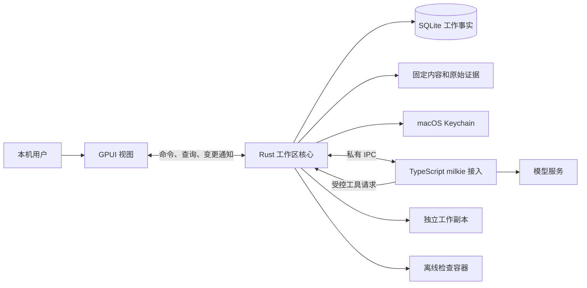

# L2 技术设计：首项团队代码任务的桌面交付

版本：v0.2，2026-09-27；状态：Draft，未实现。设计依据：[L1 v0.2](product.md)、[Issue #1](https://github.com/xforce-io/atelier/issues/1)。本稿替代旧 CLI 技术草案，不声明产品方案已全面获批；实现须采用明确的 L1 版本，不以技术困难自行删减 L1.8。

## 1. 设计依据与技术目标

实现 L1 的桌面首次配置、Team 承接、真实执行、固定产出、独立检验、有限返工、人工验收及失败处理。GPUI 仅负责交互；Rust 核心拥有身份、授权、版本、工作事实和操作结果，TypeScript 接入 milkie。术语以[名词表](../../glossary.md)为准，`revision` 是对象并发版本，区别于任务契约版本；`requestId`、Atelier `runId` 与 milkie `executorRunId` 不互相替代。

非目标同 L1.2，另不构建通用插件 ABI、分布式调度器或完整事件溯源。第一方核心默认 safe Rust，不为类型技巧引入无需求的抽象。本文只定义契约和机制，不规定函数清单或开发顺序。

## 2. 现状与改动范围

当前仓库只有产品方向、名词表和设计，无 Rust/TypeScript 应用实现。keel-how 结论为“无现成机制可讲”，不能把旧稿的 SQLite/IPC 当成现有代码。旧 v0.1 中可复用的方向是：核心决定工作事实、执行器独立进程、受控工具、不可变产出、独立检验和事务验收。

主要调整：用户入口由前台 CLI 改为 GPUI；预配置 JSON 改为核心配置命令与表单；工作区核心不依赖窗口寿命；新增连接测试、凭据引用、配置版本、导出、显式取消与资源停止核对。公共 CLI 不在本 Issue 验收范围，未来入口复用核心命令，不预先实现另一条产品路径。

milkie 的已核对契约基线仍为 `7865ffcc14a8359a055e5e6e0998b56ab2160379`：[AgentConfig](https://github.com/xforce-io/milkie/blob/7865ffcc14a8359a055e5e6e0998b56ab2160379/src/types/agent.ts)、[AgentResult](https://github.com/xforce-io/milkie/blob/7865ffcc14a8359a055e5e6e0998b56ab2160379/src/types/common.ts)、[ToolContext](https://github.com/xforce-io/milkie/blob/7865ffcc14a8359a055e5e6e0998b56ab2160379/src/types/tool.ts)。依赖打包必须锁定可构建版本，验证结构化终态、空内置工具白名单与取消信号；上游 Issue 已关闭不能替代 Integration。若选择更新版本，记录差异与验证，不默默漂移。

## 3. 总体架构与关键路径

桌面应用进程持有工作区核心，窗口只是订阅者。核心异步执行与存储操作不阻塞 GPUI 事件线程；窗口关闭释放视图，不释放活动核心或触发退出。Dock 重新打开创建窗口并查询快照。显式应用退出调用停止流程。选择这一结构以满足 L1 的窗口行为，同时避免提前引入常驻后台服务、网络控制端口或多进程 UI 协议。

一个 OS 用户、一个打开的工作区、一个持有写锁的应用实例；第二次打开同一工作区提示已被占用，不创建第二个执行核心。后续多窗口/多工作区不在本轮。模型、候选代码不可信；接入程序属于可信应用组成部分，不承诺抵御本机管理员替换程序或数据库。

主路径：保存配置 → 建立待承接 Task → 事务冻结承接依据 → 明确启动 → 核心代理工具 → 停止并固定产出 → 独立交接/检验 → 核验证据 → 人工验收事务 → 查询/导出。

失败路径分别处理：配置或启动前置不足不启动；接入失败确认无活动效果后记录 stopped；进程失联/效果不可核对记录 unknown；检查失败保留证据；存储失败不向界面发布成功。任何路径都不能以模型文本直接决定验收。

## 4. 数据与状态契约

### 4.1 工作区与配置

| 记录 | 必需信息与规则 |
|---|---|
| 工作区/本机身份 | 工作区 ID、schema 版本、本机 Human Worker、创建时间；首次初始化原子化，已有目录内容不覆盖 |
| Worker | 稳定 ID、类型、显示名称、职责说明、当前执行配置版本；人类成员没有可启动执行器 |
| 模型连接 | 名称、协议类型、规范化服务地址、凭据引用；模型标识在执行配置中固定；测试记录绑定配置摘要与时间 |
| 执行配置 | milkie 版本/接入类型、连接版本、模型、角色说明、声明能力及摘要；形成不可变版本，不内嵌凭据 |
| Team 与成员关系 | 稳定 ID、名称/用途、成员、唯一团队负责人、显式权限、默认任务职责、配置版本；唯一性原子检查 |
| 检验配置 | 不可变 ID/版本、镜像 digest、命名检查 argv、可信检查资源摘要、限制、必需结果定义及维护来源 |

草稿允许缺连接/模型/默认执行者等字段，返回缺项清单；Team 的名称、本人和唯一团队负责人是保存必需项。执行与检验如均已选择必须不同 Worker。运行就绪不是永久布尔承诺：结合配置、当前服务检查、检验环境和授权得出带原因的结果，启动时仍重验。

名称不充当主键，同类对象显示名称在工作区内唯一（去首尾空白后比较），避免选择歧义；原始角色说明允许中文。连接测试使用无工具、无工作目录的最小文本请求，30 秒超时，可取消；结果不创建 Task/代码 Run，不提高权限。一次测试完成后仅记成功时间或脱敏错误，不存模型请求中的凭据。旧配置测试结果不能使新配置显示已通过。

凭据保存在 macOS Keychain，SQLite 只存不可猜测引用。保存失败不得回退明文文件；界面显示凭据存储错误并保留非敏感表单。新凭据先写入 Keychain，再提交配置引用；数据库失败时清理本次新建凭据，清理失败记待清理诊断，不改写已引用凭据。凭据更换使用同一逻辑连接下的新秘密值，不能借更换秘密改变已冻结服务地址/模型；旧任务下一次明确启动可使用恢复有效的凭据，已运行进程不热换。删除连接/凭据不在本轮用户入口内。

### 4.2 工作记录

SQLite 保存当前事实与必要的不可变记录；大型代码与日志在核心对象目录中，避免存入普通配置。

| 记录 | 必须保留的关联 |
|---|---|
| Task | ID、revision、拟承接/实际承接 Team、生命周期/结束结果、任务负责人、当前契约/配置、当前 Artifact、等待原因与处理者、首次执行/返工计数、取消请求 |
| 契约及承接快照 | 目标/交付要求、源基线、输入、检验配置、成员职责、授权及执行约束；版本 ID、摘要、授权主体、时间；承接后不可原地覆盖 |
| Run | Task/Worker、execute/verify/rework 用途、requestId、冻结配置与输入、进程与容器归属、准备/开始/结束时间、SDK 终态及实际效果核对 |
| Artifact | 源 commit、生产 Worker/Run、契约、固定文件清单/逐文件与总摘要、持久对象位置、partial |
| 交接关系 | 发送者、接收检验者、Artifact、契约、补充说明版本、职责、offered/accepted/rejected 与原因 |
| 检验记录 | 检验者/Run、Artifact、契约/检验配置、pass/fail/inconclusive、必需检查及证据 ID、问题与限制 |
| 验收/拒绝/取消决定 | 主体、原因、时间、Task 与指定版本、适用检验或实际停止结果；不可覆盖历史决定 |
| 操作记录 | requestId、实际主体、规范化请求摘要、处理中/成功/失败结果与关联对象；不存密钥 |

Task 生命周期保持 `pending / active / closed`；closed 的结果为 `accepted / declined / cancelled`。取消处理中仍保留原生命周期和决定关联，直到确认无活动效果再 closed/cancelled。Run 为 `prepared / running / stopped / unknown`，停止原因单独存储；“等待检验”等是查询投影，不增加大量互斥 Task 状态。

返工额度在批准新 execute/rework Run 的事务中消耗：首次 execute 只允许一次，之后使用 rework；运行错误也不归还已消耗额度。verify 可显式重试但不改代码，受单 Run 限制。关闭窗口、重启或换 requestId 均不重置额度。Task 可以有多项未结束记录，单活动限制属于工作区执行资源，不属于 Team 的任务数量约束。

### 4.3 并发与持久化

所有变更携带 requestId；已有对象携带 expectedRevision。相同 requestId/相同规范请求返回既有结果，内容不同报冲突；去重先于 revision 校验。对象事实变化递增 revision，纯展示进度不递增。配置变更需校验各对象 revision 与引用版本，不能一半保存职责一半保存权限。

取得执行权 → 事务核验并保存 prepared Run/操作关联 → 启动并握手 → running → 工具/检查 → 停止核对 → 固定内容 → stopped。事务失败不启动，不能持有写事务等待模型。OS 锁防同工作区多写者，持久 Run 记录与活动资源核对防“锁释放就代表结束”的错误推断。

代码内容先临时写入、校验、原子固定，再事务提交引用和 currentArtifact。失败不更新当前版本；无引用对象可待清理，不能删仍被历史记录引用的内容。新提交即使摘要相同仍保留新提交关联，拒绝后的返工需要新检验。模型自报路径/hash 不构成 Artifact。

验收在同一事务检查 active、主体权限、无活动/未知 Run、当前版本、检验 pass 且匹配契约/产出、无后续有效拒绝，然后写 Acceptance Record 和 closed/accepted。UI 乐观更新不得绕过该事务。

## 5. 接口与协作契约

### 5.1 桌面与核心

以下为应用内部操作契约，不是本轮公开网络 API 或 CLI。主体由可信应用上下文确定，不接受用户输入任意 actor。

| 操作组 | 输入与结果 |
|---|---|
| 工作区 | create/open：目录与本人名称；返回身份、可用性、版本或失败，不覆盖已有数据 |
| 成员与连接 | saveWorker/saveConnection/testConnection：表单和 revision；返回稳定 ID、版本、缺项或绑定版本的测试结果 |
| 团队 | saveTeam：成员、唯一团队负责人、职责、授权摘要与版本；整体成功或失败 |
| 检验环境 | importProfile/inspectEnvironment/prepareSample：明确来源及确认；返回配置版本/就绪缺项/准备进度，不执行候选仓库内提供的安装脚本 |
| 任务 | create/updatePending/intake：目标及配置引用；承接事务返回冻结契约、职责与运行缺项，wait/decline 要求原因 |
| 工作推进 | execute/rework/verify：Task、revision、输入/问题依据；返回操作 ID/Run；verify 明确指定当前 Artifact |
| 交付决定 | accept/reject/cancel：当前依据、revision、决定原因；accept 不触发导出/push；cancel 区分请求已记录与实际停止 |
| 观察与退出 | query/subscribe/reconcileStop/quit：快照与增量提示、所属资源核对或停止进度；不恢复未知 Run |
| 导出 | exportArtifact：Artifact 与新空目录；确认摘要后复制，失败无覆盖；返回所导出版本与结果 |

结果包含 requestId、ok、data 或 `code/message/currentRevision/nextAction`；稳定错误类为 INVALID_INPUT、FORBIDDEN、STALE_REVISION、REQUEST_CONFLICT、WORKSPACE_BUSY、PRECONDITION_FAILED、CAPABILITY_UNAVAILABLE、EXECUTOR_FAILED、RUN_UNKNOWN、STORAGE_FAILED。nextAction 是用户可理解的建议，不自动执行副作用。

UI 订阅通知只触发刷新，核心快照是事实源；快照和通知带工作区标识及递增游标。重订阅先取快照，再衔接游标后的通知；发现缺口重取，不能以最后一条日志推导完整状态。界面保留未提交文本；提交后保存操作 ID，导航返回查询实际结果。凭据字段不持久化为表单草稿。

导出先校验 Artifact 完整性，目标必须新建或为空且无符号链接；在同一父目录临时构建、核对后再发布。遇到并发占用/替换则失败，不覆盖用户文件；失败仅清理本操作创建的临时内容。导出不复制 Keychain、模型连接、数据库或内部日志。

### 5.2 Rust 与 TypeScript

每个 Run 独立接入进程，私有 stdin/stdout JSON Lines；日志 stderr。帧有 protocolVersion、type、requestId、taskId、runId、seq、payload，身份从父进程通道绑定。两方向 seq 独立单调递增；同号同内容忽略重复，不同内容/缺号作为协议错误处理。未知版本、必要能力缺失在 invoke 前拒绝。

| 消息 | 必要语义 |
|---|---|
| hello/ready | 版本、milkieVersion、绑定角色、工具和约束能力；10 秒未 ready 按接入失败 |
| start/started | 固定目标、输入句柄、身份与配置；started 只代表实际执行开始 |
| handoff.accepted/rejected | 检验接收结果与缺项；输入被接收后才允许开始检查 |
| tool.request/result | toolCallId、命名操作、限定输入；去重并绑定 Run，不能重复产生效果 |
| progress/report | 有界进度或结构化产出说明/检验建议及核心证据引用，无直接验收权 |
| stop/terminal | 请求与结构化终态；停止请求不等于所有工具/容器已结束 |

接入使用 Milkie.invoke，新 Run 新 contextId，不复用执行者 WorkingMemory 作为独立检验上下文；返工显式提供固定输入和问题，不启用 resume。内置工具白名单为空，不配置原生 subAgents、shell、任意 Skill 或动态工具箱；不配置 onBudgetFinalize。

唯一可暴露工具为 list_files、read_file、write_file、delete_file、run_check、submit_report；检验角色无 write/delete，run_check 仅接受冻结 checkId，不接收模型指定命令。工具范围由核心实际打开/写入时校验，不只在 prompt 约束。接入代码无独立工作副本写权限；不注册可执行模型提供宿主代码的工具。

terminal 保留 executorRunId、status、stopReason、stopCode、partial、artifacts、checkpointId、output、error 中本版要求的字段；可选字段缺失不补造，必需字段缺失、伪造标识、冲突终态与超限帧均拒绝成功。checkpointId 仅保留诊断，不自动恢复。核心根据实际文件和效果核对固定内容，不直接把 SDK artifacts 认作已验证产出。

连接测试复用相同供应商接入配置但采用独立短进程和无工具请求，不混入 Task 的 IPC/Run；必须传递测试请求 ID 与配置版本供去重和取消。

## 6. 运行与保障机制

### 内容与独立检查

只读导入明确 Git commit，在核心管理的独立副本工作，不在用户检出目录执行。拒绝子模块、符号链接、特殊文件及超限内容；不把凭据、.git 或 Atelier 状态目录导入。受控文件路径必须相对根且不越界；校验实际文件类型，原子写入，不能先检查路径后跟随变化的链接写出边界。

检查运行于无网络 Linux OCI 容器：固定镜像 digest、非 root、只读候选代码与可信检查文件、独立临时目录、资源/时间限制，无主机凭据、数据库和管理 socket。Docker 兼容接口由核心持有，模型不可访问。样例环境准备可由用户明确触发拉取固定镜像；准备阶段与无网络检查阶段分开。可信检验包导入只读取数据和检查资源，不在宿主执行其脚本；摘要、argv、镜像及限额经用户确认后冻结，unknown schema 拒绝。

全部必需检查成功、原始证据绑定同一版本，且独立检验者给出有依据的通过建议，才记 pass；明确检查失败或要求不满足记 fail；检查不全、报告无效、运行错误或预算耗尽记 inconclusive。执行者自测仅作线索，候选代码自己修改的测试不能替代冻结检查资源。

### 限额与证据

继承 L1 上限：Run 15 分钟/50 次模型迭代/100 次工具调用、返工最多 2 次。技术资源限制：检查 120 秒、1 CPU/512 MiB/64 个进程；文件每次读写 256 KiB，源及单 Artifact 50 MiB；IPC 单帧 1 MiB；每次检查 stdout/stderr 各保存最多 5 MiB 并标注截断。结构化检查结果不得以截断片段判通过。只能在承接前收紧；缺执行能力落实约束时禁止对应启动。不宣称金额/token 精确预算。

检验日志、退出码、命令配置摘要、镜像和产出摘要由核心采集。界面展示有界摘要并提供原文入口；身份、版本、关键决定和停止核对持久保存。访问日志去除凭据、URL 中秘密参数和供应商敏感请求，不用全量模型会话作为普通调试输出。

### 停止、异常与窗口

关闭最后窗口不发 stop；显式退出或取消由核心先拒绝新效果，再传 AbortSignal 并停止所属检查容器。10 秒内不能正常退出的接入进程被终止，容器须单独核对；仅确认全部已接受操作结束后才固定内容并记 stopped。取消 Task 随后结束为 cancelled；普通退出只结束 Run，未验收 Task 保持未结束。

无法证明停止时记录 unknown 和已知进程/容器身份；用户显式退出未知状态只结束应用，不伪造资源已终止。应用重启不重发 start/tool.request，不以 OS 锁已释放或 PID 不存在直接认定所有资源停止。

reconcileStop 仅核对本应用创建的资源：进程启动身份（不只 PID）、所属会话/运行标识、带工作区与 runId 标签的容器、已受理工具效果。身份不符或运行环境不可访问时不杀未知第三方进程、不解除阻塞。确认相关进程退出、容器停止且无在途核心写入后，将旧 Run 记 stopped/中断，保存核对证据；可确认静止的副本再固定为 partial。核对失败仍 unknown。此功能提供可处理出口，不提供 checkpoint 恢复或改写数据库解锁。

## 7. 迁移、发布与回滚

首次实现，无既有运行数据迁移。设计迁移保留旧文档入口链接到本目录，不保留第二份有效契约。存储、配置包及 IPC 各有版本，不支持的版本拒绝写入；旧二进制遇到较新数据明确停止。

macOS 应用包包含可运行的 Rust/GPUI 应用、固定 TypeScript 接入与受支持的 JS runtime，不要求最终用户手动安装开发依赖。模型服务和 Docker 兼容环境是显式外部依赖；安装包必须包含样例代码、只读检验配置和镜像摘要。具体构建命令、签名及分发方式在实现仓库形成 runbook 后执行，本稿不编造发布指令。

备份在无活动/未知 Run 时取得数据库一致快照和引用对象；Keychain 秘密不写入普通备份。回滚使用匹配软件与数据副本，模型连接可要求重新录入凭据，不能删验收记录冒充回滚。不自动改变用户源仓库或部署业务系统。

## 8. 测试与验证

本节是实现阶段验证契约，不是通过报告。真实桌面操作走应用仓库 `.agents/skills/verify-atelier/`，当前手册标记“待实现”，不得补猜启动命令；实现后更新可执行命令再驾驶。L1.8 是产品判定事实源，功能地图只映射和补充取证方法。

| Issue / L1.8 | 主要功能文件 | E2E | Integration / Unit |
|---|---|---|---|
| S1 / S1.A1–A6 | [setup-and-intake](../../../.agents/skills/verify-atelier/features/setup-and-intake.md) | 空工作区、真实连接、配置/授权/环境、承接与新旧配置 | Integration：Keychain/数据库跨资源失败、真实接入测试、配置包与环境；Unit：唯一性、缺项、权限与冻结 |
| S2 / S2.A1–A3 | [code-delivery](../../../.agents/skills/verify-atelier/features/code-delivery.md) | 真实修改、固定版本、切页/关窗口重开、重复和忙 | Integration：进程生命周期、工作区锁、对象固定、通知补快照；Unit：去重、状态与停止原因 |
| S3 / S3.A1–A4 | [verification-rework](../../../.agents/skills/verify-atelier/features/verification-rework.md) | 拒收/失败/返工/重验/上限/无法判定 | Integration：隔离检验上下文、可信检查/容器原始证据；Unit：职责分离、额度和报告有效性 |
| S4 / S4.A1–A6 | [human-acceptance](../../../.agents/skills/verify-atelier/features/human-acceptance.md) | 接受、拒绝、过期、无权、未通过、导出 | Integration：并发验收事务、重开查询、导出无覆盖；Unit：版本/拒绝失效规则 |
| S5 / S5.A1–A6 | [failure-and-lifecycle](../../../.agents/skills/verify-atelier/features/failure-and-lifecycle.md) | 3 类失败、取消、退出、异常重开/核对、存储失败、键鼠中文输入 | Integration：IPC 断开/重复/乱序、资源归属、退出和持久化失败；Unit：未知不放行、退出不验收 |

补充纯技术验证：T1 外部输入/schema/帧上限与路径越界；T2 PID 重用、残留容器和不可访问运行环境；T3 候选测试篡改不影响可信检查；T4 凭据不进入日志、导出与产出；T5 包含接入 runtime 的安装包在干净验证机运行。技术项不能替代图形验收。现有代码样例、故障注入与运行说明均待实现，不写为已经存在。

S2.A1、S2.A2、S3.A1、S4.A1 必须保留真实 milkie 路径；确定性失败可以注入已知缺陷，不能用 stub 冒充真实执行。记录应用候选 SHA、L1 v0.2/L2 v0.2、模型与运行环境、入口、Task/Run/Artifact/检验/验收关联、截图和原始输出；脱敏且不提交真实业务数据。无法运行的必需项明确 blocked/not_run，不改 skip。

## 9. 技术风险与开放问题

- GPUI 中文输入、焦点、长内容与关闭窗口仍保留应用生命周期需要在目标 macOS 上早期验证；不满足则调整实现机制，不降级为 CLI 验收。
- 固定 GPUI 与 milkie 的可构建依赖、JS runtime 的打包和 macOS 签名策略需在实现准备时实测；本文不声明已有可安装产品。
- macOS Docker 兼容环境的资源归属与强杀后核对需验证；不可访问时保持未知，不能仅凭退出信号报告停止。
- Keychain 跨数据库写入不是一个事务，需验证失败补偿与孤立凭据清理；不得用明文配置“临时解决”。
- 提供样例镜像的实际 digest、受信检验资源、可用模型服务和验证机是实施前置，落实后写入锁定配置与手册。它们不改变已确定的产品入口；不能借缺失这些前置把本次设计称为已验证可运行。
