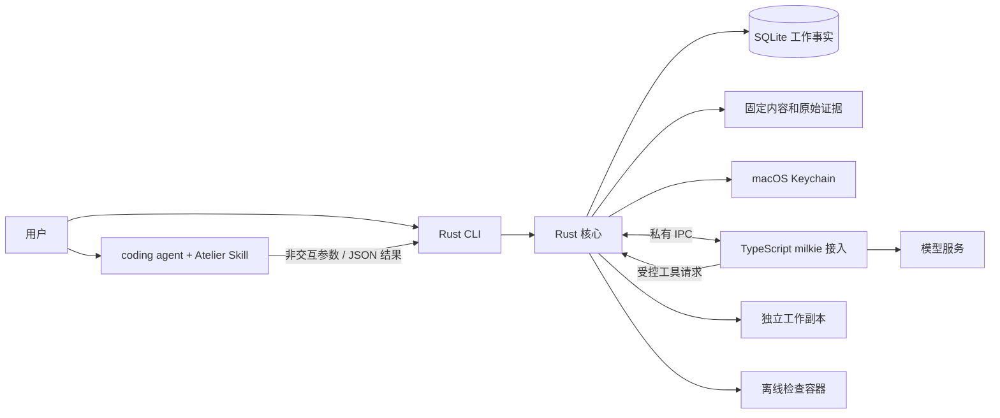

# L2 技术设计：CLI 与 Skill 的首项团队代码任务交付

版本：v0.4，2026-09-27；状态：Draft，未实现。设计依据：[L1 v0.4](product.md)、[Issue #1](https://github.com/xforce-io/atelier/issues/1)。本稿依据用户已确认的 CLI + Skill 优先范围，替代桌面首发技术草案；完整实现尚未批准或完成。实现须采用明确的 L1 版本，不以技术困难自行删减 L1.8。

## 1. 设计依据与技术目标

实现 L1 的 CLI/Skill 首次配置、Team 承接、真实执行、固定产出、独立检验、有限返工、人工验收及失败处理。CLI 提供公开操作，Atelier Skill 调用并解释；Rust 核心拥有身份、授权、版本、工作事实和操作结果，TypeScript 接入 milkie。术语以[名词表](../../glossary.md)为准，`revision` 是对象并发版本，区别于任务契约版本；`requestId`、Atelier `runId` 与 milkie `executorRunId` 不互相替代。

非目标同 L1.2，另不构建通用插件 ABI、分布式调度器或完整事件溯源。第一方核心默认 safe Rust，不为类型技巧引入无需求的抽象。本文只定义契约和机制，不规定函数清单或开发顺序。

## 2. 现状与改动范围

当前仓库只有产品方向、名词表和设计，无 Rust/TypeScript 应用实现。keel-how 结论为“无现成机制可讲”，不能把旧稿的 SQLite/IPC 当成现有代码。旧 v0.1 中可复用的方向是：核心决定工作事实、执行器独立进程、受控工具、不可变产出、独立检验和事务验收。

主要调整：先提供完整公开 CLI 和 Atelier Skill，保留工作区、配置与交付契约；GPUI 放到后续。不同于原始 v0.1 的预配置 CLI，所有 Worker/Team 的建立与修改都有命令/交互提示，Skill 可以编排但不能直接写持久数据。后续 GPUI 复用 Rust 核心命令和查询，不依赖解析 CLI 人类文本。

milkie 的已核对契约基线仍为 `7865ffcc14a8359a055e5e6e0998b56ab2160379`：[AgentConfig](https://github.com/xforce-io/milkie/blob/7865ffcc14a8359a055e5e6e0998b56ab2160379/src/types/agent.ts)、[AgentResult](https://github.com/xforce-io/milkie/blob/7865ffcc14a8359a055e5e6e0998b56ab2160379/src/types/common.ts)、[ToolContext](https://github.com/xforce-io/milkie/blob/7865ffcc14a8359a055e5e6e0998b56ab2160379/src/types/tool.ts)。依赖打包必须锁定可构建版本，验证结构化终态、空内置工具白名单与取消信号；上游 Issue 已关闭不能替代 Integration。若选择更新版本，记录差异与验证，不默默漂移。

## 3. 总体架构与关键路径

核心作为 Rust 库由每条 CLI 命令调用，execute/verify/rework 前台持有本次执行直到停止或未知，不引入常驻 daemon。查询命令读取已经提交的事实，允许另一终端在执行期间查询；配置与决定通过短事务写入。独立进程的 cancel 记录持久取消请求，活动执行核心至少每秒检查一次，不等模型输出才处理停止。若持有执行的进程已失联，cancel 不伪造停止，交由 reconcile 核对。

工作区执行锁只限制新 Run，不封锁全部查询或持久取消请求；SQLite 短事务串行修改。一个 OS 使用者是本期信任边界，Skill/coding agent 代本机用户调用。核心核验授权与版本，但不能证明同一 OS 身份下的程序代表真实人类意图；Skill 必须引用用户对当前交付的明确决定，验收命令记录该依据，不将本机 token/字符串当人类身份认证。防恶意宿主冒充人类、远程多用户认证不在本期。

模型执行/检验角色通过私有子进程通道绑定，不能传 actor 冒充其它 Worker；候选代码与模型不可信，接入程序属于可信应用代码。后续 GPUI 不掌握独立工作事实。

主路径：保存配置 → 建立待承接 Task → 事务冻结承接依据 → 明确启动 → 核心代理工具 → 停止并固定产出 → 独立交接/检验 → 核验证据 → 人工验收事务 → 查询/导出。

失败路径分别处理：配置或启动前置不足不启动；接入失败确认无活动效果后记录 stopped；进程失联/效果不可核对记录 unknown；检查失败保留证据；存储失败不向入口发布成功。任何路径都不能以模型文本直接决定验收。

## 4. 数据与状态契约

### 4.1 工作区与配置

| 记录 | 必需信息与规则 |
|---|---|
| 工作区/本机身份 | 工作区 ID、schema 版本、本机 Human Worker、创建时间；首次初始化原子化，已有目录内容不覆盖 |
| Worker | 稳定 ID、类型、显示名称、职责说明、当前执行配置版本；人类成员没有可启动执行器 |
| 模型连接 | 名称、协议类型、规范化服务地址、凭据引用；模型标识在执行配置中固定；测试记录绑定配置摘要与时间 |
| 执行配置 | milkie 版本/接入类型、连接版本、模型、角色说明、声明能力及摘要；形成不可变版本，不内嵌凭据 |
| Team 与成员关系 | 稳定 ID、名称/用途、成员、唯一团队负责人、显式权限、默认任务职责、配置版本；唯一性原子检查 |
| 检验配置 | 不可变 ID/版本、镜像 digest、命名检查 argv、可信检查资源摘要、限制、必需结果定义及维护来源 |

草稿允许缺连接/模型/默认执行者等字段，返回缺项清单；Team 的名称、本人和唯一团队负责人是保存必需项。执行与检验如均已选择必须不同 Worker。运行就绪不是永久布尔承诺：结合配置、当前服务检查、检验环境和授权得出带原因的结果，启动时仍重验。

名称不充当主键，同类对象显示名称在工作区内唯一（去首尾空白后比较），避免选择歧义；原始角色说明允许中文。连接测试使用无工具、无工作目录的最小文本请求，30 秒超时，可取消；结果不创建 Task/代码 Run，不提高权限。一次测试完成后仅记成功时间或脱敏错误，不存模型请求中的凭据。旧配置测试结果不能使新配置显示已通过。

凭据保存在 macOS Keychain，SQLite 只存不可猜测引用。保存失败不得回退明文文件；CLI 返回凭据存储错误和缺项，Skill 保留非敏感配置意图。新凭据先写入 Keychain，再提交配置引用；数据库失败时清理本次新建凭据，清理失败记待清理诊断，不改写已引用凭据。凭据更换使用同一逻辑连接下的新秘密值，不能借更换秘密改变已冻结服务地址/模型；旧任务下一次明确启动可使用恢复有效的凭据，已运行进程不热换。删除连接/凭据不在本轮用户入口内。

### 4.2 工作记录

SQLite 保存当前事实与必要的不可变记录；大型代码与日志在核心对象目录中，避免存入普通配置。

| 记录 | 必须保留的关联 |
|---|---|
| Task | ID、revision、拟承接/实际承接 Team、生命周期/结束结果、任务负责人、当前契约/配置、当前 Artifact、等待原因与处理者、首次执行/返工计数、取消请求 |
| 契约及承接快照 | 目标/交付要求、源基线、输入、检验配置、成员职责、授权及执行约束；版本 ID、摘要、授权主体、时间；承接后不可原地覆盖 |
| Run | runId、revision、Task/Worker、execute/verify/rework 用途、requestId、冻结配置与输入、进程与容器归属、准备/开始/结束时间、SDK 终态及实际效果核对 |
| Artifact | 源 commit、生产 Worker/Run、契约、固定文件清单/逐文件与总摘要、持久对象位置、partial |
| 交接关系 | 发送者、接收检验者、Artifact、契约、补充说明版本、职责、offered/accepted/rejected 与原因 |
| 检验记录 | 检验者/Run、Artifact、契约/检验配置、pass/fail/inconclusive、必需检查及证据 ID、问题与限制 |
| 验收/拒绝/取消决定 | 主体、原因、时间、Task 与指定版本、适用检验或实际停止结果；不可覆盖历史决定 |
| 操作记录 | requestId、实际主体、规范化请求摘要、处理中/成功/失败结果与关联对象；不存密钥 |

Task 生命周期保持 `pending / active / closed`；closed 的结果为 `accepted / declined / cancelled`。取消处理中仍保留原生命周期和决定关联，直到确认无活动效果再 closed/cancelled。Run 为 `prepared / running / stopped / unknown`，停止原因单独存储；“等待检验”等是查询投影，不增加大量互斥 Task 状态。

返工额度在批准新 execute/rework Run 的事务中消耗：首次 execute 只允许一次，之后使用 rework；运行错误也不归还已消耗额度。verify 可显式重试但不改代码，受单 Run 限制。结束查询、重启或换 requestId 均不重置额度。Task 可以有多项未结束记录，单活动限制属于工作区执行资源，不属于 Team 的任务数量约束。

### 4.3 并发与持久化

所有变更携带 requestId；已有对象携带 expectedRevision。相同 requestId/相同规范请求返回既有结果，内容不同报冲突；去重先于 revision 校验。对象事实变化递增 revision，纯展示进度不递增。配置变更需校验各对象 revision 与引用版本，不能一半保存职责一半保存权限。

取得执行权 → 事务核验并保存 prepared Run/操作关联 → 启动并握手 → running → 工具/检查 → 停止核对 → 固定内容 → stopped。事务失败不启动，不能持有写事务等待模型。OS 执行锁防同工作区并行 Run，其他配置、取消决定由 SQLite 短事务串行写入；持久 Run 记录与活动资源核对防“锁释放就代表结束”的错误推断。

代码内容先临时写入、校验、原子固定，再事务提交引用和 currentArtifact。失败不更新当前版本；无引用对象可待清理，不能删仍被历史记录引用的内容。新提交即使摘要相同仍保留新提交关联，拒绝后的返工需要新检验。模型自报路径/hash 不构成 Artifact。

验收在同一事务检查 active、主体权限、无活动/未知 Run、当前版本、检验 pass 且匹配契约/产出、无后续有效拒绝，然后写 Acceptance Record 和 closed/accepted。CLI 与 Skill 都不得绕过该事务。

## 5. 接口与协作契约

### 5.1 CLI 公开契约

全局参数：`--workspace PATH`（除初始化/Skill 安装外必须给出或由当前目录向上找到唯一工作区，否则失败，不猜多个工作区）、`--json`、`--request-id ID`。现有对象变更另需 `--revision N`；交互模式可以查询后带入，并在冲突时重新呈现，不能静默覆盖。Skill 对副作用先生成 requestId，再调用，超时后用相同 ID 查询，不依赖尚未收到的返回值。

下表为语义接口，名字属于本版 CLI 契约；解析库与函数结构属于实现选择。对象引用接受返回 ID 或同类唯一名称，不接受歧义猜测。`--interactive` 为人提供等价的逐字段提示，缺输入取消时不保存；与 `--json` 互斥。非交互模式不读取 TTY、不无限等待。除凭据外，长说明可用 `--description-file`、`--goal-file`、`--reason-file` 等纯 UTF-8 文本输入，与对应直接文本参数互斥。

| 命令 | 必要输入与结果 |
|---|---|
| `atelier --help / --version` | 命令树、CLI/输出协议版本；不要求工作区 |
| `atelier doctor` | CLI/runtime、工作区和检查环境事实、缺项；只读且不发送模型请求 |
| `atelier skill install` | `--target DIR [--replace]`；校验目标，写 Atelier 自己的包，展示版本与宿主加载指引；不同内容拒绝覆盖，replace 必须显式；不把宿主已加载写作安装成功事实 |
| `atelier workspace init/show` | init：`--path PATH --name NAME` 及本人授权确认；show：身份、版本与工作区信息；已有目录内容不覆盖 |
| `atelier connection create/update/list/show` | 名称、`--base-url URL`、协议类型（本轮 openai-compatible）；update 要 revision；返回不可变版本、凭据是否就绪，永不返回秘密 |
| `atelier connection credential set` | 连接引用；人类在 TTY 无回显输入，非交互用 `--secret-env NAME` 或专用 `--secret-stdin`；无 `--api-key VALUE`；秘密不在 argv/日志/结果中；由用户在宿主外设置来源 |
| `atelier connection test` | 连接和 `--model MODEL`，明确发起最小付费可能请求；30 秒上限；成功时间/脱敏错误与配置版本，不创建任务 |
| `atelier worker create/update/list/show` | 数字员工名称、职责、连接版本、模型、角色说明；可保存缺项草稿；人类成员由 workspace init 建立；返回配置版本和能力缺项 |
| `atelier team create/update/list/show` | 名称、用途、成员、`--leader`、可选 `--executor/--verifier/--acceptor`、重复 `--grant MEMBER:CAPABILITY`（team.manage、task.arrange、task.execute、task.verify、task.accept）；不隐含授予所有权限；返回完整摘要，唯一性/独立性整体校验 |
| `atelier sample prepare` | `--target DIR`；写公开样例到新空目录，返回固定 Git 基线和内置检验配置引用，不覆盖原内容 |
| `atelier profile import/list/show` | import：`--bundle FILE --approve-digest DIGEST`，先 `profile show --bundle FILE` 只读检查资料供确认；包是维护者分发物，不要求普通用户编写 JSON；未知 schema 拒绝 |
| `atelier environment check/prepare` | 指定 profile；check 只读；prepare 显式准备已确认镜像，报告进度、失败及结果，不执行候选提供的宿主脚本 |
| `atelier task create/update` | create：Team 和目标；update：待承接 Task、revision、交付要求、源仓库/commit、profile、职责、限额；返回缺项，不自动执行 |
| `atelier task intake` | Task、revision、`--decision accept/wait/decline`、accept 的唯一任务负责人，wait/decline 的原因；冻结承接依据，运行缺项独立返回 |
| `atelier task execute/rework` | Task、revision；rework 另需 `--reason-ref ID`，启动时消费额度；输出关联 Run，前台等待终态 |
| `atelier task verify` | Task、revision、`--artifact ID`，可选交接说明文本；明确接收才检查，返回交接/检验/Run 的实际结果 |
| `atelier task accept/reject` | Task、revision、Artifact；accept 另含 verification ID，reject 必须原因；Skill 代调还保存 `--decision-ref REF` 对应的本地脱敏决定记录；该引用供追踪，不认证人类身份 |
| `atelier task cancel` | Task、revision、原因；返回取消决定和 applied/pending_stop/unknown，不把请求成功当已停止 |
| `atelier task list/show` | 列表可按 Team/未结束筛选；show 返回目标、职责、当前依据、活动、产出、有效检验、阻塞和允许的下一步 |
| `atelier run/artifact/verification show` | 明确对象 ID，返回实际关联及原文证据入口；artifact 支持 `--diff` 查看固定版本与源基线差异 |
| `atelier run reconcile` | Run ID 与 revision；核对本应用所属资源是否结束，不恢复、不强行改状态 |
| `atelier request show` | requestId；返回处理中/完成/未找到，已完成含原始操作结果；未找到也须核对 Task/Run 后才决定重新发起 |
| `atelier artifact export` | Artifact、`--target DIR`；验证内容后无覆盖导出，不改变验收 |

所有 `--json` 结果为单个最终 JSON：`schemaVersion, requestId, ok, data, error?`。data 可携带已持久的部分结果；error 包括 `code/message/currentRevision/nextAction`。人类文本同样区分任务、Run 与检验结果，不只输出“完成”。稳定错误类：INVALID_INPUT、FORBIDDEN、STALE_REVISION、REQUEST_CONFLICT、WORKSPACE_BUSY、PRECONDITION_FAILED、CAPABILITY_UNAVAILABLE、EXECUTOR_FAILED、RUN_UNKNOWN、STORAGE_FAILED。Skill 不自动执行 nextAction。

退出码：0 表示操作按契约处理（可包含检验 fail/inconclusive、预算停止或取消 pending），2 输入/版本错误，3 授权/前置/冲突限制，4 接入/执行错误，5 执行未知，6 持久化失败，130 表示用户中断且已核对停止。停止不明仍为 5。0 不是产品成功，必须读取 data 中 task/run/verification/acceptance 的实际事实。长命令进度和脱敏诊断走 stderr，stdout 不夹带进度/安装横幅；超时或 SIGKILL 导致没有最终 JSON 时不制造成功返回。

输出版本 v1 与 CLI 发行版本分别记录；未知输出主版本由 Skill 停止解析并提示升级匹配。纯新增兼容字段可忽略，关键必需字段缺失则停止推进。工作区 schema 与 IPC 版本另管。

导出先验证 Artifact，目标必须新建或为空且无符号链接；同父目录临时构建核对后发布，竞态占用时失败，不覆盖用户文件。失败仅清理本操作临时内容，不复制 Keychain、模型连接、数据库和内部日志。

### 5.2 Atelier Skill 契约

交付包内提供独立 `atelier/SKILL.md` 及操作参考，明确支持的 CLI/JSON 主版本、命令选择、授权与错误处理。它与开发者用的 `.agents/skills/verify-atelier` 不同：前者是产品入口，后者是验收手册。实现阶段才落可运行产品 Skill，不在设计阶段安装一个会调用不存在二进制的壳。

加载后先 `--version`/doctor/workspace show，再 list/show 已有对象；使用返回 ID/revision 构造具名参数，通过安全参数传递调用 CLI，不将用户文本拼成 shell 代码。记录 requestId、任务和最后已核对版本；这些是查询线索，CLI 事实源优先。Skill 无权直接写数据库、编辑工作副本、修改检查资源或扩大工具权限。

用户授权已涵盖的配置与有限交付可连续执行，不逐命令索取重复同意；遇到目标/权限/费用/返工范围变化或最终验收时呈现具体依据。人工接受必须对应当前交付，保存简短脱敏决定、版本及来源；不将“继续开发”解释为接受交付。宿主若不能安全接收秘密、维护长命令或显示必要依据，应报告能力缺失，允许用户用 CLI 完成该操作，再查询结果；不能把这种人工降级算作 Skill 主路径全部通过。

输出处理以结构化事实为准：空列表需要创建或选择；错误说明原因与已有事实；unknown 先核对；成功也须区分命令处理、Run 停止、检验与验收。工具调用超时先查询 requestId 和 Task/Run，禁止换 ID 重试未知副作用。Skill 退出不主动清理业务对象；重开后恢复查询，不假称执行恢复。

### 5.3 Rust 与 TypeScript

每个 Run 独立接入进程，私有 stdin/stdout JSON Lines；日志 stderr。帧有 protocolVersion、type、requestId、taskId、runId、seq、payload，身份从父进程通道绑定。两方向 seq 独立单调递增；同号同内容忽略重复，不同内容/缺号作为协议错误处理。未知版本、必要能力缺失在 invoke 前拒绝。

| 消息 | 必要语义 |
|---|---|
| hello/ready | 版本、milkieVersion、绑定角色、工具和约束能力；10 秒未 ready 按接入失败 |
| start/started | 固定目标、输入句柄、身份与配置；started 只代表实际执行开始 |
| handoff.accepted/rejected | 检验接收结果与缺项；输入被接收后才允许开始检查 |
| tool.request/result | toolCallId、命名操作、限定输入；去重并绑定 Run，不能重复产生效果 |
| progress/report | 有界进度或结构化产出说明/检验建议及核心证据引用，无直接验收权 |
| stop/terminal | 请求与结构化终态；停止请求不等于所有工具/容器已结束 |

接入使用 Milkie.invoke，新 Run 新 contextId，不复用执行者 WorkingMemory 作为独立检验上下文；返工显式提供固定输入和问题，不启用 resume。内置工具白名单为空，不配置原生 subAgents、shell、任意 Skill 或动态工具箱；不配置 onBudgetFinalize。

唯一可暴露工具为 list_files、read_file、write_file、delete_file、run_check、submit_report；检验角色无 write/delete，run_check 仅接受冻结 checkId，不接收模型指定命令。工具范围由核心实际打开/写入时校验，不只在 prompt 约束。接入代码无独立工作副本写权限；不注册可执行模型提供宿主代码的工具。

terminal 保留 executorRunId、status、stopReason、stopCode、partial、artifacts、checkpointId、output、error 中本版要求的字段；可选字段缺失不补造，必需字段缺失、伪造标识、冲突终态与超限帧均拒绝成功。checkpointId 仅保留诊断，不自动恢复。核心根据实际文件和效果核对固定内容，不直接把 SDK artifacts 认作已验证产出。

连接测试复用相同供应商接入配置但采用独立短进程和无工具请求，不混入 Task 的 IPC/Run；必须传递测试请求 ID 与配置版本供去重和取消。

## 6. 运行与保障机制

### 内容与独立检查

只读导入明确 Git commit，在核心管理的独立副本工作，不在用户检出目录执行。拒绝子模块、符号链接、特殊文件及超限内容；不把凭据、.git 或 Atelier 状态目录导入。受控文件路径必须相对根且不越界；校验实际文件类型，原子写入，不能先检查路径后跟随变化的链接写出边界。

检查运行于无网络 Linux OCI 容器：固定镜像 digest、非 root、只读候选代码与可信检查文件、独立临时目录、资源/时间限制，无主机凭据、数据库和管理 socket。Docker 兼容接口由核心持有，模型不可访问。样例环境准备可由用户明确触发拉取固定镜像；准备阶段与无网络检查阶段分开。可信检验包导入只读取数据和检查资源，不在宿主执行其脚本；摘要、argv、镜像及限额经用户确认后冻结，unknown schema 拒绝。

全部必需检查成功、原始证据绑定同一版本，且独立检验者给出有依据的通过建议，才记 pass；明确检查失败或要求不满足记 fail；检查不全、报告无效、运行错误或预算耗尽记 inconclusive。执行者自测仅作线索，候选代码自己修改的测试不能替代冻结检查资源。

### 限额与证据

继承 L1 上限：Run 15 分钟/50 次模型迭代/100 次工具调用、返工最多 2 次。技术资源限制：检查 120 秒、1 CPU/512 MiB/64 个进程；文件每次读写 256 KiB，源及单 Artifact 50 MiB；IPC 单帧 1 MiB；每次检查 stdout/stderr 各保存最多 5 MiB 并标注截断。结构化检查结果不得以截断片段判通过。只能在承接前收紧；缺执行能力落实约束时禁止对应启动。不宣称金额/token 精确预算。

检验日志、退出码、命令配置摘要、镜像和产出摘要由核心采集。CLI/Skill 展示有界摘要并提供原文入口；身份、版本、关键决定和停止核对持久保存。访问日志去除凭据、URL 中秘密参数和供应商敏感请求，不用全量模型会话作为普通调试输出。

### 前台执行、中断与取消

执行命令中的核心持有 Run；SIGINT/SIGTERM 或观察到持久取消请求时先拒绝新工具效果，再传 AbortSignal 并停止所属检查容器。信号可处理时尽力持久化结果，10 秒内不能正常退出的接入进程被终止，容器须单独核对；确认全部已接受效果结束后才固定内容并记 stopped。取消请求随后落实 closed/cancelled；单纯中断命令只停止 Run，不取消或验收 Task。

另一个 CLI 的 cancel 不占用 Run 执行锁；它原子记录请求、当前目标与 revision，返回 pending_stop。当前核心独立监测并落实；若它已死亡或资源不明，后续查询显示 unknown，由 reconcile 继续核对。只读查询不持有执行锁，不能停止另一个命令。

强杀/宿主退出后下一次查询检查持久 Run 与进程归属，不能确认时标 unknown。锁释放、PID 不存在或终端关闭都不单独证明容器/效果结束；后续调用不自动重发 start/tool.request。

`run reconcile` 仅核对Atelier 创建的资源：进程启动身份（不只 PID）、所属会话/运行标识、带工作区与 runId 标签的容器、已受理工具效果。身份不符或运行环境不可访问时不杀未知第三方进程、不解除阻塞。确认相关进程退出、容器停止且无在途核心写入后，将旧 Run 记 stopped/中断，保存核对证据；可确认静止的副本再固定为 partial。核对失败仍 unknown。此功能提供可处理出口，不提供 checkpoint 恢复或改写数据库解锁。

## 7. 迁移、发布与回滚

首次实现，无既有运行数据迁移。设计迁移保留旧文档入口链接到本目录，不保留第二份有效契约。存储、配置包及 IPC 各有版本，不支持的版本拒绝写入；旧二进制遇到较新数据明确停止。

首期 macOS 发行包包含 Rust CLI、固定 TypeScript 接入及受支持 JS runtime、样例和检验配置、产品 Atelier Skill 包及版本兼容说明。用户不手动安装开发依赖，模型与 Docker 兼容环境仍为显式依赖。Skill 安装路径由用户指定，写入临时目录校验后发布；已有不同内容默认拒绝，replace 只作用于 Atelier 的目标包，保留备份便于回滚，不修改无关 Skill 或宿主人设。目标路径/链接异常拒绝，不顺着符号链接写入意外位置。

实际发行命令和宿主刷新方式由实现 runbook 提供；当前不编造已存在的安装器。CLI 与 Skill 分别报告版本；更新 Skill 不能静默迁移工作区或清空历史。GPUI 打包、窗口和输入法不属于本期。

备份在无活动/未知 Run 时取得数据库一致快照和引用对象；Keychain 秘密不写入普通备份。回滚使用匹配软件与数据副本，模型连接可要求重新录入凭据，不能删验收记录冒充回滚。不自动改变用户源仓库或部署业务系统。

## 8. 测试与验证

当前只有设计，所有功能尚未运行。主判定源为 [L1.8](product.md#8-验收与效果验证)，驾驶手册位于 `.agents/skills/verify-atelier/`；实现后补真实构建/启动/Skill 加载方法。目前缺命令即 BLOCKED，不能拿设计里的接口名称假装已有应用。

| Issue / L1 子项 | 功能文件 | E2E | Integration / Unit |
|---|---|---|---|
| S1 / A1–A7 | [setup-and-intake](../../../.agents/skills/verify-atelier/features/setup-and-intake.md) | 直接 CLI 从空目录组队承接；真实宿主安装/加载 Skill；连接、环境及非法配置 | Integration：Keychain、CLI 参数/JSON、Skill 安装范围、环境；Unit：唯一性/权限/缺项/冻结 |
| S2 / A1、A3–A5 | [code-delivery](../../../.agents/skills/verify-atelier/features/code-delivery.md) | 真实 milkie 修改、另一 CLI 查询、重复/忙、Skill 从目标到待验收 | Integration：前台进程/执行锁/并发查询/对象固定；Unit：请求去重、结果区分 |
| S3 / A1–A4 | [verification-rework](../../../.agents/skills/verify-atelier/features/verification-rework.md) | 拒收、真实检验失败/返工/重验、额度、无法判定 | Integration：交接、隔离上下文/容器检查；Unit：独立性/额度/有效性 |
| S4 / A1–A7 | [human-acceptance](../../../.agents/skills/verify-atelier/features/human-acceptance.md) | CLI 接受/拒绝/过期/无权/未通过/导出；Skill 对真实用户决定的落实 | Integration：验收事务/并发/导出无覆盖；Unit：权限、版本与拒绝失效 |
| S5 / A1、A2、A4、A5、A7–A9 | [failure-and-lifecycle](../../../.agents/skills/verify-atelier/features/failure-and-lifecycle.md) | 3 类错误、并发取消、Ctrl-C/强杀/核对、Skill 超时重开、中文与非交互 | Integration：信号/持久取消请求/IPC/资源归属/存储；Unit：unknown 不放行、输出/退出码 |

Skill E2E 必须记录至少一个实际支持的宿主、模型、工具执行方式和 Skill/CLI 版本，在隔离工作区真实加载产品 Skill，由自然语言请求驱动实际命令，核对调用记录与数据库查询事实。以记录的典型场景验证能否完成，不把一次成功推广为任意宿主/模型均可用。确定性边界在 CLI 和核心验证，另对 Skill 的不擅自验收、失败解释、未知先查做场景核对；不是仅测 Markdown 关键词。

S1.A7、S2.A5、S4.A7、S5.A8 是 Skill 特有必需项，不能由脚本直接调用 CLI 代替。S2.A1/A4/A5、S3.A1、S4.A1 保留真实 milkie 证据；故障可确定性注入但不能代替成功路径。原始日志脱敏，不公开真实聊天或密钥。

纯技术检查：T1 schema/帧/路径限制；T2 PID 重用与残留容器；T3 候选检查脚本无法替换可信检验；T4 凭据不在 argv/日志/导出；T5 干净验证机的 CLI/runtime/Skill 安装与不覆盖；T6 输出只有单个最终 JSON、错误不悬挂、退出码与实际事实一致。技术项不能替代入口 E2E。

逐项结果记录软件候选、L1 v0.4/L2 v0.4、环境、命令与原始输出、宿主工具记录及对象版本。缺环境 blocked，未执行 not_run；GPUI 的退役子项不作为本期 skip，也不复用桌面证据证明 CLI 通过。

## 9. 技术风险与开放问题

- 发布前明确一套实际支持的 coding agent 宿主/模型/终端能力，验证长命令与结果读取。宿主超时不等于 Run 停止，这是首期 Skill 验证重点。
- milkie/JS runtime 可构建版本、镜像 digest、公开样例与真实服务需落实到锁定配置；不能以缺前置条件删减真实执行要求。
- CLI 同一 OS 主体的调用是可信的，核心不认证对话来源是否为人；更强的人类验收证明需独立身份通道，后续另作设计，不把 decision-ref 宣称为防伪认证。
- Docker 不可访问、PID 重用和持久取消请求需实测；不通过任意杀进程或改数据库清除 unknown。
- Keychain 与 SQLite 跨资源保存需补偿；Skill 不得为方便配置读取密钥回填聊天。后续跨平台凭据后端另行确定。
- GPUI 后续复用核心，窗口持续运行等产品承诺届时重新评审，不机械复用本期前台 CLI 的进程寿命。
