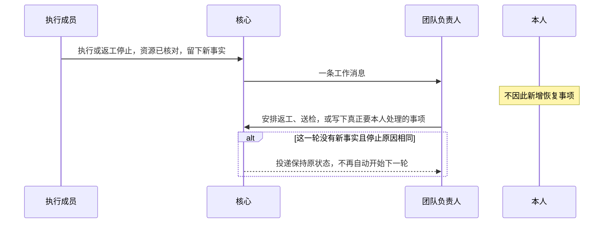
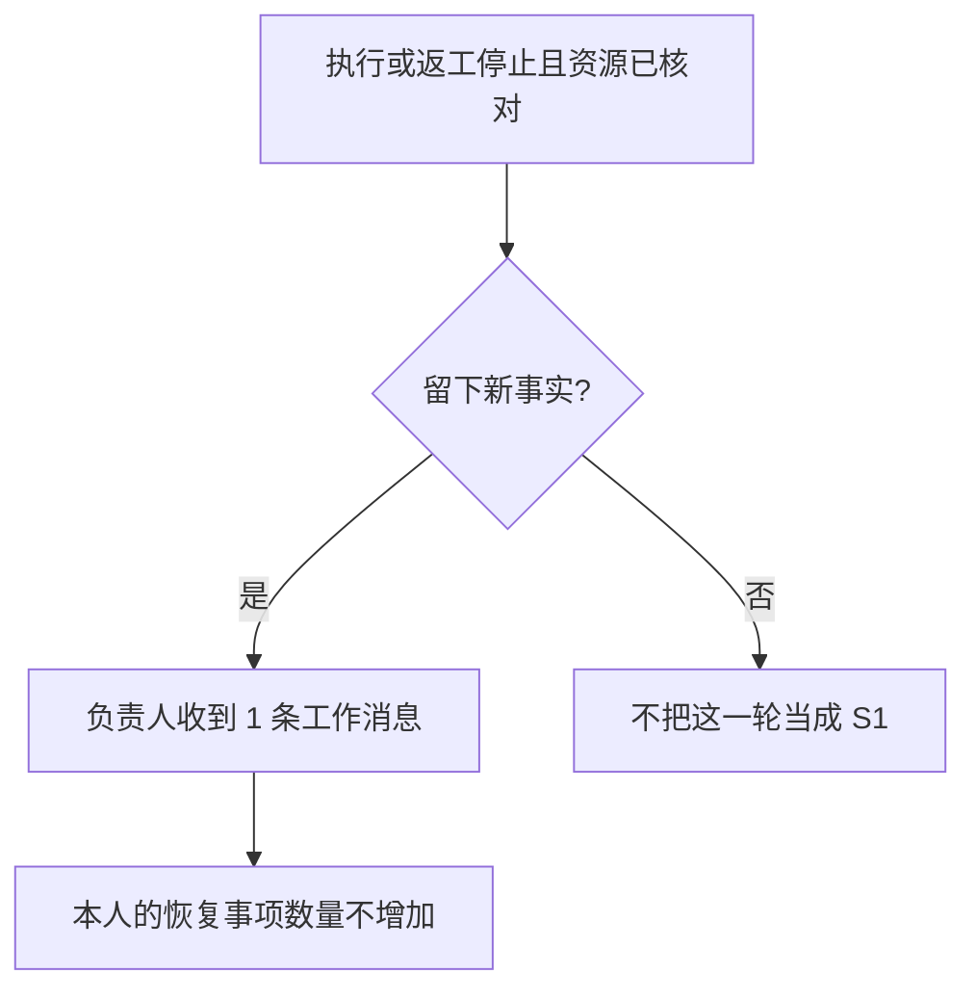
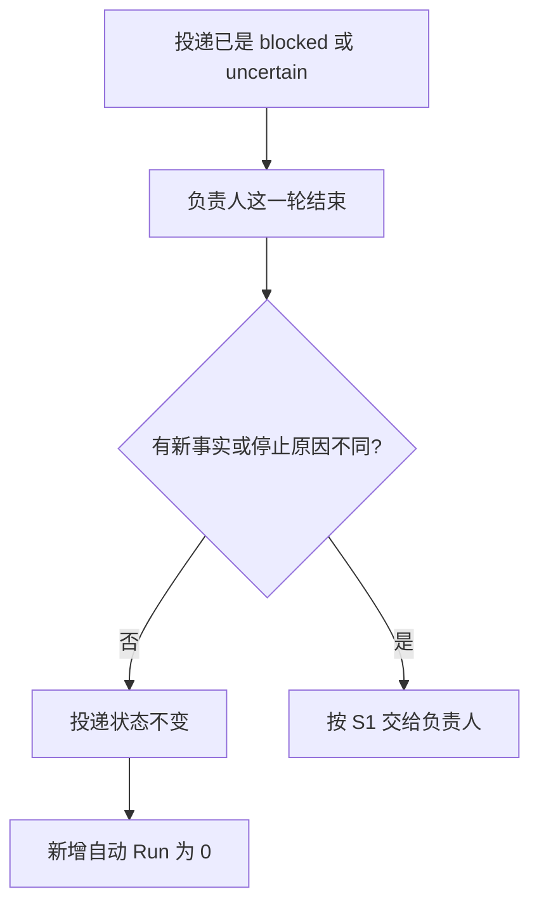
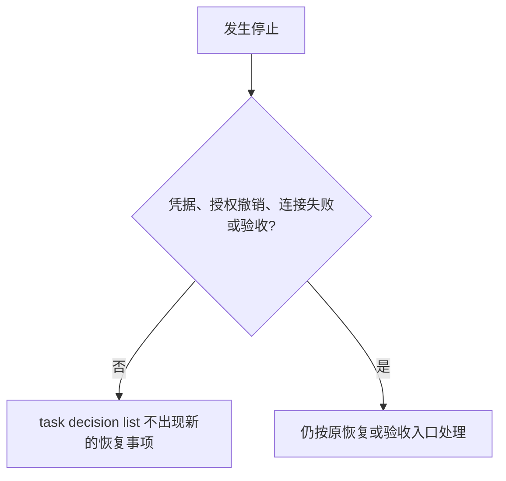

# L1 产品设计：停住的工作由负责人继续推进

版本：v0.1，2026-10-06；状态：Draft。关联 [Issue #20](https://github.com/xforce-io/atelier/issues/20)、[L2 v0.1](technical.md)、[名词表](../../glossary.md)。首个团队设计里被本文件改写的句子见 [v0.11 修订](../1-first-team-delivery/product.md)。

确认来源：2026-10-06 会话。用户确认有新事实的失败继续交给团队负责人；只有下一轮与上一轮相同（同一条投递、同一种停止、没有新操作）才不自动排队；不保留「默认最多 2 次返工」；不新增 Skill、错误码或另一套循环次数上限；已受理的代码执行仍不能原样再跑。Issue #20 记录的是这一范围。本稿只整理该确认，不另作产品取舍。

## 1. 背景与目标

执行或返工停止并留下新事实后，团队负责人应收下这一事实并决定返工、送检，或写下真正要本人处理的事项。当前负责人自己的协调一停住，核心就改成给本人打开恢复事项，选项是 retry、wait、cancel。本人不点选，负责人没有下一轮。

目标：新事实回到负责人；同一种空停止不再自动重复；普通停住不再要求本人点选；已受理的代码执行仍不能原样再跑；返工次数的旧默认不再把下一次有新依据的返工拒绝掉。

## 2. 范围与非目标

本次交付：

- 成员的执行或返工在资源已核对后留下新事实时，给团队负责人一条工作消息。
- 负责人这一轮没有新事实、且停止原因与该投递已有原因相同时，不再自动开始下一轮。
- 普通停住不新增 retry、wait、cancel 恢复事项。
- 已受理的代码执行或返工，原样重试仍被拒绝，原投递不重新排队。
- 已有 2 次返工时，第 3 次仍可因新的失败依据安排成功。未单独收紧时，已保存在任务上的旧默认 2 也不拒绝。

不做：不改提供方超时，不为单次模型请求自动再试；不新增 Skill；不新增错误码；不新增一套循环次数上限。凭据缺失、授权撤销、连接失败仍由本人处理。验收请求仍是验收事项。不自动合入、push 或部署。

## 3. 用户与产品概念

以名词表为准。团队负责人推进任务。本人验收，并处理凭据、授权和验收。执行成员与检验成员不是同一个人。

新事实指这一轮留下的、之前没有交给负责人的结果：已提交且会改变任务的操作、一次检查、一份已固定的产出，或一条新的停止原因。只读查询不是新事实。

空停止指：该投递已经是 blocked 或 uncertain，负责人这一轮没有新事实，停止原因与该投递已有原因相同。

## 4. 产品交互总览

凭据缺失、授权撤销或连接失败时，仍为本人打开既有恢复事项，不把该事项改投给负责人。上图对应 S1、S2、S3。

## 5. 信息架构与入口

不新增命令，不新增 Skill，不做图形界面。负责人用既有工作消息和 `task_read` 看到投递状态、停止原因和正式阻塞。本人用既有 `task decision list` 或 `task decision show` 查看仍然属于自己的恢复事项。原样重试仍走既有 `mailbox retry`。安排返工仍走既有安排入口。

## 6. Stories 与完整交互

### S1. 有新事实的停止交给负责人

角色：团队负责人。前置：成员的执行或返工已经停止，资源已核对，并留下新事实。入口：运行服务处理这一停止。

操作：负责人查看该任务的投递。随后安排返工，或写下不能继续的结果。

反馈：负责人收到 1 条工作消息。本人没有因此新增恢复事项。

成功终点：这条工作消息在负责人的收件箱里，任务不因此被接受。

异常：资源尚未核对时不投递这条消息，也不把它当成新事实。

对应 S1.A1。

### S2. 同一种空停止不再自动排队

角色：团队负责人。前置：某条投递已是 blocked 或 uncertain。负责人这一轮没有新事实，停止原因与该投递已有原因相同。入口：运行服务处理这一结果。

操作：再查询该投递和运行次数。

反馈：投递保持原状态。该次停止之后新增的自动 Run 为 0。

成功终点：没有新的自动运行。

异常：若这一轮留下了新事实，改走 S1，不把本条当成空停止。

对应 S2.A1。

### S3. 普通停住不再要求本人点选

角色：本人。前置：只发生了 S1 或 S2 的停止，没有凭据缺失、授权撤销、连接失败，也没有必须本人验收的请求。入口：`task decision list`。

操作：列出该任务的待决定事项。

反馈：没有新的 retry、wait、cancel 恢复事项。

成功终点：新增恢复事项为 0。已有的验收请求不受影响。

异常：凭据缺失、授权撤销或连接失败仍打开一条恢复事项，选项仍是 retry、wait、cancel。该事项不在本 Story 的「普通停住」里。

对应 S3.A1。

### S4. 已受理的代码执行不能原样再跑

角色：团队负责人。前置：执行或返工已经受理并停止。入口：对原投递做 `mailbox retry`。

单步且无分支：核心拒绝这一次，投递状态与重试前相同。不另画图。对应 S4.A1。

### S5. 第三次返工不被默认上限拒绝

角色：团队负责人。前置：任务已有 2 次已安排的返工，第三次仍有新的失败依据，其它安排条件满足。入口：安排返工。

单步且无分支：安排成功 1 次，拒绝原因不是「最多 2 次返工」。不另画图。对应 S5.A1。

## 7. 产品规则与边界

- R1. 一条新的成员停止事实，在资源已核对后，只给团队负责人投递 1 条工作消息。不因此新增恢复事项，也不因此接受任务。
- R2. 空停止不再自动开始下一轮。投递保持 blocked 或 uncertain。服务再次启动也不为同一条投递、同一种停止再自动增加 Run。
- R3. 普通停住不新增恢复事项。凭据缺失、授权撤销、连接失败仍打开一条恢复事项。验收仍走验收事项。
- R4. 已受理的 execute 或 rework 不能原样重试。继续是一条新的返工，并引用已停止的那次运行。
- R5. 未在承接前把返工上限收紧到比旧默认 2 更小的正整数时，返工次数不拒绝下一次有新失败依据的安排。运行次数仍最多 20，工作消息仍最多 100。本次不把这两项放大，也不另加循环次数上限。
- R6. 已存在的普通恢复事项不再作为继续的条件。不自动改答，也不把它当成产出。凭据、授权撤销和连接失败的恢复事项仍须本人处理。
- R7. 任务仍活动，最新的执行或返工已停止并留下新事实，而负责人当前没有待处理的工作消息时，投递 R1 的那一条。同一停止事实只投递一次。

## 8. 验收与效果验证

| ID / 关联 | 前置 | 入口与操作 | 可判定结果 | 异常与禁止 | 证据 / 执行 / 属性 |
|---|---|---|---|---|---|
| S1.A1 / S1 / R1、R7 | 数字员工负责人；执行或返工已停止；资源已核对；有新事实 | 运行服务处理该停止；查询负责人收件箱与 `task decision list` | 负责人有 1 条新的工作消息；新增恢复事项 0 | 不接受任务；资源未核对时不发这条消息 | 收件箱与待决定事项查询。核心与真实 CLI 可执行。必需 |
| S2.A1 / S2 / R2 | 投递已是 blocked 或 uncertain；负责人本轮无新事实；停止原因相同 | 处理该次停止后再查询投递和 Run | 投递状态不变；该次停止之后自动 Run 增加 0 | 不把只读查询当成新事实；有新事实时不得走本条 | 投递状态与 Run 计数。核心可执行。必需 |
| S3.A1 / S3 / R3、R6 | 只有普通停住 | `task decision list` | 新增恢复事项 0 | 不把凭据缺失、授权撤销、连接失败或验收请求算进这 0 | 待决定事项查询。核心与真实 CLI 可执行。必需 |
| S4.A1 / S4 / R4 | 执行或返工已受理并停止 | 对原投递 `mailbox retry` 一次 | 拒绝 1 次；该投递状态不变 | 不重新排队；不把它改成返工 | CLI 或成员工具的拒绝与投递查询。核心可执行。必需 |
| S5.A1 / S5 / R5 | 已有 2 次返工；第三次有新的失败依据；其它安排条件满足 | 安排第 3 次返工 | 安排成功 1 次 | 拒绝原因不得是最多 2 次返工；显式收紧到 1 次时仍拒绝第 2 次 | 安排结果与返工记录。核心可执行。必需 |

功能路径见 [leader-continues-stop.md](../../../.agents/skills/verify-atelier/features/leader-continues-stop.md)。

## 9. 折衷与开放问题

不增加新的循环次数上限。运行次数 20 与消息 100 保持原样，直到出现实际的空转再决定要不要另加限制。

已打开的普通恢复事项保留为历史记录。继续不依赖对它们的回答。不在本次关闭或改写这些事项。
