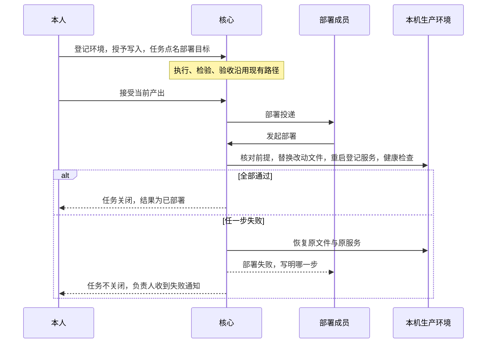
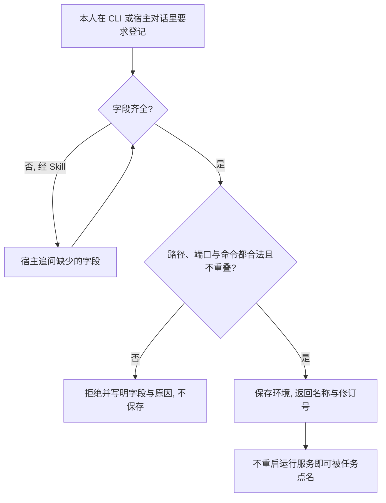
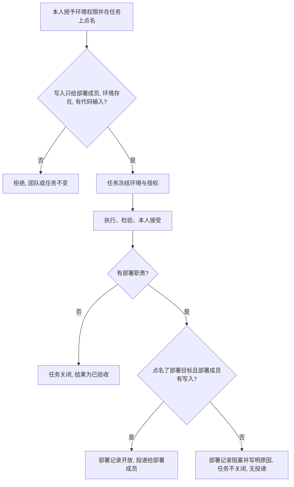
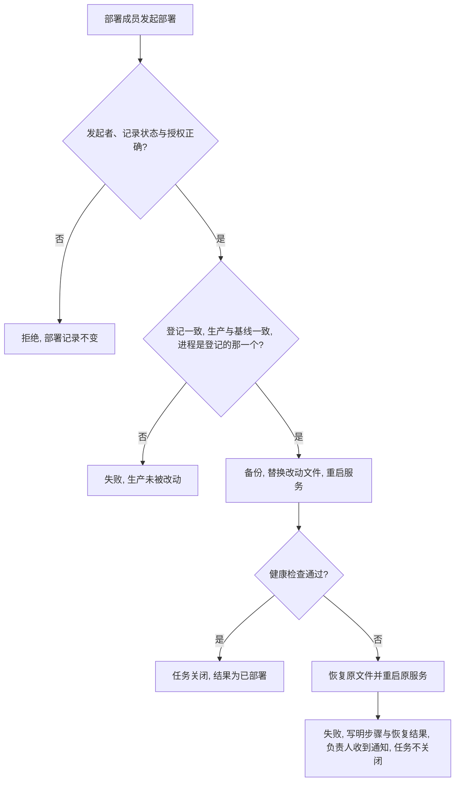
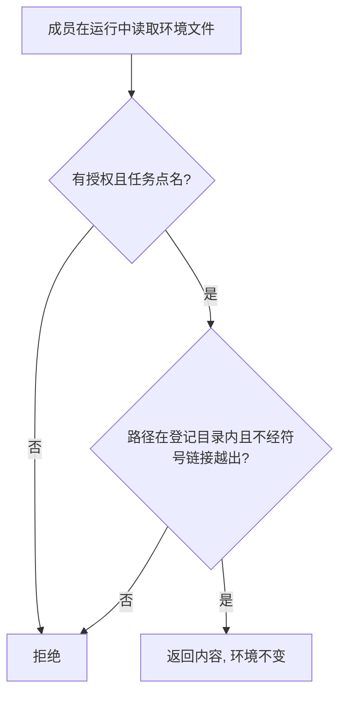

# L1 产品设计：本机环境与由核心执行的部署

版本：v0.1，2026-10-07；状态：Draft。关联 [Issue #22](https://github.com/xforce-io/atelier/issues/22)、[L2 v0.1](technical.md)、[名词表](../../glossary.md)。被本文件改写的约定见 [部署职责 L1 v0.1](../5-deploy-duty/product.md) 第 2、6 节。

确认来源：2026-10-07 会话。用户确认的是：

- 这台机器像一个机房。除了指定的开发、测试等环境，其余默认是生产，生产只有部署职责成员能写。
- 一个团队要能管理多个项目的环境，不为每个项目另建团队。
- 环境要能随时登记，不重启运行服务。
- 环境的管理不另做成员工具，CLI 是入口，Skill 只给指导。
- 开 Issue，先写 L1 与 L2 供审查。

以下是本稿的提议，待审查：

- 部署的具体步骤。
- 取消部署结果的自报。
- 只读查看（S4）本期就做。
- 第 9 节列出的其余取舍。

## 1. 背景与目标

团队修好了 Kairo 的缺陷，独立检验通过，本人也接受了，但 `127.0.0.1:8787` 上的服务还在跑旧代码。原因有三：

- 部署成员在隔离容器里运行，碰不到本机上的生产目录和进程。
- 核心只记录部署成员自报的成功或失败，自己不做任何部署。
- 团队没有指定部署职责时，接受就直接关闭任务。

本机上还有多个项目。哪个目录、哪个端口属于哪个项目的生产，没有地方写明，也没有办法按项目给成员不同的访问范围。

目标：

- 本人能随时登记本机已有的项目环境，并按环境给成员只读或写入。
- 部署成员发起部署后，由核心核对前提，替换文件，重启登记的服务，做健康检查，失败时恢复。
- 部署结果来自实际执行，不来自成员自报。
- 没有部署到位的任务不关闭。

## 2. 范围与非目标

本次交付：

- 本机环境的登记、修改、列出和查看，可通过 CLI，也可在宿主对话里经 Atelier Skill 指导后由宿主调用 CLI。
- 团队上按 Worker 和环境授予只读或写入。
- 任务点名参考环境和部署目标环境，环境登记与授权随任务冻结。
- 部署成员发起、由核心执行的本机部署，包括失败恢复。
- 运行中只读查看已授权的环境。

不做：

- 远程主机和云端。
- `docker compose`、多进程服务、进程管理器托管的服务。
- 依赖安装、数据迁移、数据库变更。
- 合入、push、在生产目录里提交 git。
- 给数字员工本机 Shell，或把生产目录以可写方式交给成员。
- 失败后自动再次部署。
- 删除环境。
- 开发和测试改用本机目录。开发仍在核心的候选副本里，检验仍在隔离检查里运行。

## 3. 用户与产品概念

以名词表为准。本人是本机的使用者，负责登记环境、授权与验收。部署职责成员是团队上显式指定的那一名成员。

| 对象 | 持续保存的事实 | 与其他对象的关系 |
|---|---|---|
| 本机环境 | 名称、代码目录、可选数据目录、可选本机服务（监听端口、启动命令、工作目录、健康检查）、修订号 | 属于工作区，与团队无关；同一工作区可以有多个。与执行配置里的「CLI 环境」无关 |
| 环境授权 | 团队上某个 Worker 对某个环境的只读或写入 | 与任务权限分开；写入只能给部署职责成员 |
| 任务点名的环境 | 本任务参考的环境，以及至多一个部署目标环境 | 创建或补齐任务时写入，随任务冻结 |
| 部署尝试 | 一次由核心执行的部署，包括每一步的结果、改动文件、备份位置、新旧进程和恢复情况 | 属于部署记录；成功才关闭任务 |

「机房」的对应关系：

- 登记的环境之外，本机路径一律不可见。
- 登记的环境只对获得授权的成员可见。
- 写入只经部署操作发生。
- 开发的写入仍落在候选副本里，不落在本机目录。

## 4. 产品交互总览

团队有部署职责，但任务没有点名部署目标时，接受后部署为阻塞，任务不关闭，不产生部署投递。团队没有部署职责时，接受仍直接关闭任务，结果为已验收。

## 5. 信息架构与入口

- 环境：CLI `environment create / update / list / show`，只有本机本人可以执行。环境属于工作区，不属于某个团队，所以不挂在团队管理权限上。数字员工没有登记入口；需要新环境时，用已有的 `decision_request` 请本人登记。
- 授权：CLI `team create / update` 增加按环境授予与撤销。
- 任务：CLI `task create`，以及 pending 状态下的 `task update`，增加参考环境与部署目标。补齐后用已有的刷新团队选项冻结新的授权。
- 部署：
  - 数字员工在部署运行中使用成员工具 `deploy_apply`。
  - 本机本人使用 CLI `task deploy apply`。
  - 原来自报结果的成员工具 `task_deploy` 和 CLI `task deploy --result` 取消。
  - 查询走已有的 `task show`，部署尝试的每一步都在部署记录里。
- 只读查看：已有的 `list_files`、`read_file` 增加可选的 `environment` 参数，不新增工具。
- Skill：`host.md` 写明宿主何时问齐登记所需的信息并调用 CLI，部署运行的说明写明只用 `deploy_apply`、不自报。不新增 Skill。

## 6. Stories 与完整交互

### S1. 登记本机环境

角色：本机本人。前置：工作区已初始化。入口：CLI `environment create`，或在宿主对话里说「把某个项目管起来」。

操作：

1. 本人给出环境名、代码目录，以及可选的数据目录和本机服务。
2. 宿主经 Skill 指导时，先问齐缺少的字段，再调用 CLI。
3. 随后用 `environment update` 修改，用 `environment list` 或 `show` 查看。

反馈：登记成功后返回环境名与修订号。运行服务正在运行时也立即可用，不需要重启。

成功终点：`environment show` 返回登记的全部字段。

异常：出现以下任一情况时整体拒绝，写明是哪一个字段、什么原因：

- 路径不是已存在的绝对目录，或含符号链接。
- 路径是根目录、家目录本身或家目录的上级。
- 路径位于工作区内或包含工作区。
- 路径包含 `~/.ssh` 等登录材料目录。
- 与其他环境的目录重叠。
- 启动命令不是参数列表，第一个参数不是绝对路径，或参数含空白。服务的监听地址固定为 `127.0.0.1`，不接受其他地址。
- 端口已被其他环境登记。
- 环境名重复。

数字员工调用登记入口被拒绝。

对应 S1.A1 至 S1.A4。

### S2. 按环境授权并冻结到任务

角色：本机本人。前置：已有登记的环境和团队。入口：`team update` 与 `task create` / `task update`。

操作：

1. 在团队上为成员授予某个环境的只读或写入。
2. 创建任务，或在任务 pending 时补齐，写明参考环境和部署目标环境。
3. 承接、执行、检验、验收按现有路径进行。

反馈：

- 团队查询显示每个成员在每个环境上的授权。
- 任务查询显示冻结的环境与授权。
- 之后修改环境登记或团队授权，不改变已冻结的内容。

成功终点：接受当前产出时，按冻结内容打开部署，或标为阻塞。

异常：

- 把写入授予部署职责以外的成员时，拒绝。
- 点名不存在的环境时，拒绝。
- 写了部署目标却没有代码输入时，拒绝；没有代码输入就没有可以比对的基线。
- 团队有部署职责，但任务没有点名部署目标，或部署成员没有该环境当前和冻结的写入授权时：接受照常保存验收记录，部署记录为阻塞并写明原因，任务不关闭，没有部署投递。

对应 S2.A1 至 S2.A5。

### S3. 部署到本机生产

角色：冻结的部署成员，可以是数字员工，也可以是本机本人。前置：本人已接受当前产出，部署记录为开放，部署成员持有部署目标的写入授权和 `task.deploy`，运行服务在运行。入口：成员工具 `deploy_apply`，或 CLI `task deploy apply`。

操作：

1. 部署成员发起部署。核心受理后，部署记录变为执行中。
2. 核心按顺序执行：
   1. 核对前提：
      - 环境登记与冻结时一致。
      - 产出相对基线改动的每个文件，在生产里都仍与基线相同。
      - 改动不落在数据目录或 `.git` 里。
      - 端口上正在监听的进程就是登记的命令和工作目录。
   2. 备份将被改动的文件，只替换或删除这些文件。
   3. 停止原服务，按登记的命令启动新服务。
   4. 健康检查。
3. 本人或部署成员用 `task show` 查看结果。

反馈：部署记录中可以看到每一步的结果、改动的文件、备份位置、新旧进程号和日志位置。环境没有登记服务时，只替换文件，不做停止、启动和健康检查。

成功终点：任务关闭，结果为已部署，验收记录仍为接受。

异常：

- 前提不满足时：在写入前失败，生产不变。
- 写入、停止、启动或健康检查失败时：
  - 恢复原文件，重新按登记的命令启动服务，再做一次健康检查。
  - 部署记录为失败，写明哪一步失败以及恢复是否成功。
  - 任务不关闭，团队负责人收到失败通知。
- 部署中运行服务意外退出时：重启服务后，该次部署记为失败，写明「部署中断」、中断前已完成的步骤和备份位置。不自动恢复，由本人核对生产。
- 以下请求一律被拒绝，也不能代替部署：
  - 非部署成员发起部署。
  - 部署已结束后再次发起。
  - 数字员工在部署运行之外发起。
  - 自报部署结果。

对应 S3.A1 至 S3.A7。

### S4. 运行中只读查看环境

角色：持有某环境只读或写入授权的数字员工。前置：任务点名了该环境，成员在本任务的运行中。入口：`list_files` 或 `read_file` 带 `environment` 参数。

操作：在运行中列出或读取该环境代码目录或数据目录下的文件。

反馈：返回文件列表或内容，分页与大小限制与读取候选文件相同。

成功终点：成员拿到所需内容，环境没有任何变化。

异常：

- 环境未授权或未被任务点名时，拒绝。
- 路径越出登记的目录，或经由符号链接指向登记目录之外时，拒绝。
- 没有任何写入或删除入口可以指向环境。

对应 S4.A1、S4.A2。

## 7. 产品规则与边界

- R1. 本机路径只有登记为环境后才对 Atelier 可见。登记只能由本机本人通过 CLI 完成。数字员工可以请求登记，但不能自行登记。
- R2. 登记校验以下各项，不满足即整体拒绝，不做部分保存：
  - 路径是已存在的规范绝对目录。
  - 不是家目录或其上级，不在工作区内也不包含工作区，不包含登录材料目录。
  - 各环境之间的目录互不重叠；同一环境的数据目录可以位于代码目录内。
  - 服务只监听 `127.0.0.1`，端口不与其他环境重复。
  - 启动命令是参数列表，第一个参数是可执行文件的绝对路径，各参数都不含空白，以便与正在运行的进程逐字比对。
- R3. 环境授权与任务权限分开。写入只能授予部署职责成员；写入包含只读。撤销授权后，已领取的运行也会在下一次访问时被拒绝。
- R4. 任务冻结点名的环境登记和授权。部署时要求当前登记与冻结内容一致，当前授权与冻结授权都包含写入。任一不满足时，部署失败或标为阻塞，不改用当前内容继续。
- R5. 有部署职责的团队，任务必须点名部署目标，部署成员必须有该目标的写入授权。否则本人接受后，部署记录为阻塞，任务不关闭。没有部署职责的团队保持现有行为。
- R6. 部署只改动产出相对基线改动的文件，包括新增、修改、删除和可执行标记。不写数据目录，不写 `.git`，不运行安装或迁移。
- R7. 写入前必须满足两项前提：每个将被改动的生产文件都与基线相同，端口上的进程就是登记的命令和工作目录。任一不满足即失败，生产不变。
- R8. 写入之后任一步失败，就恢复原文件和原服务。恢复结果写进部署记录，不报告为成功。
- R9. 部署结果只由核心按实际执行写入。成员和本人都不能自报。同一工作区的同一环境同一时间只有一次部署在执行。
- R10. 只读查看不提供写入入口，也不把写入授权以可写方式交给成员。
- R11. 不改变执行、检验与验收的现有规则。开发的写入仍落在候选副本里。

## 8. 验收与效果验证

验收在临时目录里用一个最小的本机 HTTP 服务作为登记的生产环境，不碰 `8787` 上的 Kairo 服务。真正部署 Kairo 是另一项需要本人单独授权的操作，不在本表内。

| ID / 关联 | 前置 | 入口与操作 | 可判定结果 | 异常与禁止 | 证据 / 执行 / 属性 |
|---|---|---|---|---|---|
| S1.A1 / S1 / R1、R2 | 工作区已初始化；运行服务在运行 | CLI `environment create` 登记临时目录与临时端口的服务；随后 `update`、`list`、`show` | 返回名称与修订号；`show` 返回全部字段；修改后修订号加 1；不重启服务即可被任务点名 | 不得要求重启运行服务 | CLI 输出。核心与真实 CLI 可执行。必需 |
| S1.A2 / S1 / R2 | 同上 | 分别用家目录、工作区内路径、`~/.ssh`、与已有环境重叠的目录、含符号链接的路径、第一个参数不是绝对路径的命令、参数含空白的命令、重复端口登记 | 每次都被拒绝，写明字段与原因 | 不得部分保存 | CLI 拒绝与 `environment list`。核心可执行。必需 |
| S1.A3 / S1 / R1 | 宿主已安装 Atelier Skill | 在宿主对话中只说要管起来某个目录 | 宿主先追问缺少的服务字段，再调用 CLI 登记成功 | 不得跳过追问而猜测端口或命令；不得以宿主自报代替 CLI 结果 | 宿主对话与 `environment show`。真实宿主可执行。必需 |
| S1.A4 / S1 / R1 | 数字员工在任务运行中 | 尝试登记环境 | 没有该入口，或被拒绝；可以用 `decision_request` 请本人登记 | 数字员工不得新增环境 | 成员工具清单与拒绝。核心可执行。必需 |
| S2.A1 / S2 / R3 | 团队有部署成员与执行成员 | 给执行成员授予写入；给部署成员授予写入；给检验成员授予只读 | 第一次被拒绝；后两次成功，团队查询可见 | 不得因显示名推断授权 | 团队查询。核心与真实 CLI 可执行。必需 |
| S2.A2 / S2 / R4 | 任务已点名环境并冻结 | 修改环境登记与团队授权后查询任务 | 任务里的冻结内容不变 | 不得静默改用新登记 | 任务查询。核心可执行。必需 |
| S2.A3 / S2 / R5 | 有部署职责；任务未点名部署目标，或部署成员无写入 | 本人接受当前产出 | 验收记录为接受；部署记录为阻塞且写明原因；任务仍活动，结果为空；没有部署投递 | 不得关闭任务或报告为已验收 | 任务、部署记录、收件箱。核心与真实 CLI 可执行。必需 |
| S2.A4 / S2 / R5 | 没有部署职责的团队 | 本人接受当前产出 | 任务关闭，结果为已验收 | 不得被本规则挡住 | 既有验收查询。核心可执行。必需 |
| S2.A5 / S2 / R4 | — | 点名不存在的环境；写了部署目标却没有代码输入 | 都被拒绝，任务不变 | — | CLI 拒绝。核心可执行。必需 |
| S3.A1 / S3 / R6、R9 | 部署记录开放；生产与基线一致；服务正在运行 | 数字员工部署成员在部署运行中使用 `deploy_apply` | 只有改动的文件变化，数据目录的摘要不变；端口上是新进程且健康检查通过；任务关闭，结果为已部署；部署记录写明每一步 | 不得改动未改动的文件、数据目录或 `.git` | 文件摘要、进程号、HTTP 响应、任务查询。真实 CLI 与运行服务可执行。必需 |
| S3.A2 / S3 / R7 | 生产里某个将被改动的文件与基线不同 | 发起部署 | 部署失败，写明是哪个文件；生产所有文件和进程都不变；任务不关闭 | 不得覆盖或合并该文件 | 文件摘要、进程号、部署记录。可执行。必需 |
| S3.A3 / S3 / R7 | 端口上是另一个进程，或没有进程监听 | 发起部署 | 另一个进程：失败，生产不变。没有进程：前提通过，替换文件后启动并做健康检查 | 不得停止不是登记命令的进程 | 进程号、部署记录。可执行。必需 |
| S3.A4 / S3 / R8 | 产出会让新服务的健康检查失败 | 发起部署 | 部署失败；生产文件恢复为部署前的摘要；端口上的服务健康；部署记录写明健康检查失败、恢复成功；负责人收到失败通知；任务不关闭 | 不得报告为已部署；不得自动再次部署 | 文件摘要、HTTP 响应、部署记录、收件箱。可执行。必需 |
| S3.A5 / S3 / R9 | 部署记录开放 | 非部署成员发起；部署成员在部署运行之外发起；结束后再次发起；调用已取消的自报入口 | 全部被拒绝，部署记录不变 | 不得以执行或检验操作完成部署 | 拒绝与部署记录。核心可执行。必需 |
| S3.A6 / S3 / R9 | 部署成员是本机本人；运行服务在运行 | CLI `task deploy apply` | 结果与 S3.A1 相同；运行服务未运行时被拒绝 | 不得由 CLI 进程在运行服务之外执行部署 | CLI 输出与任务查询。真实 CLI 可执行。必需 |
| S3.A7 / S3 / R8 | 部署在执行中 | 强制结束运行服务后重新启动 | 该次部署为失败，写明「部署中断」、已完成的步骤与备份位置；不自动恢复，不自动再次部署 | 不得推定成功 | 部署记录。可执行。必需 |
| S4.A1 / S4 / R3、R10 | 成员有只读授权；任务点名该环境 | 在运行中带 `environment` 使用 `list_files` 与 `read_file` | 返回环境里的文件与内容；环境摘要不变 | — | 工具结果与目录摘要。核心与真实 CLI 宿主可执行。必需 |
| S4.A2 / S4 / R3、R10 | 同上 | 读取未授权或未点名的环境；用 `../` 或符号链接越出目录；对环境使用 `write_file` 或 `delete_file` | 全部被拒绝 | 不得读到工作区、登录材料或登记目录以外的文件 | 工具拒绝。核心可执行。必需 |

功能路径在 [host-environment-deploy.md](../../../.agents/skills/verify-atelier/features/host-environment-deploy.md)，随实现建立；并更新 [deploy-duty.md](../../../.agents/skills/verify-atelier/features/deploy-duty.md) 中自报结果的那一段。

## 9. 折衷与开放问题

被改写的约定：部署职责 L1 v0.1 的「核心不执行部署命令」「部署成员提交成功或失败」两条，改为由核心执行登记的部署，结果只来自实际执行。「不合入、不 push」保持不变。

本稿已经做出、待审查确认的取舍：

1. **取消自报。** 自报会让「已部署」重新变成模型的说法，这正是 Kairo 任务出问题的地方。代价是没有登记服务的项目，比如只发布文件或手工部署的，暂时没有部署路径；这类团队可以不设部署职责，接受后直接关闭。
2. **只部署改动的文件，并要求生产与基线一致。** 这样不会覆盖生产上的手改或其他分支，代价是生产偏离基线时必须先由人处理。不做三方合并。
3. **按登记的命令重启。** 只停止进程号、命令和工作目录都对得上的那个进程，不使用 `kill` 端口这类做法。代价是用进程管理器托管的服务暂不支持。
4. **S4 只读查看本期就做。** 它让检验和排查能看到真实环境，代价是多一条访问路径。若希望先收敛范围，可以拆到后续 Issue，S1 至 S3 不依赖它。

待用户决定：

1. **新服务的环境变量。** 本稿提议继承运行服务启动时的环境，登记里不保存变量，也不保存凭据。若生产服务依赖只在某个 shell 里设置过的变量，新进程会缺少它们，健康检查会失败并恢复。另一种做法是登记时显式列出变量名，从运行服务的环境里取值。
2. **恢复后服务仍不可用。** 本稿提议写进部署记录，并通知团队负责人。是否还要给本人打开一项必须处理的事项？
3. **健康检查标准。** 本稿提议对登记路径做 `GET`，30 秒内收到 200 即通过。是否需要可配置的状态码或超时？
4. **备份保留期。** 本稿提议永久保留在工作区内，由本人自行清理。
5. **只读授权能读到生产目录里的配置文件。** 代码目录里若有 `.env` 之类带凭据的文件，持有只读授权的成员也能读到。本稿不按文件名猜测过滤；授予只读即视为允许读取整个登记目录。是否需要在登记时列出排除的路径？

Kairo 的收尾任务 `96edf65c` 目前是 pending。实现后，可以登记 `kairo-prod` 环境、给运维授予写入，再用 `task update` 补齐部署目标并刷新团队，沿本设计走完。这一步需要本人单独授权。
