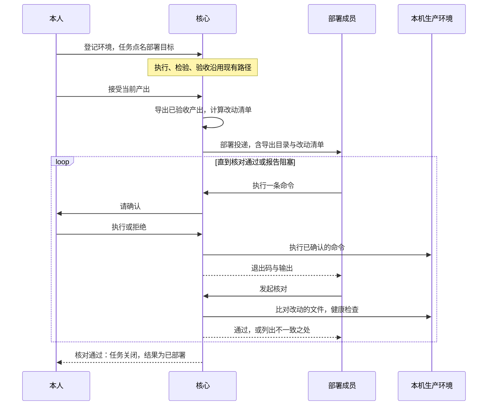
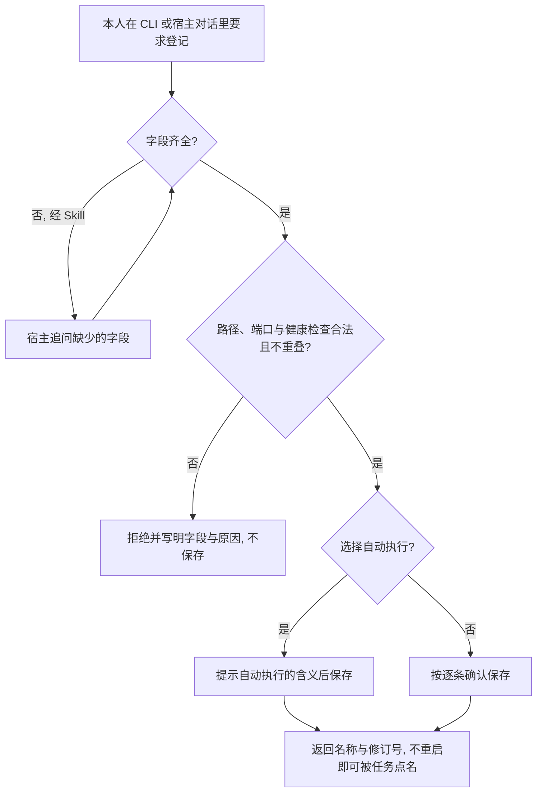
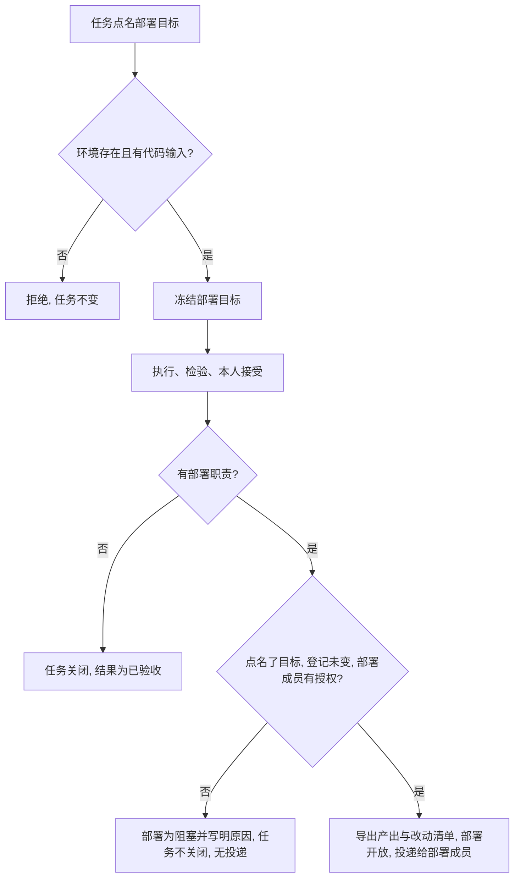
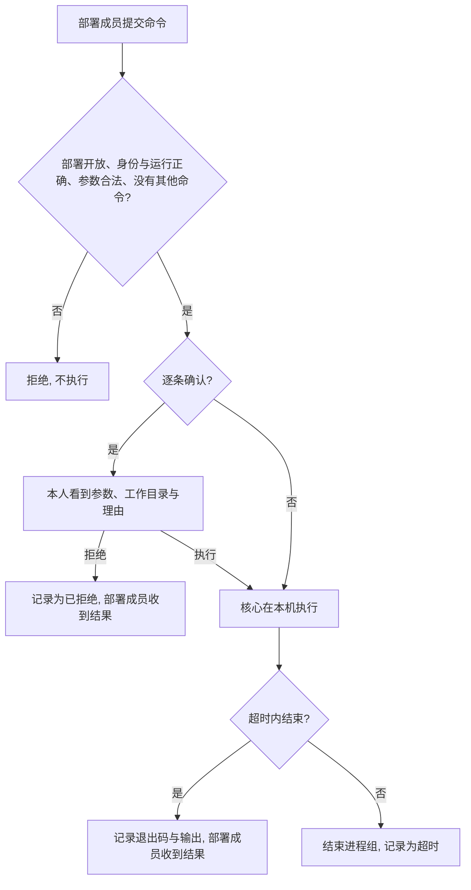
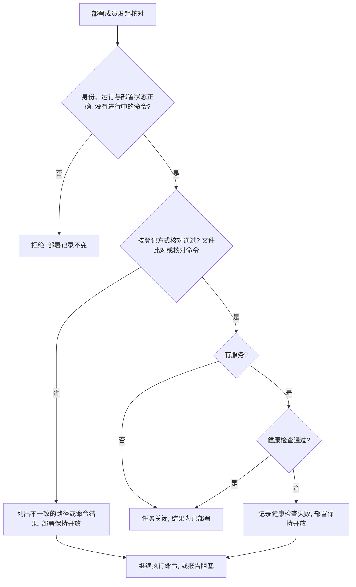

# L1 产品设计：部署成员在本机部署，由核心核对结果

版本：v0.4，2026-10-07；状态：Approved（2026-10-07 用户审查通过，第 9 节待定问题按提议决定）。关联 [Issue #22](https://github.com/xforce-io/atelier/issues/22)、[L2 v0.4](technical.md)、[名词表](../../glossary.md)。被本文件改写的约定见 [部署职责 L1 v0.1](../5-deploy-duty/product.md) 第 2、6 节。

v0.4 相对 v0.3：核对方式随环境登记，缺省为文件比对；也可以改为本人登记的核对命令，以适配镜像、编译产物、前端构建等不在代码目录里直接比对源码的部署方式。健康检查与核对方式相互独立，是可选项。

v0.3 相对 v0.1、v0.2 的方向变化：

- 权限只看角色。只有冻结的部署成员能在部署目标上执行命令；不设环境类型，也不设按成员与环境的授权。
- 核心不替成员动手。部署成员用本机命令完成全部改动，核心只核对结果是否等于已验收产出、服务是否健康。
- 本机命令是通用的，默认每条先经本人确认。
- 不再提供「运行中只读查看环境」，部署成员用命令查看即可。

确认来源：2026-10-07 会话。用户确认的是：

- 这台机器像一个机房，生产只有部署职责成员能碰。
- 一个团队要能管理多个项目，不为每个项目另建团队。
- 环境要能随时登记，不重启运行服务。管理环境走 CLI，Skill 只给指导。
- 环境是一台计算机，要能执行通用命令；只支持具名命令难以维护。
- 参考 Grok Bot，不区分环境类型，按角色职责区分能做的事与权限。
- 部署采用「成员用本机命令动手，核心核对结果」的方案。
- 不同环境的部署方式不同，核对方式随环境登记：缺省为文件比对，或由本人登记核对命令；健康检查可选。
- 本机开发、测试环境另开 Issue。
- 开 Issue，先写 L1 与 L2 供审查。

本稿提出的核对标准、命令的确认方式与限制、取消自报，以及第 9 节的取舍，均于 2026-10-07 经用户审查通过。

## 1. 背景与目标

团队修好了 Kairo 的缺陷，独立检验通过，本人也接受了，但 `127.0.0.1:8787` 上的服务还在跑旧代码。原因有三：

- 部署成员在隔离容器里运行，碰不到本机上的生产目录和进程。
- 核心只记录部署成员自报的成功或失败。
- 团队没有指定部署职责时，接受就直接关闭任务。

目标：

- 本人能随时登记本机上各个项目的部署目标：代码在哪，服务在哪个端口，怎样算健康。
- 部署成员能在部署目标上执行通用的本机命令，默认每条先经本人确认。
- 是否「已部署」由核心按环境登记的核对方式判断，不由成员自报。
  - 缺省方式：生产里改动的文件等于已验收产出。
  - 其他部署方式：本人登记的核对命令通过。
  - 有服务时，健康检查也要通过。
- 没有部署到位的任务不关闭。

## 2. 范围与非目标

本次交付：

- 部署目标环境的登记、修改、列出和查看，可通过 CLI，也可在宿主对话里经 Atelier Skill 指导后由宿主调用 CLI。
- 任务点名部署目标，随任务冻结；接受后据此打开部署或标为阻塞。
- 部署开放时，把已验收产出导出到本机一个只读目录，并给出相对基线的改动清单。
- 部署成员在部署目标上执行本机命令。
- 核心核对部署结果；通过则关闭任务。

不做：

- 远程主机和云端。
- 本机开发、测试环境，包括执行成员或检验成员在本机执行命令、沙箱、开发目录冻结成产出。这些另开 Issue。
- 对命令做沙箱隔离。命令以本机用户身份运行，确认是唯一的闸门。
- 核心替成员写入文件、重启服务、自动恢复。
- 合入、push、在生产目录里提交 git。
- 失败后自动再次部署。
- 删除环境。

## 3. 用户与产品概念

以名词表为准。本人是本机的使用者，负责登记、确认命令与验收。部署职责成员是团队上显式指定的那一名成员。

| 对象 | 持续保存的事实 | 与其他对象的关系 |
|---|---|---|
| 本机环境 | 名称、代码目录、可选服务（端口与健康检查路径）、核对方式（文件比对，或本人登记的核对命令）、命令确认方式、修订号 | 属于工作区，与团队无关，可以有多个。只描述部署目标，不承载权限。与执行配置里的「CLI 环境」无关 |
| 部署导出 | 部署开放时导出的已验收产出，位于本机只读目录；以及相对基线的改动清单（写入或删除的路径） | 属于部署记录；是命令取用产出的唯一来源 |
| 本机命令 | 参数、工作目录、理由、确认结果、退出码、耗时、输出末尾、日志位置 | 属于部署记录；需要确认时对应本人的一项待决定事项 |
| 部署核对 | 一次核对的时间、核对方式及其结果（不一致的路径，或核对命令的退出码与输出末尾）、健康检查结果、结论 | 属于部署记录；通过才关闭任务 |

权限只看任务职责：

- 冻结的部署成员持有 `task.deploy`，可以在本任务的部署目标上执行命令和发起核对。
- 其他成员看不到部署目标，也不能执行本机命令。

## 4. 产品交互总览

团队有部署职责，但任务没有点名部署目标时，接受后部署为阻塞，任务不关闭，不产生部署投递。团队没有部署职责时，接受仍直接关闭任务，结果为已验收。

## 5. 信息架构与入口

- 环境：
  - CLI `environment create / update / list / show`，只有本机本人可以执行。
  - 环境属于工作区，不挂在团队管理权限上。
  - 数字员工没有登记入口；需要时用已有的 `decision_request` 请本人登记。
- 任务：CLI `task create`，以及 pending 状态下的 `task update`，增加 `--deploy-environment`。
- 部署（数字员工）：只在部署运行中出现两个新的成员工具：
  - `host_exec`：执行一条本机命令。
  - `deploy_verify`：请核心核对。
  - 做不下去时，用已有的 `task_report_blocker`。
- 部署（本人）：
  - 在自己的终端里执行命令。
  - 用 CLI `task deploy verify` 发起核对。
- 取消的入口：成员工具 `task_deploy` 和 CLI `task deploy --result`。
- 查看：导出目录、改动清单、命令记录、每次核对的结果，都在部署记录里。数字员工用 `task_read` 查看，本人用 `task show` 查看。
- 命令确认：沿用已有的待决定事项。`skill describe` 的 `pendingDecisions` 与 `task decision list` 都能看到，用 `task decision respond` 回答。
- Skill：
  - `host.md` 写明三件事：
    - 宿主何时问齐登记信息并调用 CLI。
    - 命令确认要连同参数、工作目录与理由展示给用户，用户明确同意后才回答「执行」。
    - 「自动执行」意味着什么。
  - 部署运行的说明写明：从导出目录取产出，做完后发起核对，不能自报。
  - 不新增 Skill。

## 6. Stories 与完整交互

### S1. 登记部署目标环境

角色：本机本人。前置：工作区已初始化。入口：CLI `environment create`，或在宿主对话里说「把某个项目的生产管起来」。

操作：

1. 本人给出环境名、代码目录，以及可选的服务端口与健康检查路径。
2. 选择核对方式：
   - 缺省为「文件比对」，适用于直接从代码目录运行的服务。
   - 可改为「核对命令」：本人登记一条命令及其超时。核对时由核心执行，退出码为 0 即通过。
   - 核心会把导出目录、改动清单与产出摘要交给这条命令，用于判断镜像标签、程序版本号或构建产物是否对应已验收产出。
3. 命令确认方式缺省为「逐条确认」。
   - 改为「自动执行」须显式选择。
   - 登记时会提示：自动执行等于让部署成员以本人身份在本机任意执行命令。
4. 宿主经 Skill 指导时，先问齐缺少的字段，再调用 CLI。宿主可以根据部署方式建议一条核对命令，但必须由本人确认后才登记。
5. 随后用 `environment update` 修改，用 `list` 或 `show` 查看。

反馈：返回环境名与修订号。运行服务正在运行时也立即可用，不需要重启。

成功终点：`environment show` 返回登记的全部字段。

异常：出现以下任一情况时整体拒绝，写明字段与原因：

- 代码目录不是已存在的规范绝对目录，或含符号链接。
- 代码目录是根目录、家目录本身或其上级。
- 代码目录位于工作区内或包含工作区，或包含 `~/.ssh` 等登录材料目录。
- 代码目录与其他环境的代码目录重叠。
- 端口已被其他环境登记。
- 健康检查路径不以 `/` 开头。
- 核对命令的第一个参数不是绝对路径，或超时超过 10 分钟。
- 环境名重复。

数字员工调用登记入口被拒绝。

对应 S1.A1 至 S1.A4。

### S2. 任务点名部署目标，接受后打开部署

角色：本机本人。前置：已有登记的环境，团队有部署职责。入口：`task create` 或 pending 时的 `task update`，然后是已有的接受入口。

操作：

1. 创建任务或补齐时，写明部署目标环境。
2. 承接、执行、检验按现有路径进行。
3. 本人接受当前产出。

反馈：

- 任务查询显示冻结的部署目标。之后修改环境登记，不改变冻结内容。
- 接受后，部署记录为开放，含导出目录与改动清单；部署成员收到投递。

成功终点：部署成员收到部署投递，导出目录里的文件与已验收产出一致，且该目录不可写。

异常：

- 点名不存在的环境，或写了部署目标却没有代码输入：拒绝，任务不变。没有代码输入就算不出改动清单。
- 团队有部署职责，却出现以下任一情况时：接受照常保存验收记录，部署记录为阻塞并写明原因，任务不关闭，没有部署投递。
  - 任务没有点名部署目标。
  - 当前环境登记与冻结内容不一致。
  - 部署成员缺少 `task.deploy`。
- 团队没有部署职责：接受后任务关闭，结果为已验收。

对应 S2.A1 至 S2.A4。

### S3. 部署成员执行本机命令

角色：数字员工部署成员；本人负责确认。前置：部署记录为开放，部署成员在本任务的部署运行中。入口：成员工具 `host_exec`。

操作：

1. 部署成员提交一条命令，写明以下内容：
   - 参数列表。需要 shell 语法时，用 `/bin/bash -lc "…"`。
   - 相对于代码目录的工作目录。
   - 超时。
   - 理由。

   典型做法是：从导出目录拷入改动的文件，安装依赖，重启服务。
2. 环境为「逐条确认」时，本人收到一项待决定事项。事项里有环境名、工作目录、完整参数和理由，选项为「执行」或「拒绝」。宿主会在对话开头主动展示这类事项。
3. 本人选择「执行」后，核心在本机执行该命令。环境为「自动执行」时，跳过第 2 步。
4. 部署成员查看结果。

反馈：

- 命令记录有确认结果、退出码、耗时、输出末尾和完整日志位置。
- 部署成员若已不在运行中，会收到一条工作消息并被唤起继续。

成功终点：命令结束，结果写进部署记录，部署成员据此决定下一步。

异常：

- 以下情况在提交时就被拒绝：
  - 部署记录不是开放。
  - 不是冻结的部署成员，或不在部署运行中。
  - 工作目录越出代码目录，或第一个参数不是绝对路径。
  - 超时超过上限。
  - 已有一条命令在等待确认或执行。
- 本人选择「拒绝」：命令不执行，记录为已拒绝，部署成员收到结果。
- 超时：结束整个进程组，记录为超时。
- 部署在等待确认期间结束或被取消：该事项作废，命令不执行。
- 运行服务在命令执行中退出：命令记为「中断，结果未知」，并写明进程组号，不自动重新执行。

对应 S3.A1 至 S3.A5。

### S4. 核对部署结果

角色：冻结的部署成员，可以是数字员工，也可以是本机本人。前置：部署记录为开放，没有命令在等待确认或执行。入口：成员工具 `deploy_verify`，或 CLI `task deploy verify`。

操作：

1. 部署成员发起核对。
2. 核心按冻结的核对方式执行：
   - 文件比对：检查改动清单里的每个路径。写入的路径，生产文件存在，摘要与可执行位都与已验收产出相同；删除的路径，生产中不存在。
   - 核对命令：在代码目录执行本人登记的命令，不经确认，因为它是本人登记的。退出码为 0 即通过，超时或非 0 即不通过。
3. 有服务时，再对 `127.0.0.1` 上登记的端口和路径做健康检查。
4. 部署成员查看核对结果。

反馈：核对记录列出核对方式的结果，即不一致的路径，或核对命令的退出码与输出末尾，以及健康检查结果。

成功终点：核对通过，任务关闭，结果为已部署，验收记录仍为接受。

异常：

- 核对不通过：部署保持开放，任务不关闭。部署成员可以继续执行命令，再次核对。
- 部署成员认为做不下去：用 `task_report_blocker` 报告阻塞，由团队负责人或本人处理；部署保持开放，任务不关闭。
- 以下请求被拒绝，部署记录不变：
  - 非部署成员发起。
  - 数字员工在部署运行之外发起。
  - 有命令在等待确认或执行时发起。
  - 部署已结束后发起。
  - 调用已取消的自报入口。
- 本人发起核对时，运行服务必须在运行。

对应 S4.A1 至 S4.A5。

## 7. 产品规则与边界

- R1. 本机环境只描述部署目标，只能由本机本人通过 CLI 登记。数字员工可以请求登记，但不能自行登记。
- R2. 登记校验以下各项，不满足即整体拒绝，不做部分保存：
  - 代码目录是已存在的规范绝对目录。
  - 不是家目录或其上级，不在工作区内也不包含工作区，不包含登录材料目录。
  - 与其他环境的代码目录互不重叠。
  - 端口不与其他环境重复。
  - 核对方式缺省为文件比对。核对命令的第一个参数是绝对路径，超时不超过 10 分钟。
  - 命令确认方式缺省为逐条确认。
- R3. 权限只看任务职责。只有冻结的部署成员，且持有当前与冻结的 `task.deploy`，才能执行本机命令和发起核对。不设按成员与环境的授权。
- R4. 任务冻结部署目标。打开部署与每次执行命令、核对时，都要求当前登记与冻结内容一致，不一致即阻塞或拒绝，不改用当前内容继续。
- R5. 有部署职责的团队，任务必须点名部署目标，否则本人接受后部署为阻塞，任务不关闭。没有部署职责的团队保持现有行为。
- R6. 部署开放时，核心导出已验收产出到只读目录，并以基线算出改动清单。导出内容在部署结束前不变。
- R7. 本机命令以运行服务所在的本机用户身份执行，不做沙箱隔离。这意味着：
  - 命令能访问该用户能碰的一切，包括 Atelier CLI 与工作区本身。
  - 工作目录限定在代码目录内，但这只是起点，不是边界。
  - 登记和确认时都要向本人说明这一点。
- R8. 每项部署同一时间至多一条命令在等待确认或执行。逐条确认的环境，每条命令都须本人明确选择「执行」后才运行；不设超时后自动执行。
- R9. 命令超时上限为 60 分钟，缺省 10 分钟。超时就结束整个进程组。中断的命令不自动重新执行。
- R10. 「已部署」只来自核对通过：
  - 冻结的核对方式通过：文件比对时，改动清单里的路径与已验收产出一致；核对命令时，命令退出码为 0。
  - 有服务时，健康检查也通过。
  - 成员和本人都不能自报。
  - 核对不通过时，部署不结束，可以继续核对。
- R11. 核对方式只能由本人登记或修改，随任务冻结，部署成员不能更换。核对命令不经确认执行，以本机用户身份运行。文件比对只检查改动清单里的路径。两种方式都不撤销命令造成的任何改动。
- R12. 不改变执行、检验与验收的现有规则。开发的写入仍落在候选副本里。

## 8. 验收与效果验证

验收在临时目录里用一个最小的本机 HTTP 服务作为登记的部署目标，不碰 `8787` 上的 Kairo 服务。真正部署 Kairo 是另一项需要本人单独授权的操作，不在本表内。

| ID / 关联 | 前置 | 入口与操作 | 可判定结果 | 异常与禁止 | 证据 / 执行 / 属性 |
|---|---|---|---|---|---|
| S1.A1 / S1 / R1、R2 | 工作区已初始化；运行服务在运行 | CLI `environment create` 登记临时目录与临时端口；随后 `update`、`list`、`show` | 返回名称与修订号；`show` 返回全部字段，确认方式为逐条确认；修改后修订号加 1；不重启服务即可被任务点名 | 不得要求重启运行服务 | CLI 输出。核心与真实 CLI 可执行。必需 |
| S1.A2 / S1 / R2 | 同上 | 分别用家目录、工作区内路径、`~/.ssh`、与已有环境重叠的目录、含符号链接的路径、重复端口、不以 `/` 开头的健康检查路径、第一个参数不是绝对路径的核对命令、超时 11 分钟的核对命令登记 | 每次都被拒绝，写明字段与原因 | 不得部分保存 | CLI 拒绝与 `environment list`。核心可执行。必需 |
| S1.A3 / S1 / R1、R7 | 宿主已安装 Atelier Skill | 在宿主对话中只说要管起来某个目录；再要求改为自动执行 | 宿主先追问缺少的字段，再调用 CLI 登记成功；改为自动执行前，向用户说明其含义 | 不得猜测端口；不得以宿主自报代替 CLI 结果 | 宿主对话与 `environment show`。真实宿主可执行。必需 |
| S1.A4 / S1 / R1 | 数字员工在任务运行中 | 尝试登记环境 | 没有该入口，或被拒绝；可以用 `decision_request` 请本人登记 | 数字员工不得新增环境 | 成员工具清单与拒绝。核心可执行。必需 |
| S2.A1 / S2 / R4、R6 | 有部署职责；任务点名部署目标并冻结 | 修改环境登记后查询任务；随后把登记改回，本人接受当前产出 | 修改后任务里的冻结内容不变；接受后部署开放，导出目录的文件摘要等于已验收产出，目录不可写；改动清单与产出相对基线的差异一致；部署成员收到投递 | 不得静默改用新登记 | 任务查询、文件摘要、目录权限、收件箱。核心与真实 CLI 可执行。必需 |
| S2.A2 / S2 / R5 | 有部署职责；任务未点名部署目标，或登记与冻结不一致 | 本人接受当前产出 | 验收记录为接受；部署为阻塞且写明原因；任务仍活动，结果为空；没有部署投递 | 不得关闭任务或报告为已验收 | 任务、部署记录、收件箱。核心与真实 CLI 可执行。必需 |
| S2.A3 / S2 / R5 | 没有部署职责的团队 | 本人接受当前产出 | 任务关闭，结果为已验收 | 不得被本规则挡住 | 既有验收查询。核心可执行。必需 |
| S2.A4 / S2 / R4 | — | 点名不存在的环境；写了部署目标却没有代码输入 | 都被拒绝，任务不变 | — | CLI 拒绝。核心可执行。必需 |
| S3.A1 / S3 / R7、R8 | 逐条确认的环境；部署开放 | 部署成员用 `host_exec` 提交从导出目录拷入改动文件的命令；本人在 `skill describe` 中看到该事项，回答「执行」 | `pendingDecisions` 含环境名、工作目录、完整参数与理由；执行后生产文件已更新，记录退出码 0 与输出末尾；部署成员收到结果 | 本人回答前，命令不得执行 | 待决定事项、文件摘要、部署记录、收件箱。真实 CLI 与运行服务可执行。必需 |
| S3.A2 / S3 / R8 | 同上 | 本人回答「拒绝」 | 命令不执行，记录为已拒绝，部署成员收到结果 | 不得执行 | 文件摘要、部署记录。可执行。必需 |
| S3.A3 / S3 / R8 | 自动执行的环境 | 部署成员提交命令 | 不产生待决定事项，直接执行并记录结果 | — | 部署记录。可执行。必需 |
| S3.A4 / S3 / R3、R8 | 部署开放 | 分别提交：工作目录为 `../`；第一个参数为相对路径；超时 61 分钟；有一条在等待确认时再提交一条；执行成员在其运行中提交；部署已结束后提交 | 全部被拒绝 | 不得执行 | 工具拒绝或工具清单。核心可执行。必需 |
| S3.A5 / S3 / R9 | 命令会启动子进程并持续运行 | 提交超时 2 秒的命令；另一次在命令执行中强制结束运行服务后重启 | 超时：整个进程组被结束，记录为超时。中断：记录为「中断，结果未知」并写明进程组号，不自动重新执行 | 不得残留子进程；不得报告为成功 | 进程查询、部署记录。可执行。必需 |
| S4.A1 / S4 / R10 | 生产中改动的文件已与产出一致；服务健康 | 部署成员用 `deploy_verify` | 核对通过；任务关闭，结果为已部署；验收记录仍为接受 | 不得以执行或检验操作完成部署 | 核对记录、任务查询。真实 CLI 与运行服务可执行。必需 |
| S4.A2 / S4 / R10、R11 | 某个改动路径与产出不一致，或服务健康检查失败 | 发起核对；修正后再次核对 | 第一次不通过，列出不一致的路径或健康检查结果，部署保持开放，任务不关闭；修正后再次核对通过 | 不得关闭任务；不得改动生产 | 核对记录、任务查询。可执行。必需 |
| S4.A3 / S4 / R3、R10 | 部署开放 | 非部署成员发起；部署成员在部署运行之外发起；有命令等待确认时发起；调用已取消的自报入口；结束后再次发起 | 全部被拒绝，部署记录不变 | — | 拒绝与部署记录。核心可执行。必需 |
| S4.A4 / S4 / R10 | 部署成员是本机本人 | 在自己的终端里完成改动，然后用 CLI `task deploy verify`；运行服务未运行时再试一次 | 前者结果与 S4.A1 相同；后者被拒绝 | — | CLI 输出与任务查询。真实 CLI 可执行。必需 |
| S4.A5 / S4 / R4、R10、R11 | 环境登记了核对命令：读取环境变量里的产出摘要，与生产中的一个版本文件比对 | 版本文件不对时发起核对；改对后再次核对；之后本人修改该环境的核对方式，再发起一次 | 第一次不通过，记录退出码与输出末尾；第二次通过，任务关闭，结果为已部署。另一个开放部署在本人修改登记后发起核对，被拒绝，原因是登记已变化 | 部署成员不能更换核对方式；核对命令不产生待决定事项 | 核对记录、任务查询。可执行。必需 |

功能路径在 [host-environment-deploy.md](../../../.agents/skills/verify-atelier/features/host-environment-deploy.md)，随实现建立；并更新 [deploy-duty.md](../../../.agents/skills/verify-atelier/features/deploy-duty.md) 中自报结果的那一段。

## 9. 折衷与开放问题

被改写的约定：部署职责 L1 v0.1 的「部署成员提交成功或失败」，改为由核心核对结果。「核心不合入、不 push」保持不变。核心仍不替成员执行部署动作，但会代为执行部署成员提交、经本人确认的命令。

本稿已经做出、待审查确认的取舍：

1. **核心只核对，不动手。** 这样什么部署方式都能用，包括 compose、进程管理器、迁移、装依赖，核心实现也小。代价是：
   - 没有自动恢复。
   - 写入前不比对生产与基线，部署成员可能覆盖生产上的手改。
   - 出问题时由部署成员用命令处理，本人在确认时把关。
2. **核对方式由本人随环境登记。**
   - 文件比对适合直接从代码目录运行的服务，能证明「已验收的改动在生产里」。但它不能证明进程加载了新代码：比如文件换了、进程没重启，健康检查照样通过。
   - 镜像、编译产物、前端构建、已安装的包这类部署，或者需要证明进程已加载新代码时，本人登记核对命令，比如比对镜像标签、`--version` 输出或页面里的版本标记。
   - 核对命令由本人编写和维护。部署成员持有本机 Shell，可以伪造核对命令要看的东西；不做沙箱就防不住刻意作假，只能防住「忘了重启」「拷错文件」这类失误。
3. **命令不做沙箱，确认是唯一的闸门。** 自动执行等于把本人在本机的身份交给部署成员，包括调用 Atelier CLI 以本人身份接受任务。
4. **取消自报。** 自报会让「已部署」重新变成模型的说法，这正是 Kairo 任务出问题的地方。做不下去时用报告阻塞，不另设失败结果。
5. **不提供运行中只读查看环境。** 部署成员可以用命令查看；其他角色本期不需要接触生产。
6. **唤起次数计入运行额度。** 每条命令结束、每次核对，都可能唤起一次部署运行，计入任务最多 20 次的运行额度。复杂的部署可能需要在创建任务时放宽额度。

已决定（2026-10-07 用户采纳本稿提议）：

1. **命令的环境变量。** 继承运行服务启动时的环境，登记里不保存变量和凭据。
2. **健康检查标准。** 对登记路径做 `GET`，30 秒内收到 200 即通过。
3. **导出目录的保留。** 部署结束后保留，由本人清理。
4. **命令输出可能带凭据。** 输出末尾会返回给模型并写进记录。不做过滤；本人确认时可以拒绝明显会打印凭据的命令。

Kairo 的收尾任务 `96edf65c` 目前是 pending。实现后，可以登记 `kairo-prod` 环境，用 `task update` 补齐部署目标并刷新团队，沿本设计走完。这一步需要本人单独授权。
