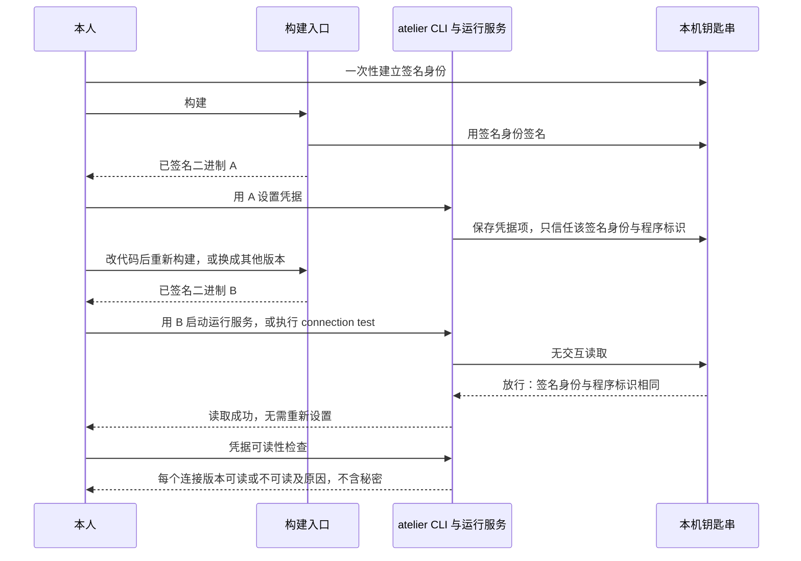
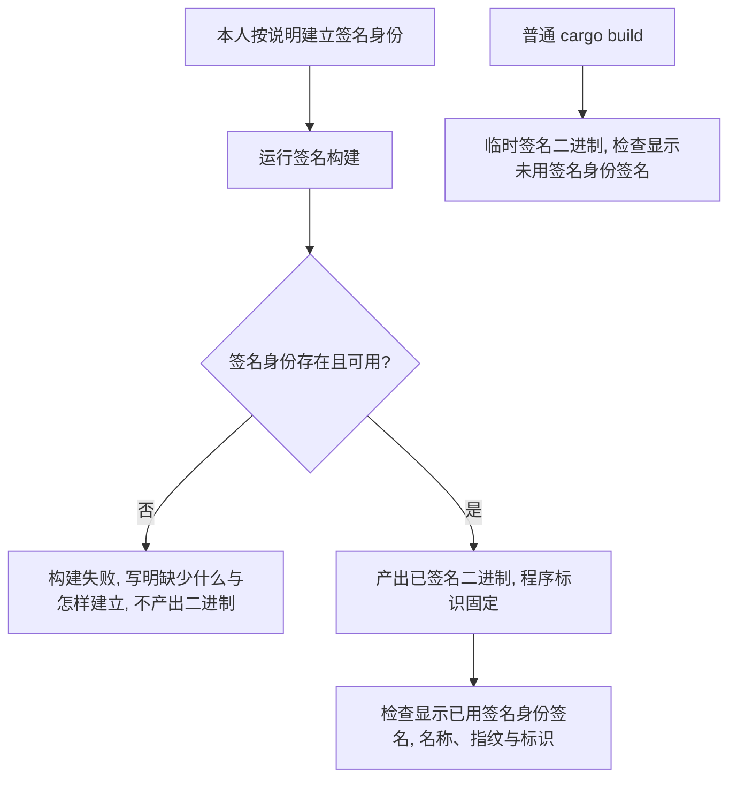
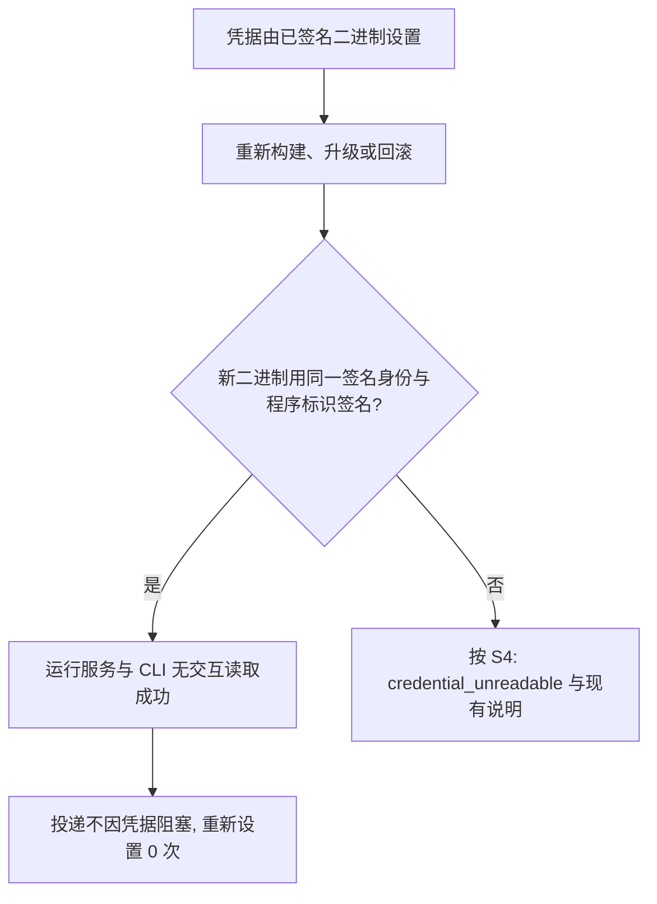
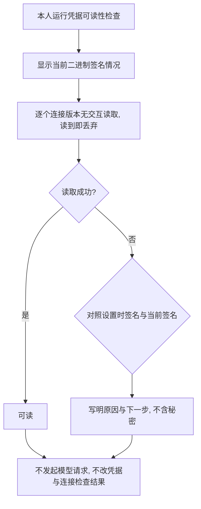
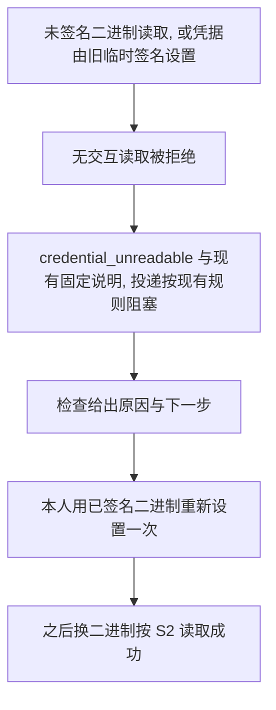

# L1 产品设计：重新编译后仍能读取已保存的 Keychain 凭据

版本：v0.1，2026-10-08；状态：Draft。关联 [Issue #24](https://github.com/xforce-io/atelier/issues/24)、[名词表](../../glossary.md)。L2 待本稿批准后再写。本稿不改写 [首个团队设计 L1](../1-first-team-delivery/product.md) 的 S1.A18（Issue #6）：没有用签名身份签名的二进制读不到已有项时，失败原因与现在相同。

确认来源：2026-10-08 12:39，本人经 Jenny 确认：「给 atelier 一个固定的签名身份，解决重编译后读不了 Keychain 的问题，P3。」本人确认的是这个目标和优先级。第 3 至 8 节的对象、入口、规则与验收，以及第 9 节的取舍和待定问题，都是本稿的提议，待审查。

## 1. 背景与目标

API 凭据只保存在 macOS Keychain，SQLite 里只有引用（`src/credential.rs:1-2`）。凭据项按「工作区 ID:随机 UUID」命名（`src/credential.rs:240`），与路径无关。读取时关闭用户交互，不弹窗（`src/credential.rs:64-73`）。钥匙串拒绝时，失败原因是「当前二进制无法读取已有 Keychain 项，请用当前二进制重新设置凭据」，连接检查给出 `credential_unreadable`（`src/credential.rs:39-40`、`src/connection_probe.rs:371-377`）。这条说明来自 Issue #6 / PR #15。

问题本身还在：

- 本地 `cargo build` 产出的二进制只有链接器给的临时签名。程序标识形如 `atelier-<哈希>`，每次构建的签名摘要都不同。
- 钥匙串在设置凭据时信任的是那一份二进制。换了二进制，签名对不上，读取就被拒绝。
- 运行服务由 `runtime start` 用当前二进制启动 `runtime-serve`（`src/runtime.rs:71-75`），领取投递前预检凭据（`src/api_driver.rs:74`）。读不到时投递被阻塞。
- 结果是截至 2026-10-08，运行服务每换一次二进制，包括回滚，都要本人亲自用 `connection credential set <连接 ID> --revision <版本> --stdin`（带 `--request-id`）重新设置 API 凭据。

目标：

- 本人在本机一次性建立一个固定的签名身份。用它签名的 atelier 二进制，重新构建、升级或回滚之后，运行服务和 CLI 都能直接读取已保存的凭据，不需要重新设置，也不弹窗。
- 读不到时，本人能查到是哪一种原因：当前二进制没有用签名身份签名、签名身份与设置凭据时不同、凭据缺失，或钥匙串不可用。
- 安全边界不变：不放宽钥匙串访问控制到任意进程，不回退明文，输出不含秘密。

## 2. 范围与非目标

本次交付：

- 签名身份的一次性建立说明，以及检查。
- 一个构建入口，产出用签名身份签名、程序标识固定的 atelier 二进制。
- 换二进制后，运行服务与 CLI 读取已有 API 凭据。
- 凭据可读性检查：按连接版本说明当前二进制能否读取，读不到时给出原因与下一步。
- 从临时签名设置的凭据迁移过来：每个在用的连接版本由本人重新设置一次。

不做：

- agent CLI 连接的登录材料。它保存在 `<工作区>/cli-environments/<id>/login`（`src/cli_environment.rs:38`、`:308`），不在钥匙串，不受签名影响。
- Apple 公证与对外分发；非 macOS 平台。
- 放宽钥匙串访问控制；回退到文件、环境变量、数据库或明文。
- 自动迁移旧凭据项，或替本人重新设置凭据。
- 在 CI 中持有或使用真实签名身份。
- 切换本人正在运行的运行服务。那是另一项需要本人单独操作的事，不在本稿验收内。

## 3. 用户与产品概念

以名词表为准。本人是本机的使用者，负责建立签名身份、设置凭据、切换二进制。

| 对象 | 持续保存的事实 | 与其他对象的关系 |
|---|---|---|
| 签名身份 | 本人本机钥匙串里的一张代码签名证书及其私钥；对外只显示名称和证书指纹 | 属于本机，不属于工作区。私钥不离开钥匙串 |
| 已签名二进制 | 由签名身份签名、程序标识固定的 atelier 二进制 | 同一签名身份、同一程序标识的不同构建，钥匙串视为同一程序 |
| 设置时签名 | 设置凭据那一刻二进制的签名身份指纹与程序标识，或「未用签名身份签名」 | 记在凭据设置记录上，不含秘密。只用来说明原因，不是读取授权 |
| 凭据可读性检查 | 一次检查的时间、当前二进制的签名情况、每个连接版本的可读结论与原因 | 只读，不发起模型请求，不改凭据，不改连接检查结果 |

## 4. 产品交互总览

二进制没有用签名身份签名时，读取仍按现有规则失败：`credential_unreadable` 与现有固定说明。检查入口给出细分原因。

## 5. 信息架构与入口

- 签名身份：README 写明一次性建立的步骤。建立由本人在本机完成，系统要求的确认由本人处理。见第 9 节待定问题 Q2、Q3。
- 构建入口：仓库提供一个构建入口，产出已签名二进制，暂称「签名构建」。普通 `cargo build` 保留，用于开发和测试，仍是临时签名。见 Q2。
- 凭据设置与清除：沿用 `connection credential set/clear`，参数不变。设置时额外记下设置时签名。
- 凭据可读性检查：新增只读入口，提议为 `connection credential check [<连接 ID>]`。不带连接 ID 时检查工作区内所有有凭据引用的连接版本。不需要 `--request-id`。
- 连接检查与运行服务：`connection test`、`connection show` 的 `readiness`、运行服务预检保持现有行为与错误码。

## 6. Stories 与完整交互

### S1. 一次性建立签名身份，构建出已签名的二进制

角色：本机本人。前置：macOS 本机，尚无签名身份。入口：README 的建立说明、签名构建、凭据可读性检查。

操作：

1. 本人按说明在本机钥匙串建立签名身份，只做一次。
2. 本人用签名构建构建 atelier。
3. 本人运行凭据可读性检查，查看当前二进制的签名情况。

反馈：检查显示「已用签名身份签名」，以及签名身份名称、证书指纹和程序标识。

成功终点：已签名二进制可用；之后每次签名构建都用同一签名身份与程序标识。

异常：

- 没有签名身份，或签名身份不可用：签名构建失败，写明缺少什么、怎样建立。不产出看起来已签名的二进制。
- 普通 `cargo build` 照常可用，检查显示「未用签名身份签名」。
- 私钥不出现在仓库、数据库、日志或任何输出里。

对应 S1.A1 至 S1.A3。

### S2. 换二进制后照常读取已有凭据

角色：本机本人；工作区运行服务。前置：已有签名身份；API 凭据由已签名二进制设置。入口：签名构建、`runtime start`、`connection test`。

操作：

1. 本人做以下任一切换，新二进制都用同一签名身份签名：
   - 改代码后重新构建。
   - 换成更新的版本。
   - 回滚到较早的版本。
2. 本人用新二进制启动运行服务，或执行 `connection test`。

反馈：读取成功。连接检查不再是 `credential_unreadable`。运行服务领取数字员工投递时，凭据预检通过。

成功终点：三种切换都不需要重新设置凭据，全程无钥匙串弹窗。

异常：新二进制没有用签名身份签名，或用了另一个签名身份，按 S4 处理。

对应 S2.A1 至 S2.A3。

### S3. 查明当前二进制能否读取已保存的凭据

角色：本机本人。前置：工作区已初始化。入口：`connection credential check [<连接 ID>]`（提议）。

操作：

1. 本人运行检查，可指定一个连接，也可不指定。

反馈：

- 当前二进制的签名情况：已用签名身份签名（名称、指纹、程序标识），或未用签名身份签名。
- 每个有凭据引用的连接版本一行：可读，或不可读及原因与下一步。原因是以下之一：
  - 当前二进制未用签名身份签名。下一步：换用签名构建的二进制。
  - 签名身份或程序标识与设置凭据时不同。下一步：换回设置时的签名身份，或用当前二进制重新设置一次。
  - 凭据由未用签名身份签名的二进制设置。下一步：用已签名二进制重新设置一次。
  - 凭据缺失。下一步：重新设置。
  - 钥匙串不可用。下一步：解锁或检查钥匙串；不回退明文。
- 签名情况都对上，钥匙串仍然拒绝时，写明「原因未知」，并给出钥匙串返回的错误类别。不猜测。

成功终点：本人据此知道要不要重新设置、该用哪一份二进制。

异常：工作区没有凭据时，显示没有需要检查的凭据，不算失败。指定的连接不存在时被拒绝。

对应 S3.A1 至 S3.A3。

### S4. 没有签名身份时保持显式失败，迁移只需重设一次

角色：本机本人。前置：二进制没有用签名身份签名（例如普通 `cargo build`），或凭据是由旧的临时签名二进制设置的。入口：运行服务、`connection test`、`connection credential set`。

操作：

1. 用该二进制读取已有凭据。
2. 本人用已签名二进制，以新的 `--request-id` 重新设置一次凭据。

反馈：

- 第 1 步读不到时，仍是 `credential_unreadable` 与现有固定说明。运行服务的投递仍按现有规则阻塞。
- 第 2 步之后，再按 S2 换二进制，都能读取。

成功终点：从临时签名迁移，每个在用的连接版本最多重新设置 1 次。

异常：不弹窗；不放宽访问控制；不回退到文件、环境变量、数据库或明文；不自动替本人重新设置。

对应 S4.A1 至 S4.A3。

## 7. 产品规则与边界

- R1. 签名身份由本人在本机建立，私钥只在本人的钥匙串里。atelier 和仓库不保存、不导出、不输出私钥，也不提交任何证书材料。
- R2. 签名构建只用签名身份签名，程序标识固定。签名身份缺失或不可用时构建失败并写明原因，不回退成临时签名再当作已签名交付。
- R3. 凭据读取规则不变：关闭用户交互；访问控制只信任与设置时相同签名身份、相同程序标识的二进制，不放宽到任意进程；读不到不回退明文、文件、环境变量或数据库。
- R4. 设置凭据时记下设置时签名：签名身份指纹与程序标识，或「未用签名身份签名」。它不含秘密，只用来说明原因。能不能读，以钥匙串的实际结果为准。
- R5. 凭据可读性检查只读：每项读到即丢弃，不输出、不缓存；不发起模型请求；不改凭据、连接检查结果或 `readiness`。
- R6. `credential_unreadable` 与现有固定说明、运行服务预检与投递阻塞的行为保持不变。细分原因只在检查入口给出。
- R7. 不自动迁移旧凭据项。由临时签名设置的凭据，由本人用已签名二进制重新设置一次。
- R8. 用同一签名身份签名的任意版本都能读取，包括回滚到的较早版本；与二进制所在目录无关。更换签名身份等于重新开始：已有凭据要按 R7 重新设置一次，检查入口会指出。
- R9. CI 不持有签名身份，基础检查在没有签名身份时照常运行。模拟不同签名的现有测试（`tests/cli.rs:1681-1682`、`:1800`）保留。
- R10. agent CLI 的登录材料不受本稿影响。

## 8. 验收与效果验证

验收用临时工作区和合成凭据，连接指向本机替身端点，不碰本人正在运行的运行服务和真实凭据。需要真实签名身份的项在本人 Mac 上执行，由本人建立身份；没有执行的不得记为通过。

| ID / 关联 | 前置 | 入口与操作 | 可判定结果 | 异常与禁止 | 证据 / 执行 / 属性 |
|---|---|---|---|---|---|
| S1.A1 / S1 / R1、R2 | 本人已按说明建立签名身份 | 签名构建；对产物运行凭据可读性检查；查看签名信息 | 检查显示已用签名身份签名，名称、指纹、程序标识与签名信息一致；连续两次构建的程序标识相同 | 私钥与证书材料不出现在仓库、数据库、日志或输出 | 检查输出、`codesign` 签名信息、`git status`。需本人 Mac 与签名身份。必需 |
| S1.A2 / S1 / R2 | 本机没有签名身份，或签名身份不可用 | 签名构建 | 构建失败，写明缺少什么与怎样建立 | 不产出二进制；不回退成临时签名 | 构建输出与产物目录。可执行。必需 |
| S1.A3 / S1 / R9 | 没有签名身份 | 普通 `cargo build`；运行检查；运行 CI 同款基础检查 | 构建与基础检查照常通过；检查显示未用签名身份签名 | 不因缺签名身份失败 | 检查输出、测试结果。CI 与本机可执行。必需 |
| S2.A1 / S2 / R3、R8 | 用签名构建的二进制 A 设置合成凭据 | 改动代码后再签名构建得到 B；确认 A、B 签名摘要不同；用 B 执行 `connection test` | 连接检查通过替身端点；凭据代次不变；无钥匙串弹窗 | 不得重新设置；不得是 `credential_unreadable` | 签名摘要、连接检查结果、凭据设置记录。需本人 Mac。必需 |
| S2.A2 / S2 / R8 | 同上，另有较早版本 C 放在另一目录，也用同一签名身份签名 | 用 C 执行 `connection test`；再换回 B 执行 | 两次都通过；重新设置凭据 0 次 | 不得弹窗 | 连接检查结果、凭据设置记录。需本人 Mac。必需 |
| S2.A3 / S2 / R3、R6 | 同上；有一名使用该连接的数字员工和一条待领取投递 | 用 B `runtime start`；等待领取 | 预检读取成功，投递不因凭据阻塞 | 不得打开凭据恢复事项 | `runtime status`、投递与待决定事项查询。需本人 Mac。必需 |
| S3.A1 / S3 / R5 | 有两个连接版本的凭据，都可读 | `connection credential check`；再指定其中一个连接 | 两行都为可读；指定时只列该连接；显示当前签名情况 | 输出不含秘密；替身端点收到请求 0 次；凭据设置记录、连接检查记录与 `readiness` 不变 | 检查输出、替身端点计数、数据库对照。可执行。必需 |
| S3.A2 / S3 / R4、R5 | 分别构造：未签名二进制读取；另一签名身份签名的二进制读取；凭据由临时签名二进制设置；钥匙串项已被删除；钥匙串不可用 | 各运行一次检查 | 依次写明五种原因及对应下一步 | 不得猜测原因；签名都对上却被拒绝时写「原因未知」与错误类别；输出不含秘密 | 检查输出。签名相关需本人 Mac；钥匙串不可用可由核心测试注入。必需 |
| S3.A3 / S3 / R5 | 工作区没有凭据；或指定不存在的连接 | 运行检查 | 前者显示没有需要检查的凭据，不算失败；后者被拒绝 | — | 检查输出。可执行。必需 |
| S4.A1 / S4 / R3、R6 | 凭据由已签名二进制设置 | 用普通 `cargo build` 的二进制执行 `connection test`，并用它 `runtime start` 领取投递 | `credential_unreadable` 与现有固定说明；投递按现有规则阻塞 | 不弹窗；不放宽；秘密不出现在数据库、文件、环境变量或输出 | 连接检查结果、投递查询、数据库与日志检索。可执行。必需 |
| S4.A2 / S4 / R7 | 凭据由临时签名二进制设置 | 用已签名二进制读取；检查；用已签名二进制以新 `--request-id` 重新设置；再签名构建一次并读取 | 第一次读取为 `credential_unreadable`，检查指出凭据由未签名二进制设置；重设 1 次后，新构建读取成功 | 不自动迁移；每个连接版本重设不超过 1 次 | 连接检查结果、检查输出、凭据设置记录。需本人 Mac。必需 |
| S4.A3 / S4 / R8 | 凭据由签名身份甲签名的二进制设置 | 用签名身份乙签名的二进制读取并检查 | `credential_unreadable`；检查指出签名身份与设置时不同 | 不得读到 | 连接检查结果、检查输出。需本人 Mac 与第二个测试用签名身份。必需 |

功能路径随实现新建 `.agents/skills/verify-atelier/features/stable-signing-identity.md`，并更新 [setup-and-intake.md](../../../.agents/skills/verify-atelier/features/setup-and-intake.md) 的 S1.A18 一段，写明签名身份相同时不再出现该失败。

## 9. 折衷与开放问题

本稿提出、待审查的取舍：

1. **签名构建在缺签名身份时失败，不回退临时签名。** 回退会让本人以为换二进制不用重设凭据。代价是没有身份时这个入口不可用；普通 `cargo build` 仍可用于开发。
2. **设置凭据时记下设置时签名。** 没有它，检查只能说「读不到」，分不出未签名、身份不同、旧凭据三种情况。它是新存的一项非秘密事实。
3. **新增只读检查入口，不改现有错误码与固定说明。** `credential_unreadable` 已被连接检查、运行服务和验收引用；改动面小。代价是细分原因要多跑一个命令。入口名提议为 `connection credential check`。
4. **不自动迁移。** 自动迁移需要用旧二进制读出秘密再写入，或放宽访问控制，两者都不做。代价是每个在用连接版本要本人重设一次。

待定问题（每项给出建议默认，审查时确认或改定）：

- **Q1. 证书类型。** 本机自签代码签名证书，还是 Apple Developer ID。建议默认：本机自签，不需要 Apple 账号，只在本机有效；对外分发与公证另开 Issue。
- **Q2. 签名在哪一步做。** 仓库构建脚本、atelier 自带的安装命令，或 Cargo 配置。建议默认：仓库提供一个构建脚本，构建后签名，放到固定输出位置；运行服务用这里的二进制启动。atelier 二进制本身不提供给自己签名的命令。
- **Q3. 签名身份怎样建立。** atelier 提供引导命令，还是 README 写明手动步骤。建议默认：README 写明手动步骤，检查入口核对结果；atelier 不代建私钥。
- **Q4. CI。** 建议默认：CI 不签名、不持有私钥，基础检查不依赖签名身份；需要真实签名身份的验收在本人 Mac 上执行，证据单独记录。
- **Q5. 钥匙串放行的实测风险。** 「同一签名身份、同一程序标识的不同构建能被放行」是本稿的前提。它是否受二进制所在目录、证书是否被系统信任、钥匙串类型影响，需要在写 L2 前在本人 Mac 上用合成凭据实测。建议默认：以 S2.A1、S2.A2 的实测为准；若实测仍被拒绝或弹窗，回到本人决定改用 Developer ID，还是为凭据项显式登记可信程序。
