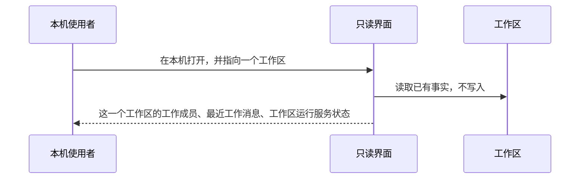
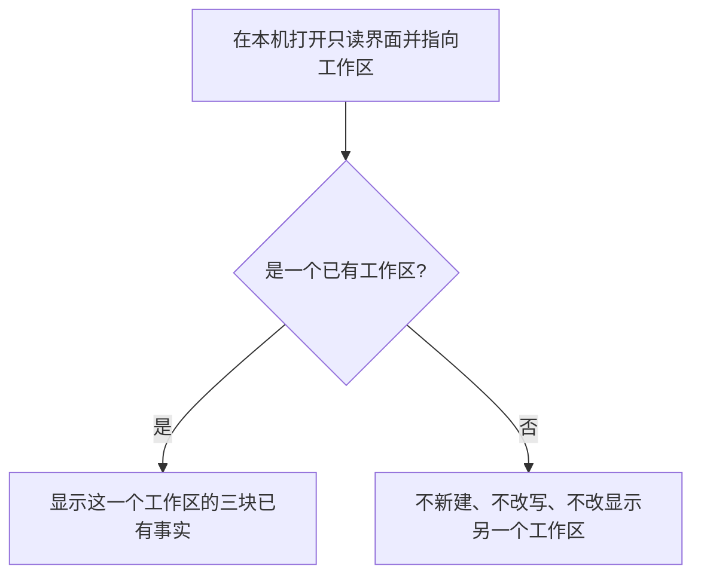
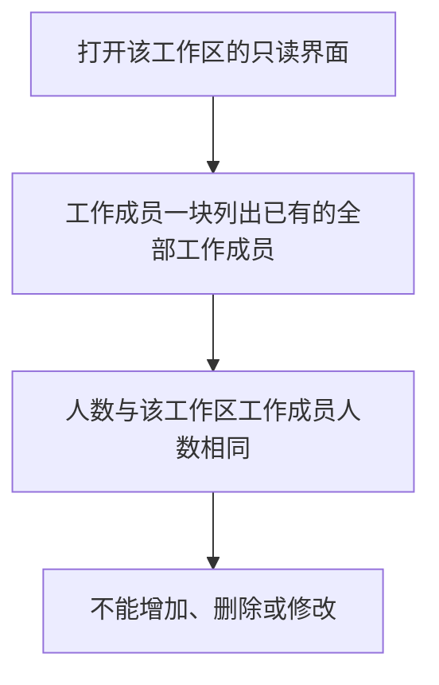
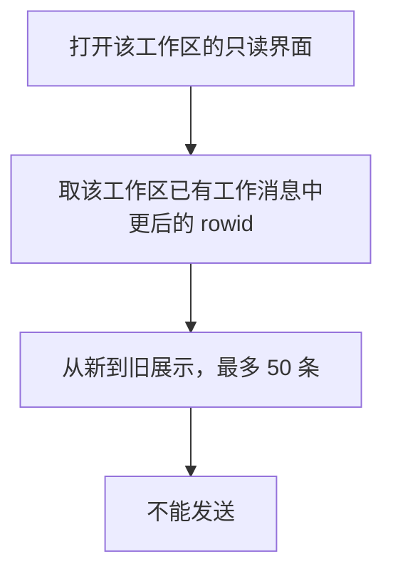
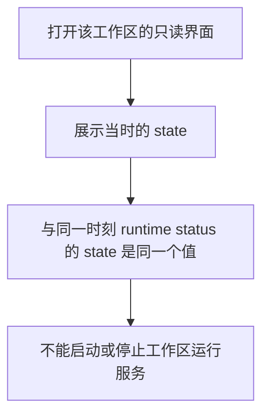
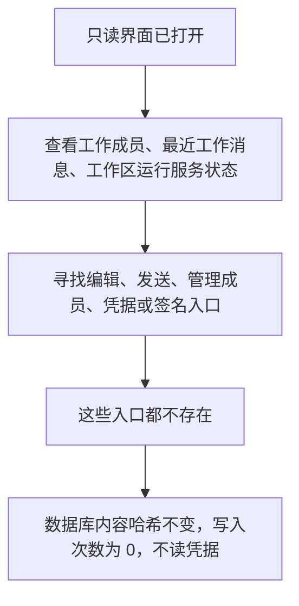

# L1 产品设计：本机打开只读界面查看工作成员、最近工作消息和工作区运行服务状态

版本：v0.1，2026-10-08；状态：Draft。关联 [Issue #25](https://github.com/xforce-io/atelier/issues/25)、[名词表](../../glossary.md)。

L2 待本稿批准后再写，批准前不实现。

## 1. 背景与目标

工作区的工作成员、工作消息和工作区运行服务状态都在本机。现在只能用命令分开看。已有 `worker list` 和 `runtime status`。`runtime status` 给出 state，也给出 lockHeld。工作消息可以发送，但没有列出工作消息的命令。

本机使用者打开一个只读界面，就应该看到当前这一个工作区的这三块，而不改已有事实。

目标：

- 在本机打开一个只读界面，只指向一个已有工作区。
- 看到该工作区的全部工作成员，人数与已有工作成员相同。
- 看到该工作区最近的工作消息，从新到旧，首屏最多 50 条，且与最新的 50 条是同一批。
- 看到当时的工作区运行服务状态，与同一时刻 `runtime status` 的 state 相同。
- 不能编辑、发送、管理成员、启停工作区运行服务，也没有凭据或签名入口。打开和查看不改工作区数据，不读凭据。

## 2. 范围与非目标

本次在本稿里约定的范围：

- 本机打开的只读界面。
- 一个工作区的全部工作成员。
- 该工作区最近 50 条工作消息。
- 该工作区的工作区运行服务状态，以 `runtime status` 的 state 为准。

不做：

- 写数据。
- 编辑。
- 发送工作消息。
- 增加、删除或修改工作成员。
- 凭据与签名。
- 启动或停止工作区运行服务。
- 用正在跑的 kairo-team 做开发。
- 第 51 条及更早的工作消息。
- 把 lockHeld 做成必须单独展示、单独验收的第二项状态。本期要一致的是 state。
- 改动 Issue #24。
- 在本稿批准前写 L2 或实现。

首屏 50 条是 v0.1 的产品选择，不是某一条现有命令已经规定的条数上限。

## 3. 用户与产品概念

以名词表为准。角色是本机使用者。只读界面在本机打开，只展示一个工作区已有的事实，不写入。

| 对象 | 只读界面展示的已有事实 | 与其他对象的关系 |
|---|---|---|
| 工作区 | 这一次打开所指向的那一个工作区 | 一次打开只对应一个工作区。指向方式与命令已有的 `--workspace` 相同 |
| 工作成员 | 该工作区已有的全部工作成员 | 与 `worker list` 是同一批，人数相等。要能区分每一名工作成员，本稿不另定字段清单 |
| 工作消息 | 该工作区已有工作消息里较新的至多 50 条 | 新指更后的 `messages.rowid`，较新的在前。不使用、也不假定有 created_at。要能区分每一条工作消息。这不是单个工作成员的收件箱 |
| 工作区运行服务 | 同一时刻 `runtime status` 的 state | 只展示这个状态，不启动、不停止。界面上的状态与命令报告的 state 是同一个值，不另起名字 |

按接收的工作成员汇集并列出工作消息时，既有顺序是 `messages.rowid` 从先到后。只读界面不沿用这个方向。它展示的是这一个工作区的工作消息，从新到旧；新指更后的 `messages.rowid`。

## 4. 产品交互总览

打开之后，没有第二条路去编辑、发送工作消息、管理成员、进入凭据或签名，或启停工作区运行服务。命令里已经存在的发送和其他写操作，不从只读界面进入。

## 5. 信息架构与入口

- 入口只有一个：在本机打开只读界面，并指向一个工作区。指向方式与命令已有的 `--workspace` 相同，就是打开时给定的那一个工作区。
- 不扫描本机目录，也不提供在多个工作区之间点选的入口。
- 指向一个已有工作区之后，同一屏只有三块：工作成员、最近工作消息、工作区运行服务状态。
- 没有这些入口：编辑、发送工作消息、增加或删除或修改工作成员、凭据、签名、启动或停止工作区运行服务。
- 只绑定本机回环地址。v1 不设登录。见第 9 节。

## 6. Stories 与完整交互

### S1. 本机打开就能看到当前工作区

角色：本机使用者。前置：本机已有一个工作区。

操作：

1. 在本机打开只读界面。
2. 指向该工作区。

闭环结果：只读界面显示这一个工作区，而不是空白或另一个工作区。

定量：1 个只读界面对应 1 个工作区。

反馈：三块都属于这一个工作区。工作成员、工作消息和工作区运行服务的 state 都只来自它。

成功终点：对照打开时指向的工作区，只读界面仍然是这一个，不是空白，也不是另一个。

异常：

- 没有指向工作区，或指向的不是一个已有工作区：不新建工作区，不改写，也不改去显示另一个工作区。
- 同一次打开只指向一个工作区。要看另一个工作区，需要另一次打开，并另行指向。

### S2. 只读看到全部工作成员

角色：本机使用者。前置：工作区里已有工作成员。

操作：

1. 打开该工作区的只读界面。
2. 看工作成员一块。

闭环结果：只读界面上的工作成员与该工作区已有工作成员是同一批，不能从只读界面增加、删除或修改。

定量：界面人数 = 该工作区工作成员人数。该人数与 `worker list` 的人数相同，且是同一批。

反馈：集合来自已有事实。没有工作成员时人数为 0，仍然是同一批。每一名工作成员都要能与 `worker list` 里的对应起来。本稿不规定字段清单。

成功终点：与 `worker list` 对照，集合一致，且没有增删或改的入口。

异常：只读界面上不出现增加、删除或修改工作成员的入口。

### S3. 只读看到最近工作消息

角色：本机使用者。前置：工作区里已有工作消息。

操作：

1. 打开该工作区的只读界面。
2. 看最近工作消息一块。

闭环结果：只读界面上的每一条都是该工作区已有的工作消息，从新到旧，不能从只读界面发送。

定量：首屏最多 50 条，且与该工作区最新的 50 条工作消息是同一批。

新指更后的 `messages.rowid`。从更后的 rowid 往前取，取满 50 条或取尽为止，较新的排在前面。不使用、也不假定存在 created_at。这 50 条上限是 v0.1 的产品选择，不是现有命令的条数限制。现有命令可以发送工作消息；没有列出工作消息的命令。按接收的工作成员列出时，顺序是 `messages.rowid` 从先到后；只读界面不沿用那个方向，也不是单个工作成员的收件箱。

没有工作消息时，首屏是 0 条。多于 50 条时，更早的不在首屏。本稿不另设继续浏览。

成功终点：首屏与更后的至多 50 条工作消息是同一批，顺序为更后的在前，且没有发送入口。每一条都要能判定是哪一条已有工作消息。本稿不规定字段清单。

异常：不能从只读界面发送工作消息。不能把另一个工作区的工作消息放进这一屏。

### S4. 只读看到工作区运行服务状态

角色：本机使用者。前置：工作区已有运行记录。

操作：

1. 打开该工作区的只读界面。
2. 看运行状态一块。

闭环结果：只读界面上的运行状态与该工作区当时的工作区运行服务状态一致，不能从只读界面启动或停止工作区运行服务。

定量：只读界面显示的状态与同一时刻 `runtime status` 的 state 相同。

反馈：展示的是 state 这一个值，与命令报告的是同一个值，不另起名字。`runtime status` 也会给出 lockHeld。本期不把 lockHeld 写成必须一并验收的第二项，也不把它变成启停入口。

成功终点：同一时刻两边的 state 相同。打开只读界面没有启动或停止工作区运行服务。

异常：

- 打开只读界面本身不启动工作区运行服务。查看状态沿用既有结果：查看事实不启动工作。
- 没有启动或停止的入口。

### S5. 界面不写数据

角色：本机使用者。前置：只读界面已打开。

操作：

1. 查看三块内容。
2. 寻找编辑、发送、管理成员、凭据或签名入口。

闭环结果：没有这些入口。打开和查看不改工作区数据，不读凭据。

定量：查看前后，工作区数据库文件的内容哈希不变；写入次数为 0。

成功终点：三块都能查看；编辑、发送、管理成员、凭据、签名这五类入口都没有；内容哈希不变；写入次数为 0；查看不读取凭据。

异常：不因为查看而写入工作区，也不为了展示去读取凭据或进入签名。

## 7. 产品规则与边界

- R1. 一次打开的只读界面只对应一个工作区。指向方式与命令已有的 `--workspace` 相同。不扫描目录，不在未指向时自行挑一个工作区来显示。
- R2. 只读界面只展示该工作区已有事实。不新建工作区，不补写事实，不修改工作成员，不发送工作消息，不启动或停止工作区运行服务。
- R3. 工作成员一块与该工作区全部工作成员是同一批，人数相等，并与 `worker list` 一致。每一名都要能被核对。没有增加、删除或修改的入口。本稿不规定字段清单。
- R4. 工作消息一块只取该工作区已有工作消息。新的定义是更后的 `messages.rowid`。首屏从更后往前，最多 50 条，且与最新的 50 条是同一批，较新的在前。不假定 created_at。50 是 v0.1 的产品选择，不是现有命令的条数限制。没有发送入口。本稿不另设更早工作消息的继续浏览。每一条都要能被核对是哪一条已有工作消息。
- R5. 运行状态一块与同一时刻 `runtime status` 的 state 是同一个值。没有启停入口。打开只读界面不启动工作区运行服务。
- R6. 没有编辑、发送、管理成员、凭据或签名入口。打开和查看不读取凭据，也不进入签名。
- R7. 查看前后，工作区数据库文件的内容哈希不变；对工作区数据库的写入次数为 0。
- R8. 只绑定本机回环地址。v1 不设登录。不向回环以外提供这个只读界面。
- R9. 不改变 Issue #24。签名与凭据不进入只读界面，本稿也不改那部分已有行为。

## 8. 验收与效果验证

验收对照本机上临时准备的、已经有事实的工作区。不扫描目录，也不打开某个正在运行的既有团队工作区来做对照。验收本身不从只读界面写入、发送、修改工作成员或启停工作区运行服务。

| ID / 关联 | 前置 | 入口与操作 | 可判定结果 | 异常与禁止 | 证据 |
|---|---|---|---|---|---|
| S1 / R1、R2 | 本机已有一个工作区 | 打开只读界面，并按 `--workspace` 的方式指向它 | 1 个只读界面对应这 1 个工作区；不是空白，也不是另一个工作区 | 不得新建工作区，不得改显示成另一个工作区 | 界面所指向的工作区与打开时指向的是同一个 |
| S2 / R3 | 该工作区已有工作成员 | 看工作成员一块，并与 `worker list` 对照 | 人数相等，且是同一批；没有增加、删除或修改 | 不得从只读界面改工作成员 | `worker list` 与界面上的工作成员集合 |
| S3 / R4 | 该工作区已有工作消息，且能区分 `messages.rowid` 的先后 | 看最近工作消息一块 | 首屏最多 50 条；从更后的 rowid 到更前；与最新 50 条是同一批；没有发送 | 不得按 created_at 排序；不得把 50 说成现有命令的条数限制；不得发送；不得改成单个工作成员的收件箱 | 首屏工作消息与更后的至多 50 个 `messages.rowid` 是同一批，且更后的在前 |
| S4 / R5 | 工作区已有运行记录 | 看运行状态一块，并在同一时刻看 `runtime status` | 界面状态与该命令的 state 是同一个值；工作区运行服务没有被启动或停止 | 不得提供启停；打开本身不得启动工作区运行服务 | 同一时刻两边的 state |
| S5 / R6、R7 | 只读界面已打开 | 查看三块，并寻找编辑、发送、管理成员、凭据或签名入口 | 五类入口都没有；查看前后工作区数据库文件的内容哈希不变；写入次数为 0；不读取凭据 | 不得为了展示而写工作区数据或读凭据 | 入口清点、内容哈希、写入次数 |

五项都成立，本稿所描述的只读界面才达到 v0.1。

## 9. 折衷与开放问题

本稿采用的默认如下，不是新的假设：

1. **只绑定本机回环地址。** v1 不设登录。本机使用者能打开它，是因为它在本机回环上，而不是因为另做了一套身份。
2. **一次打开一个工作区。** 指向方式与命令已经接受的 `--workspace` 相同。不扫描本机目录来发现工作区，也不把任何一个正在使用的工作区写进本稿当作要打开的对象。
3. **不改 Issue #24。** 签名和凭据留在只读界面之外。本稿不增加这两类入口，也不改它们已有的行为。
4. **L2 和实现都等本稿批准。** 批准前不写 L2，不实现，也不把本稿标成已批准。

没有另列待选方案。上面四条就是 v0.1 的边界。
