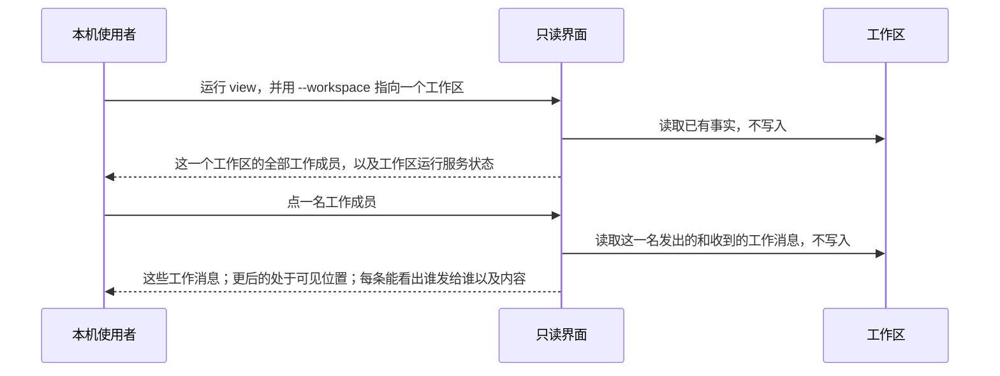
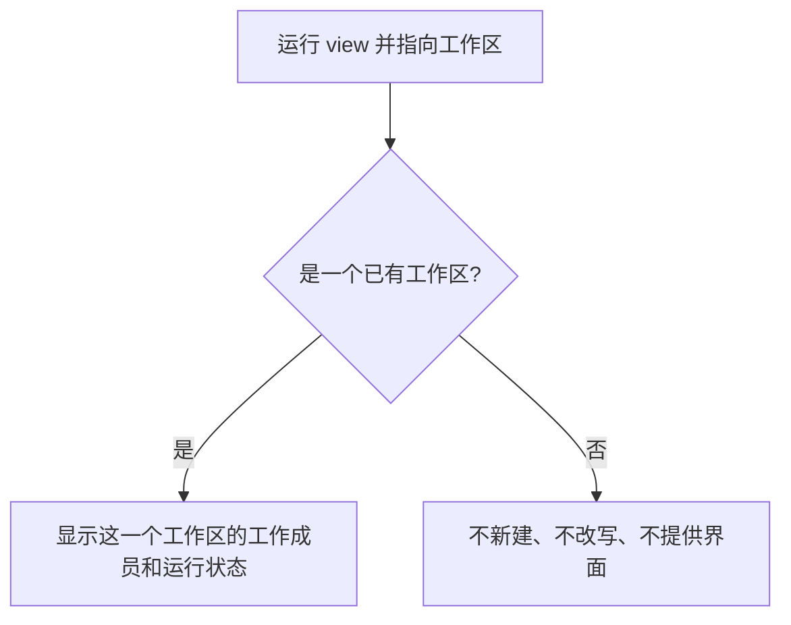
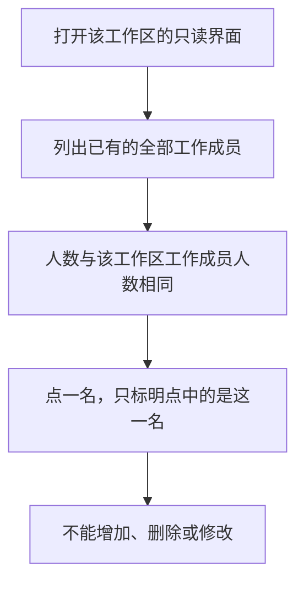
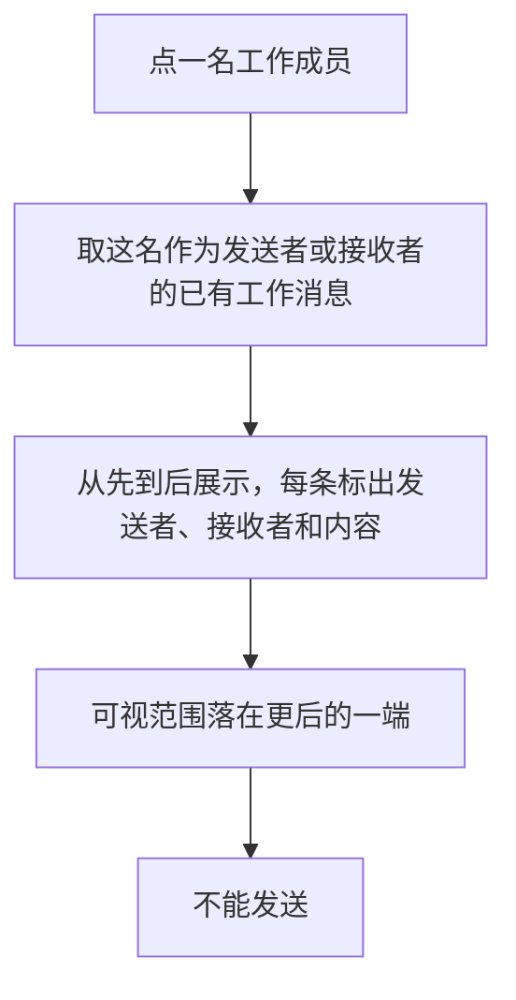
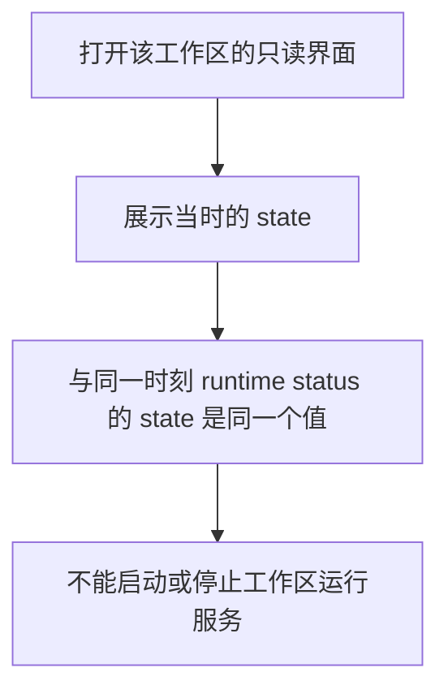
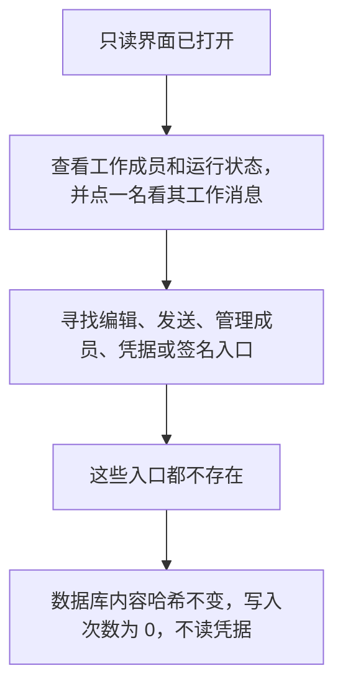

# L1 产品设计：本机打开只读界面，按工作成员查看其发出和收到的工作消息

版本：v0.3，2026-10-08；状态：Draft。关联 [Issue #25](https://github.com/xforce-io/atelier/issues/25)、[名词表](../../glossary.md)、[L2 v0.1](technical.md)。

v0.1 把工作成员和整个工作区最新 50 条工作消息放在同一屏。v0.2 改成先看到全部工作成员，点一名再看这一名发出的和收到的工作消息。v0.3 在 v0.2 上微调四点，其余只读边界不变：

1. 点开后，消息仍按更早到更晚排在同一列表，打开时可视范围落在更后的一端，更后的消息处于可见位置；更早的留在同一列表里，向更早一端移动就能看到。
2. 每条都展示已有内容。
3. 没有工作成员发送者时，发送者显示为「核心」，不显示成任何工作成员。
4. 接收者只认消息自己的接收者。

确认来源：2026-10-08 本次会话。用户在看过 v0.2 与上述四点后说「好，微调后，开始进入端到端」。该确认适用于 v0.3。本稿不自批为 Approved。

## 1. 背景与目标

工作区的工作成员、工作消息和工作区运行服务状态都在本机。现在只能用命令分开看。已有 `worker list` 和 `runtime status`。`runtime status` 给出 state，也给出 lockHeld。工作消息可以发送，但没有列出工作消息的命令。

按接收的工作成员汇集并列出工作消息，是收件箱。收件箱只含该成员收到的工作消息。名词表里的会话是承载工作成员之间消息交流的持续对象。本稿两者都不用：不把只读界面做成收件箱，也不把它做成会话。

本机使用者打开一个只读界面，看到这一个工作区的全部工作成员。点其中一名，看到这一名发出的和收到的工作消息，能看出每一条是谁发给谁，并能看到内容。不改已有事实。

目标：

- 在本机打开一个只读界面，只指向一个已有工作区。
- 看到该工作区的全部工作成员，人数与已有工作成员相同。点一名工作成员，才能看到工作消息。
- 点中的这一名，其发出的和收到的工作消息都要出现，且与该工作区里这一名作为发送者或接收者的已有工作消息是同一批。每一条都要能看出发送者、接收者和内容。打开这一块时，更后的消息处于可见位置。
- 看到当时的工作区运行服务状态，与同一时刻 `runtime status` 的 state 相同。
- 不能编辑、发送、管理成员、启停工作区运行服务，也没有凭据或签名入口。打开、点选和查看不改工作区数据，不读凭据。

## 2. 范围与非目标

本次在本稿里约定的范围：

- 本机打开的只读界面。入口命令是 `atelier --workspace <工作区路径> view`。
- 一个工作区的全部工作成员，并可点其中一名。
- 点中这一名发出的和收到的工作消息。每条都能看出发送者、接收者和内容。打开时更后的消息可见。
- 该工作区的工作区运行服务状态，以 `runtime status` 的 state 为准。

不做：

- 写数据。
- 编辑。
- 发送工作消息。
- 增加、删除或修改工作成员。
- 凭据与签名。
- 启动或停止工作区运行服务。
- 用正在跑的 kairo-team 做开发。
- 不点工作成员，就展示整个工作区最新的工作消息。v0.1 的「同一屏最新 50 条」不再作为这一屏。
- 把 lockHeld 做成必须单独展示、单独验收的第二项状态。本期要一致的是 state。
- 按投递记录或收件箱展示工作消息，不展示投递状态。
- 另设条数上限或「继续加载」。
- 改动 Issue #24。

不另设条数上限。点中一名之后，这一名作为发送者或接收者的已有工作消息都在同一列表。打开时先看到更后的那些；更早的仍在这一列表中。

## 3. 用户与产品概念

以名词表为准。角色是本机使用者。只读界面在本机打开，只展示一个工作区已有的事实，不写入。

| 对象 | 只读界面展示的已有事实 | 与其他对象的关系 |
|---|---|---|
| 工作区 | 这一次打开所指向的那一个工作区 | 一次打开只对应一个工作区。指向方式是命令已有的 `--workspace` |
| 工作成员 | 该工作区已有的全部工作成员 | 与 `worker list` 是同一批，人数相等。每一名显示 id 和名称，以便对应和点选。点一名，才出现工作消息 |
| 工作消息 | 点中这一名作为发送者或接收者的已有工作消息 | 发送者、接收者取消息本身。新指更后的 `messages.rowid`。同一列表从更先的 rowid 到更后的 rowid。不使用、也不假定有 created_at。每一条显示消息 id、发送者、接收者和内容。这不是收件箱，也不是名词表里的会话 |
| 工作区运行服务 | 同一时刻 `runtime status` 的 state | 只展示这个状态，不启动、不停止。界面上的状态与命令报告的 state 是同一个值，不另起名字 |

发送者：消息记录了一名工作成员时，显示这一名的 id 和名称。消息没有工作成员发送者时，显示「核心」，不显示成任何工作成员。有工作成员发送者时，即使来源标记是核心，仍显示这名工作成员。

接收者：只取消息自己的接收者，显示其 id 和名称。不取投递记录上的接收者，不展示投递状态。

内容：展示这条工作消息已有的正文，按文本展示，不把正文当成页面标记执行。

同一条工作消息会在发送者那一屏和接收者那一屏各出现一次。两边都是这一条已有工作消息，两边都标出发送者、接收者和内容。没有工作成员发送者的消息只出现在接收者那一屏。

## 4. 产品交互总览

打开之后，没有第二条路去编辑、发送工作消息、管理成员、进入凭据或签名，或启停工作区运行服务。命令里已经存在的发送和其他写操作，不从只读界面进入。点另一名工作成员，只换成那一名的发出和收到，工作区不变。

## 5. 信息架构与入口

- 入口只有一个：`atelier --workspace <工作区路径> view`。它在本机回环地址上提供这个界面，并把打开地址告诉本机使用者。
- 不扫描本机目录，也不提供在多个工作区之间点选的入口。
- 指向一个已有工作区之后，先看到全部工作成员，以及工作区运行服务状态。不点工作成员，不出现工作消息。
- 点一名工作成员之后，看到这一名发出的和收到的工作消息。列表从更早排到更晚，打开时可视范围在更后的一端。点另一名，这一块换成那一名的，不同时叠两名的。
- 没有这些入口：编辑、发送工作消息、增加或删除或修改工作成员、凭据、签名、启动或停止工作区运行服务。
- 只绑定本机回环地址。v1 不设登录。见第 9 节。

没有工作成员时，人数为 0，无法点出工作消息。点中的一名没有工作消息时，这一块是 0 条，点中的仍是这一名，没有「更后的消息」需要放入可视范围。

## 6. Stories 与完整交互

### S1. 本机打开就能看到当前工作区

角色：本机使用者。前置：本机已有一个工作区。

操作：

1. 在本机运行 `atelier --workspace <该工作区> view`。
2. 打开它给出的本机地址。

闭环结果：只读界面显示这一个工作区，而不是空白或另一个工作区。

定量：1 个只读界面对应 1 个工作区。

反馈：工作成员和工作区运行服务的 state 都只来自它。之后点出的工作消息也只来自它。

成功终点：对照打开时指向的工作区，只读界面仍然是这一个，不是空白，也不是另一个。

异常：

- 没有指向工作区，或指向的不是一个已有工作区：不新建工作区，不改写，也不改去显示另一个工作区。命令失败，不提供界面。
- 同一次打开只指向一个工作区。要看另一个工作区，需要另一次打开，并另行指向。

对应验收：S1.A1。

### S2. 只读看到全部工作成员，并可点其中一名

角色：本机使用者。前置：工作区里已有工作成员。

操作：

1. 打开该工作区的只读界面。
2. 看工作成员。
3. 点其中一名。

闭环结果：只读界面上的工作成员与该工作区已有工作成员是同一批，不能从只读界面增加、删除或修改。点一名只用来看这一名的工作消息，不改变成员。

定量：界面人数 = 该工作区工作成员人数。该人数与 `worker list` 的人数相同，且是同一批。

反馈：每一名显示 id 和名称，能与 `worker list` 里的对应起来。没有工作成员时人数为 0，仍然是同一批，也无法点出工作消息。

成功终点：与 `worker list` 对照，集合一致，且没有增删或改的入口。点一名之后，界面标明当前点中的是这一名。

异常：只读界面上不出现增加、删除或修改工作成员的入口。点成员不写入。

对应验收：S2.A1。

### S3. 点一名工作成员，只读看到其发出和收到的工作消息

角色：本机使用者。前置：已点中该工作区的一名工作成员。

操作：

1. 点这名工作成员。
2. 看随之出现的工作消息。

闭环结果：这里的每一条都是该工作区已有的工作消息，且这名工作成员是发送者或接收者。能看出每一条是谁发给谁，并能看到内容。不能从只读界面发送。打开时，更后的消息处于可见位置。

定量：条数等于该工作区里、这名工作成员作为发送者或接收者的已有工作消息条数，且是同一批。不另设 50 条上限。

顺序是 `messages.rowid` 从先到后，更先的在前。新仍指更后的 `messages.rowid`。不使用、也不假定存在 created_at。这不是收件箱：收件箱只有收到的，这里发出的也在。这也不是名词表里的会话。v0.1 的整个工作区最新 50 条不再作为这一屏。

每一条显示消息 id、发送者、接收者和内容。发送者是工作成员时显示该成员；没有工作成员发送者时显示「核心」。接收者是消息自己的接收者。内容是已有正文。

没有这样的工作消息时，这一块是 0 条，点中的仍是这一名。点另一名，换成那一名作为发送者或接收者的那一批，不把两名叠在一起。有消息时，更早的仍在同一列表中，向更早一端移动可以看到；不另设继续加载。

成功终点：与这名作为发送者或接收者的已有工作消息是同一批，更先的 rowid 在前；每一条都能看出发送者、接收者和内容，并能按消息 id 判定是哪一条；没有发送入口；更后的消息在打开时可见。

异常：

- 不能从只读界面发送工作消息。
- 不能把这名既不是发送者、也不是接收者的工作消息放进这一块。
- 不能把另一个工作区的工作消息放进这一块。
- 未点工作成员时，不展示工作消息。
- 不能只给出收到的，也不能按投递状态筛选。
- 没有工作成员发送者时，不能显示成某一名工作成员。

对应验收：S3.A1、S3.A2。

### S4. 只读看到工作区运行服务状态

角色：本机使用者。前置：工作区已有运行记录。

操作：

1. 打开该工作区的只读界面。
2. 看运行状态。

闭环结果：只读界面上的运行状态与该工作区当时的工作区运行服务状态一致，不能从只读界面启动或停止工作区运行服务。

定量：只读界面显示的状态与同一时刻 `runtime status` 的 state 相同。

反馈：展示的是 state 这一个值，与命令报告的是同一个值，不另起名字。`runtime status` 也会给出 lockHeld。本期不把 lockHeld 写成必须一并验收的第二项，也不把它变成启停入口。运行状态不依赖是否点了工作成员。

成功终点：同一时刻两边的 state 相同。打开只读界面没有启动或停止工作区运行服务。

异常：

- 打开只读界面本身不启动工作区运行服务。查看状态沿用既有结果：查看事实不启动工作。
- 没有启动或停止的入口。

对应验收：S4.A1。

### S5. 界面不写数据

角色：本机使用者。前置：只读界面已打开。

操作：

1. 查看工作成员和工作区运行服务状态。
2. 点一名工作成员，查看其发出和收到的工作消息。
3. 寻找编辑、发送、管理成员、凭据或签名入口。

闭环结果：没有这些入口。打开、点选和查看不改工作区数据，不读凭据。

定量：查看前后，工作区数据库文件的内容哈希不变；写入次数为 0。

成功终点：工作成员、点中后的工作消息、运行状态都能查看；编辑、发送、管理成员、凭据、签名这五类入口都没有；内容哈希不变；写入次数为 0；查看不读取凭据。

异常：不因为打开、点选或查看而写入工作区，也不为了展示去读取凭据或进入签名。

对应验收：S5.A1。

## 7. 产品规则与边界

- R1. 一次打开的只读界面只对应一个工作区。入口是 `atelier --workspace <工作区路径> view`。不扫描目录，不在未指向时自行挑一个工作区来显示。
- R2. 只读界面只展示该工作区已有事实。不新建工作区，不补写事实，不修改工作成员，不发送工作消息，不启动或停止工作区运行服务。点一名工作成员也不写入。
- R3. 工作成员与该工作区全部工作成员是同一批，人数相等，并与 `worker list` 一致。每一名显示 id 和名称。点一名只标明点中的是这一名。没有增加、删除或修改的入口。
- R4. 未点工作成员时不展示工作消息。点中之后，只取该工作区里这一名作为发送者或接收者的已有工作消息，且是同一批，不另设条数上限。顺序是 `messages.rowid` 从先到后。不假定 created_at。每一条显示消息 id、发送者、接收者和内容。发送者是工作成员时显示该成员；没有工作成员发送者时显示「核心」。接收者只取消息自己的接收者。同一条在发送者一屏和接收者一屏各出现一次；没有工作成员发送者的消息只出现在接收者一屏。这不是收件箱，也不是名词表里的会话。不展示整个工作区最新 50 条。没有发送入口。点另一名则换成那一名的这一批。
- R5. 有工作消息时，打开这一块的可视范围落在更后的一端，更后的消息处于可见位置。更早的仍在同一列表中，向更早一端移动可以看到。不另设继续加载。没有工作消息时不适用这一条。
- R6. 运行状态与同一时刻 `runtime status` 的 state 是同一个值。没有启停入口。打开只读界面不启动工作区运行服务。是否点了工作成员不改变这一条。
- R7. 没有编辑、发送、管理成员、凭据或签名入口。打开、点选和查看不读取凭据，也不进入签名。内容按文本展示。
- R8. 查看前后，工作区数据库文件的内容哈希不变；对工作区数据库的写入次数为 0。
- R9. 只绑定本机回环地址。v1 不设登录。不向回环以外提供这个只读界面。
- R10. 不改变 Issue #24。签名与凭据不进入只读界面，本稿也不改那部分已有行为。

## 8. 验收与效果验证

验收对照本机上临时准备的、已经有事实的工作区。不扫描目录，也不打开某个正在运行的既有团队工作区来做对照。验收本身不从只读界面写入、发送、修改工作成员或启停工作区运行服务。

真实入口是 `atelier --workspace <路径> view` 打开的本机页面，不是只调用内部函数。功能地图：[readonly-workspace-ui.md](../../../.agents/skills/verify-atelier/features/readonly-workspace-ui.md)。

| ID / 关联 | 前置 | 入口与操作 | 可判定结果 | 异常与禁止 | 证据 |
|---|---|---|---|---|---|
| S1.A1 / S1 / R1、R2 | 本机已有一个工作区 | 运行 `view` 指向它，并打开给出的地址 | 1 个只读界面对应这 1 个工作区；不是空白，也不是另一个工作区 | 指向无效时不得新建工作区，不得改显示成另一个工作区，不得留下界面 | 界面所指向的工作区与打开时指向的是同一个；无效指向时命令失败且没有新建目录 |
| S2.A1 / S2 / R3 | 该工作区已有工作成员 | 看工作成员，并与 `worker list` 对照；点其中一名 | 人数相等，且是同一批；每名可见 id 和名称；点中的是这一名；没有增加、删除或修改 | 不得从只读界面改工作成员；点选不得写入 | `worker list` 与界面上的工作成员集合，以及当前点中的是哪一名 |
| S3.A1 / S3 / R4 | 已点中一名工作成员；工作消息能区分发送者、接收者、内容和 `messages.rowid` | 看这一名的工作消息 | 条数与这一名作为发送者或接收者的已有工作消息相同，且是同一批；更先的 rowid 在前；每条可见消息 id、发送者、接收者和内容；没有工作成员发送者时发送者是「核心」；接收者是消息自己的接收者；没有发送 | 不得在未点成员时展示整个工作区的工作消息；不得只给收到的；不得按投递状态筛选；不得按 created_at 排序；不得再以最新 50 条为这一屏；不得发送；不得把两名的工作消息叠在同一块；不得把空发送者显示成工作成员 | 这一块的工作消息与该成员作为发送者或接收者的消息是同一批，更先的在前；每条的 id、发送者、接收者、内容与已有事实相同 |
| S3.A2 / S3 / R5 | 点中的这名至少有一条工作消息 | 点这名之后看消息区域 | 更后的消息处于可见位置；更早的仍在同一列表中，向更早一端移动可以看到 | 不得另设条数上限或继续加载；不得只留下更早的而把更后的留在可见范围之外 | 打开后更后一条处于可视范围；同一列表仍含更早的消息 |
| S4.A1 / S4 / R6 | 工作区已有运行记录 | 看运行状态，并在同一时刻看 `runtime status` | 界面状态与该命令的 state 是同一个值；工作区运行服务没有被启动或停止 | 不得提供启停；打开本身不得启动工作区运行服务 | 同一时刻两边的 state |
| S5.A1 / S5 / R7、R8 | 只读界面已打开 | 查看工作成员和运行状态，点一名看其工作消息，并寻找编辑、发送、管理成员、凭据或签名入口 | 五类入口都没有；查看前后工作区数据库文件的内容哈希不变；写入次数为 0；不读取凭据 | 不得为了展示或点选而写工作区数据或读凭据 | 入口清点、内容哈希、写入次数、凭据表未被读取 |

| ID | 执行与依赖 | 交付属性 |
|---|---|---|
| S1.A1–S5.A1 | agent 可在临时工作区用真实 `view` 命令和本机页面执行。不需要真实模型或正在运行的团队工作区。缺页面或未打开真实入口时不得记通过 | 必需 |

六项都成立，本稿所描述的只读界面才达到 v0.3。

## 9. 折衷与开放问题

本稿采用的默认如下。确认来源见文首。没有留到实现时再定的产品问题。

1. **只绑定本机回环地址。** v1 不设登录。本机使用者能打开它，是因为它在本机回环上，而不是因为另做了一套身份。
2. **一次打开一个工作区。** 入口命令是 `atelier --workspace <工作区路径> view`。不扫描本机目录来发现工作区。
3. **先点工作成员，再看这一名发出和收到的工作消息。** 不点就不展示工作消息。同一条在发送者和接收者两边各看一次。没有工作成员发送者时，发送者显示为「核心」，该条只出现在接收者一边。接收者只认消息自己的接收者。每条展示内容。不另设条数上限。打开时可视范围在更后的一端。
4. **不改 Issue #24。** 签名和凭据留在只读界面之外。
5. **状态保持 Draft。** 本次会话确认适用于 v0.3，但不把本稿自批为 Approved。
