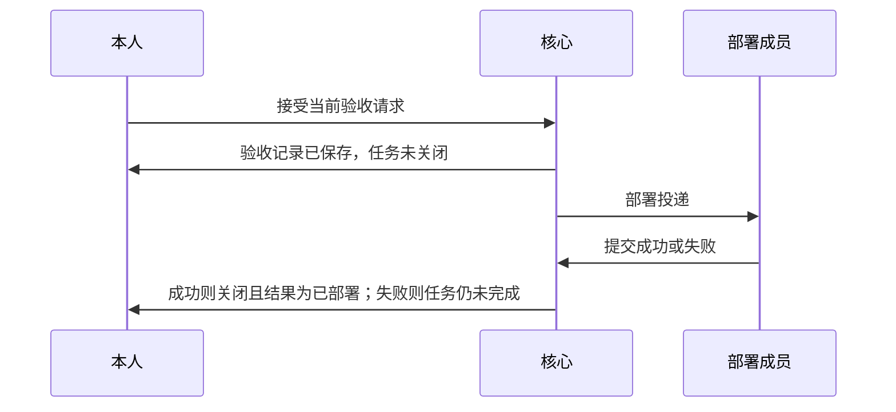

# L1 产品设计：明确部署职责

版本：v0.1，2026-10-05；状态：Draft。确认来源：[Issue #5](https://github.com/xforce-io/atelier/issues/5) 期望。关联 [L2](technical.md)、[名词表](../../glossary.md)。本稿不把首个团队设计里的「自动合入/push/部署」改成自动发布；那三项仍然不做。

## 1. 背景与目标

已有团队可以包含一名被称作运维的成员，但任务参与者只有负责人、验收者，以及承接后的执行者和检验者。运行服务不向该成员投递，核心也没有部署操作。因此「检验通过并经本人验收后，由该成员部署」无法交给这个成员。

目标：团队显式指定部署职责后，该成员能收到部署投递；部署结果与代码验收分开记录；做不到时任务保持未完成，不能把未部署报成完成。

## 2. 范围与非目标

本期提供：

- 团队上的可选部署职责。职责来自显式字段，不由成员显示名推断。
- 有该职责时，本人接受只写入验收记录并打开部署，任务保持未关闭。
- 部署成员提交成功或失败。成功后任务关闭，结果与「已验收」区分；失败后任务保持未完成。
- 没有该职责的团队仍在本人接受后关闭，结果仍为已验收。

不做：自动合入、push、由核心执行 `deploy/compose.yaml` 或其他部署命令、把部署并进执行或检验、失败后自动再次部署、由其他身份代报部署结果。任务说明里的部署路径是给部署成员的工作内容，不是核心硬编码命令。

## 3. 用户与产品概念

以名词表为准。部署职责是团队上的显式可选职责，与执行、检验、验收分开。部署成员可以是数字员工，或本机本人；不能是执行者或检验者。显示名为「运维」不产生该职责。

| 对象 | 持续保存的事实 | 与其他对象的关系 |
|---|---|---|
| 部署职责 | 团队及任务冻结快照中的部署成员 | 可选；没有它时验收行为与现在相同 |
| 验收记录 | 本人对当前产出的接受或拒绝 | 有部署职责时，接受不关闭任务 |
| 部署记录 | 开放、阻塞、成功或失败，以及原因和对应验收 | 与验收记录分开；成功才把任务标成已部署 |

## 4. 产品交互总览

没有部署职责时，接受仍直接关闭任务，不出现部署投递。部署成员看不到部署工具时，不能用执行或检验操作代替。

## 5. 场景

正常路径：团队指定部署成员并授予 `task.deploy`。代码经独立检验后，本人接受。查询仍显示任务未关闭，验收记录为接受，部署记录为开放。部署成员收到投递，在自己的运行里提交成功。任务随后关闭，结果为已部署，验收记录仍在。

做不到：未授权、缺少执行配置、额度耗尽或仍有正式阻塞时，接受仍保存验收记录，部署记录为阻塞并写明原因，不产生部署投递，任务不关闭。部署成员提交失败后，任务保持活动且结果为空，并通知团队负责人；同一部署不能改报成功。

无职责：沿用现有四名 Worker 路径，接受后任务关闭，结果为已验收。

## 6. 需求

- 创建或更新团队时可指定部署成员。该成员必须属于团队，且不得与执行者或检验者相同。人类部署成员只能是本机本人。
- 权限是显式的 `task.deploy`，不因职责字段或显示名自动获得。
- 有冻结部署职责时，接受写入验收记录，把部署记录打开或标成阻塞，不把任务标成已验收或已关闭。
- 只有冻结部署成员能提交结果。数字员工必须在自己的部署运行中提交。本机本人使用管理入口。
- 成功：任务关闭，结果为已部署。失败：任务保持未完成，不自动再次投递。提交结果后，原来的部署指派结束，收件箱不再把它当作待处理。
- 核心不执行部署命令，不合入，不 push。

## 7. 体验与质量

查询任务时能同时看到验收记录和部署记录。阻塞和失败写明原因，不用「已完成」或「已验收」概括未部署的任务。部署说明不回显凭据。重复提交已结束的部署被拒绝，不覆盖上一次结果。

## 8. 验收

| ID | 前置与操作 | 可判定结果 | 禁止结果 | 证据 |
|---|---|---|---|---|
| S1.A1 | 指定部署成员；另把执行者或检验者填入该职责；成员显示名为运维但不指定职责 | 显式成员被保存；并入执行或检验被拒绝；显示名不产生职责 | 因名称加入参与者 | 团队查询 |
| S1.A2 | 无部署职责的团队，本人接受有效验收请求 | 任务关闭，结果为已验收 | 被新规则挡住 | 既有验收查询 |
| S1.A3 | 有职责且持有 task.deploy，本人接受 | 验收记录为接受；任务仍活动且结果为空；部署投递只给该成员 | 把未部署报成完成；投递给执行或检验 | 验收记录、任务、收件箱 |
| S1.A4 | 有职责但缺少授权、配置或额度 | 验收记录已保存；部署为阻塞；无部署投递；任务不关闭 | 关闭任务或假装已部署 | 任务与部署记录 |
| S1.A5 | 部署成员在部署运行中提交成功；其他人尝试代报 | 任务关闭且结果为已部署；验收记录仍为接受；代报被拒绝 | 用已验收代替已部署；执行或检验操作完成部署 | 两条记录与拒绝 |
| S1.A6 | 部署成员提交失败后再提交成功 | 任务保持活动、结果为空；第二次被拒绝；负责人收到失败通知 | 自动再次部署或把失败报成完成 | 部署记录与收件箱 |

## 9. 未决问题

无。失败后再次打开部署不在本版，需要时另开 Issue。确认来源是 Issue #5 的期望，本稿保持 Draft。
