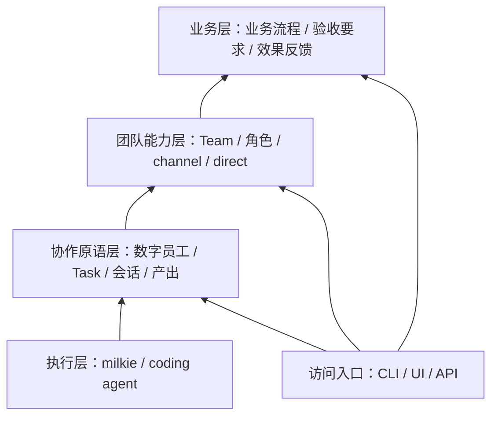

# Atelier 概要设计

状态：提案。本文为项目级概要设计，不是详细设计或实现计划。

## 1. 背景

Atelier（工坊）面向人和数字员工共同工作的场景。起点是当前围绕 Buzz 接入 coding agent 的方式：消息和团队界面由上游产品提供，本机运行由 buzz-team 管理，用户难以直接调整完整的协作机制和工作体验。

Atelier 希望拥有独立于聊天界面及执行器的工作对象，使团队能持续承担工作，人能够设定目标、观察进度、介入关键决定并验收结果。当前尚未建立关联 Issue；本文记录新项目方向，后续具体范围通过 Issue 定义验收。

《AI Native 研发范式实践手册》1.1「案例一：AIDC 数字投手智能营销助手」描述了从超级个体、数字员工到云上 Scrum 的演进：数字员工出现后，仍存在岗位孤立、人负责调度、质量标准不统一等问题。该案例启发 Atelier 将重点放在交接与交付闭环，而非仅提供更多 agent 会话。

## 2. 目标与非目标

### 目标

- 数字员工拥有独立于执行器和单次执行的持续身份与工作关系。
- Task 成为可追踪、可交接、可检验的工作对象；执行结束不自动意味着任务完成。
- Team 能组织成员承担任务，通过明确规则完成委派、交接、检验与人工介入。
- CLI、UI 和 API 共用产品能力与工作状态，避免各自形成一套协作逻辑。
- 接入不同执行器时保留任务与团队关系，并明确能力差异。

### 非目标

- 第一版不追求全面替换 Buzz，不复制完整即时通信产品。
- 不自行训练模型，不重写 coding agent，不把 milkie 改造成 Office 产品。
- 不承诺任意执行器之间无损迁移会话或恢复状态。
- 不追求无人化组织，不让数字员工自行降低契约要求来结束工作。
- 不提前构建万能流程语言、跨机器调度或多团队共同负责机制。
- 不把测试通过等同于形式化证明，不把任务验收等同于业务效果已达成。

## 3. 分层与责任

| 层 | 核心对象与能力 | 责任边界 |
|---|---|---|
| 执行层 | 执行器、执行配置、单次执行、能力声明、执行事件 | 基于 milkie 或 coding agent 执行工作；不定义团队组织或掌握最终验收权。 |
| 协作原语层 | 参与者、数字员工、Task、任务契约、会话、消息、产出、证据 | 定义持续身份和工作关系，维护任务生命周期，提供交接与检验的通用机制。 |
| 团队能力层 | Team、团队成员关系、角色、权限、channel、direct | 组织工作，确定响应、分配、委派、检验安排和升级给人的规则。 |
| 业务层 | 具体业务对象、职责、流程、验收要求、业务闭环 | 定义要做什么、怎样算完成，以及业务反馈如何形成后续任务。 |

CLI、UI、API 是访问入口，可提供通用能力或业务能力。持久化、身份认证、权限执行、可观察性和版本关联是贯穿各层的基础机制，不另造业务概念。

milkie 是底层 agent runtime。milkie 内的 agent 定义属于执行机制；Atelier 的数字员工属于持续协作主体，两者不必一对一。不同 coding agent 可以作为执行器接入，不要求所有执行经过 milkie；能否复用其记录和恢复机制需单独验证。

## 4. 核心关系

### 数字员工与 Team

数字员工具有持续身份、职责、工作记录和执行配置。Team 通过团队成员关系赋予其团队内角色、权限和响应规则；同一数字员工可以具有不同团队关系。

长期知识和工作记录需要有可见范围与访问边界，不意味着某个团队的私有上下文可自动流入另一个团队。换执行器可以保留身份和任务关联，但上下文迁移必须按实际能力处理。

### Task 与 Team

Task 在协作原语层首次出现，可以不归属 Team，例如个人交给一个数字员工的工作。第一版一个 Task 最多归属一个承担最终交付责任的 Team，参与者按任务承担负责人、执行者、检验者或验收者等职责。

跨团队协作暂以委派子任务表达；父任务保留最终责任。团队角色不直接等于每项任务的职责，channel 成员也不直接等于任务参与者。Task 可以收紧 Team 的默认约束；放宽权限必须经过有权主体授权，不能覆盖系统的硬性限制。

### Task 与执行、会话

一个 Task 可以关联多次执行、多个会话和多个产出。会话承载交流，Task 承载工作契约；消息可以形成任务，但不是每条消息都触发执行。

channel/direct 定义团队中的交流入口；单聊、群聊是用户看到的交流形态，不构成新的执行模型。会话关闭、执行结束或界面重启都不应自动删除任务关系。

## 5. Task 的任务契约

| 内容 | 含义 |
|---|---|
| 目标 | 需要达成的可观察结果。 |
| Law | 结果或系统必须满足的性质；按需填写，并标明表达和保证方式。 |
| 检验方式 | 通过测试、工具、独立检查或人工判断检验要求的方式。 |
| Guardrail | 执行允许范围、资源预算、风险限制和停止条件。 |
| 输入与前置条件 | 开始或继续工作所需的资料、权限及依赖。 |
| 交付与交接要求 | 预期产出、可供下一参与者使用的信息及后续职责。 |
| 契约版本 | 标识本次工作的有效要求，支持变更与重新检验。 |

目标必填，Law 与 Guardrail 按需明确；至少有一种检验方式，允许人工检验与验收。具体字段和状态契约留待详细设计确定。

执行者可以提交产出、证据及契约修改建议；是否改变要求由有权主体决定。契约或产出变更后，既有检验是否仍有效必须明确判断，不能沿用不匹配版本的通过结果。

Guardrail 在任务契约中声明，由实际控制对应操作的机制落实。例如目录限制由权限机制执行，预算限制由执行管理执行；仅写进 prompt 不构成可靠约束。未获得所需权限或缺少必要控制能力时，暂停并暴露原因。

## 6. 思路与折衷

- **选择任务契约作为工作基础。** 获得明确的状态、交接和验收边界；代价是需要维护任务而不只是聊天。保留自由讨论，避免每条消息都被迫结构化。放弃仅从聊天内容推断所有工作状态。
- **选择数字员工与执行器分离。** 保留长期身份与职责，允许执行机制演进；代价是要管理执行配置和能力差异。放弃将一个进程或一个会话直接等同于一名员工。
- **选择统一契约加能力声明。** 上层复用启动、输入、中断和结果等公共机制，对恢复等差异做显式处理。放弃用统一方法名掩盖不同执行器的行为差异。
- **选择工程机制维护确定性边界。** 身份、权限、状态变更和验收权限由系统执行；数字员工在授权范围内分析、生成和推进工作。放弃让模型自行维护所有事实状态。
- **选择明确依赖与交接的并行。** 独立任务可并发，共享修改需明确归属，部分失败需有可观察结果。放弃以全员响应群消息替代调度。
- **选择先同一项目内分层。** 验证边界后再考虑拆包或服务。放弃预先构建万能流程系统及分布式平台。

Bend 2 的启发在于将工作要求与实现、检验分离，以及明确资源所有权和外部操作边界。当前不选择它作为主要实现语言，不将其均衡 fork/join 的计算调度直接套用到耗时不定、具有外部影响的 agent 工作。

## 7. 主路径与关键状态

首个场景：人提出一个代码修改目标，一名数字员工执行，另一名数字员工独立检验，人验收。系统依据明确规则推进交接，无需人逐条转发。

1. 人创建 Task，明确目标、交付要求、检验方式及执行约束，并选择参与者或 Team。
2. Task 获得负责人，缺失输入或权限时显示等待原因；条件满足后开始执行。
3. 执行过程展示当前参与者、进展和需要人决定的问题；人可补充要求或中断。
4. 执行者提交产出和证据，检验者按当前契约与产出版本检验。
5. 检验通过后等待有权主体验收；不通过则保留问题并继续工作。验收后 Task 显示已接受的产出与证据。

关键状态是可判定的用户结果，具体状态机归详细设计：

- **空状态：** 没有任务时可辨认当前无工作，并能创建 Task。
- **等待状态：** 能看见缺少的输入、权限或决定，以及谁能解除等待。
- **执行状态：** 能看见当前执行者和活动；执行信息未知时不能伪装为正常推进。
- **中断或失败：** 能看见原因、已完成产出和后续选择；不自动宣称可恢复，也不盲目重试外部操作。
- **待验收：** 能看见当前契约、产出与检验结论；检验通过不自动成为验收通过。
- **成功状态：** 明确显示任务已验收及对应产出、证据和验收者。

第一版不做复杂组织管理后台、自由编排画布、完整即时通信或业务专用仪表盘。概要仅定义上述可见结果，布局、信息架构和完整交互状态留待详细设计。

## 8. 边界与风险

- 执行器切换不承诺原生会话无损恢复；恢复能力缺失时显式暴露限制。
- CLI 与 UI 共用工作状态；关闭入口不隐式取消后台工作，运行责任需要详细设计明确。
- 重启与重试不得静默重复有外部影响的操作；执行层与协作层需有一致的事件和身份关联。
- 数字员工的自报完成不是验收依据；形式化证明仅保证被形式化并实际证明的性质。
- 业务层保留效果反馈：任务交付不证明业务价值，反馈可以产生新的 Task，但高风险发布仍需要相应授权。
- 团队自治是逐步获得的能力，不将不明确目标、冲突或异常隐藏在人类持续兜底中。

## 9. 测试意图与首阶段验收方向

以下 S1–S4 是后续 Issue 的验收方向，不代表已有测试或已通过验收。

| 编号 | 可判定结果 | 测试层级与意图 |
|---|---|---|
| S1 | 一项代码修改从创建到执行、独立检验、人工验收形成完整记录，无需人逐条转发交接消息。 | E2E：走通主路径，确认产出、检验、验收相互关联。 |
| S2 | 中断或入口重启后 Task 仍存在，原因和产出可见；支持恢复时可继续，不支持时明确提示。 | E2E：中途介入和重启；Integration：执行能力声明与状态恢复边界。 |
| S3 | 契约或产出改变后，不匹配版本的检验结果不能用于接受当前交付。 | E2E：改变要求或产出后尝试验收；Unit：版本有效性与状态变更规则。 |
| S4 | 未授权操作被阻止或暂停，无权主体不能擅自降低要求或验收。 | E2E：尝试越界操作；Integration：权限控制；Unit：契约修改与验收权限判断。 |

执行器选型无关另需 Integration 验证至少两种执行机制的公共行为及能力差异；未验证前不宣称产品支持。

## 10. 是否需要详细设计与开放问题

需要详细设计，原因是任务状态、执行恢复、权限、版本关联和跨入口一致性形成多个契约边界。待具体 Issue 建立后，详细设计仅落在 `docs/design/{issue-no}-{slug}.md`，本文保留方向与链接，不重复详细正文。

开放问题：

- 首阶段采用哪些执行器，milkie 可直接复用哪些能力，哪些需要独立适配？
- 数字员工的长期知识、跨团队上下文和工作记录如何隔离与交接？
- Task 与子任务的责任、取消、失败传播和检验汇合怎样定义？
- 任务认领采用明确分配、规则认领还是有限自主判断，冲突如何处理？
- 在单机环境中由哪个服务管理运行生命周期，CLI/UI 如何连接？
- Law 的表达、检验方式和保证强度如何展示，业务反馈如何转化为后续 Task？

## 11. 关联

- [名词表](glossary.md)
- [项目说明](../README.md)
- [milkie](https://github.com/xforce-io/milkie)：底层 agent runtime 候选基础。
- [buzz-team](https://github.com/xforce-io/buzz-team)：现有本机运行管理模块，供比较和经验参考。
- 《AI Native 研发范式实践手册》1.1「案例一：AIDC 数字投手智能营销助手」，正文第 1–5 页：来自用户提供材料，未复制分发原文件。
- [Bend 2 官方指南](https://github.com/bendlang/bend/blob/main/guide/GUIDE.md)：规则与证明、资源所有权及 IO 边界的思想参考，不作为实现依赖。
