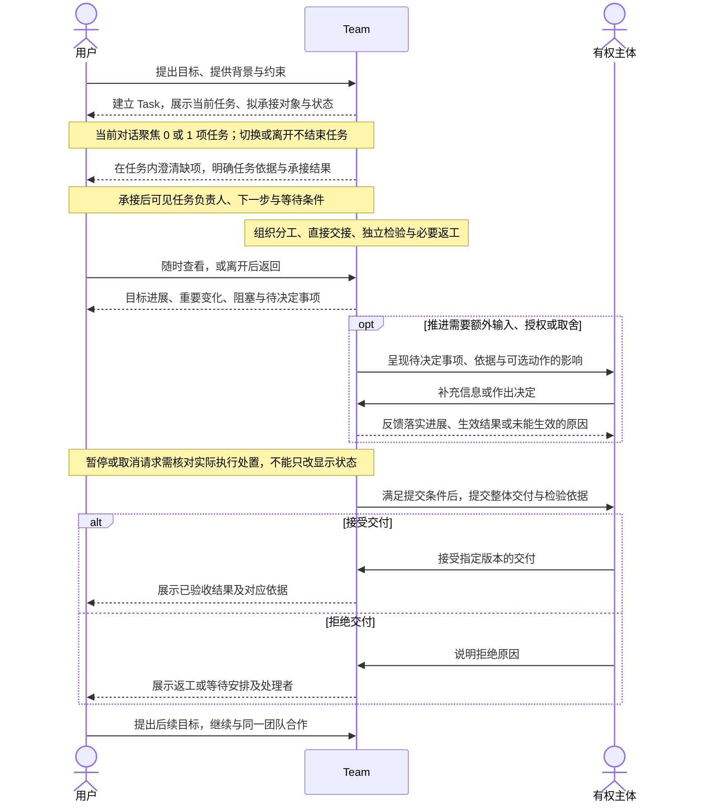
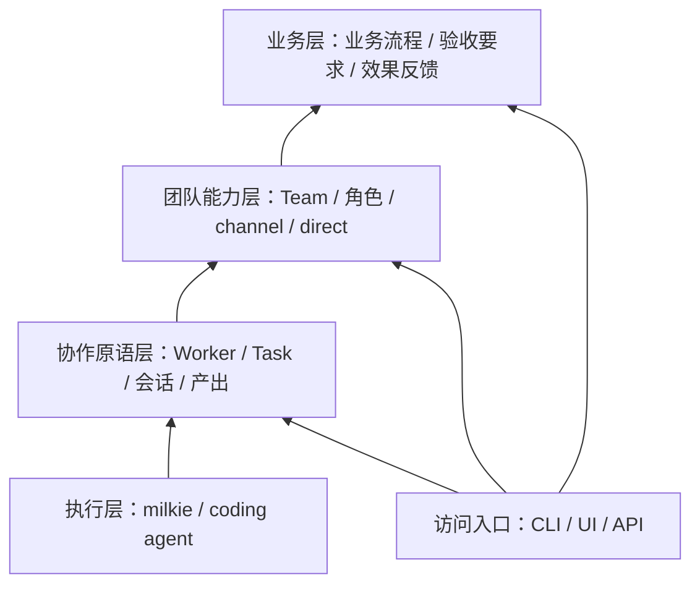

# Atelier 产品方向与研究背景

状态：提案，修订版 0.12（2026-09-27）。本文保留项目方向、研究背景与跨阶段产品假设，不是第三层设计；具体 Issue 采用 L1 产品设计与 L2 技术设计。文中目标体验不代表 Issue #1 一次交付全部能力，首项范围与逐项验收见 [L1 v0.4](design/1-first-team-delivery/product.md)。

## 1. 背景

Atelier（工坊）出发于两个相互关联的基础问题：**硅基—碳基组织应如何运转，以及智能体正在怎样改变任务的完成与能力的改进方式。** 前者关心人和数字员工如何形成持续的组织关系，后者关心软件获得运行时判断与持续改进能力后，工作如何被组织、检验和约束。Atelier 希望在具体工作中探索这两种变化交汇处的机制。

### 1.1 硅基—碳基组织：共同参与工作与责任关系

当数字员工能够持续承担工作、参与分工并在授权范围内作出决定时，组织就需要明确其成员身份、职责、权限与协作关系。人可以提出目标、执行工作、检验结果或组织团队；数字员工也可以承担其中的部分职责。双方能否配合，取决于实际能力、任务性质与授权，不能只由“人”或“数字员工”的类型决定。共同的协作模型需要保留双方在执行方式、可用性和责任后果上的差异。

已有研究开始触及这种变化。2025 年《The Cybernetic Teammate》在宝洁开展了涉及 776 名专业人员的随机实验：在所研究的产品创新任务中，使用 AI 的个人达到未使用 AI 的团队的表现，显示 AI 可能改变知识组合与分工方式；该实验尚未验证自主数字员工团队的长期运作。[研究原文](https://www.nber.org/papers/w33641) 微软 2026 年 Work Trend Index 则从企业调查与实践出发，指出个人使用 AI 的能力与组织吸收这些能力的机制可能错位，工作分配、管理与评价方式也需要调整；这类观察提供方向，不构成对某种组织结构的因果证明。[报告原文](https://www.microsoft.com/en-us/worklab/work-trend-index/agents-human-agency-and-the-opportunity-for-every-organization)

对 Atelier 而言，组织的关键问题是：谁承接共同目标，谁有权委派，谁协调冲突，成员何时应当报告阻塞或拒绝不合适的工作，以及成员变化后由谁继续承担责任。2026 年《Intelligent AI Delegation》将委派视为包含授权、责任、问责、能力匹配与持续反馈的一组决定，同时讨论人向 AI、AI 向 AI 和 AI 向人的委派。这为共同的 Worker 模型提供了参考，也提醒我们不能把委派简化为发送消息或启动执行。[论文原文](https://arxiv.org/abs/2602.11865)

持续组织还需要保持对目标的共同理解。完成若干 Task，并不自动意味着团队目标已经达成。微软研究院 2026 年关于目标表达的设计研究强调，在协作中澄清和对齐目标，并将目标与产出区分。[研究原文](https://www.microsoft.com/en-us/research/publication/goals-as-first-class-abstractions-in-human-ai-collaboration/) 本设计据此关注 Team 如何围绕目标组织任务、解释结果并形成后续工作；是否需要独立的目标对象，仍应由具体场景决定。

### 1.2 任务范式变化：更多判断发生在运行时

传统软件通常由开发者预先编写处理规则与主要执行路径，程序在这些规则下反复运行。智能体能够根据目标、上下文和反馈，在运行时解释问题、选择工具、形成步骤并调整行动。传统软件也可以搜索、学习和适应，因此二者并无绝对分界；这里关注的变化，是更多关于“下一步怎样做”的判断进入了运行时，并能作用于较开放的工作。

这种能力使软件可以处理难以预先穷举步骤的任务，同时增加了路径、成本和结果质量的不确定性。系统因而需要明确表达目标与约束，区分行动是否获准、执行是否结束、结果是否满足要求，以及交付是否被接受。任务状态和责任关系还需跨越单次执行持续存在，使等待、返工、要求变更与成员交接不依赖某个人重新解释整段会话。

对 Atelier 的设计推论是：任务契约提供行动依据，Guardrail 约束行为与资源，产出和证据支持检验，有权主体作出验收决定。智能体在这些边界内拥有选择方法的空间，其自报完成不能代替组织对结果的判断。

### 1.3 RSI：工作方法与改进机制也成为变化的对象

近期 RSI 研究使上述变化进一步延伸：系统不仅可以调整当前任务的解法，还可能将反馈固化为记忆、工具、执行器代码或搜索策略，并将这些变化用于后续工作。需要区分三个层次：任务内适应解决当前问题；跨任务改进将变化持久保留并检验后续收益；RSI 进一步让产生、评估或选择后续改进的机制本身成为改进对象。不同研究对 RSI 的范围仍有差异，本文采用名词表中的工作定义，不将一次反思、反复重试或一次代码修改直接认定为递归改进。

2026 年 9 月更新的《The Last AI Built by Humans》从自主性角度提出研究路线，强调后续系统继承了什么变化、哪些改进决定仍由人或外部机制控制，以及改进能否在明确资源条件下持续有效。这是一种研究框架，尚不能视为统一标准。[论文原文](https://arxiv.org/abs/2609.11873)

9 月 22 日发布的 AIDE² 提供了具体实验：作者报告系统在一次 8 天运行中取得 7 次被接受的改进，并在未参与选择的任务上观察到收益；但其进一步实验尚不能证明改进后的系统比原系统更擅长驱动自我改进。该结果支持有限条件下的持续改进，不能据此推断递归加速已成立。[论文原文](https://arxiv.org/html/2609.26457v1) Anthropic 的《When AI builds itself》也明确区分了 AI 加速研发与完全自主构建后继模型，表示后者尚未实现且并非必然。[机构原文](https://www.anthropic.com/institute/recursive-self-improvement)

能力边界同样重要。2026 年的一项开放式 AI 研究评估发现，智能体在两个案例中完成了工程工作，却未能实质推进核心研究问题，暴露出研究判断、资源意识和摆脱无效路径等不足；案例数量有限，但提示工程执行能力不能直接等同于完整研究能力。[论文原文](https://arxiv.org/abs/2607.27191)

因此，Atelier 应容纳成员能力与工作方法的变化，同时要求“变得更好”具有可检验依据。改进需要说明变更内容、适用范围、比较条件及后续效果；一次交付成功不足以证明新方法值得推广。系统还必须区分改进工作方法的权限，与修改任务要求、评价依据及授权边界的权限，避免通过改变判断标准制造进步。

### 1.4 Atelier 的研究命题与当前起点

基于上述思考，Atelier 的研究命题是：**人和数字员工如何组成持续工作的组织，在明确目标与授权下共同交付，并通过可验证的反馈持续改进成员能力与协作方式。** 组织关系为运行时的自主判断提供责任、协调与边界，工作结果则为后续改进提供证据。

这一命题包含相互关联的两种过程：交付过程围绕目标展开委派、执行、交接、检验和验收；组织学习则将交付中的经验与问题转化为可比较、可采用、可撤回的能力或协作方式变化。保存历史资料是基础，能否使后续工作取得更好的结果仍需验证。组织学习也不自动等于 RSI，只有改进机制自身进入可验证的持续改进过程时，才进一步触及递归改进问题。

当前设计先验证单 Team 的交付过程：每个 Team 必须有且只有一名团队负责人，可以由人或数字员工担任，成员在职责与授权范围内直接协作。唯一团队负责人是当前用于明确承接与协调责任的结构假设，不是对未来组织形态的普遍结论；当前不考虑 P2P 结构。首个场景选择代码修改，通过承接、执行、独立检验、返工和人工验收，检验基本组织关系能否成立。

组织学习与 RSI 为长期设计提供问题与边界，不代表首阶段已经包含自主修改执行器、演进评价机制或训练后继模型的能力。相关能力需要另行确定范围和验收。本文研究依据截至 2026 年 9 月 26 日，区分公开实验、机构观察与 Atelier 自身的设计推论；首项实现范围由 [Issue #1](https://github.com/xforce-io/atelier/issues/1) 定义，后续能力另行确定范围。

## 2. 产品核心价值与首个用户

**产品核心价值：让人和数字员工围绕明确目标组成持续学习的组织，将原本难以实现的目标变为现实，并把实践所得转化为组织可持续增长的能力。**

**系统原则：组织在明确授权和资源约束下行动，依据真实结果判断交付与学习是否有效。**

这包含两个需要验证的主张：组织能够创造单独使用工具或固定流程难以获得的能力；实践形成的改进能够被后续工作继承，使团队在新任务上达成更高要求的目标或更可靠地交付。减少协调和重复错误是早期证据，能力能否突破原有边界才是长期判断依据。组织学习不以实现 RSI 为前提，也不能仅凭保存历史、生成反思或更换更强模型来宣称成立。

### 首个用户与目标体验

首个用户假设是：已经使用 coding agent 持续交付代码，能够表达目标与判断结果，但仍亲自维持任务分配、上下文转交、检验安排和异常追踪的人。其角色可以是个人开发者或小型研发团队中的组织者，首阶段以这类共同工作方式界定用户，不同时覆盖所有业务岗位。个人用户可以组织 Team，也可以直接委派给 Worker；用户人数不决定任务的承接方式。该假设需要通过实际使用验证。

目标体验是：**把一项明确目标交给 Team 后，用户可以离开；回来时能知道目标推进到哪里、什么被阻塞、哪些决定需要自己处理，以及依据什么接受交付。** 用户无需逐条转发成员消息，也无需持续检查执行日志来维持工作推进。这里的“可以离开”指已获授权且条件满足的工作能够继续；遇到必须由用户决定的事项，系统明确等待并通知，不承诺无人介入或所有任务都能自动完成。

用户交出的是在既定目标与授权下的日常协调：分工落实、直接交接、检验安排、异常定位及按规则升级。目标与取舍仍需由相应有权主体决定；首个场景的最终验收由人完成。团队负责人可以由数字员工担任，但不因承担协调职责而自动获得改变交付范围、追加资源或验收的权限。

Team 的持续价值体现在连续工作中：围绕可理解的目标与承接范围，复用成员关系、协作规则和获准访问的历史产出，并在多项任务发生冲突时说明取舍。任务结束后这些关系仍然存在；新任务仍须形成自己的契约与检验、验收记录。首阶段通过连续承接任务和两项任务竞争同一执行成员的场景验证这一价值，不预先增加独立目标管理系统或智能调度算法。

首阶段成功既要求交付闭环成立，也要求用户为维持协作付出的劳动减少；这为核心价值提供初步证据，尚不足以证明组织已能持续扩大能力。第 11 节将功能验收与产品价值验证分别描述；不会仅以消息量、执行次数或成员数量证明产品有效。

## 3. 目标与非目标

### 目标

- Human Worker 与 Agent Worker 共用 Worker 协作模型；数字员工拥有独立于执行器和单次执行的持续身份与工作关系。
- Task 是可交给 Worker 或 Team 的持续工作对象；当前对话最多聚焦一项任务，任务可以跨会话与单次执行推进，按明确条件结束。
- 用户能够离开并返回工作，通过目标进展、待决定事项和交付依据理解状态，无需持续承担消息转交与异常追踪。
- Team 在唯一团队负责人的组织下持续承担工作，成员按职责直接协作，完成委派、交接、检验与人工介入。
- CLI、UI 和 API 共用产品能力与工作状态，避免各自形成一套协作逻辑。
- 接入不同执行器时保留任务与团队关系，并明确能力差异。
- 以 Rust 构建产品核心与 GPUI 桌面界面，利用静态检查支持 AI 编写与长期维护；milkie 接入保留 TypeScript，明确跨语言边界。

### 非目标

- 第一版不追求全面替换 Buzz，不复制完整即时通信产品。
- 不自行训练模型，不重写 coding agent，不把 milkie 改造成 Office 产品。
- 不承诺任意执行器之间无损迁移会话或恢复状态。
- 不追求无人化组织，不让数字员工自行降低契约要求来结束工作。
- 不提前构建万能流程语言、跨机器调度或多团队共同负责机制，也不以穷举消息意图和内部步骤来定义任务状态。
- 当前不考虑无团队负责人、多个共同负责人或 P2P 式团队结构；首阶段不要求自动拆分任务或自主认领。
- 不把测试通过等同于形式化证明，不把任务验收等同于业务效果已达成。

## 4. 产品交互总览（Product Interaction Overview）

用户与 Atelier 的协作围绕一个持续存在的 Team 展开：提出目标，与团队澄清工作约定，交出日常协调，在需要时作出决定，并依据检验结果接受交付。用户可以离开，也可以随时回来了解工作；一次任务结束后，仍可与同一团队继续合作。以下描述首阶段单 Team 场景的目标体验，不代表已有实现。Task 也可以直接交给 Worker；此时由该成员承接并承担任务负责人职责，仍保留独立检验与授权边界。

图中的 Team 表示用户面对的持续协作关系，具体工作由承担相应职责的 Worker 完成；不要求所有交流都经团队负责人转发。有权主体按每项操作的授权分别确定，作出取舍与最终验收的可以是不同 Worker，也可以是用户本人。提出目标不自动取得授权或验收权；首个场景的最终验收由人完成。各参与者只能查看其有权访问的信息。图中展示正常交付及验收拒绝分支；未承接、等待和取消等结果按下文说明处理，不假定所有任务都会进入验收。

### 交出目标：从交流到明确承接

用户选择已有 Team 后，可以通过会话讨论目标、提供资料，也可以直接提交已明确的 Task。用户或已获授权的团队负责人开始处理一项目标时，建立 Task，并明确展示当前工作、委派对象及承接状态。模型可以理解对话、整理目标并在授权范围内发起建立任务，不要求用户先填写表单或逐步确认；进入结果须可见、可纠正，不以逐句准确分类自然语言作为产品成立的前提。普通讨论可以保持不聚焦任何 Task。任务可以先记录目标、必要背景引用及待澄清项，再在任务内明确交付要求、检验方式和执行约束，不必等全部要求齐备才建立。

回执让用户看见任务入口、当前状态及处理承接的主体。团队负责人判断是否承接，为承接的任务指定任务负责人；等待或拒绝时说明原因与处理归属。建立任务、团队承接和开始执行可区分，条件齐全时可连续完成；承接后缺少执行条件仍明确等待。

当前对话最多聚焦一个 Task，进入后保持该工作上下文，直到明确切换或离开；后续交流由模型结合当前目标理解，不逐句重新决定任务归属。可以引用其他任务，但引用不自动切换；模型认为出现独立目标时可以提出另开工作，不静默改变当前任务。切换或返回 Team 对话不结束原任务，原任务可以继续执行或等待。改变契约、授权或任务状态仍需相应有权主体决定并经系统校验。尚无 Team 时需先创建并明确团队负责人；没有任务时，应能辨认当前无工作并发起新任务。

### 工作推进：可以离开，也能理解变化

承接后，任务负责人组织分工、协调依赖与汇合交付，成员按职责直接交接，检验者独立检验，必要时返工。用户无需逐条转发消息来维持协作。已获授权且条件满足的工作可以继续；需要决定的部分明确等待，不以用户离开为由默认扩大权限。

用户随时查看或离开后返回，应先看到目标推进到哪里、上次查看以来的重要变化、当前产出、阻塞及下一步，再按需进入相关会话、任务依据和执行记录。正在执行、等待、执行信息未知和已验收须可区分；没有需要本人处理的事项，不等于所有工作都在正常推进。

### 必要介入：知道为什么找我，以及决定是否落实

团队在已有职责与授权内处理日常协调；需要补充输入、额外授权或超出权限的取舍时，向相应有权主体提出待决定事项。事项应说明为什么需要此人、对应的任务依据、可选动作及其影响。两项任务竞争同一成员时，也应说明受影响的工作和已有承诺，避免让用户自行从消息中拼出冲突。

用户在权限内回应后，应能看到请求已收到、正在落实、已经生效，或未能生效及原因。暂停请求不等于执行已停止，旧契约或旧产出上的决定也不能直接用于新版本。用户主动提出要求变更或中断时，同样需要得到明确的处理结果；无人有权处理或团队负责人不可用时，应暴露等待原因，不能假定已经转交。

### 接受交付：有依据地结束一次任务，继续合作

任务负责人汇合整体交付并组织对应检验，满足提交条件后交由有权验收者决定。验收者应能查看当前任务契约、指定版本的产出、独立检验结论、证据及尚存限制。执行结束、部分产出完成或检验通过，都不自动成为整体任务已验收。

接受后，任务保留对应产出、证据及验收记录；拒绝后，保留原因并明确返工或等待的处理者。检验失败后的返工由团队组织，新产出须重新检验，达到停止条件时明确等待处理。

任务结束后，Team、成员关系及可访问的工作记录仍然存在。用户可以继续交流并提出新的相关目标，复用已有背景；新任务仍需独立的契约、检验和验收依据。交付反馈也可以形成后续 Task；将经验转化为经验证、获准采用的工作方法改进，是组织学习的后续探索方向，不表示当前已具有 RSI 能力。

CLI、UI、API 共用上述工作状态与权限边界。具体用户路径、失败分支及可判定结果见第 9 节和第 11 节，布局与完整交互契约由对应 L1 产品设计确定。个人任务可不归属 Team，按明确的任务职责完成基本交付过程。

## 5. 分层与责任

| 层 | 核心对象与能力 | 责任边界 |
|---|---|---|
| 执行层 | Executor/执行器、Execution Configuration/执行配置、Run/单次执行、Capability Declaration/能力声明、Execution Event/执行事件 | 基于 milkie 或 coding agent 执行工作；不定义团队组织或掌握最终验收权。 |
| 协作原语层 | Worker/工作成员、Task/任务、Task Contract/任务契约、Conversation/会话、Artifact/产出、Verification Record/检验记录、Acceptance Record/验收记录 | 定义人和数字员工的持续身份与工作关系，维护任务生命周期及最小推进规则，提供交接、等待、检验与验收的通用机制。 |
| 团队能力层 | Team/团队、Team Membership/团队成员关系、角色、团队内授权、channel/频道、direct/直接会话入口 | 维护唯一团队负责人，由其组织 Worker 完成工作，提供团队默认的分配、响应、检验安排和升级规则；形成交付闭环。 |
| 业务层 | 具体业务对象、职责、流程、验收要求、Business Feedback Loop/业务闭环 | 定义要做什么、怎样算完成，以及业务反馈如何形成后续任务。 |

CLI、UI、API 是访问入口，可提供通用能力或业务能力。持久化、身份认证、权限执行、可观察性和版本关联是贯穿各层的基础机制，不另造业务概念。

milkie 是底层 agent runtime。milkie 内的 agent 定义属于执行机制；Atelier 的数字员工属于持续协作主体，两者不必一对一。不同 coding agent 可以作为执行器接入，不要求所有执行经过 milkie；能否复用其记录和恢复机制需单独验证。

## 6. 核心关系

概念模型词条统一按“英文/中文”标注，以[名词表](glossary.md)为准；正文可使用其中一种规范表达。英文名用于概念识别，不预先规定代码类型或协议字段。

### Worker/工作成员与 Team/团队

Worker 是共同协作抽象，包含 Human Worker 和 Agent Worker。两者都具有持续身份、工作记录、团队成员关系和任务职责关系，都能接收工作、交接、检验和验收；Agent Worker 另外关联执行配置，产品中称数字员工。

Human Worker 通过通知、等待与人工提交推进工作；Agent Worker 通过执行器推进工作。共同流程根据实际能力选择执行方式，不把所有 Worker 强制映射成模型或进程。人可以承担普通执行职责，数字员工也可以在明确授权范围内承担检验或验收职责；是否有权修改契约、批准或验收由权限决定，不仅由 Worker 类型决定。

职责分离是系统规则而非协作习惯：同一 Worker 不能独立检验自己提交的产出；数字员工不能验收自己参与执行的交付；任何 Worker 不能为自己授予或扩大权限。任务契约可以要求更强的检验独立性，例如检验者使用不同的执行配置或不共享执行者的上下文。

Team 通过团队成员关系赋予 Worker 团队内角色、权限和响应规则；同一 Worker 可以具有不同团队关系。授权人和实际执行者分别留痕，批准某项操作不等于批准人亲自执行。

每个 Team 必须有且只有一名团队负责人，由该 Team 的一个 Worker 担任，可以是 Human Worker 或 Agent Worker。创建 Team 时必须明确团队负责人；该职责属于团队成员关系，不新增一种 Worker 类型。团队负责人承接团队目标、指定任务负责人、协调跨任务冲突并处理升级事项，对团队层面的交付负责。

团队负责人不自动获得修改契约、批准操作或验收的权限，也不必亲自分配每项子任务或批准每次交接。成员在已明确的职责与权限内直接协作；任务内问题先由任务负责人处理，无法解决或涉及跨任务冲突时再升级给团队负责人。同一 Worker 兼任两种负责人时直接处理，不制造重复升级。

团队负责人暂时不可用时，成员可以继续已获授权且条件仍满足的工作，需要其决定的事项明确等待，不隐式产生第二名团队负责人。有权主体可以显式更换团队负责人：交接生效前仍由原成员担任，生效后由新成员担任，始终恰有一名团队负责人；未决事项随职责移交，原成员不再以该身份作出决定。原成员不可用不能成为有权主体更换团队负责人的永久障碍，具体接收与生效契约留待对应 L1/L2 设计。

长期知识和工作记录需要有可见范围与访问边界，不意味着某个团队的私有上下文可自动流入另一个团队。换执行器可以保留身份和任务关联，但上下文迁移必须按实际能力处理。

### Task/任务与 Worker/工作成员、Team/团队

Task 是有目标、约束和结束条件的持续工作对象，可委派给一个 Worker（人或数字员工），也可以交给一个 Team。每项 Task 同一时刻只有一个明确的承接对象，不同时委派给多个 Worker 或 Team 共同承担最终责任；尚待承接时记录拟委派对象和处理归属。多人可以参与同一任务，需要独立委派并汇合结果的工作通过子任务表达，父任务保留整体交付责任。

团队负责人为 Team 承接的每项任务指定唯一任务负责人，也可以自行担任；承接对象是 Team，任务负责人是具体 Worker，两者不构成重复委派。任务负责人组织分工、协调依赖并汇合产出；部分子任务完成不代表整体交付完成。首阶段采用明确分配与明确交接，系统落实已经确定的规则，不依赖自主认领来形成闭环。

直接委派给 Worker 的 Task 由该成员承担任务负责人职责，仍须明确独立检验安排和需要决定时的处理者，不因个人承接而以自检代替独立检验或绕过验收；没有团队负责人时不套用团队升级规则。Team 为承接的任务提供默认安排和跨任务协调。一个 Worker 或 Team 可以承担多个未结束 Task，是否并行执行取决于能力、资源和冲突约束，不由当前对话选中了哪项任务决定。

跨团队协作暂以委派子任务表达；父任务保留最终责任，其具体流程不进入首阶段单 Team 验证范围。团队角色不直接等于每项任务的职责，channel 成员也不直接等于承担该任务的 Worker。Task 可以收紧 Team 的默认约束；放宽权限必须经过有权主体授权，不能覆盖系统的硬性限制。

### Task/任务与 Conversation/会话、Run/单次执行

以下几种关系分别表达不同事实，不合并为一个“当前任务状态”：

| 需要回答的问题 | 对应事实 | 数量与边界 |
|---|---|---|
| 这项工作交给谁？ | Task 的承接对象 | 已承接时为一个 Worker 或一个 Team。 |
| 谁组织这项工作的交付？ | Task Owner/任务负责人 | 已承接时为唯一 Worker；承接对象为 Team 时由团队负责人指定。 |
| 当前在谈哪项工作？ | Conversation 中当前交互的任务关联 | 0 或 1 个 Task；切换不改任务责任或生命周期。 |
| 哪些工作正在执行？ | Task 关联的 Run 与人工工作活动 | 可以有多项；并行受授权、资源和冲突约束，单次执行停止不自动结束 Task。 |

一个 Task 可以关联多次执行、多个会话和多个产出；同一会话也可以先后处理不同 Task。**当前对话同一时刻最多聚焦一个 Task，也可以不聚焦任何 Task。** 进入后，后续交流默认围绕该任务，资料补充、方法讨论、等待和返工在同一工作上下文内持续发生，不要求对每句话重新识别任务归属或预定义意图类别。引用其他任务不自动改变当前任务；进入、切换和离开须可见，选择错误时可以纠正。这里的“当前”指一次明确的交互上下文，不是整个 Team 或 Worker 的全局唯一任务；一个参与者的切换不应静默改变其他参与者的消息归属。共享会话、多入口的具体呈现与同步方式留待对应 L1/L2 设计。

离开当前任务或切换到另一项任务只改变交互上下文，不结束原任务，也不隐式暂停或取消执行。任务达到约定的完成条件，或有权主体明确取消、终止时才结束；完成条件包含契约要求的检验与验收，首个场景以人工验收为准。缺资料、等待批准或执行预算耗尽通常进入等待或暂停，不自动结束任务。完成、取消和因无法继续而终止保留不同结果与原因，模型自报完成不能代替完成条件的检查。

纠正误建或选错的任务不等于撤销已发生的工作：尚未执行时可以更正委派或取消；已有执行或外部影响时，须核对产出和执行状态，按变更、交接或终止规则处理，保留原始关联与纠正记录。不能仅切换界面、删除任务或改消息归属就声称影响已撤回。

channel/direct 定义团队中的交流入口；单聊、群聊是用户看到的交流形态，不构成新的执行模型。会话关闭、执行结束或界面重启都不应自动删除任务关系。

## 7. 一等公民与任务契约

### First-Class Entity/一等公民

一等公民具有独立身份、生命周期或持久记录，可以被引用、操作和检查，不仅存在于 prompt 或聊天文本中。核心对象不意味着第一版各自需要独立服务、页面或完整管理接口。

| 对象 | 独立存在的理由 | 所属层 |
|---|---|---|
| Worker/工作成员 | 人与数字员工共用协作身份，保持任务关系，不依附某次执行。 | 协作原语层 |
| Team/团队 | 持续组织工作并承担交付责任，任务结束后仍存在。 | 团队能力层 |
| Task/任务 | 维护工作责任、依赖和生命周期，不从消息或执行退出推断完成。 | 协作原语层 |
| Task Contract/任务契约 | 独立版本化要求，避免目标或约束变更覆盖历史。 | 协作原语层；业务层提供内容 |
| Conversation/会话 | 持续承载交流，可关联多个 Task；当前对话最多聚焦一个 Task，不等于执行器原生会话。 | 协作原语层；团队能力层定义 channel/direct |
| Artifact/产出 | 以版本关联交接、检验和验收，不局限于完成消息。 | 协作原语层 |
| Run/单次执行 | 保存实际执行器、输入关联、事件和结束原因。 | 执行层；协作原语层关联 Task 与 Worker |
| Verification Record/检验记录 | 关联检验主体、契约与产出版本、方式、证据和结论。 | 协作原语层 |
| Acceptance Record/验收记录 | 关联有权主体接受的交付及依据，独立于检验与执行结束。 | 协作原语层 |

团队成员关系、任务职责关系和交接关系必须显式保存，不能依赖模型记忆。交接关系需要可判定的接收状态；系统按规则通知、接收和推进后续工作，不能仅发送一条消息就宣称交接完成。

消息与证据需要可寻址、可追溯；消息归属于会话，提交时关联的 Task（如有）需明确保留，之后切换当前任务不重写历史消息归属。引用其他任务及其资料须符合访问权限。证据归属于提交它的产出或检验记录。证据需标明来源：由核心或检验者实际采集的证据，与执行者自报的证据分开记录；自报证据只能作为检验线索，不能单独构成检验通过的依据。目标、Law、检验方式和 Guardrail 先作为任务契约的结构化组成部分；独立复用与版本管理需求出现后，再考虑提升为独立对象。

### Task Contract/任务契约

| 内容 | 含义 |
|---|---|
| Goal/目标 | 需要达成的可观察结果。 |
| Law/结果性质 | 结果或系统必须满足的性质；按需填写，并标明表达和保证方式。 |
| Verification Method/检验方式 | 通过测试、工具、独立检查或人工判断检验要求的方式。 |
| Guardrail/执行约束 | 执行允许范围、资源预算、风险限制和停止条件。 |
| Inputs and Preconditions/输入与前置条件 | 开始或继续工作所需的资料、权限及依赖。 |
| Delivery and Handoff Requirements/交付与交接要求 | 预期产出、可供下一 Worker 使用的信息及后续职责。 |
| Contract Version/契约版本 | 标识本次工作的有效要求，支持变更与重新检验。 |

建立任务时需有可辨认的目标，其他缺项可在任务内澄清；开展所委派工作前明确适用的任务契约、所需授权及结束条件，至少有一种检验方式，并明确验收安排，Law 与 Guardrail 按需表达。澄清期间仍可在已有授权与资源约束内进行对话及必要分析，不能把“任务尚待承接”理解成模型完全不能运行，也不能借澄清之名执行尚未授权的工作。自动返工必须有停止条件；未显式配置时使用有限的默认策略，到达边界后暂停并显示原因和可处理的主体。具体限制数值、字段和状态契约留待对应 L1/L2 设计确定。

任务的结束条件与 Guardrail 中的停止条件不同：前者确定何时可以结束工作及其结果，成功结束须有对应的检验与验收；后者限定执行或自动返工何时必须停下来等待处理。预算耗尽、单次执行报错或成员说“完成”本身均不满足任务成功结束的条件。取消表示不再要求继续，终止表示无法继续而决定结束；两者保留原因和已有产出，执行仍可能活动时须显示处置未完成，不宣称安全停止。

执行者可以提交产出、证据及契约修改建议；是否改变要求由有权主体决定。契约或产出变更后，既有检验是否仍有效必须明确判断，不能沿用不匹配版本的通过结果。

验收只能基于对应当前契约与产出版本的检验通过结果。有权主体认为某项要求不再必要时，应修改契约形成新版本并重新判断检验有效性，不能绕过未通过的检验直接验收。验收者可以拒绝交付并说明原因，任务进入返工或等待，拒绝原因随任务保留。

代码产出必须对应可固定、可追溯的内容，检验记录绑定实际被检验的内容与契约版本；后续代码修改形成新产出版本，不能只保留一个指向可变工作目录的引用作为版本依据。具体快照与引用方式留待对应 L1/L2 设计。

Guardrail 在任务契约中声明，由实际控制对应操作的机制落实。例如目录限制由权限机制执行，预算限制由执行管理执行；仅写进 prompt 不构成可靠约束。未获得所需权限或缺少必要控制能力时，暂停并暴露原因。

## 8. 思路与折衷

- **选择持续任务上下文与少量明确边界。** 模型在既定目标下理解交流、选择方法和推进工作；系统维护委派、授权、有效契约与结束结果。代价是进入或切换判断仍可能需要纠正，因此必须可见并保留纠正依据。放弃逐句穷举意图、将每个内部步骤编码为任务状态，以及只凭聊天文字宣称状态已生效。
- **选择 Worker 统一协作、按能力执行。** 人和数字员工共享任务职责与交接机制，执行方式保留差异。放弃把 Human Worker 硬套成一个可启动的执行器。
- **选择唯一团队负责人组织、成员直接协作。** 明确承接与升级责任，允许任务负责人分担组织工作；代价是团队负责人不可用时部分决定会等待，需要显式交接机制。放弃 P2P 和多个共同负责人，不要求所有协作经过团队负责人。
- **选择数字员工与执行器分离。** 保留长期身份与职责，允许执行机制演进；代价是要管理执行配置和能力差异。放弃将一个进程或一个会话直接等同于一名员工。
- **选择统一契约加能力声明。** 上层复用启动、输入、中断和结果等公共机制，对恢复等差异做显式处理。放弃用统一方法名掩盖不同执行器的行为差异。
- **选择工程机制维护确定性边界。** 身份、权限、状态变更和验收权限由系统执行；数字员工在授权范围内分析、生成和推进工作。放弃让模型自行维护所有事实状态。
- **选择明确依赖与交接的并行。** 独立任务可并发，共享修改需明确归属，部分失败需有可观察结果。放弃以全员响应群消息替代调度。
- **选择先同一项目内分层。** 验证边界后再考虑拆包或服务。放弃预先构建万能流程系统及分布式平台。

Bend 2 的启发在于将工作要求与实现、检验分离，以及明确资源所有权和外部操作边界。当前不选择它作为主要实现语言，不将其均衡 fork/join 的计算调度直接套用到耗时不定、具有外部影响的 agent 工作。

### 语言选型与运行边界

首阶段选择 Rust 核心与 CLI、Atelier Skill，后续桌面方向为 GPUI；TypeScript 仅用于 milkie 接入，当前不改写 milkie。主要理由是 Atelier 要长期维护身份、工作状态、契约版本与授权边界，Rust 的类型和编译诊断有助于 AI 编写和修改这部分代码；不是基于当前已有性能瓶颈。

| 部分 | 语言方向 | 掌握的状态与责任 |
|---|---|---|
| Atelier 核心与 CLI | Rust | Worker、Team、Task、契约、权限、产出关联、检验和验收的事实状态，以及执行管理。 |
| milkie 接入 | TypeScript | agent runtime 内部上下文、执行事件与恢复信息；不得直接决定 Atelier 的任务验收。 |
| Atelier Skill | Skill 文档与操作参考 | 引导 coding agent 调用 CLI，解释核心返回的事实；不直接修改持久状态或代替人工验收。 |
| GPUI 桌面界面（后续） | Rust | 提供 Worker、Team 与 Task 的可见入口，展示和发起操作，读取核心状态，不拥有另一套任务状态机。 |

GPUI 保留为后续桌面产品入口，不把浏览器界面或 TypeScript UI 作为第一方默认方向。其官方文档将 GPUI 描述为 Rust UI 框架，并说明仍处于 1.0 前、版本之间可能有破坏性变化；因此实现须固定依赖版本，桌面视图与核心工作契约保持分离，具体平台支持逐项验证。[GPUI 官方说明](https://github.com/zed-industries/zed/tree/main/crates/gpui) 采用 GPUI 不等于已经实现页面：Worker 创建与配置、Team 组建及任务交付的操作路径必须在 L1 产品设计中完整表达，不能用配置文件字段或 CLI 命令清单替代。

首项采用 CLI 前台执行与持久任务，通过进程协议接入 milkie；Skill 读取 CLI 事实并在用户授权内编排，其他执行器后续接入。查询结束不取消工作；中断执行命令停止或核对 Run，但 Task 保留。终端或宿主消失后不承诺继续执行，自动恢复和后台推进另立范围。

协议需要表达版本、关联标识、能力声明、请求、事件、错误、中断和恢复结果；具体消息格式暂不确定。两端都必须校验外部输入，Rust 的静态保证不延伸到 JSON、TypeScript 或外部工具。执行器原生记录可以作为来源，Atelier 的协作状态由核心核对并保存，不直接复制出第二套 runtime 状态机。

主要代价是跨语言通信、版本兼容、打包和故障定位。放弃仅为语言统一而重写 milkie，也放弃初期嵌入 JavaScript 引擎或建立复杂插件 ABI。执行器运行在独立进程不自动构成权限隔离，Guardrail 仍须由对应机制落实。

### 面向 AI 编写的工程原则

- 用语义明确的标识类型、状态与结果区分工作、执行、检验和验收；避免全靠字符串或任意字段修改维护规则。
- 状态变更通过集中、可检查的操作推进；权限、契约与产出版本等动态条件仍在运行时校验。
- 第一方核心默认使用 safe Rust，必要的底层能力优先复用成熟库；编译通过不保证业务正确、无死锁或外部操作不会重复。
- 建立快速编译反馈、格式与 lint 检查、针对行为的测试及独立审查；不以关闭检查或删除断言作为修复方式。
- API 保持惯用、文档明确、示例可运行、改动可评审，避免为静态检查引入复杂类型技巧和多余抽象。

## 9. 关键 Stories、主路径与关键状态

### 产品路径与范围

Stories 按用户从第一次使用到持续合作的过程组织，描述目标体验，不表示能力已经实现。贯穿示例是：用户组建处理代码修改的 Team，提出“导出功能增加筛选”，交出日常协调，团队形成经独立检验的交付，由人验收。示例中的功能与问题用于让路径可判定，不限定产品只能处理此类任务。

主要路径为：**建立 Team（S1）→ 建立委托与明确承接（S2–S3）→ 分工及直接交接（S4–S5）→ 独立检验与返工（S9）→ 人工验收（S10）→ 持续合作（S14）**。工作进行期间，用户通过 S6 观察、S7 处理必要决定、S8 主动改变要求；S11–S13 处理接续、跨任务取舍和团队负责人更换。S15 单独表达组织学习的后续产品路径，不计入首阶段交付承诺。

这里是一组项目级场景，不是一张大 Issue。以下分为五组；进入交付时按组内闭环拆分具体 Issue，不要求一次实现全部 Stories。第 11 节与 S1–S15 逐项对应。

共同交互约束：**当前对话最多聚焦一个 Task，也可以不聚焦任何 Task；任务内部持续交流，进入、切换与离开可见。** 引用其他任务不自动切换，切换不结束原工作。模型负责结合上下文理解与推进，不要求逐句识别固定意图类别；任务委派、契约变化、授权及结束结果由明确操作与相应条件维护。

直接交给 Worker 的任务使用同一工作模型：例如用户将代码排查交给一名数字员工，该成员明确接收、等待所需资料或拒绝；接收后负责推进，按契约将产出交给另一 Worker 独立检验，再交由有权主体验收。人类成员承接时通过通知、回应及人工提交完成对应步骤，不假定能自动执行。个人任务同样覆盖澄清、观察、决定、变更和接续；只有 Team 的创建、团队负责人交接等团队专属安排不作为前置条件。

### 首次使用与目标承接

#### S1. 建立能够承接工作的 Team

- **角色与前置：** 用户；尚无 Team，已有可用的 Worker 或需要接入数字员工。
- **触发与操作：** 用户创建一个处理代码修改的 Team，明确唯一团队负责人、成员职责和已有授权；为数字员工选择执行配置。
- **可观察中间态：** 用户看到成员与职责、接入检查结果及当前无任务；缺执行能力、必要权限或独立检验者时，看到具体缺项和处理入口。补齐条件后，发起第一项目标。
- **闭环结果：** Team 有且只有一名团队负责人，用户能判断哪些工作可以交给它；配置未就绪不伪装为可执行，不因创建 Team 自动取得仓库写入或验收权限。
- **判定尺度：** 唯一团队负责人为 1 名；每个阻止承接或执行的缺项都有明确原因。

#### S2. 开始一项工作，并保持明确的任务上下文

- **角色与前置：** 用户；与 Team 讨论导出体验问题，当前可以尚未聚焦任何 Task。
- **触发与操作：** 用户或已获授权的团队负责人开始处理“排查原因并给出建议”，模型可结合讨论整理目标并发起建立 Task，也可由用户直接创建；展示拟承接的 Team、当前任务及缺少的条件。
- **可观察中间态：** 用户能识别进入了哪项工作、由谁处理承接，并可纠正误建或选错的任务；已有执行时明确显示其处置情况，不能靠切换任务撤销已发生的影响。进入后补资料、讨论方法和追问均在同一上下文内继续，不逐句决定是否新建任务；目标不明确时先澄清，不把未承接显示为执行中。
- **闭环结果：** 工作具有持续的任务记录，当前对话聚焦对象明确；用户可进入、切换或离开任务，原任务及其执行状态保留。普通讨论可保持无当前任务，不要求先填写完整表单。
- **判定尺度：** 当前对话聚焦的 Task 为 0 或 1 个；一次任务内连续交流保持同一对象，切换和纠正有可见结果。

#### S3. 团队判断是否承接，并明确下一步

- **角色与前置：** 团队负责人；已有待承接 Task，可能缺少范围、资料、检验方式或所需授权。
- **触发与操作：** 团队负责人检查目标、能力、资源及授权，在任务内提出具体澄清问题；相关主体补齐或确认任务依据后，团队负责人决定承接、等待条件或拒绝。
- **可观察中间态：** 用户看到已有依据、缺少什么、由谁补充，以及承接判断的进展；承接时明确任务负责人、当前契约和下一步，执行条件不足时仍显示等待及解除条件。
- **闭环结果：** 用户得到明确的承接、等待或拒绝结果；承接的任务有任务负责人，尚待承接的工作也有明确处理归属。条件齐全时可以直接承接并执行，无需用户逐步确认；等待或拒绝有原因，不静默遗忘委托。
- **判定尺度：** 承接、等待、拒绝 3 类结果可区分；已承接但尚不能执行的工作不会显示为正在执行。

### 日常协作与用户介入

#### S4. 安排多人工作并推进整体目标

- **角色与前置：** 任务负责人；导出筛选任务已承接，需要修改实现和补充回归检验。
- **触发与操作：** 任务负责人明确执行、检验及验收职责；需要独立委派、追踪结果并汇合交付时才形成子任务，说明依赖、交付要求与汇合条件；被分配者明确接收或暴露无法承担的原因。普通沟通、工具调用和执行步骤不自动成为子任务。
- **可观察中间态：** 成员按职责推进，用户可见谁在做什么、依赖何时满足、哪些产出尚未汇合；任务负责人处理拒收和任务内冲突，超出能力或权限时升级。
- **闭环结果：** 各项工作有实际承接者或明确处理者；任务负责人能汇合整体交付，某个子任务或单次执行结束不会把父任务标成已验收。
- **判定尺度：** 至少 2 名 Worker 参与；执行者不能独立检验自己提交的产出。

#### S5. 成员直接交接可继续使用的工作

- **角色与前置：** 发送者与接收者；执行者已有代码版本，需要检验者接手。
- **触发与操作：** 执行者直接交接固定版本的产出、对应契约、已知问题和后续职责，接收者检查资料并接收或说明缺项。
- **可观察中间态：** 双方看到已发送、已接收或尚未解决的交接问题；版本发生变化、资料不足或无人响应时，由任务负责人安排补充或改派，必要时升级。
- **闭环结果：** 接收者基于明确版本继续工作，或交接停在有明确处理者的等待；发送消息不自动转移职责，用户不需代转上下文。
- **判定尺度：** 每次交接能定位产出版本、接收者、后续职责与接收结果。

#### S6. 离开后返回，理解目标进展

- **角色与前置：** 用户；任务已承接且执行条件满足，用户暂时关闭 CLI 或 UI。
- **触发与操作：** 用户离开期间，团队继续已授权工作；用户返回后查看任务进展与上次查看以来的变化，从 Team 对话进入具体任务并继续讨论，再按需要进入产出或执行记录，也可以明确返回 Team 对话。
- **可观察中间态：** 当前讨论的任务及范围持续可辨认；用户先看到当前阶段、任务负责人、重要变化、已有产出、阻塞和下一步，以及需要本人处理的事项；执行信息未知、他人待处理与正常推进可区分。
- **闭环结果：** 用户不必通读日志即可说明目标推进情况及自己的下一步；没有本人待办不等于工作正常，也不把关闭入口视为取消任务。
- **判定尺度：** 至少离开并返回 1 次；所见阶段、处理者和下一步与工作记录一致。

#### S7. 处理必要决定，并确认决定落实

- **角色与前置：** 有权主体；检验需要尚未提供的样例数据，或后续操作需要额外授权。
- **触发与操作：** 系统向相应主体提出待决定事项，说明缺什么、为什么需要此人、关联版本、可选动作及影响；该主体补充资料、批准或拒绝。
- **可观察中间态：** 事项显示请求已收到、正在落实、已生效或未能生效及原因；满足条件的工作继续，拒绝后的工作转为可行替代安排或明确等待。
- **闭环结果：** 阻塞被实际解除或保留有原因的等待，不能只把消息回复当成条件满足；无人有权处理时暴露授权缺口，过期决定不能直接生效。
- **判定尺度：** 每个必要决定有处理主体、依据及落实结果；越权和过期决定均不能直接改变执行。

#### S8. 执行中变更目标或停止工作

- **角色与前置：** 用户与有权主体；筛选功能正在开发，用户提出扩大范围，或决定不再继续。
- **触发与操作：** 用户在当前任务中讨论新的要求，例如增加日期筛选；模型结合持续上下文整理变更及影响，由有权主体决定是否应用。用户也可明确请求暂停、取消或终止当前任务；任务负责人安排旧执行处置及已有产出去向。出现独立目标时提出另开工作，不静默切换或改变当前契约。
- **可观察中间态：** 用户看到原契约与变更内容、受影响的工作、请求落实进展及已有产出；在确认停止前显示处理中或未知，不能提前宣称已经停止。
- **闭环结果：** 变更获准后按新契约继续，受影响的旧检验不能冒充新要求下的结论；暂停有继续条件，取消或终止后保留产出与原因且不误报已验收；被拒的变更有明确原因。
- **判定尺度：** 一次要求变更产生可区分的契约版本；要求变更、暂停、取消和终止结果可区分；离开当前对话不触发这些操作。

### 检验与交付

#### S9. 独立检验发现问题并闭合返工

- **角色与前置：** 执行者、检验者与任务负责人；代码版本已交接，约定的回归场景包含空结果导出。
- **触发与操作：** 检验者针对指定契约与产出运行检查，发现空结果场景失败，记录问题和证据；任务负责人安排执行者返工。
- **可观察中间态：** 用户能看到失败依据、问题对应版本及返工安排；新版本形成后重新检验，旧失败记录保留；达到资源或返工停止条件时转为明确等待。
- **闭环结果：** 有满足要求的指定版本及独立检验记录，或达到停止条件后由明确主体处理；执行者自报完成、旧版本通过或无证据的结论不能代替当前检验。
- **判定尺度：** 至少经过 1 次检验失败、1 次新版本返工和重新检验；停止条件另有可判定结果。

#### S10. 依据整体交付验收，或拒绝并继续处理

- **角色与前置：** 有权验收者；首个场景由人担任，整体交付已具备相应独立检验依据。
- **触发与操作：** 任务负责人提交整体交付；验收者查看当前契约、指定版本产出、检验结论、证据和尚存限制，决定接受或说明拒绝原因。
- **可观察中间态：** 接受前系统核对授权及版本有效性；若期间产出或要求已改变，明确提示需要重新判断。拒绝后展示返工或等待安排，而不是仅关闭验收请求。
- **闭环结果：** 接受的任务保留可追溯的验收记录；拒绝的任务保留原因及后续处理者，返工后重新检验再提交。部分完成、检验通过和执行结束均不自动成为验收。
- **判定尺度：** 每次接受均关联确定的契约、交付版本、检验依据与验收者；拒绝有后续归属。

### 接续与持续团队协作

#### S11. 中断或成员不可用后安全接续

- **角色与前置：** 任务负责人或团队负责人；执行器断连、核心重启，或当前成员无法继续，已有部分产出。
- **触发与操作：** 系统暴露中断或未知及最后已知工作；任务负责人核对旧执行和产出，选择等待、按能力恢复或交给其他成员；任务负责人不可用时由团队负责人安排。
- **可观察中间态：** 用户看到处置原因、可恢复范围、接收者与旧执行的实际状态；接收者确认已有产出和未完成事项，恢复或新执行与原工作保持关联。
- **闭环结果：** 工作恢复推进或明确暂停；不能确认旧执行停止或失去修改权限时，不启动冲突替代执行，不盲目重试可能已有外部影响的操作；原成员恢复后不重复接管已移交职责。
- **判定尺度：** 每次接续有明确旧执行处置结果与工作归属；不支持恢复时必须显式可见。

#### S12. 第二项紧急任务进入时作出取舍

- **角色与前置：** 团队负责人及有权主体；Team 正在修改筛选功能，紧急缺陷需要同一执行成员处理。
- **触发与操作：** 用户提交紧急目标，团队负责人明确新工作的承接结果、两项任务的资源冲突和已有承诺；在已有授权内安排先后，超出授权时请求决定。
- **可观察中间态：** 用户可以引用两项任务，但当前最多聚焦一项；切换至新任务和返回原任务都有明确显示，不因切换而停止原任务；用户看到两项任务分别继续、等待或请求中断，以及调整对交付的影响；任务负责人按决定落实，确认旧执行安全停止或失权后再启动冲突工作。
- **闭环结果：** 两项任务都有任务负责人、当前安排和后续条件；紧急任务结束后，原任务按明确条件继续或等待，不被静默遗忘；拒绝调整不会暗中改变原安排。
- **判定尺度：** 同时追踪 2 项冲突任务；每项都有当前安排与后续条件。

#### S13. 更换唯一团队负责人并承接未决事项

- **角色与前置：** 有权主体；当前团队负责人计划离开或已经不可用，Team 仍有未决事项。
- **触发与操作：** 有权主体指定接任者并发起交接，明确待承接任务、未决决定与协调事项；按明确条件完成交接，原成员不可用时仍有可执行的更换路径。
- **可观察中间态：** 成员看到当前生效的团队负责人、交接进展和未决事项的归属；未生效或失败时保留原归属并暴露原因，不误报协调已恢复。
- **闭环结果：** 交接前后始终恰有一名团队负责人，接任者能继续处理未决事项，原成员不能再以旧身份作决定；变更不自动扩大新成员权限或撤销原成员的无关授权。
- **判定尺度：** 生效的团队负责人始终为 1 名；未决事项全部有处理归属。

#### S14. 与同一 Team 继续工作，并反馈交付效果

- **角色与前置：** 用户与团队负责人；筛选任务已验收，用户提出相关新目标，或实际使用中发现未覆盖的问题。
- **触发与操作：** 用户继续与同一 Team 交流，引用有权访问的历史产出或反馈问题；用户可以留在已结束任务中查看依据、追问和反馈，模型结合既有记录回应；决定开展后续工作时建立关联的新 Task，再判断承接。回到旧任务对话不自动重开或改变原验收事实。
- **可观察中间态：** 用户看到复用的背景、成员关系与本次新要求，能追溯反馈来源及后续任务；新任务重新明确契约、职责、检验和验收安排。
- **闭环结果：** 无需重建团队或重复提供已有可访问资料即可继续交付；新任务不继承旧通过结论，也不改写原任务的验收事实；解释性追问不会自动创建或重开任务，真实使用反馈得到明确处理；保存历史本身不宣称已经形成组织学习。
- **判定尺度：** 同一 Team 连续承接至少 2 项相关任务；各任务的契约、检验与验收记录独立。

### 组织学习的后续路径

#### S15. 把实践反馈转成可验证的能力改进〔后续探索〕

- **角色与前置：** 提出改进的 Worker 与有权主体；多次交付发现相似遗漏，已有可追溯问题和比较基线。
- **触发与操作：** Worker 提出例如“调整检验方法以发现遗漏”的改进，说明来源、适用范围、预期收益及代价；有权主体允许在明确范围比较验证。
- **可观察中间态：** 用户看到旧方法与改进方法在未用于形成改进的任务上的结果、资源投入和失败情况；据此决定采用、继续验证或放弃，采用后能追踪后续效果。
- **闭环结果：** 有效且获准的变化被后续任务继承；无效或退化的变化可停用并恢复先前方式。改进不能通过降低要求、扩大权限或隐瞒人工投入制造收益。
- **判定尺度：** 至少比较旧/新两种方式，并在未参与形成改进的新任务上验证；成功标准和资源范围在比较前确定。

### 用户观察与介入的核心体验

各入口应让用户围绕工作结果理解状态，并按权限查看相应范围。概要先明确用户必须得到的答案，具体页面、布局和完整交互契约留待对应 L1/L2 设计。

| 用户的问题 | 必须可见的结果 | 可采取的行动 |
|---|---|---|
| 我的目标推进到哪里了？ | 任务负责人、当前阶段、已形成产出、关键依赖和下一步；明确区分正在执行、等待、未知与已验收。多任务取舍应显示受影响的任务及原因。 | 查看任务依据和必要的执行记录，提出要求变更或中断请求；是否生效取决于授权与执行状态。 |
| 什么需要我处理？ | 待决定事项说明为什么需要本人、相关契约与产出版本、可选动作及其影响；没有待处理事项时明确显示无需当前用户行动，同时保留其他等待或未知状态。 | 在授权内补充信息、批准或拒绝请求、作出取舍；不具备权限时显示有权处理者或授权缺失原因。 |
| 我凭什么接受这个结果？ | 当前契约、指定版本的产出、独立检验结论、证据及尚存限制；不能用成员自报完成代替依据。 | 有权验收者接受交付或说明拒绝原因；拒绝后显示返工或等待的处理者。 |

用户离开后返回，应能看到上次查看以来影响目标的变化、当前阻塞及需要本人处理的事项。通知围绕明确职责、待决定事项、影响交付的异常和可验收结果触发，普通执行活动可供查阅，无需逐条打断用户。谁能解除等待必须清楚；无人具备所需授权时明确暴露缺口，不能假定用户天然有权处理。

用户提交决定后，需要看到请求已收到、正在落实、已经生效或未能生效及原因。暂停请求不等于执行已经停止；取舍尚未生效时不能提前显示新的执行安排。契约、产出或权限已变化的旧请求需重新判断有效性，避免用户针对过期状态作出决定后系统继续照旧执行。

### 首个验证场景

人把一项代码修改目标交给 Team；团队负责人安排任务负责人、执行与独立检验，成员直接交接，检验失败后返工，最终由人验收。过程中包含一次需要明确主体处理的阻塞，用户能看到并处理必要决定，无需持续充当消息中转者。团队负责人可兼任任务负责人，执行与独立检验由不同 Worker 承担。 用户在执行期间离开一次，返回后应能理解重要变化并处理必要决定；后续再以 S12 验证第二项紧急任务进入时的取舍，不将两种场景混为一次最小验证。

1. 人建立或选择 Team，开始代码修改工作并看到新建 Task 及承接状态；在任务内澄清交付要求、检验方式与执行约束，团队负责人明确承接和唯一任务负责人。
2. 任务负责人组织分工和检验安排；缺输入或权限时显示等待原因及可处理的主体，条件满足后开始执行。
3. 执行过程展示当前 Worker、进展和待决定事项；任务内问题由任务负责人协调，无法解决时升级给团队负责人，需额外授权时交给有权主体。
4. 执行者提交固定版本的产出和证据，直接交给检验者；检验者明确接收，并按对应契约与产出版本独立检验。
5. 检验不通过时保留问题与证据，交回执行者返工并重新检验；达到停止条件时暂停，由明确主体处理。通过后等待有权主体验收；验收被拒时保留原因并回到返工或等待，验收后展示已接受的产出与证据。

以下是必须可辨认的用户结果，**不是一组互斥的 Task 状态，也不是需要依次经过的固定流程**。一个任务可以同时有成员执行、子任务等待和交接待处理；模型在授权范围内选择推进路径，系统维护对应工作事实。具体状态机只在 L2 技术设计中按必要边界定义：

- **无当前任务：** 可以自由讨论并开始工作；没有聚焦 Task 不等于 Worker 或 Team 没有进行中的任务，已有工作仍可查看。尚无任何任务时显示真正的空状态；创建 Team 时需明确团队负责人。
- **待承接：** 明确委托已有任务入口，能看见尚未被承接、由谁处理及待澄清项；被拒绝时能看见原因，不将待承接显示为执行中。
- **等待状态：** 能看见缺少的输入、权限或决定，以及谁能解除等待；团队负责人不可用时不误报已转交他人。
- **执行状态：** 能看见当前执行者、任务负责人、活动与依赖；执行信息未知时不能伪装为正常推进。
- **交接状态：** 能区分已发送、已接收与尚未解决的交接问题，显示当前职责归属和处理者。
- **中断或失败：** 能看见原因、已完成产出和后续选择；不自动宣称可恢复，也不盲目重试外部操作。
- **返工状态：** 能看见检验问题、对应产出版本及当前执行者；自动返工停止时能看见原因和处理者。
- **待验收：** 能看见当前契约、产出与检验结论；检验通过不自动成为验收通过，验收被拒时能看见原因和后续处理者。
- **成功结束：** 明确显示任务已验收及对应产出、证据和验收者；之后仍可查看或讨论，不因重新进入对话而重开任务。
- **取消或终止：** 显示决定主体、原因、已有产出及执行处置结果；未确认停止或失权时显示处置未完成，不把决定已记录等同于执行已安全结束。

第一版不做复杂组织管理后台、自由编排画布、完整即时通信或业务专用仪表盘。概要仅定义上述可见结果，布局、信息架构和完整交互状态由对应 L1 产品设计确定。

## 10. 边界与风险

- 执行器切换不承诺原生会话无损恢复；恢复能力缺失时显式暴露限制。
- CLI 与后续 UI 共用 Rust 核心事实；关闭入口不代表 Task 已结束，Run 是否继续须以具体入口生命周期契约判断，不能一概承诺后台工作。
- 重启与重试不得静默重复有外部影响的操作；执行层与协作层需有一致的事件和身份关联。
- 数字员工的自报完成不是验收依据；形式化证明仅保证被形式化并实际证明的性质。
- 业务层保留效果反馈：任务交付不证明业务价值，反馈可以产生新的 Task，但高风险发布仍需要相应授权。
- 唯一团队负责人可能成为决策瓶颈；通过明确委派和成员直接协作减少等待，不以产生第二名团队负责人规避约束。团队负责人变更不自动撤销原成员作为普通成员已获的其他授权，也不自动赋予新团队负责人额外操作或验收权限。
- 团队自治是逐步获得的能力，不将不明确目标、冲突或异常隐藏在人类持续兜底中。

## 11. 分阶段验证方向

以下结果与第 9 节 S1–S15 一一对应，不代表已有测试或已通过验收。早期目标依次验证 S1–S7、S9–S10：建立团队、澄清承接、成员协作、离开后返回、处理阻塞、检验返工及人工验收；随后分别验证 S8、S11–S14 的要求变更、接续、取舍、负责人交接与连续任务。每个具体 Issue 限定自己的闭环范围。S15 是后续组织学习的独立验证方向，不作为首阶段功能验收。

| 编号 | 可判定结果 | 测试层级与意图 |
|---|---|---|
| S1 | Team 始终有 1 名团队负责人，职责与授权可见；未就绪能力有明确缺项，不误报可执行。 | E2E：首次创建、接入成功/失败、补齐条件后发起工作；Unit：唯一性与授权分别判断。 |
| S2 | 当前对话聚焦 0 或 1 个 Task，进入可见、连续交流保持对象；切换不改变原任务状态、历史消息归属或他人交互上下文，误建可纠正并保留已发生工作的处置依据。 | E2E：无任务讨论、开始工作、切换返回、多人/多入口、执行前后纠正；Unit：交互上下文与任务生命周期分离。 |
| S3 | 承接、等待、拒绝有明确结果与处理归属；Team 承接后有唯一任务负责人、当前契约和下一步，条件不足不误报执行中。 | E2E：任务内澄清、条件齐全直接承接、等待/拒绝、承接后仍缺执行条件。 |
| S4 | 至少 2 名 Worker 按明确职责协作，依赖与汇合结果可见；独立检验者不同于执行者，部分完成不算整体验收，普通步骤不自动成为子任务。 | E2E：分配、拒收后协调、依赖解除与汇合；Unit：职责分离、子任务边界及父任务责任。 |
| S5 | 交接能定位产出版本、接收者、后续职责和接收结果；未接收有处理者，不靠用户代转，也不以发送消息代替职责交接。 | E2E：接收、缺项拒收、版本变化、无人响应；Integration：通知及升级关联持久记录。 |
| S6 | 离开并返回至少 1 次后，不通读日志即可判断阶段、变化、处理者和下一步；无本人待办不掩盖等待或未知，关闭入口不取消工作。 | E2E：返回时处于执行、等待、未知或待验收，并进入任务/返回 Team 对话；Integration：跨入口工作状态一致。 |
| S7 | 必要决定有正确处理主体、依据与落实结果；批准后条件确实满足才继续，拒绝或落实失败有后续安排，越权、过期决定不生效。 | E2E：补输入、批准/拒绝、无人有权处理、落实失败；Unit：授权与请求有效性；Integration：通知对象正确。 |
| S8 | 要求变更形成可区分的契约版本；旧执行和不匹配检验得到正确处置；暂停保留继续条件，取消/终止保留原因、产出及实际执行处置结果，离开对话不触发这些操作。 | E2E：变更及被拒、暂停后继续、取消/终止及停止无法确认；Unit：版本有效性；Integration：决定与执行处置分别核对。 |
| S9 | 至少 1 次检验失败后形成新产出并重新检验；问题与证据保留，旧通过结论及自报完成不替代当前检验，达到停止条件后有明确处理者。 | E2E：失败→返工→重新检验、触及停止条件；Unit：独立性、证据来源与版本匹配。 |
| S10 | 接受关联确定的契约、产出、检验依据与验收者；拒绝保留原因并安排返工或等待，未满足条件不能成功结束任务。 | E2E：接受、拒绝后重新提交、验收期间版本变化；Unit：权限与检验有效性；确认执行结束不自动验收。 |
| S11 | 接续或暂停都有原因、工作归属和旧执行处置依据；未确认停止或失权不启动冲突替代执行，能力不足不假称可恢复，原成员恢复不重复接管。 | E2E：执行成员/任务负责人不可用及恢复；Integration：断连、核心重启核对、重复事件、能力不足和外部效果不确定。 |
| S12 | 2 项冲突任务均有当前安排、职责及后续条件；紧急任务结束后原工作不丢失；引用不切换、切换不停止原任务，当前最多聚焦 1 项。 | E2E：等待、获准调整、被拒、紧急任务结束后接续及切换返回；Integration：安全中断与新执行顺序；Unit：取舍权限。 |
| S13 | 生效的团队负责人始终为 1 名；交接后未决事项有归属、旧身份失效，新成员不自动扩权，原成员无关授权不被误撤。 | E2E：正常交接、原成员不可用和交接失败；Integration：并发更换与旧身份请求；Unit：唯一性和授权。 |
| S14 | 同一 Team 连续承接至少 2 项相关任务，可复用获准背景但各任务契约与检验、验收独立；旧任务追问不重开，新工作关联来源且保留原验收事实。 | E2E：连续任务、验收后追问与反馈形成后续工作；Integration：历史访问边界；Unit：旧结论不替代新检验。 |
| S15 | 后续探索：在事先明确的标准与资源范围内比较旧/新方法，在新任务上验证，采用有依据和授权，退化可停用；保存历史不单独计为学习收益。 | 后续 E2E：提出→验证→采用/放弃→后续使用→停用；Integration：来源、版本、使用记录；另见产品价值验证。 |

个人任务与团队任务共用以下测试意图，不另定义一组同名 Stories：

| 共用能力 | 可判定结果与测试意图 |
|---|---|
| 阻塞处理与要求变更 | E2E：缺输入或权限时显示原因与处理者，有权主体解除后可继续；变更要求后执行处置明确，不匹配版本的检验不能用于当前验收。Unit：契约、产出与检验有效性规则。 |
| 中断与入口重启 | E2E：中断或入口重启后 Task、原因和产出仍可见，恢复能力不足时明确提示。Integration：执行能力声明、核心重启后的执行核对与恢复边界。 |
| 权限与 Worker 类型 | E2E：人和数字员工交换执行与检验职责，并分别担任团队负责人；人工等待不误报为自动执行，越权修改或验收被阻止。Unit：类型、职责与授权分别判断；以自检代替独立检验、自我授权、仅凭自报证据判定通过及绕过未通过检验验收均被拒绝。 |
| 观察与介入 | E2E：用户离开后返回，不先阅读日志即可辨认阶段、关键变化、阻塞及本人待决定事项；无待处理事项不掩盖其他等待或未知状态。提交决定或暂停请求后可辨认落实结果；Integration：通知对象与授权、请求版本关联，过期决定不直接生效。 |
| 执行器接入 | Integration：milkie 接入失败、协议不兼容及输入无效；E2E：错误可见、工作关系保留，Task 不被误报为完成。 |

直接委派给 Worker 的个人任务另走一次创建、承接、执行、独立检验与验收的 E2E，分别覆盖人类成员与数字员工，确认基本闭环不依赖团队负责人。Unit 验证同一 Task 只有一个明确承接对象，Worker/Team 可承担多项任务而当前对话最多聚焦一项。执行器选型无关另需 Integration 验证至少两种执行机制的公共行为及能力差异；未验证前不宣称产品支持。

### 产品价值验证

核心价值通过以下两项假设验证。实验前明确任务范围、成功标准、资源预算和比较方法；结论限于所测范围，不从个别成功推断所有目标都能实现。

| 核心假设 | 验证方式 | 不成立的证据 |
|---|---|---|
| 组织创造能力 | 在相同模型能力与可比总资源下，对比 Atelier、用户直接协调 coding agent 及适用的固定流程，判断是否能达成基线难以完成的明确目标。 | 优势只能由更多算力、更强模型或更多幕后人工投入解释，组织机制没有带来额外收益。 |
| 学习扩大能力 | 对比保留与未采用实践改进的团队版本，在未用于形成改进的新任务上检验目标达成、质量与可靠性；保留改进来源和采用记录。 | 收益仅对旧案例有效，或移除学习积累后表现没有可判定差异；模型、资源及任务变化已足以解释收益。 |

总资源包括准备配置、执行、协调、检验及事后补救中的人工投入与计算消耗。学习验证需要说明变更内容、适用范围和比较条件，避免将不同模型能力或更多投入计为组织学习收益。组织学习能力的实现与验收需另行划定范围，以下首阶段观察不替代其验证。

上述功能验收证明流程成立，首阶段价值承诺还需与用户直接操作 coding agent 的工作方式比较。首轮先记录基线与实际表现，采用规模和难度相近的任务，注明执行器、成员配置及使用条件；尚不预设没有依据的改善百分比，也不将任务难度差异当成产品收益。

| 观察项 | 验证方式与判定方向 |
|---|---|
| 协调负担 | 记录用户主动转交上下文、催促交接、追问状态和重新安排工作的次数及耗时，与目标澄清、必要授权和人工验收分别统计；预期减少维持流程的人工劳动。 |
| 状态理解 | 在离开后返回、阻塞和待验收时，请用户说明当前阶段、下一步、处理者及交付依据，与实际记录比对；预期无需通读日志即可准确判断，未知状态不得被误认作正常推进。 |
| 阻塞处理 | 记录阻塞出现、被暴露、通知到有权处理者和解除的时间，并保留未解除原因；预期缩短无人察觉或找错处理者造成的等待，不把必要的人为等待全部算作系统失败。 |
| 交付效果与成本 | 比较独立检验结果、验收后发现的问题、总交付时间、人的投入时间及执行资源消耗；不以减少介入次数掩盖质量下降、无效返工或明显成本转移。 |
| 持续协作 | 在后续相关任务中记录重复提供背景和重新配置职责的劳动，并验证历史资料访问与检验版本独立性；预期复用关系和有用经验，不能仅凭保存了历史记录宣称收益。 |

如果功能验收通过，但用户仍需频繁追问、代转信息或纠正状态理解，首阶段价值承诺尚未得到支持，应据此调整交互与协作规则。量化目标在取得基线后、正式比较实验开始前写入具体 Issue；本节是产品验证方向，不是已实现能力或已达成指标。

## 12. 设计分工与后续开放问题

每个 Issue 先以 L1 明确产品入口、完整 Stories、规则及逐项验收，再以 L2 说明必要的架构、数据、接口与运行机制，两份文档不再分概要和详细。首项交付见 [L1 产品设计 v0.4](design/1-first-team-delivery/product.md) 与 [L2 技术设计 v0.4](design/1-first-team-delivery/technical.md)，旧设计入口仅作导航。Issue S1–S5 与本文方向 Stories 的编号分开，不能混用。

首项范围调整为 CLI + Atelier Skill，保留 Worker/Team 的真实创建配置入口和完整团队代码交付。CLI/核心负责事实与规则，Skill 负责用户引导与编排；不是回到预配置团队，也不将 Skill 编排声称为 Team 自主协调。GPUI 的[产品](design/future-gpui-product.md)与[技术](design/future-gpui-technical.md)图稿保留为后续参考。持续对话、自动协调、并发、后台推进、自动恢复及组织学习逐项后续验证，首项不宣称实现本篇全部目标体验。

开放问题：

- 多人共享会话及多个入口中，如何让各次交互的当前任务明确可见，避免一人的切换改变他人消息归属，并支持误选后的纠正？
- 多任务取舍中，团队负责人能够自行调整的范围、对已有承诺的影响和等待任务的恢复条件怎样表达？
- 待决定事项的通知渠道、重复提醒与过期处理如何支持用户离开后返回的体验？
- 首项已选择 milkie；后续接入其他执行器时，哪些公共能力可以复用，哪些必须独立适配？
- Worker 的认证、代理操作与授权人身份如何关联，数字员工的长期知识与跨团队上下文如何隔离？
- Task 与子任务的责任、取消、失败传播和检验汇合怎样定义？
- 团队负责人交接如何接收和生效，原成员不可用时如何完成授权更换，并处理并发请求与未决事项？
- 明确分配下的响应期限、升级条件与自动返工默认停止条件如何确定？Human Worker 与 Agent Worker 的“不可用”分别如何判定？直接委派给 Worker 时的接收与改派规则怎样表达？
- 提出目标和验收的人是否统一以 Human Worker 表达，是否必须是所属 Team 的成员，有权主体的授权来源是什么？
- Rust 核心如何核对重启后的执行状态，协议格式、版本兼容与发行方式怎样定义？是否复用 ACP（Agent Client Protocol）等已有执行器协议，而非自定义？
- 首项前台 CLI 的执行边界已明确；后续加入 GPUI、常驻服务或其他平台时，如何扩展而不改变任务事实和授权边界？
- 首阶段与 Buzz、buzz-team 是并行共存、逐步迁移还是互不关联？
- Law 的表达、检验方式和保证强度如何展示，业务反馈如何转化为后续 Task？
- 后续组织学习以哪些工作方法或能力变化为对象，谁能批准比较验证、采用及停用，怎样保留改进版本、适用范围与后续效果的关联？

## 13. 关联

- [名词表](glossary.md)
- [项目说明](../README.md)
- [milkie](https://github.com/xforce-io/milkie)：底层 agent runtime 候选基础。
- [buzz-team](https://github.com/xforce-io/buzz-team)：现有本机运行管理模块，供比较和经验参考。
- 《AI Native 研发范式实践手册》1.1「案例一：AIDC 数字投手智能营销助手」，正文第 1–5 页：来自用户提供材料，未复制分发原文件。
- [Bend 2 官方指南](https://github.com/bendlang/bend/blob/main/guide/GUIDE.md)：规则与证明、资源所有权及 IO 边界的思想参考，不作为实现依赖。
- [Microsoft Pragmatic Rust Guidelines：AI](https://microsoft.github.io/rust-guidelines/guidelines/ai/)：强类型、惯用接口、文档、示例与行为测试的工程依据。
- [Rust Compiler Development Guide：Writing LLM-created code](https://rustc-dev-guide.rust-lang.org/llm-guidance/writing.html)：小步变更、真实回归与独立检查的参考，其项目特有规则不直接作为 Atelier 门禁。
- [Anthropic：Building a C compiler with a team of parallel Claudes](https://www.anthropic.com/engineering/building-c-compiler)：反馈与验证环境的案例，不作为 Rust 全面优于其他语言的证据。
