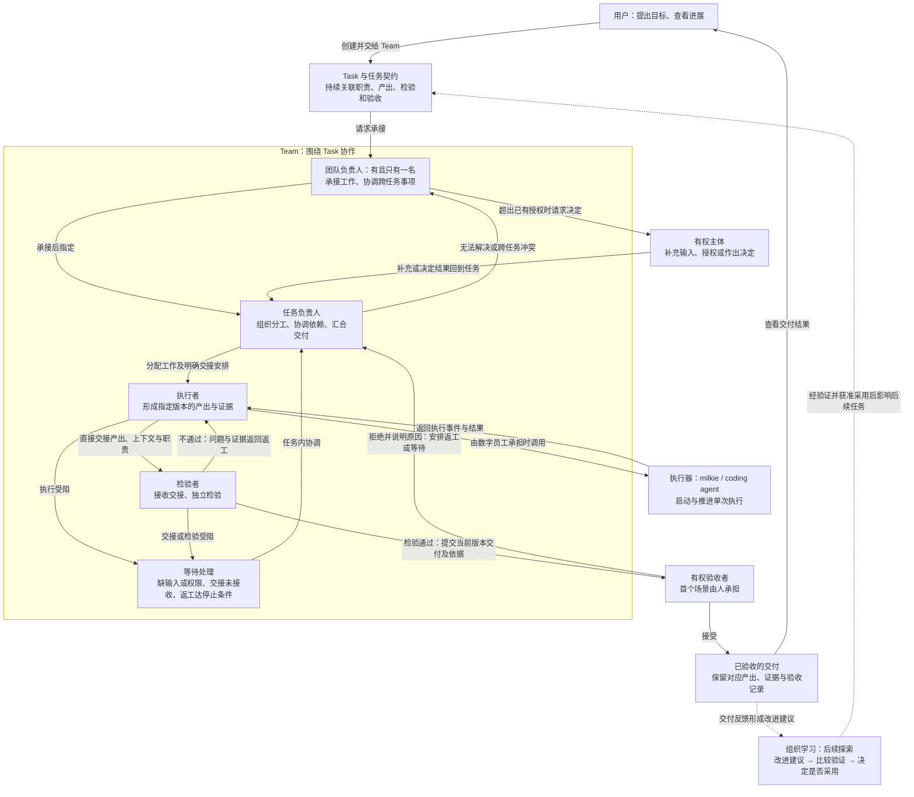
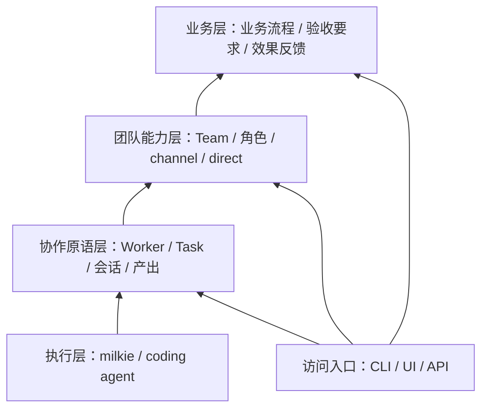

# Atelier 概要设计

状态：提案，修订版 0.6（2026-09-26）。本文为项目级概要设计，不是详细设计或实现计划；具体数据结构、协议格式与完整状态机留待详细设计。

## 1. 背景

Atelier（工坊）出发于两个相互关联的基础问题：**硅基—碳基组织应如何运转，以及智能体正在怎样改变任务的完成与能力的改进方式。** 前者关心人和数字员工如何形成持续的组织关系，后者关心软件获得运行时判断与持续改进能力后，工作如何被组织、检验和约束。Atelier 希望在具体工作中探索这两种变化交汇处的机制。

### 1.1 硅基—碳基组织：共同参与工作与责任关系

当数字员工能够持续承担工作、参与分工并在授权范围内作出决定时，组织就需要明确其成员身份、职责、权限与协作关系。人可以提出目标、执行工作、检验结果或组织团队；数字员工也可以承担其中的部分职责。双方能否配合，取决于实际能力、任务性质与授权，不能只由“人”或“数字员工”的类型决定。共同的协作模型需要保留双方在执行方式、可用性和责任后果上的差异。

已有研究开始触及这种变化。2025 年《The Cybernetic Teammate》在宝洁开展了涉及 776 名专业人员的随机实验：在所研究的产品创新任务中，使用 AI 的个人达到未使用 AI 的团队的表现，显示 AI 可能改变知识组合与分工方式；该实验尚未验证自主数字员工团队的长期运作。[研究原文](https://www.nber.org/papers/w33641) 微软 2026 年 Work Trend Index 则从企业调查与实践出发，指出个人使用 AI 的能力与组织吸收这些能力的机制可能错位，工作分配、管理与评价方式也需要调整；这类观察提供方向，不构成对某种组织结构的因果证明。[报告原文](https://www.microsoft.com/en-us/worklab/work-trend-index/agents-human-agency-and-the-opportunity-for-every-organization)

对 Atelier 而言，组织的关键问题是：谁承接共同目标，谁有权委派，谁协调冲突，成员何时应当报告阻塞或拒绝不合适的工作，以及成员变化后由谁继续承担责任。2026 年《Intelligent AI Delegation》将委派视为包含授权、责任、问责、能力匹配与持续反馈的一组决定，同时讨论人向 AI、AI 向 AI 和 AI 向人的委派。这为共同的 Worker 模型提供了参考，也提醒我们不能把委派简化为发送消息或启动执行。[论文原文](https://arxiv.org/abs/2602.11865)

持续组织还需要保持对目标的共同理解。完成若干 Task，并不自动意味着团队目标已经达成。微软研究院 2026 年关于目标表达的设计研究强调，在协作中澄清和对齐目标，并将目标与产出区分。[研究原文](https://www.microsoft.com/en-us/research/publication/goals-as-first-class-abstractions-in-human-ai-collaboration/) 本设计据此关注 Team 如何围绕目标组织任务、解释结果并形成后续工作；是否需要独立的目标对象，仍应由具体场景决定。

### 1.2 任务范式变化：更多判断发生在运行时

传统软件通常由开发者预先编写处理规则与主要执行路径，程序在这些规则下反复运行。智能体能够根据目标、上下文和反馈，在运行时解释问题、选择工具、形成步骤并调整行动。传统软件也可以搜索、学习和适应，因此二者并无绝对分界；这里关注的变化，是更多关于“下一步怎样做”的判断进入了运行时，并能作用于较开放的工作。

这种能力使软件可以处理难以预先穷举步骤的任务，同时增加了路径、成本和结果质量的不确定性。系统因而需要明确表达目标与约束，区分行动是否获准、执行是否结束、结果是否满足要求，以及交付是否被接受。任务状态和责任关系还需跨越单次执行持续存在，使等待、返工、要求变更与成员交接不依赖某个人重新解释整段会话。

对 Atelier 的设计推论是：任务契约提供行动依据，Guardrail 约束行为与资源，产出和证据支持检验，有权主体作出验收决定。智能体在这些边界内拥有选择方法的空间，其自报完成不能代替组织对结果的判断。

### 1.3 RSI：工作方法与改进机制也成为变化的对象

近期 RSI 研究使上述变化进一步延伸：系统不仅可以调整当前任务的解法，还可能将反馈固化为记忆、工具、执行器代码或搜索策略，并将这些变化用于后续工作。需要区分三个层次：任务内适应解决当前问题；跨任务改进将变化持久保留并检验后续收益；RSI 进一步让产生、评估或选择后续改进的机制本身成为改进对象。不同研究对 RSI 的范围仍有差异，本文采用名词表中的工作定义，不将一次反思、反复重试或一次代码修改直接认定为递归改进。

2026 年 9 月更新的《The Last AI Built by Humans》从自主性角度提出研究路线，强调后续系统继承了什么变化、哪些改进决定仍由人或外部机制控制，以及改进能否在明确资源条件下持续有效。这是一种研究框架，尚不能视为统一标准。[论文原文](https://arxiv.org/abs/2609.11873)

9 月 22 日发布的 AIDE² 提供了具体实验：作者报告系统在一次 8 天运行中取得 7 次被接受的改进，并在未参与选择的任务上观察到收益；但其进一步实验尚不能证明改进后的系统比原系统更擅长驱动自我改进。该结果支持有限条件下的持续改进，不能据此推断递归加速已成立。[论文原文](https://arxiv.org/html/2609.26457v1) Anthropic 的《When AI builds itself》也明确区分了 AI 加速研发与完全自主构建后继模型，表示后者尚未实现且并非必然。[机构原文](https://www.anthropic.com/institute/recursive-self-improvement)

能力边界同样重要。2026 年的一项开放式 AI 研究评估发现，智能体在两个案例中完成了工程工作，却未能实质推进核心研究问题，暴露出研究判断、资源意识和摆脱无效路径等不足；案例数量有限，但提示工程执行能力不能直接等同于完整研究能力。[论文原文](https://arxiv.org/abs/2607.27191)

因此，Atelier 应容纳成员能力与工作方法的变化，同时要求“变得更好”具有可检验依据。改进需要说明变更内容、适用范围、比较条件及后续效果；一次交付成功不足以证明新方法值得推广。系统还必须区分改进工作方法的权限，与修改任务要求、评价依据及授权边界的权限，避免通过改变判断标准制造进步。

### 1.4 Atelier 的研究命题与当前起点

基于上述思考，Atelier 的研究命题是：**人和数字员工如何组成持续工作的组织，在明确目标与授权下共同交付，并通过可验证的反馈持续改进成员能力与协作方式。** 组织关系为运行时的自主判断提供责任、协调与边界，工作结果则为后续改进提供证据。

这一命题包含相互关联的两种过程：交付过程围绕目标展开委派、执行、交接、检验和验收；组织学习则将交付中的经验与问题转化为可比较、可采用、可撤回的能力或协作方式变化。保存历史资料是基础，能否使后续工作取得更好的结果仍需验证。组织学习也不自动等于 RSI，只有改进机制自身进入可验证的持续改进过程时，才进一步触及递归改进问题。

当前设计先验证单 Team 的交付过程：每个 Team 必须有且只有一名团队负责人，可以由人或数字员工担任，成员在职责与授权范围内直接协作。唯一团队负责人是当前用于明确承接与协调责任的结构假设，不是对未来组织形态的普遍结论；当前不考虑 P2P 结构。首个场景选择代码修改，通过承接、执行、独立检验、返工和人工验收，检验基本组织关系能否成立。

组织学习与 RSI 为长期设计提供问题与边界，不代表首阶段已经包含自主修改执行器、演进评价机制或训练后继模型的能力。相关能力需要另行确定范围和验收。本文研究依据截至 2026 年 9 月 26 日，区分公开实验、机构观察与 Atelier 自身的设计推论；当前尚未建立关联 Issue，后续具体范围通过 Issue 定义。

## 2. 首个用户与价值承诺

首个用户假设是：已经使用 coding agent 持续交付代码，能够表达目标与判断结果，但仍亲自维持任务分配、上下文转交、检验安排和异常追踪的人。其角色可以是个人开发者或小型研发团队中的组织者，首阶段以这类共同工作方式界定用户，不同时覆盖所有业务岗位。该假设需要通过实际使用验证。

核心价值承诺是：**把一项明确目标交给 Team 后，用户可以离开；回来时能知道目标推进到哪里、什么被阻塞、哪些决定需要自己处理，以及依据什么接受交付。** 用户无需逐条转发成员消息，也无需持续检查执行日志来维持工作推进。这里的“可以离开”指已获授权且条件满足的工作能够继续；遇到必须由用户决定的事项，系统明确等待并通知，不承诺无人介入或所有任务都能自动完成。

用户交出的是在既定目标与授权下的日常协调：分工落实、直接交接、检验安排、异常定位及按规则升级。目标与取舍仍需由相应有权主体决定；首个场景的最终验收由人完成。团队负责人可以由数字员工担任，但不因承担协调职责而自动获得改变交付范围、追加资源或验收的权限。

Team 的持续价值体现在连续工作中：围绕可理解的目标与承接范围，复用成员关系、协作规则和获准访问的历史产出，并在多项任务发生冲突时说明取舍。任务结束后这些关系仍然存在；新任务仍须形成自己的契约与检验、验收记录。首阶段通过连续承接任务和两项任务竞争同一执行成员的场景验证这一价值，不预先增加独立目标管理系统或智能调度算法。

首阶段成功既要求交付闭环成立，也要求用户为维持协作付出的劳动减少。第 11 节将功能验收与产品价值验证分别描述；不会仅以消息量、执行次数或成员数量证明产品有效。

## 3. 目标与非目标

### 目标

- Human Worker 与 Agent Worker 共用 Worker 协作模型；数字员工拥有独立于执行器和单次执行的持续身份与工作关系。
- Task 成为可追踪、可交接、可检验的工作对象；执行结束不自动意味着任务完成。
- 用户能够离开并返回工作，通过目标进展、待决定事项和交付依据理解状态，无需持续承担消息转交与异常追踪。
- Team 在唯一团队负责人的组织下持续承担工作，成员按职责直接协作，完成委派、交接、检验与人工介入。
- CLI、UI 和 API 共用产品能力与工作状态，避免各自形成一套协作逻辑。
- 接入不同执行器时保留任务与团队关系，并明确能力差异。
- 以 Rust 构建产品核心，利用静态检查支持 AI 编写与长期维护；保留 TypeScript 的 milkie 与 UI，明确跨语言边界。

### 非目标

- 第一版不追求全面替换 Buzz，不复制完整即时通信产品。
- 不自行训练模型，不重写 coding agent，不把 milkie 改造成 Office 产品。
- 不承诺任意执行器之间无损迁移会话或恢复状态。
- 不追求无人化组织，不让数字员工自行降低契约要求来结束工作。
- 不提前构建万能流程语言、跨机器调度或多团队共同负责机制。
- 当前不考虑无团队负责人、多个共同负责人或 P2P 式团队结构；首阶段不要求自动拆分任务或自主认领。
- 不把测试通过等同于形式化证明，不把任务验收等同于业务效果已达成。

## 4. 产品交互总览（Product Interaction Overview）

下图以单 Team 的交付场景展示目标交互：用户通过 CLI、UI 或 API 提出目标并查看进展，团队负责人组织承接，成员围绕同一 Task 的任务契约直接协作，最终由有权主体验收。实线表示当前设计范围内的交互，虚线表示组织学习的后续探索方向；均不代表已有实现。

图中的职责由 Worker 承担，可由人或数字员工担任；团队负责人可以兼任任务负责人，执行者不得独立检验自己的产出。提出目标的用户不自动具有额外授权或验收权。图中单列有权主体表示操作需要匹配授权，不要求为每种职责配备一个不同成员；入口也不决定成员是否属于 Team。

数字员工无论承担执行、检验还是组织职责，都通过执行器推进工作，图中仅在执行者处示意这一关系。人通过通知、等待和人工操作参与；执行器返回结果不自动推动 Task 通过检验或验收。CLI、UI、API 共用工作状态，各参与者按可见范围查看职责、进展与待处理事项。

成员直接交接，接收状态须明确；无需每次交接都经过团队负责人。任务负责人在已有授权内处理任务问题，需要时向团队负责人升级，额外授权由相应有权主体决定；图中的升级路径不要求已获授权的决定重复申请。未承接、无人响应或团队负责人不可用时，任务保留明确原因及待处理归属，不沿主路径假定成功。返工达到停止条件时进入等待，新产出仍需重新检验。

交付反馈可以形成新的 Task；虚线进一步表达将经验转化为后续工作方法改进的长期方向，不表示当前已具有 RSI 能力。具体用户路径、失败分支与可判定结果见第 9 节 Stories 和第 11 节验收方向；个人任务可不归属 Team，按明确的任务职责完成基本交付过程。

## 5. 分层与责任

| 层 | 核心对象与能力 | 责任边界 |
|---|---|---|
| 执行层 | Executor/执行器、Execution Configuration/执行配置、Run/单次执行、Capability Declaration/能力声明、Execution Event/执行事件 | 基于 milkie 或 coding agent 执行工作；不定义团队组织或掌握最终验收权。 |
| 协作原语层 | Worker/工作成员、Task/任务、Task Contract/任务契约、Conversation/会话、Artifact/产出、Verification Record/检验记录、Acceptance Record/验收记录 | 定义人和数字员工的持续身份与工作关系，维护任务生命周期及最小推进规则，提供交接、等待、检验与验收的通用机制。 |
| 团队能力层 | Team/团队、Team Membership/团队成员关系、角色、团队内授权、channel/频道、direct/直接会话入口 | 维护唯一团队负责人，由其组织 Worker 完成工作，提供团队默认的分配、响应、检验安排和升级规则；形成交付闭环。 |
| 业务层 | 具体业务对象、职责、流程、验收要求、Business Feedback Loop/业务闭环 | 定义要做什么、怎样算完成，以及业务反馈如何形成后续任务。 |

CLI、UI、API 是访问入口，可提供通用能力或业务能力。持久化、身份认证、权限执行、可观察性和版本关联是贯穿各层的基础机制，不另造业务概念。

milkie 是底层 agent runtime。milkie 内的 agent 定义属于执行机制；Atelier 的数字员工属于持续协作主体，两者不必一对一。不同 coding agent 可以作为执行器接入，不要求所有执行经过 milkie；能否复用其记录和恢复机制需单独验证。

## 6. 核心关系

概念模型词条统一按“英文/中文”标注，以[名词表](glossary.md)为准；正文可使用其中一种规范表达。英文名用于概念识别，不预先规定代码类型或协议字段。

### Worker/工作成员与 Team/团队

Worker 是共同协作抽象，包含 Human Worker 和 Agent Worker。两者都具有持续身份、工作记录、团队成员关系和任务职责关系，都能接收工作、交接、检验和验收；Agent Worker 另外关联执行配置，产品中称数字员工。

Human Worker 通过通知、等待与人工提交推进工作；Agent Worker 通过执行器推进工作。共同流程根据实际能力选择执行方式，不把所有 Worker 强制映射成模型或进程。人可以承担普通执行职责，数字员工也可以在明确授权范围内承担检验或验收职责；是否有权修改契约、批准或验收由权限决定，不仅由 Worker 类型决定。

职责分离是系统规则而非协作习惯：同一 Worker 不能独立检验自己提交的产出；数字员工不能验收自己参与执行的交付；任何 Worker 不能为自己授予或扩大权限。任务契约可以要求更强的检验独立性，例如检验者使用不同的执行配置或不共享执行者的上下文。

Team 通过团队成员关系赋予 Worker 团队内角色、权限和响应规则；同一 Worker 可以具有不同团队关系。授权人和实际执行者分别留痕，批准某项操作不等于批准人亲自执行。

每个 Team 必须有且只有一名团队负责人，由该 Team 的一个 Worker 担任，可以是 Human Worker 或 Agent Worker。创建 Team 时必须明确团队负责人；该职责属于团队成员关系，不新增一种 Worker 类型。团队负责人承接团队目标、指定任务负责人、协调跨任务冲突并处理升级事项，对团队层面的交付负责。

团队负责人不自动获得修改契约、批准操作或验收的权限，也不必亲自分配每项子任务或批准每次交接。成员在已明确的职责与权限内直接协作；任务内问题先由任务负责人处理，无法解决或涉及跨任务冲突时再升级给团队负责人。同一 Worker 兼任两种负责人时直接处理，不制造重复升级。

团队负责人暂时不可用时，成员可以继续已获授权且条件仍满足的工作，需要其决定的事项明确等待，不隐式产生第二名团队负责人。有权主体可以显式更换团队负责人：交接生效前仍由原成员担任，生效后由新成员担任，始终恰有一名团队负责人；未决事项随职责移交，原成员不再以该身份作出决定。原成员不可用不能成为有权主体更换团队负责人的永久障碍，具体接收与生效契约留待详细设计。

长期知识和工作记录需要有可见范围与访问边界，不意味着某个团队的私有上下文可自动流入另一个团队。换执行器可以保留身份和任务关联，但上下文迁移必须按实际能力处理。

### Task/任务与 Team/团队

Task 在协作原语层首次出现，可以不归属 Team，例如个人自行完成或交给一个数字员工的工作。第一版一个 Task 最多归属一个承担最终交付责任的 Team，Worker 按任务承担任务负责人、执行者、检验者或验收者等职责。

团队负责人为承接的任务指定任务负责人，也可以自行担任。任务负责人组织分工、协调依赖并汇合产出；部分子任务完成不代表整体交付完成。首阶段采用明确分配与明确交接，系统落实已经确定的规则，不依赖自主认领来形成闭环。

不归属 Team 的 Task 同样需要明确任务负责人、检验安排和需要决定时的处理者，由协作原语层支持基本推进；没有团队负责人时不套用团队升级规则。Team 为所属任务提供默认安排和跨任务协调。

跨团队协作暂以委派子任务表达；父任务保留最终责任，其具体流程不进入首阶段单 Team 验证范围。团队角色不直接等于每项任务的职责，channel 成员也不直接等于承担该任务的 Worker。Task 可以收紧 Team 的默认约束；放宽权限必须经过有权主体授权，不能覆盖系统的硬性限制。

### Task/任务与 Run/单次执行、Conversation/会话

一个 Task 可以关联多次执行、多个会话和多个产出。会话承载交流，Task 承载工作契约；消息可以形成任务，但不是每条消息都触发执行。

channel/direct 定义团队中的交流入口；单聊、群聊是用户看到的交流形态，不构成新的执行模型。会话关闭、执行结束或界面重启都不应自动删除任务关系。

## 7. 一等公民与任务契约

### First-Class Entity/一等公民

一等公民具有独立身份、生命周期或持久记录，可以被引用、操作和检查，不仅存在于 prompt 或聊天文本中。核心对象不意味着第一版各自需要独立服务、页面或完整管理接口。

| 对象 | 独立存在的理由 | 所属层 |
|---|---|---|
| Worker/工作成员 | 人与数字员工共用协作身份，保持任务关系，不依附某次执行。 | 协作原语层 |
| Team/团队 | 持续组织工作并承担交付责任，任务结束后仍存在。 | 团队能力层 |
| Task/任务 | 维护工作责任、依赖和生命周期，不从消息或执行退出推断完成。 | 协作原语层 |
| Task Contract/任务契约 | 独立版本化要求，避免目标或约束变更覆盖历史。 | 协作原语层；业务层提供内容 |
| Conversation/会话 | 持续承载交流，可关联多个 Task，不等于执行器原生会话。 | 协作原语层；团队能力层定义 channel/direct |
| Artifact/产出 | 以版本关联交接、检验和验收，不局限于完成消息。 | 协作原语层 |
| Run/单次执行 | 保存实际执行器、输入关联、事件和结束原因。 | 执行层；协作原语层关联 Task 与 Worker |
| Verification Record/检验记录 | 关联检验主体、契约与产出版本、方式、证据和结论。 | 协作原语层 |
| Acceptance Record/验收记录 | 关联有权主体接受的交付及依据，独立于检验与执行结束。 | 协作原语层 |

团队成员关系、任务职责关系和交接关系必须显式保存，不能依赖模型记忆。交接关系需要可判定的接收状态；系统按规则通知、接收和推进后续工作，不能仅发送一条消息就宣称交接完成。

消息与证据需要可寻址、可追溯；第一版消息归属于会话，证据归属于提交它的产出或检验记录。证据需标明来源：由核心或检验者实际采集的证据，与执行者自报的证据分开记录；自报证据只能作为检验线索，不能单独构成检验通过的依据。目标、Law、检验方式和 Guardrail 先作为任务契约的结构化组成部分；独立复用与版本管理需求出现后，再考虑提升为独立对象。

### Task Contract/任务契约

| 内容 | 含义 |
|---|---|
| Goal/目标 | 需要达成的可观察结果。 |
| Law/结果性质 | 结果或系统必须满足的性质；按需填写，并标明表达和保证方式。 |
| Verification Method/检验方式 | 通过测试、工具、独立检查或人工判断检验要求的方式。 |
| Guardrail/执行约束 | 执行允许范围、资源预算、风险限制和停止条件。 |
| Inputs and Preconditions/输入与前置条件 | 开始或继续工作所需的资料、权限及依赖。 |
| Delivery and Handoff Requirements/交付与交接要求 | 预期产出、可供下一 Worker 使用的信息及后续职责。 |
| Contract Version/契约版本 | 标识本次工作的有效要求，支持变更与重新检验。 |

目标必填，Law 与 Guardrail 按需明确；至少有一种检验方式，允许人工检验与验收。自动返工必须有停止条件；未显式配置时使用有限的默认策略，到达边界后暂停并显示原因和可处理的主体。具体限制数值、字段和状态契约留待详细设计确定。

执行者可以提交产出、证据及契约修改建议；是否改变要求由有权主体决定。契约或产出变更后，既有检验是否仍有效必须明确判断，不能沿用不匹配版本的通过结果。

验收只能基于对应当前契约与产出版本的检验通过结果。有权主体认为某项要求不再必要时，应修改契约形成新版本并重新判断检验有效性，不能绕过未通过的检验直接验收。验收者可以拒绝交付并说明原因，任务进入返工或等待，拒绝原因随任务保留。

代码产出必须对应可固定、可追溯的内容，检验记录绑定实际被检验的内容与契约版本；后续代码修改形成新产出版本，不能只保留一个指向可变工作目录的引用作为版本依据。具体快照与引用方式留待详细设计。

Guardrail 在任务契约中声明，由实际控制对应操作的机制落实。例如目录限制由权限机制执行，预算限制由执行管理执行；仅写进 prompt 不构成可靠约束。未获得所需权限或缺少必要控制能力时，暂停并暴露原因。

## 8. 思路与折衷

- **选择任务契约作为工作基础。** 获得明确的状态、交接和验收边界；代价是需要维护任务而不只是聊天。保留自由讨论，避免每条消息都被迫结构化。放弃仅从聊天内容推断所有工作状态。
- **选择 Worker 统一协作、按能力执行。** 人和数字员工共享任务职责与交接机制，执行方式保留差异。放弃把 Human Worker 硬套成一个可启动的执行器。
- **选择唯一团队负责人组织、成员直接协作。** 明确承接与升级责任，允许任务负责人分担组织工作；代价是团队负责人不可用时部分决定会等待，需要显式交接机制。放弃 P2P 和多个共同负责人，不要求所有协作经过团队负责人。
- **选择数字员工与执行器分离。** 保留长期身份与职责，允许执行机制演进；代价是要管理执行配置和能力差异。放弃将一个进程或一个会话直接等同于一名员工。
- **选择统一契约加能力声明。** 上层复用启动、输入、中断和结果等公共机制，对恢复等差异做显式处理。放弃用统一方法名掩盖不同执行器的行为差异。
- **选择工程机制维护确定性边界。** 身份、权限、状态变更和验收权限由系统执行；数字员工在授权范围内分析、生成和推进工作。放弃让模型自行维护所有事实状态。
- **选择明确依赖与交接的并行。** 独立任务可并发，共享修改需明确归属，部分失败需有可观察结果。放弃以全员响应群消息替代调度。
- **选择先同一项目内分层。** 验证边界后再考虑拆包或服务。放弃预先构建万能流程系统及分布式平台。

Bend 2 的启发在于将工作要求与实现、检验分离，以及明确资源所有权和外部操作边界。当前不选择它作为主要实现语言，不将其均衡 fork/join 的计算调度直接套用到耗时不定、具有外部影响的 agent 工作。

### 语言选型与运行边界

选择 Rust 核心、TypeScript 的 milkie 接入与 UI，当前不改写 milkie。主要理由是 Atelier 要长期维护身份、工作状态、契约版本与授权边界，Rust 的类型和编译诊断有助于 AI 编写和修改这部分代码；不是基于当前已有性能瓶颈。

| 部分 | 语言方向 | 掌握的状态与责任 |
|---|---|---|
| Atelier 核心与 CLI | Rust | Worker、Team、Task、契约、权限、产出关联、检验和验收的事实状态，以及执行管理。 |
| milkie 接入 | TypeScript | agent runtime 内部上下文、执行事件与恢复信息；不得直接决定 Atelier 的任务验收。 |
| UI | TypeScript | 展示和发起操作，读取核心状态，不拥有另一套任务状态机。 |

首阶段采用单机核心管理工作生命周期，通过进程协议接入 milkie 与其他执行器；同一项目内维护边界，不预先拆为分布式服务。关闭 CLI/UI 不隐式结束工作。核心重启后的执行核对、恢复策略和进程归属仍需详细设计。

协议需要表达版本、关联标识、能力声明、请求、事件、错误、中断和恢复结果；具体消息格式暂不确定。两端都必须校验外部输入，Rust 的静态保证不延伸到 JSON、TypeScript 或外部工具。执行器原生记录可以作为来源，Atelier 的协作状态由核心核对并保存，不直接复制出第二套 runtime 状态机。

主要代价是跨语言通信、版本兼容、打包和故障定位。放弃仅为语言统一而重写 milkie，也放弃初期嵌入 JavaScript 引擎或建立复杂插件 ABI。执行器运行在独立进程不自动构成权限隔离，Guardrail 仍须由对应机制落实。

### 面向 AI 编写的工程原则

- 用语义明确的标识类型、状态与结果区分工作、执行、检验和验收；避免全靠字符串或任意字段修改维护规则。
- 状态变更通过集中、可检查的操作推进；权限、契约与产出版本等动态条件仍在运行时校验。
- 第一方核心默认使用 safe Rust，必要的底层能力优先复用成熟库；编译通过不保证业务正确、无死锁或外部操作不会重复。
- 建立快速编译反馈、格式与 lint 检查、针对行为的测试及独立审查；不以关闭检查或删除断言作为修复方式。
- API 保持惯用、文档明确、示例可运行、改动可评审，避免为静态检查引入复杂类型技巧和多余抽象。

## 9. 关键 Stories、主路径与关键状态

### 个人任务的基础路径

个人任务仍需覆盖五种闭环：委托后收到经检验的交付；缺输入或权限时由有权主体解除阻塞；检验失败后返工并重新检验；要求改变后按新契约交付；执行中断后恢复或交接。它们是 Task 的通用能力，不以加入 Team 为前提。要求改变时必须明确当前执行继续、暂停还是终止，旧契约下的活动不能被默认为已经遵循新要求。

### 单 Team 的关键 Stories

前提是 Team 具有且仅具有一名团队负责人。以下 S1–S7 描述持续团队协作需要闭合的路径，不代表均已实现，也不要求自动拆分或自主调度。第 11 节按同一编号给出可判定结果。

| 编号 | 角色与前置 | 操作与可观察中间态 | 闭环结果 |
|---|---|---|---|
| S1 团队承接工作 | 用户有明确目标，已有 Team 及团队负责人。 | 用户将目标交给 Team；团队负责人判断是否承接，用户可见承接结果、任务负责人和下一步，或缺失条件。 | 承接后任务有明确责任与下一步；无法承接时有明确原因，不将收到消息视为已经承接。 |
| S2 多成员协同交付 | 任务负责人已接收任务，需要多个成员配合。 | 任务负责人明确分工、依赖及检验安排；成员执行，用户可见各项进展与整体状态；任务负责人汇合产出，组织独立检验，必要时返工，再提交有权主体验收。 | 形成对应当前契约的整体交付、检验和验收记录；部分完成不等于整体完成，返工达到停止条件时明确等待处理。 |
| S3 成员直接交接 | 发送者已有产出，需要另一成员承担后续工作。 | 发送者交接产出版本、上下文和职责；接收者明确接收或说明缺失内容，双方可见接收状态；拒收或无人响应时由任务负责人协调，必要时升级。 | 后续工作由明确的接收者承担，或交接问题进入有明确处理者的等待；不依赖用户逐条转发消息。 |
| S4 成员不可用时接续工作 | 执行成员或任务负责人不可用，已有工作受到影响。 | 任务负责人安排等待或重新分配；任务负责人不可用时由团队负责人处理。接收者确认已有产出与未完成事项，相关成员可见职责变更及原执行的处置情况。 | 工作恢复推进或明确暂停；不能确认原执行已停止或已失去修改权限时，不启动会冲突的替代执行，原成员恢复后不自动重复承担已移交工作。 |
| S5 团队持续承接任务 | Team 已完成一次交付，用户提出新的相关目标。 | 团队负责人组织下一项任务，复用成员关系、协作规则和有权访问的历史产出；成员可见本次契约与历史参考的区别。 | 无需重建团队及重复提供已有且可访问的背景；新任务具有独立契约、产出、检验与验收关联，不继承旧任务的通过结论。 |
| S6 显式交接团队负责人 | Team 已有团队负责人，有权主体需要更换该成员。 | 有权主体发起更换，相关成员可见当前团队负责人、交接进展和未决事项；交接按明确条件生效，原成员不可用时仍可由有权主体完成更换。 | 交接前后始终恰有一名团队负责人，未决事项有承接者，原成员不再以团队负责人身份作出决定；交接未生效时保留原归属和明确原因。 |
| S7 多任务冲突下的取舍 | 用户提交更紧急的目标，Team 已有任务正在占用同一执行成员。 | 团队负责人判断承接能力与已有承诺，说明两项任务的影响，按已有授权安排先后或请求有权主体决定；任务负责人落实继续、等待或中断，用户可见决定是否生效及恢复条件。 | 两项任务的处理顺序、职责、等待原因和后续条件明确；紧急程度不自动扩大权限，未确认原执行安全中断前不启动冲突执行，原任务不被静默遗忘。 |

### 用户观察与介入的核心体验

各入口应让用户围绕工作结果理解状态，并按权限查看相应范围。概要先明确用户必须得到的答案，具体页面、布局和完整交互契约留待详细设计。

| 用户的问题 | 必须可见的结果 | 可采取的行动 |
|---|---|---|
| 我的目标推进到哪里了？ | 任务负责人、当前阶段、已形成产出、关键依赖和下一步；明确区分正在执行、等待、未知与已验收。多任务取舍应显示受影响的任务及原因。 | 查看任务依据和必要的执行记录，提出要求变更或中断请求；是否生效取决于授权与执行状态。 |
| 什么需要我处理？ | 待决定事项说明为什么需要本人、相关契约与产出版本、可选动作及其影响；没有待处理事项时明确显示无需当前用户行动，同时保留其他等待或未知状态。 | 在授权内补充信息、批准或拒绝请求、作出取舍；不具备权限时显示有权处理者或授权缺失原因。 |
| 我凭什么接受这个结果？ | 当前契约、指定版本的产出、独立检验结论、证据及尚存限制；不能用成员自报完成代替依据。 | 有权验收者接受交付或说明拒绝原因；拒绝后显示返工或等待的处理者。 |

用户离开后返回，应能看到上次查看以来影响目标的变化、当前阻塞及需要本人处理的事项。通知围绕明确职责、待决定事项、影响交付的异常和可验收结果触发，普通执行活动可供查阅，无需逐条打断用户。谁能解除等待必须清楚；无人具备所需授权时明确暴露缺口，不能假定用户天然有权处理。

用户提交决定后，需要看到请求已收到、正在落实、已经生效或未能生效及原因。暂停请求不等于执行已经停止；取舍尚未生效时不能提前显示新的执行安排。契约、产出或权限已变化的旧请求需重新判断有效性，避免用户针对过期状态作出决定后系统继续照旧执行。

### 首个验证场景

人把一项代码修改目标交给 Team；团队负责人安排任务负责人、执行与独立检验，成员直接交接，检验失败后返工，最终由人验收。过程中包含一次需要明确主体处理的阻塞，用户能看到并处理必要决定，无需持续充当消息中转者。团队负责人可兼任任务负责人，执行与独立检验由不同 Worker 承担。 用户在执行期间离开一次，返回后应能理解重要变化并处理必要决定；后续再以 S7 验证第二项紧急任务进入时的取舍，不将两种场景混为一次最小验证。

1. 人创建 Task，明确目标、交付要求、检验方式及执行约束，并交给 Team；团队负责人明确承接与任务负责人。
2. 任务负责人组织分工和检验安排；缺输入或权限时显示等待原因及可处理的主体，条件满足后开始执行。
3. 执行过程展示当前 Worker、进展和待决定事项；任务内问题由任务负责人协调，无法解决时升级给团队负责人，需额外授权时交给有权主体。
4. 执行者提交固定版本的产出和证据，直接交给检验者；检验者明确接收，并按对应契约与产出版本独立检验。
5. 检验不通过时保留问题与证据，交回执行者返工并重新检验；达到停止条件时暂停，由明确主体处理。通过后等待有权主体验收；验收被拒时保留原因并回到返工或等待，验收后展示已接受的产出与证据。

关键状态是可判定的用户结果，具体状态机归详细设计：

- **空状态：** 没有任务时可辨认当前无工作，并能创建 Task；创建 Team 时需明确团队负责人。
- **待承接：** 能看见任务尚未被承接、由谁处理；被拒绝时能看见原因。
- **等待状态：** 能看见缺少的输入、权限或决定，以及谁能解除等待；团队负责人不可用时不误报已转交他人。
- **执行状态：** 能看见当前执行者、任务负责人、活动与依赖；执行信息未知时不能伪装为正常推进。
- **交接状态：** 能区分已发送、已接收与尚未解决的交接问题，显示当前职责归属和处理者。
- **中断或失败：** 能看见原因、已完成产出和后续选择；不自动宣称可恢复，也不盲目重试外部操作。
- **返工状态：** 能看见检验问题、对应产出版本及当前执行者；自动返工停止时能看见原因和处理者。
- **待验收：** 能看见当前契约、产出与检验结论；检验通过不自动成为验收通过，验收被拒时能看见原因和后续处理者。
- **成功状态：** 明确显示任务已验收及对应产出、证据和验收者。

第一版不做复杂组织管理后台、自由编排画布、完整即时通信或业务专用仪表盘。概要仅定义上述可见结果，布局、信息架构和完整交互状态留待详细设计。

## 10. 边界与风险

- 执行器切换不承诺原生会话无损恢复；恢复能力缺失时显式暴露限制。
- CLI 与 UI 共用 Rust 核心的工作状态；关闭入口不隐式取消后台工作，重启后能否继续由实际执行能力与核对结果决定。
- 重启与重试不得静默重复有外部影响的操作；执行层与协作层需有一致的事件和身份关联。
- 数字员工的自报完成不是验收依据；形式化证明仅保证被形式化并实际证明的性质。
- 业务层保留效果反馈：任务交付不证明业务价值，反馈可以产生新的 Task，但高风险发布仍需要相应授权。
- 唯一团队负责人可能成为决策瓶颈；通过明确委派和成员直接协作减少等待，不以产生第二名团队负责人规避约束。团队负责人变更不自动撤销原成员作为普通成员已获的其他授权，也不自动赋予新团队负责人额外操作或验收权限。
- 团队自治是逐步获得的能力，不将不明确目标、冲突或异常隐藏在人类持续兜底中。

## 11. 测试意图与首阶段验收方向

以下结果与第 9 节单 Team Stories 按 S1–S7 一一对应，不代表已有测试或已通过验收。首阶段先贯通 S1–S3 的团队交付主路径，再验证 S4–S7 的接续、持续协作与多任务取舍；具体 Issue 各自限定范围，不将七条强行合为一次交付。

| 编号 | 可判定结果 | 测试层级与意图 |
|---|---|---|
| S1 | 承接的任务有明确任务负责人和下一步；无法承接或缺少条件时有明确原因及处理者。 | E2E：提交目标，分别验证承接、等待和拒绝的可见结果。 |
| S2 | 多成员产出汇合为当前契约下的整体交付，独立检验与人工验收记录完整；部分完成不算整体完成，返工停止条件有效。 | E2E：分工、汇合、检验失败、返工、再次检验及验收，并验证返工达到边界时暂停；Unit：依赖、版本与验收规则。 |
| S3 | 交接产出版本与后续职责明确，接收状态可判定；未接收的问题有明确处理者，无需用户转发消息。 | E2E：直接交接的接收、拒收及无人响应路径；Integration：通知与升级关联持久状态。 |
| S4 | 成员不可用后工作可接续或明确暂停，职责与产出仍可追溯，未确认原执行处置结果时不会启动冲突执行。 | E2E：执行成员及任务负责人分别不可用、重新分配与原成员恢复；Integration：执行核对与中断边界。 |
| S5 | 后续任务复用同一 Team 的成员关系、规则及获准访问的历史产出，新任务的契约与检验、验收记录独立。 | E2E：同一 Team 连续完成两项相关任务；Integration：历史资料访问边界；Unit：旧结论不能冒充新任务的检验。 |
| S6 | 创建及更换过程中 Team 始终恰有一名团队负责人，交接后未决事项归属明确，原成员的团队负责人身份不再有效。 | E2E：正常交接、原团队负责人不可用时更换及交接失败；Unit：唯一性、授权和变更生效规则；Integration：并发变更及旧身份请求被正确处理。 |
| S7 | 两项冲突任务的处理顺序、职责、等待原因与后续条件可见；越权取舍不生效，原执行未确认安全中断前不启动冲突执行，原任务仍有明确后续安排。 | E2E：同一执行成员处理任务期间提交紧急目标，分别验证等待、获准调整及授权被拒后的安排；Integration：中断结果与新执行启动关联；Unit：已有授权、优先顺序和请求有效性判断。 |

个人任务与团队任务共用以下测试意图，不另定义一组同名 Stories：

| 共用能力 | 可判定结果与测试意图 |
|---|---|
| 阻塞处理与要求变更 | E2E：缺输入或权限时显示原因与处理者，有权主体解除后可继续；变更要求后执行处置明确，不匹配版本的检验不能用于当前验收。Unit：契约、产出与检验有效性规则。 |
| 中断与入口重启 | E2E：中断或入口重启后 Task、原因和产出仍可见，恢复能力不足时明确提示。Integration：执行能力声明、核心重启后的执行核对与恢复边界。 |
| 权限与 Worker 类型 | E2E：人和数字员工交换执行与检验职责，并分别担任团队负责人；人工等待不误报为自动执行，越权修改或验收被阻止。Unit：类型、职责与授权分别判断；检验自己的产出、自我授权、仅凭自报证据判定通过及绕过未通过检验验收均被拒绝。 |
| 观察与介入 | E2E：用户离开后返回，不先阅读日志即可辨认阶段、关键变化、阻塞及本人待决定事项；无待处理事项不掩盖其他等待或未知状态。提交决定或暂停请求后可辨认落实结果；Integration：通知对象与授权、请求版本关联，过期决定不直接生效。 |
| 执行器接入 | Integration：milkie 接入失败、协议不兼容及输入无效；E2E：错误可见、工作关系保留，Task 不被误报为完成。 |

不归属 Team 的个人任务另走一次创建、执行、检验与验收的 E2E，确认基本闭环不依赖团队负责人。执行器选型无关另需 Integration 验证至少两种执行机制的公共行为及能力差异；未验证前不宣称产品支持。

### 产品价值验证

上述验收证明流程成立，价值承诺还需与用户直接操作 coding agent 的工作方式比较。首轮先记录基线与实际表现，采用规模和难度相近的任务，注明执行器、成员配置及使用条件；尚不预设没有依据的改善百分比，也不将任务难度差异当成产品收益。

| 观察项 | 验证方式与判定方向 |
|---|---|
| 协调负担 | 记录用户主动转交上下文、催促交接、追问状态和重新安排工作的次数及耗时，与目标澄清、必要授权和人工验收分别统计；预期减少维持流程的人工劳动。 |
| 状态理解 | 在离开后返回、阻塞和待验收时，请用户说明当前阶段、下一步、处理者及交付依据，与实际记录比对；预期无需通读日志即可准确判断，未知状态不得被误认作正常推进。 |
| 阻塞处理 | 记录阻塞出现、被暴露、通知到有权处理者和解除的时间，并保留未解除原因；预期缩短无人察觉或找错处理者造成的等待，不把必要的人为等待全部算作系统失败。 |
| 交付效果与成本 | 比较独立检验结果、验收后发现的问题、总交付时间、人的投入时间及执行资源消耗；不以减少介入次数掩盖质量下降、无效返工或明显成本转移。 |
| 持续协作 | 在后续相关任务中记录重复提供背景和重新配置职责的劳动，并验证历史资料访问与检验版本独立性；预期复用关系和有用经验，不能仅凭保存了历史记录宣称收益。 |

如果功能验收通过，但用户仍需频繁追问、代转信息或纠正状态理解，核心价值假设尚未得到支持，应据此调整交互与协作规则。量化目标在取得基线后写入具体 Issue；本节是产品验证方向，不是已实现能力或已达成指标。

## 12. 是否需要详细设计与开放问题

需要详细设计，原因是任务状态、执行恢复、权限、版本关联和跨入口一致性形成多个契约边界。待具体 Issue 建立后，详细设计仅落在 `docs/design/{issue-no}-{slug}.md`，本文保留方向与链接，不重复详细正文。

开放问题：

- 多任务取舍中，团队负责人能够自行调整的范围、对已有承诺的影响和等待任务的恢复条件怎样表达？
- 待决定事项的通知渠道、重复提醒与过期处理如何支持用户离开后返回的体验？
- 首阶段采用哪些执行器，milkie 可直接复用哪些能力，哪些需要独立适配？
- Worker 的认证、代理操作与授权人身份如何关联，数字员工的长期知识与跨团队上下文如何隔离？
- Task 与子任务的责任、取消、失败传播和检验汇合怎样定义？
- 团队负责人交接如何接收和生效，原成员不可用时如何完成授权更换，并处理并发请求与未决事项？
- 明确分配下的响应期限、升级条件与自动返工默认停止条件如何确定？Human Worker 与 Agent Worker 的“不可用”分别如何判定？
- 提出目标和验收的人是否统一以 Human Worker 表达，是否必须是所属 Team 的成员，有权主体的授权来源是什么？
- Rust 核心如何核对重启后的执行状态，协议格式、版本兼容与发行方式怎样定义？是否复用 ACP（Agent Client Protocol）等已有执行器协议，而非自定义？
- 常驻核心与 CLI/UI 的进程关系、持久化模型（状态表或追加式事件记录）及 UI 形态如何确定？
- 首阶段与 Buzz、buzz-team 是并行共存、逐步迁移还是互不关联？
- Law 的表达、检验方式和保证强度如何展示，业务反馈如何转化为后续 Task？

## 13. 关联

- [名词表](glossary.md)
- [项目说明](../README.md)
- [milkie](https://github.com/xforce-io/milkie)：底层 agent runtime 候选基础。
- [buzz-team](https://github.com/xforce-io/buzz-team)：现有本机运行管理模块，供比较和经验参考。
- 《AI Native 研发范式实践手册》1.1「案例一：AIDC 数字投手智能营销助手」，正文第 1–5 页：来自用户提供材料，未复制分发原文件。
- [Bend 2 官方指南](https://github.com/bendlang/bend/blob/main/guide/GUIDE.md)：规则与证明、资源所有权及 IO 边界的思想参考，不作为实现依赖。
- [Microsoft Pragmatic Rust Guidelines：AI](https://microsoft.github.io/rust-guidelines/guidelines/ai/)：强类型、惯用接口、文档、示例与行为测试的工程依据。
- [Rust Compiler Development Guide：Writing LLM-created code](https://rustc-dev-guide.rust-lang.org/llm-guidance/writing.html)：小步变更、真实回归与独立检查的参考，其项目特有规则不直接作为 Atelier 门禁。
- [Anthropic：Building a C compiler with a team of parallel Claudes](https://www.anthropic.com/engineering/building-c-compiler)：反馈与验证环境的案例，不作为 Rust 全面优于其他语言的证据。
